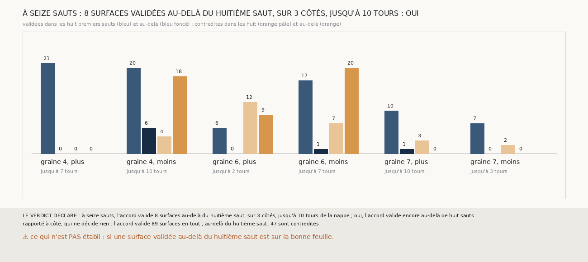

# `389` — Sur PHerc0358, à seize sauts, l'accord aux comptes de `m7` valide-t-il encore des surfaces au-delà du huitième ? Oui : 8, sur 3 côtés, jusqu'à 10 tours

*`384` a validé, aux comptes de `m7`, 78 surfaces sur six côtés de PHerc0358, jusqu'à 7 tours, au bout des huit sauts des chaînes. Cette
tranche lance les mêmes chaînes jusqu'à seize sauts. L'accord valide 8 surfaces au-delà du huitième saut, sur 3 côtés, jusqu'à 10 tours de
la nappe de départ : par la règle déclarée, oui. Mais au-delà du huitième saut, il contredit 47 surfaces pour 8 qu'il valide : les chaînes
vont plus loin que leur accord.*

## 0. Pourquoi cette tranche

C'est `R4-P186`, ouverte par `388`. Le Grand Prize demande un rouleau entier ; une surface validée à 7 tours de sa nappe, au bout de huit
sauts, ne dit pas jusqu'où l'accord porte.

## 1. Ce qui a été vu avant d'écrire

Tout ce que `296` à `388` publient, dont `R4-F570`, `R4-F571`, `R4-F573` et `R4-F496` : à seize sauts, la chaîne de `303` tenait 6 côtés sur
10, mais `m7` n'appuyait plus que 15 à 16 % au seizième saut.

## 2. Ce qui est fait

- **Les chaînes** : les trois chaînes de `373` sur les seize côtés, la chaîne d'une maille de `366` jusqu'à 16 sauts ; pour cela, elle prend
  désormais le nombre de sauts, huit par défaut. Leurs huit premiers sauts redonnent les nombres de feuilles et les points mesurés de `384`.
- **Les comptes, les paires et l'accord** : les comptes de `m7`, les paires de `368`, l'accord de `374`, sur toutes les surfaces.
- **La règle** : des surfaces validées au-delà du huitième saut sur au moins deux côtés, oui ; sur un seul, en partie ; sur aucun, non.

`m7` a été lu en 41657 chunks, dont 183 absents du dépôt, sans panne, en 238,5 secondes.

## 3. Ce que dit l'accord

| côté | validées, huit premiers sauts | validées au-delà | contredites au-delà | jusqu'à |
|---|---|---|---|---|
| graine 4, plus | 21 | 0 | 0 | 7 tours |
| graine 4, moins | 20 | 6 | 18 | 10 tours |
| graine 6, plus | 6 | 0 | 9 | 2 tours |
| graine 6, moins | 17 | 1 | 20 | 7 tours |
| graine 7, plus | 10 | 1 | 0 | 10 tours |
| graine 7, moins | 7 | 0 | 0 | 3 tours |

⭐⭐⭐⭐ **L'accord aux comptes de `m7` porte au-delà de huit sauts, mais peu** (`R4-F575`). Sur la graine 4, côté moins, les trois chaînes
ont chacune une surface validée à 10 tours de la nappe ; sur la graine 7, côté plus, la compagne aussi. En tout, l'accord valide 89
surfaces, dont 81 dans les huit premiers sauts : les surfaces de plus loin confirment aussi des surfaces plus proches.

⚠⚠ **Au-delà du huitième saut, les contradictions l'emportent** : 47 surfaces contredites pour 8 validées, sur les graines 4 et 6, côté
moins, et 6, côté plus. Les chaînes avancent encore : 13 des 18 chaînes de ces six côtés posent des points à chacun de leurs seize sauts,
et `m7` dit le nombre de feuilles de 146 des 161 sauts au-delà du huitième sur les seize côtés. Ce n'est donc pas le compte qui manque, ce
sont les chaînes qui cessent de s'accorder sur la feuille ou sur le compte.

## 4. Le verdict

**8 SURFACES VALIDÉES AU-DELÀ DU HUITIÈME SAUT, SUR 3 CÔTÉS, JUSQU'À 10 TOURS : OUI**

`R4-P186` est répondue : oui. L'accord de trois chaînes aux comptes de `m7` valide encore au-delà de huit sauts, jusqu'à 10 tours de la
nappe ; mais il s'y raréfie, et c'est désormais là que passe la limite de la méthode.

## 5. Ce que cette tranche ne dit pas

- ⚠⚠ Si une surface validée au-delà du huitième saut est sur la bonne feuille : PHercParis4 n'a des tours publiés que jusqu'à `5753_-7`.
- ⚠ Pourquoi les chaînes cessent de s'accorder : une chaîne qui glisse, ou les trois qui divergent.

## 6. Les sondes

Une batterie de **7** contrôles et une figure de **17**. Quatre règles cassées exprès ont fait échouer la batterie : le huitième saut compté
au-delà, la redite sans les points mesurés, la redite sur tous les sauts, et « oui » dès un côté. La redite sans les points passait
d'abord : un contrôle la lit désormais. Trois sondes de la figure l'ont fait échouer.

## 7. Ce qui reste

`R4-P187`, ouverte ici : au-delà du huitième saut, sur les graines 4 et 6, côté moins, le vote de `372` désigne-t-il une chaîne qui glisse,
et à quel saut ? `R4-P151`, l'encre, reste en attente de l'auteur.
