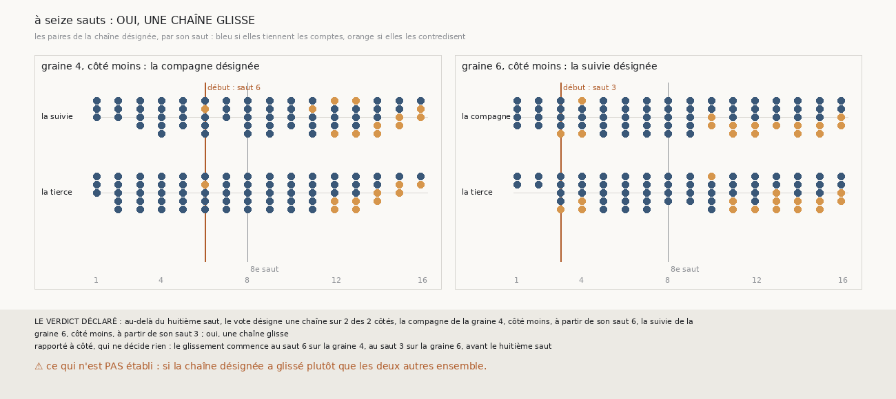

# `390` — Au-delà du huitième saut, le vote désigne-t-il une chaîne qui glisse ? Oui, sur les deux côtés ; les contradictions s'y installent à partir du dixième et du douzième saut

*`389` a vu, à seize sauts, 47 surfaces contredites au-delà du huitième saut pour 8 validées, sur les graines 4 et 6, côté moins, surtout.
Cette tranche relit le vote de `372` sur les chaînes à seize sauts. Il désigne la compagne sur la graine 4, côté moins, et la suivie sur la
graine 6, côté moins : par la règle déclarée, oui, une chaîne glisse. Leur première contradiction tombe tôt, au sixième et au troisième
saut, mais elle reste isolée ; les contradictions ne s'installent qu'à partir du douzième et du dixième saut.*

## 0. Pourquoi cette tranche

C'est `R4-P187`, ouverte par `389`. Une chaîne qui glisse se voit à ce qu'elle contredit les deux autres pendant que celles-ci s'accordent ;
savoir où le glissement commence dit si la limite de `389` est celle d'une chaîne ou celle de la méthode.

## 1. Ce qui a été vu avant d'écrire

Tout ce que `296` à `389` publient, dont `R4-F575`, et les couples que `389` publie sur les deux côtés. ⚠ Cette tranche ne lit pas `m7` :
elle relit les paires et les comptes que `389` publie.

## 2. Ce qui est fait

- **Les couples et le vote** : ceux de `372` et `373`, sur les paires et les comptes de `m7` de `389`.
- **Le début du glissement** : pour la chaîne désignée, sa première paire qui contredit avec chacune des deux autres ; le glissement
  commence au plus petit des deux sauts de la chaîne désignée.
- **La règle** : le vote désigne une chaîne sur les graines 4 et 6, côté moins, oui ; sur une, en partie ; sur aucune, non.

## 3. Ce que dit le vote

| côté | chaîne désignée | couples qui tiennent | première contradiction | paires contredites, par saut de la chaîne désignée |
|---|---|---|---|---|
| graine 4, moins | compagne | suivie et tierce, 74 paires sur 75 | saut 6 | 2 sur 14 au saut 6, aucune du saut 7 au saut 10, 1 sur 13 au saut 11 ; 4 sur 11 aux sauts 12 et 13 |
| graine 6, moins | suivie | compagne et tierce, 77 paires sur 80 | saut 3 | 2 sur 10 au saut 3 et 4 sur 11 au saut 4, aucune du saut 5 au saut 9 ; 3 sur 10 au saut 10 |

⭐⭐⭐⭐ **Sur les deux côtés, le vote désigne une chaîne qui glisse** (`R4-F576`). Sur la graine 4, côté moins, la suivie et la tierce
tiennent leurs comptes 74 fois sur 75 et la compagne les contredit ; sur la graine 6, côté moins, ce sont la compagne et la tierce, 77 fois
sur 80, et la suivie.

⭐⭐⭐⭐ **La limite de `389` est celle d'une chaîne, et elle tombe au-delà du huitième saut.** La première contradiction de la chaîne désignée
est isolée : après elle, aucune de ses paires ne contredit du septième au dixième saut sur la graine 4, du cinquième au neuvième sur la
graine 6. Les contradictions s'installent ensuite, à partir du douzième et du dixième saut, et ne cessent plus jusqu'au seizième.

⚠ Rapporté à côté : sur la graine 6, côté moins, les contradictions des sauts 3 et 4 sont celles que `374` avait déjà vues à 2 et 3 tours,
autour des sauts nuls de la suivie.

## 4. Le verdict

**LE VOTE DÉSIGNE UNE CHAÎNE SUR LES DEUX CÔTÉS : OUI**

`R4-P187` est répondue : oui, une chaîne glisse. Par la règle déclarée, son glissement commence au sixième et au troisième saut ; en
substance, ces premières contradictions sont isolées, et le glissement qui borne l'accord commence au douzième et au dixième saut.

## 5. Ce que cette tranche ne dit pas

- ⚠⚠ Si la chaîne désignée a glissé plutôt que les deux autres ensemble, ni sur quelle feuille elle est passée.
- ⚠ Ce qui fait glisser la compagne de la graine 4 au douzième saut : `m7` le compte nul, c'est-à-dire sans feuille franchie.

## 6. Les sondes

Une batterie de **8** contrôles et une figure de **15**. Quatre règles cassées exprès ont fait échouer la batterie : les sauts lus dans
l'ordre de la paire, le début au plus grand des deux sauts, une contradiction réduite à la même feuille, et tous les côtés comptés. Le début
au plus grand et la contradiction réduite passaient d'abord : deux contrôles les lisent désormais.

## 7. Ce qui reste

`R4-P188`, ouverte ici : sur la graine 4, côté moins, le douzième saut de la compagne, que `m7` compte nul, la laisse-t-il sur la feuille de
sa onzième surface, ou `m7` manque-t-il la feuille qu'il franchit ? `R4-P151`, l'encre, reste en attente de l'auteur.
