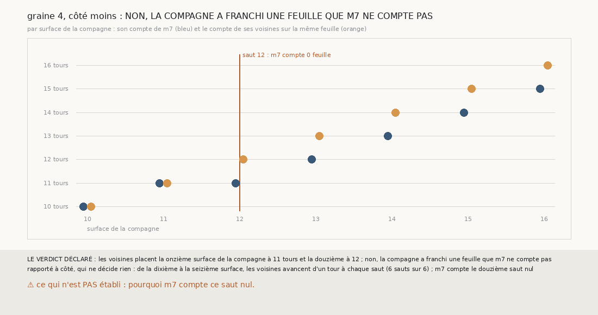

# `391` — Sur la graine 4, côté moins, le douzième saut de la compagne, que `m7` compte nul, est-il resté sur sa feuille ? Non : il en a franchi une que `m7` ne compte pas

*`390` a trouvé que les contradictions de la compagne de la graine 4, côté moins, s'installent à son douzième saut, le seul des seize que
`m7` compte nul. Cette tranche lit, sur les paires même feuille de `389`, le compte que les surfaces voisines de la suivie et de la tierce
donnent à chaque surface de la compagne. Les voisines placent sa onzième surface à 11 tours et sa douzième à 12 : par la règle déclarée,
non, la compagne a franchi une feuille que `m7` ne compte pas. De sa dixième à sa seizième surface, les voisines la font avancer d'un tour à
chaque saut, et la compagne compte un tour de moins à partir du douzième.*

## 0. Pourquoi cette tranche

C'est `R4-P188`, ouverte par `390`. Si le saut est resté sur sa feuille, la compagne compte juste et le glissement est ailleurs ; si `m7` a
manqué la feuille franchie, la limite de `389` tient au compte, pas à la chaîne.

## 1. Ce qui a été vu avant d'écrire

Tout ce que `296` à `390` publient, dont `R4-F576`, les nombres de feuilles de `389` et, ⚠ avant d'écrire la règle, la liste des paires même
feuille de la compagne autour de ce saut. ⚠ Cette tranche ne lit pas `m7` : elle relit les paires et les comptes de `389`.

## 2. Ce qui est fait

- **Le compte des voisines** d'une surface de la compagne : sur ses paires même feuille avec la suivie et la tierce, le compte de `m7` le
  plus fréquent que portent ces surfaces voisines, le plus petit à égalité.
- **L'avance** du douzième saut : le compte des voisines de la douzième surface moins celui de la onzième.
- **La règle** : une avance d'un tour, non, la compagne a franchi une feuille que `m7` ne compte pas ; nulle, oui, elle est restée ; sinon,
  indécidable.

## 3. Ce que disent les voisines

| surface de la compagne | voisines sur la même feuille | leur compte | compte de la compagne |
|---|---|---|---|
| 11 | suivie 11 et 12, tierce 12 | 11 | 11 |
| 12 | suivie 12, tierce 13 | 12 | 11 |

⭐⭐⭐⭐ **Le douzième saut de la compagne a franchi une feuille que `m7` compte nulle** (`R4-F577`). Sa douzième surface est sur la feuille de
la douzième de la suivie et de la treizième de la tierce, toutes deux à 12 tours ; sa onzième, sur celle de la onzième de la suivie et de la
douzième de la tierce, à 11 tours. De la dixième à la seizième surface, les voisines avancent d'un tour à chaque saut, 6 sauts sur 6 : la
compagne n'a pas glissé, elle a perdu un tour au compte, au douzième saut.

⚠ Rapporté à côté : la onzième surface de la compagne est aussi sur la feuille de la douzième de la suivie, donc à cheval sur deux feuilles.
C'est une explication possible du nul de `m7` : les points de la douzième surface qui font face à la onzième peuvent faire face à sa partie
déjà posée sur la feuille suivante.

## 4. Le verdict

**LES VOISINES PLACENT LA ONZIÈME SURFACE À 11 TOURS ET LA DOUZIÈME À 12 : NON**

`R4-P188` est répondue : non, la compagne a franchi une feuille que `m7` ne compte pas. La limite que `389` voyait sur la graine 4, côté
moins, n'est pas un glissement de chaîne : c'est un tour perdu au compte.

## 5. Ce que cette tranche ne dit pas

- ⚠⚠ Pourquoi `m7` compte ce saut nul ; la surface à cheval est une hypothèse, pas une mesure.
- ⚠ Si les autres sauts que `m7` compte nuls sont aussi des feuilles manquées.

## 6. Les sondes

Une batterie de **4** contrôles et une figure de **15**. Quatre règles cassées exprès ont fait échouer la batterie : l'ordre de la paire
ignoré, l'égalité au plus grand compte, les paires d'autres feuilles comptées, et une avance de deux tours acceptée. Trois sondes de la
figure l'ont fait échouer ; le compte des avances pris sur toutes passait d'abord, un contrôle le lit désormais.

## 7. Ce qui reste

`R4-P189`, ouverte ici : sur PHerc0358, les sauts que `m7` compte nuls laissent-ils les chaînes sur leur feuille, ou les voisines
voient-elles une feuille franchie ? `R4-P151`, l'encre, reste en attente de l'auteur.
