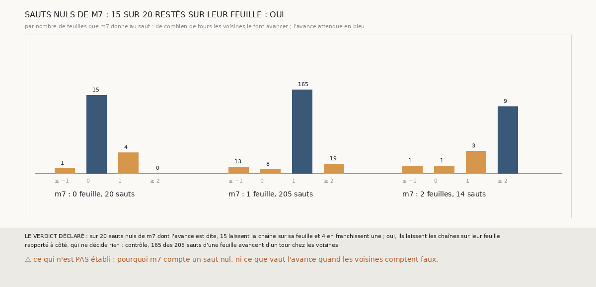

# `392` — Sur PHerc0358, les sauts que `m7` compte nuls laissent-ils les chaînes sur leur feuille ? Oui : 15 sur 20, mais 4 en franchissent une

*`391` a montré qu'un saut que `m7` compte nul, le douzième de la compagne de la graine 4, côté moins, avait franchi une feuille. Cette
tranche lit, pour chaque saut des chaînes à seize sauts de `389`, de combien de tours les surfaces voisines des deux autres chaînes le font
avancer. Des 20 sauts nuls de `m7` dont l'avance est dite, 15 laissent la chaîne sur sa feuille, 4 en franchissent une et 1 recule : par la
règle déclarée, oui, tout juste. Le contrôle tient : 165 des 205 sauts d'une feuille avancent d'un tour chez les voisines.*

## 0. Pourquoi cette tranche

C'est `R4-P189`, ouverte par `391`. Un saut nul de `m7` qui franchit une feuille fait perdre un tour à toute la suite de la chaîne ; s'il y
en a d'autres, les comptes de `m7` ont une faiblesse à corriger avant de porter l'accord plus loin.

## 1. Ce qui a été vu avant d'écrire

Tout ce que `296` à `391` publient, dont `R4-F577` et `R4-F570`. ⚠ Cette tranche ne lit pas `m7` : elle relit les paires et les comptes de
`389`, avec les fonctions de `391`.

## 2. Ce qui est fait

- **L'avance des voisines** d'un saut : le compte des voisines de la surface où il arrive moins celui de la surface d'où il part, sur chaque
  saut à partir du deuxième dont `m7` dit le nombre de feuilles, sur les seize côtés.
- **Le contrôle** : sur les sauts d'une feuille, les voisines avancent d'un tour sous au moins 75 % des sauts où l'avance est dite.
- **La règle** : au moins 75 % des sauts nuls à une avance nulle, oui ; au plus 25 %, non ; sinon, en partie.

## 3. Ce que disent les voisines

| nombre de feuilles de `m7` | sauts | avance dite | recul | avance nulle | un tour | deux tours ou plus |
|---|---|---|---|---|---|---|
| 0 | 31 | 20 | 1 | 15 | 4 | 0 |
| 1 | 271 | 205 | 13 | 8 | 165 | 19 |
| 2 | 16 | 14 | 1 | 1 | 3 | 9 |

⭐⭐⭐⭐ **La plupart des sauts que `m7` compte nuls laissent bien la chaîne sur sa feuille** (`R4-F578`) : 15 des 20, et `m7` dit juste là.
Mais 4 franchissent une feuille que `m7` ne compte pas : le douzième saut de la compagne de la graine 4, côté moins, celui de `391`, le
cinquième de la suivie et le dixième de la tierce de la graine 6, côté moins, et le deuxième de la compagne de la graine 8, côté moins.
Chacun fait perdre un tour à la suite de sa chaîne.

⚠ Rapporté à côté : les sauts de deux feuilles avancent de deux tours chez les voisines sur 9 des 14 ; les sauts d'une feuille, d'un tour
sur 165 des 205, et les autres avancent de zéro, de deux ou plus, ou reculent : l'avance des voisines dépend aussi de leurs propres comptes.

## 4. Le verdict

**15 DES 20 SAUTS NULS DE `m7` LAISSENT LA CHAÎNE SUR SA FEUILLE, 4 EN FRANCHISSENT UNE : OUI**

`R4-P189` est répondue : oui, tout juste, à 75 %. Le compte de `m7` dit juste la plupart du temps quand il dit nul, mais un saut nul sur
cinq franchit une feuille, et c'est assez pour défaire l'accord au-delà de quelques sauts.

## 5. Ce que cette tranche ne dit pas

- ⚠⚠ Pourquoi `m7` compte nuls ces 4 sauts, ni ce qui les distingue des 15 autres.
- ⚠ Ce que vaut l'avance là où les voisines elles-mêmes comptent faux.

## 6. Les sondes

Une batterie de **5** contrôles et une figure de **20**. Cinq règles cassées exprès ont fait échouer la batterie : le premier saut compris,
les sauts sans nombre gardés, l'avance inversée, le contrôle ôté, et « oui » à la moitié. Trois sondes de la figure l'ont fait échouer.

## 7. Ce qui reste

`R4-P190`, ouverte ici : les sauts nuls de `m7` qui franchissent une feuille se distinguent-ils des autres par la part de leurs points qui
en franchissent une ? `R4-P151`, l'encre, reste en attente de l'auteur.
