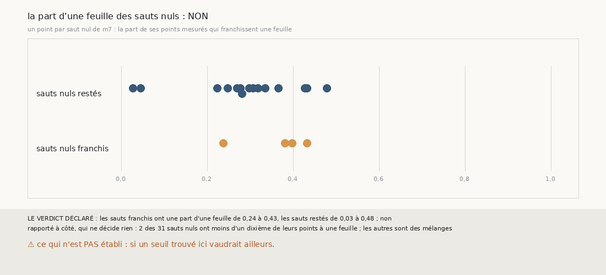

# `393` — Les sauts nuls de `m7` qui franchissent une feuille se distinguent-ils par la part de leurs points qui en franchissent une ? Non

*`392` a trouvé que 4 des 20 sauts nuls de `m7` dont les voisines disent l'avance franchissent une feuille. Cette tranche relit, point par
point, le compte de `m7` de chaque saut des chaînes à seize sauts. Les sauts franchis ont une part de points à une feuille de 0,24 à 0,43,
les sauts restés de 0,03 à 0,48 : par la règle déclarée, non, la part ne les sépare pas. Surtout, la plupart des sauts nuls de `m7` ne sont
pas nets : 2 seulement des 31 ont moins d'un dixième de leurs points à une feuille ; les autres sont des mélanges où le zéro l'emporte de
peu.*

## 0. Pourquoi cette tranche

C'est `R4-P190`, ouverte par `392`. Si un saut nul qui franchit une feuille garde plus de points à une feuille qu'un saut nul qui reste, un
seuil sur cette part le rattrape, sans les voisines.

## 1. Ce qui a été vu avant d'écrire

Tout ce que `296` à `392` publient, dont `R4-F578` et `R4-F577`.

## 2. Ce qui est fait

- **Les chaînes et les comptes** : les chaînes à seize sauts de `389`, rejouées ; leurs nombres de feuilles redonnent ceux de `389`. Pour
  chaque saut, le compte de `383` point par point, gardé en entier.
- **La part d'une feuille** d'un saut : ses points mesurés qui franchissent une feuille, sur ses points mesurés.
- **La règle** : tous les sauts franchis plus forts que tous les restés, oui ; la médiane des franchis au-dessus du plus fort des restés, en
  partie ; sinon, non.

`m7` a été lu sans panne, en 237,9 secondes.

## 3. Ce que dit la part

| sauts nuls | nombre | part d'une feuille, du plus faible au plus fort |
|---|---|---|
| restés sur leur feuille | 15 | 0,03 à 0,48 |
| franchissant une feuille | 4 | 0,24 à 0,43 |

⭐⭐⭐ **La part d'une feuille ne sépare pas les sauts nuls franchis des restés** (`R4-F579`). Les quatre franchis tombent au milieu des restés
: 12 des 15 restés ont une part d'au moins 0,24, et 1 une part plus forte que le plus fort des franchis.

⭐⭐⭐⭐ **Un saut nul de `m7` est presque toujours un mélange.** Sur les 31 sauts nuls, 2 seulement ont moins d'un dixième de leurs points à
une feuille, le deuxième de la suivie de la graine 6, côté moins, et le cinquième de la tierce de la graine 4, côté moins ; dans les autres,
le zéro l'emporte avec 34 à 77 % des points, contre une médiane de 92 % de points à une feuille pour les sauts d'une feuille. Le compte
majoritaire tranche ces mélanges, et c'est là qu'il se trompe parfois.

## 4. Le verdict

**LES SAUTS FRANCHIS ONT UNE PART D'UNE FEUILLE DE 0,24 À 0,43, LES SAUTS RESTÉS DE 0,03 À 0,48 : NON**

`R4-P190` est répondue : non. Aucun seuil sur la part d'une feuille ne rattrape les sauts nuls franchis sans perdre des sauts restés ; ce
que le compte de `m7` dit nul est le plus souvent un mélange qu'il ne sait pas trancher.

## 5. Ce que cette tranche ne dit pas

- ⚠⚠ Si un mélange se trompe plus souvent qu'un saut net : sur PHerc0358, seules les voisines le disent, et elles ne le disent que pour 20
  sauts nuls.
- ⚠ Si un seuil trouvé ici vaudrait ailleurs.

## 6. Les sondes

Une batterie de **4** contrôles et une figure de **13**. Trois règles cassées exprès ont fait échouer la batterie : la part comptée sur une
et deux feuilles, un recul compté resté, et la séparation prise au plus fort des franchis. Deux sondes de la figure l'ont fait échouer.

## 7. Ce qui reste

`R4-P191`, ouverte ici : sur PHercParis4, les sauts dont le compte majoritaire de `m7` est porté par moins des deux tiers des points
donnent-ils des comptes faux plus souvent que les autres ? `R4-P151`, l'encre, reste en attente de l'auteur.
