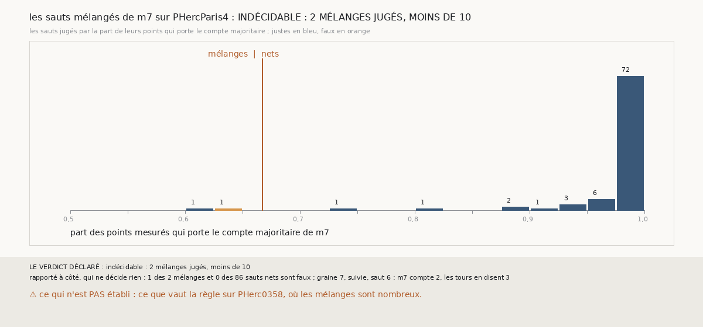

# `394` — Sur PHercParis4, les sauts mélangés de `m7` se trompent-ils plus souvent que les sauts nets ? Indécidable

*`393` a trouvé qu'un saut nul de `m7` est presque toujours un mélange. Cette tranche range les sauts de PHercParis4, dont les tours publiés
disent saut par saut si le compte est juste, en mélanges et en sauts nets. Sur 88 sauts jugés, 2 seulement sont des mélanges, dont 1 faux ;
les 86 sauts nets sont tous justes. Par la règle déclarée, c'est indécidable : moins de 10 mélanges. Ce que la tranche trouve tout de
même : sur PHercParis4, un compte net de `m7` ne s'est jamais trompé.*

## 0. Pourquoi cette tranche

C'est `R4-P191`, ouverte par `393`. Si un saut dont le compte majoritaire est faible se trompe plus souvent, l'accord peut le tenir pour
incertain au lieu de lui faire confiance ; PHercParis4 dit saut par saut si le compte est juste.

## 1. Ce qui a été vu avant d'écrire

Tout ce que `296` à `393` publient, dont `R4-F579` et `R4-F571`. Cette tranche ne lit pas `m7` : elle relit les comptes point par point que
`385` publie et les tours retrouvés que `379` publie.

## 2. Ce qui est fait

- **Les sauts jugés** : sur les côtés moins, chaque saut dont `m7` dit le nombre de feuilles et dont la surface de départ et celle d'arrivée
  retrouvent chacune un seul tour. Il est **juste** si son nombre de feuilles égale le nombre de tours entre les deux, dans le sens du côté.
- **Mélange ou net** : un saut est un mélange si son compte majoritaire est porté par moins des deux tiers de ses points mesurés.
- **La règle** : les mélanges faux au moins deux fois plus souvent que les nets, oui ; pas plus souvent, non ; sinon, en partie.
  Indécidable sous 10 mélanges jugés.

## 3. Ce que disent les tours

| sauts jugés | nombre | faux |
|---|---|---|
| nets, part majoritaire d'au moins deux tiers | 86 | 0 |
| mélanges, part majoritaire sous deux tiers | 2 | 1 |

⭐⭐⭐⭐ **Sur PHercParis4, les 86 sauts nets de `m7` sont justes** (`R4-F580`). 72 des 88 sauts jugés ont au moins 97,5 % de leurs points
sur le compte majoritaire, et 87 franchissent une feuille et un tour.

⭐⭐⭐ **Le seul saut faux est un mélange, et son second compte est le bon.** Le sixième saut de la suivie de la graine 7 : 105 de ses 166
points comptent 2 feuilles et 60 en comptent 3 ; les tours en disent 3. L'autre mélange, le septième saut de la compagne de la graine 4, est
juste.

## 4. Le verdict

**INDÉCIDABLE : 2 MÉLANGES JUGÉS, MOINS DE 10**

`R4-P191` est répondue : indécidable. PHercParis4 a des feuilles trop nettes pour juger les mélanges ; sur PHerc0358, où ils sont nombreux,
il n'y a pas de tours publiés.

## 5. Ce que cette tranche ne dit pas

- ⚠⚠ Si les mélanges se trompent plus souvent sur PHerc0358.
- ⚠ Si le second compte d'un mélange est le bon plus souvent qu'une fois sur deux : un seul cas.

## 6. Les sondes

Une batterie de **5** contrôles et une figure de **16**. Quatre règles cassées exprès ont fait échouer la batterie : le sens du côté ignoré,
le seuil du mélange à la moitié, le rapport ramené à un, et le minimum ramené à 5. Deux sondes de la figure l'ont fait échouer : les sauts
faux comptés justes, et le seuil tracé à la moitié.

## 7. Ce qui reste

`R4-P192`, ouverte ici : sur PHerc0358, à seize sauts, l'accord qui rend aux sauts mélangés de `m7` le poids de leur genre de `369`
valide-t-il autant de surfaces en se contredisant moins ? `R4-P151`, l'encre, reste en attente de l'auteur.
