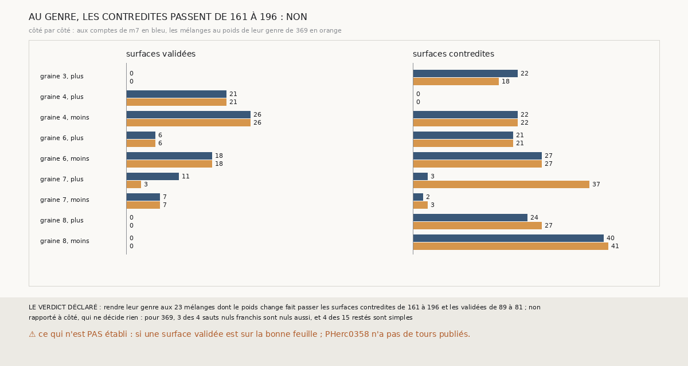

# `395` — Sur PHerc0358, rendre aux mélanges de `m7` le poids de leur genre de `369` contredit-il moins ? Non

*`394` a trouvé que sur PHercParis4 le seul compte faux de `m7` est un mélange. Cette tranche rejoue les chaînes à seize sauts de PHerc0358
et compte chaque mélange au poids de son genre de `369`, comme `384` le fait quand `m7` ne dit rien. Rendre leur genre aux 23 mélanges dont
le poids change fait passer les surfaces contredites de 161 à 196 et les validées de 89 à 81 : par la règle déclarée, non. Le genre de `369`
se trompe davantage que le compte majoritaire de `m7`, même sur un mélange.*

## 0. Pourquoi cette tranche

C'est `R4-P192`, ouverte par `394`. Si les comptes faux de `m7` sont des mélanges, un mélange peut être compté autrement : par le genre que
`369` donne à son saut. Si l'accord se contredit moins sans perdre de surfaces validées, le compte d'un mélange est à prendre au genre.

## 1. Ce qui a été vu avant d'écrire

Tout ce que `296` à `394` publient, dont `R4-F575`, `R4-F578`, `R4-F579` et `R4-F580`.

## 2. Ce qui est fait

- **Les chaînes et les sauts** : les chaînes à seize sauts de `389`, rejouées ; leurs nombres de feuilles, leurs paires et les statuts de
  leurs surfaces redonnent ceux de `389`. Pour chaque saut, son genre de `369` et le compte de `m7` point par point.
- **Mélange** : comme `394`, un saut dont le compte majoritaire est porté par moins des deux tiers de ses points mesurés.
- **Les deux accords** : celui de `389`, et le même où chaque mélange ajoute le poids de son genre au lieu de son nombre de feuilles.
- **La règle** : moins de contredites et au moins autant de validées, oui ; moins de contredites mais moins de validées, en partie ; pas
  moins de contredites, non.

`m7` a été lu sans panne, en 238,7 secondes.

## 3. Ce que dit l'accord

96 des 343 sauts que `m7` compte sont des mélanges. 23 changent de poids au genre : 13 que `m7` compte nuls et que `369` dit simples, 9 que
`m7` compte de deux feuilles et que `369` dit simples, 1 de trois feuilles que `369` dit double.

| accord | validées | contredites |
|---|---|---|
| aux comptes de `m7` | 89 | 161 |
| mélanges au genre de `369` | 81 | 196 |

⭐⭐⭐⭐ **Au genre, l'accord se contredit plus et valide moins** (`R4-F581`). Un seul côté se contredit moins, la graine 3, côté plus
(22 → 18), où rien n'est validé. La graine 7, côté plus, perd 8 validées (11 → 3) et gagne 34 contredites (3 → 37) : le deuxième saut de
sa suivie, que `m7` compte de deux feuilles avec 263 de ses 463 points, redevient simple, et c'est le saut que `384` avait trouvé de deux
feuilles.

⭐⭐⭐ **Le genre ne voit pas non plus les sauts nuls qui franchissent une feuille.** Des 4 sauts nuls que `392` dit franchis, 3 sont nuls
aussi pour `369` ; des 15 qu'il dit restés, 4 sont simples.

## 4. Le verdict

**AU GENRE, LES CONTREDITES PASSENT DE 161 À 196 ET LES VALIDÉES DE 89 À 81 : NON**

`R4-P192` est répondue : non. Le compte majoritaire de `m7` reste le meilleur compte connu, mélanges compris.

## 5. Ce que cette tranche ne dit pas

- ⚠⚠ Si une surface validée est sur la bonne feuille : PHerc0358 n'a pas de tours publiés.
- ⚠ D'où viennent les mélanges, ni pourquoi ils sont 28 % des sauts comptés sur PHerc0358 contre 2 sur 88 sur PHercParis4.

## 6. Les sondes

Une batterie de **7** contrôles et une figure de **17**. Trois règles cassées exprès ont fait échouer la batterie : le seuil du mélange à la
moitié, le genre sans effet, et tous les mélanges comptés comme changés. Deux sondes de la figure l'ont fait échouer : un côté omis, et les
seuls côtés à surfaces validées gardés.

## 7. Ce qui reste

`R4-P193`, ouverte ici : sur PHerc0358, les points d'un saut mélangé de `m7` qui franchissent une feuille et ceux qui n'en franchissent
aucune occupent-ils deux plages séparées de la surface, comme une surface à cheval, ou sont-ils entremêlés ? `R4-P151`, l'encre, reste en
attente de l'auteur.
