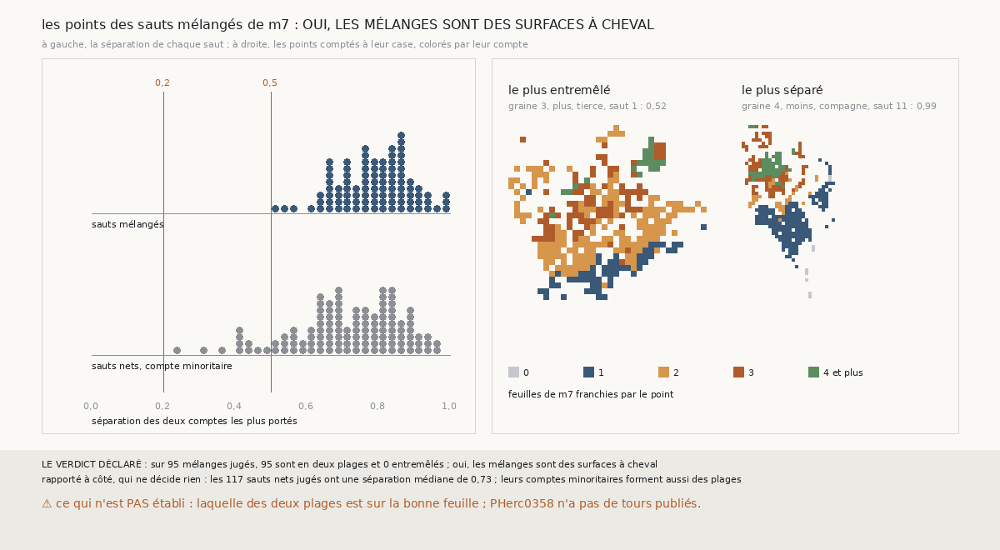

# `396` — Sur PHerc0358, les points d'un saut mélangé de `m7` forment-ils deux plages ? Oui

*`395` a trouvé que le compte majoritaire de `m7` reste le meilleur compte connu, alors que 96 des 343 sauts comptés sont des mélanges.
Cette tranche lit chaque point d'un mélange à sa place sur la surface. Sur 95 mélanges jugés, 95 sont en deux plages et 0 entremêlés : par
la règle déclarée, oui, les mélanges sont des surfaces à cheval. Les écarts le confirment : dans un mélange de zéro et une feuille, les
points à zéro sont restés sur la surface de départ.*

## 0. Pourquoi cette tranche

C'est `R4-P193`, ouverte par `395`. Si les deux comptes d'un mélange occupent deux plages, la surface est à cheval sur deux feuilles, et
c'est elle qu'il faut scinder ; s'ils sont entremêlés, c'est le compte qui est bruité.

## 1. Ce qui a été vu avant d'écrire

Tout ce que `296` à `395` publient, dont `R4-F581`, `R4-F579` et `R4-F564`.

## 2. Ce qui est fait

- **Les comptes à leur place** : les chaînes à seize sauts de `389`, rejouées ; pour chaque saut, les comptes de `m7` point par point, avec
  la position de chaque point. Leurs répartitions redonnent celles de `395`.
- **La séparation** d'un saut : chaque point de ses deux comptes les plus portés est relié à ses 6 plus proches voisins ; la part des liens
  de même compte, rapportée à celle d'un tirage au hasard. Elle vaut 0 au hasard et approche 1 pour deux plages nettes.
- **La règle** : en deux plages à 0,5 au moins, entremêlé sous 0,2 ; trois quarts des mélanges en deux plages, oui ; trois quarts
  entremêlés, non ; sinon, en partie. Un mélange est jugé si ses deux comptes ont chacun au moins 20 points.

`m7` a été lu sans panne, en 232,6 secondes.

## 3. Ce que disent les points

95 des 96 mélanges sont jugés ; le seul qui ne l'est pas, le quatorzième saut de la suivie de la graine 8, côté moins, n'a que 17 points à
zéro feuille. Leur séparation va de 0,52 à 0,99, avec une médiane de 0,80.

⭐⭐⭐⭐ **Un mélange de `m7` est une surface à cheval** (`R4-F582`). Ses deux comptes occupent deux plages, et dans les 95 le compte le
plus bas est celui des points restés le plus près de la surface de départ :

| deux comptes | mélanges | écart du compte bas | écart du compte haut | bas plus près |
|---|---|---|---|---|
| zéro et une feuille | 50 | 0,02 pas | 0,69 pas | 50 sur 50 |
| une et deux feuilles | 38 | 0,82 pas | 1,31 pas | 38 sur 38 |

Les écarts sont des médianes de médianes. Dans un mélange de zéro et une feuille, la plage à zéro n'a pas quitté la surface de départ :
`m7` ne s'y trompe pas, c'est la surface qui y est retombée.

⭐⭐⭐ **Les comptes de `m7` forment des plages partout.** Les 117 sauts nets dont le compte minoritaire a au moins 20 points ont une
séparation médiane de 0,73. Ce qui fait un mélange n'est pas d'avoir une seconde plage, c'est qu'elle soit grande.

## 4. Le verdict

**SUR 95 MÉLANGES JUGÉS, 95 SONT EN DEUX PLAGES ET 0 ENTREMÊLÉS : OUI**

`R4-P193` est répondue : oui. Une surface mélangée est en partie retombée sur la feuille d'où elle part, ou en partie montée d'une feuille
de trop ; c'est la surface qu'il faut scinder, pas le compte qu'il faut corriger.

## 5. Ce que cette tranche ne dit pas

- ⚠⚠ Laquelle des deux plages est sur la bonne feuille : PHerc0358 n'a pas de tours publiés.
- ⚠ Si la séparation est propre à `m7` : elle mesure la cohérence d'un compte dans l'espace, que des rayons voisins partagent en partie.

## 6. Les sondes

Une batterie de **9** contrôles et une figure de **17**. Trois règles cassées exprès ont fait échouer la batterie : la séparation prise sans
la retrancher d'un tirage au hasard, tous les comptes gardés au lieu des deux plus portés, et le minimum de points ramené à 5. Deux sondes
de la figure l'ont fait échouer : un point posé une case trop loin, et une seule couleur pour tous les comptes.

## 7. Ce qui reste

`R4-P194`, ouverte ici : sur PHerc0358, une chaîne qui retire de chaque surface la plage restée sur la surface d'où elle part a-t-elle moins
de sauts mélangés, et l'accord s'y contredit-il moins ? `R4-P151`, l'encre, reste en attente de l'auteur.
