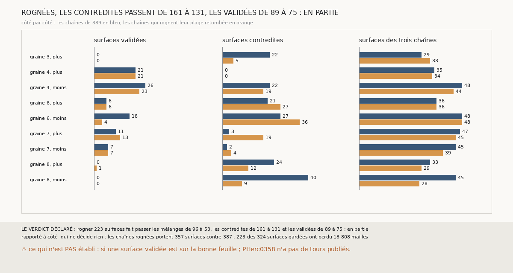

# `397` — Sur PHerc0358, une chaîne qui rogne la plage retombée de ses surfaces se contredit-elle moins ? En partie

*`396` a trouvé qu'un mélange de `m7` est une surface à cheval, dont une plage est retombée sur la surface de départ. Cette tranche relance
les trois chaînes à seize sauts en retirant de chaque surface gardée sa plage retombée avant le saut suivant. Rogner 223 surfaces fait
passer les mélanges de 96 à 53, les contredites de 161 à 131 et les validées de 89 à 75 : par la règle déclarée, en partie. Le rognage
apaise les côtés qui se contredisaient le plus, et coûte cher à la graine 6, côté moins.*

## 0. Pourquoi cette tranche

C'est `R4-P194`, ouverte par `396`. Une plage retombée est une part de la surface qui n'a pas sauté ; si elle reste, le saut suivant part en
partie de la feuille d'avant. La retirer scinde la surface au lieu de corriger son compte.

## 1. Ce qui a été vu avant d'écrire

Tout ce que `296` à `396` publient, dont `R4-F582`, `R4-F581`, `R4-F575` et `R4-F548`.

## 2. Ce qui est fait

- **Les chaînes** : celles de `389`, dont chaque surface gardée est rognée avant d'être enregistrée et d'être le départ du saut suivant,
  par un crochet `rogner` ajouté à `356` et à `366` (sans lui, rien ne change).
- **Le rognage** : une maille est retombée si son écart à la surface de départ, le long de sa normale, est sous un quart de pas. Les mailles
  retombées sont retirées si les mailles parties sont au moins le tiers des mailles dont l'écart est dit ; sinon la surface reste entière.
- **La règle**, contre `389` : moins de contredites et au moins autant de validées, oui ; moins de contredites mais moins de validées, en
  partie ; pas moins de contredites, non.

`m7` a été lu sans panne, en 234,6 secondes.

## 3. Ce que dit l'accord

223 des 324 surfaces gardées sont rognées, et perdent 18 808 mailles, 11 % de leurs mailles dont l'écart est dit.

| chaînes | surfaces | sauts comptés | mélanges | validées | contredites |
|---|---|---|---|---|---|
| `389` | 387 | 343 | 96 | 89 | 161 |
| rognées | 357 | 315 | 53 | 75 | 131 |

⭐⭐⭐⭐ **Rogner divise les mélanges par près de deux, et l'accord se contredit moins, mais valide moins** (`R4-F583`). Rapportées aux
surfaces portées, les contredites passent de 41,6 % à 36,7 % et les validées de 23,0 % à 21,0 %.

⭐⭐⭐ **Le gain et la perte ne tombent pas sur les mêmes côtés.** Les contredites fondent là où les chaînes se contredisaient le plus : graine
8, côté moins, 40 → 9, mais ses chaînes y portent 28 surfaces au lieu de 45 ; graine 8, côté plus, 24 → 12 ; graine 3, côté plus, 22 → 5. La
graine 6, côté moins, perd 14 validées (18 → 4) et gagne 9 contredites, à surfaces égales : elle validait jusqu'à 7 tours, elle ne valide
plus qu'à 1. La graine 7, côté plus, gagne 2 validées et 16 contredites. La surface validée la plus lointaine passe de 10 tours à 9.

## 4. Le verdict

**ROGNÉES, LES CONTREDITES PASSENT DE 161 À 131, LES VALIDÉES DE 89 À 75 : EN PARTIE**

`R4-P194` est répondue : en partie. Rogner la plage retombée n'est pas un remède uniforme : il défait des contradictions, et en fait naître
sur des côtés qui tenaient.

## 5. Ce que cette tranche ne dit pas

- ⚠⚠ Si une surface validée est sur la bonne feuille : PHerc0358 n'a pas de tours publiés.
- ⚠ Pourquoi la graine 6, côté moins, perd ses validées : changement de feuille, ou seulement de compte.

## 6. Les sondes

Une batterie de **8** contrôles et une figure de **15**. Trois règles cassées exprès ont fait échouer la batterie : le seuil de la plage
retombée porté à un pas, la part partie exigée à 0,9, et la même part ramenée à zéro. Deux sondes de la figure l'ont fait échouer : un côté
omis, et les surfaces des chaînes de `389` prises pour celles des chaînes rognées.

## 7. Ce qui reste

`R4-P195`, ouverte ici : sur la graine 6, côté moins, de PHerc0358, les surfaces des chaînes rognées sont-elles sur les mêmes feuilles que
celles des chaînes de `389`, ou le rognage les fait-il changer de feuille ? `R4-P151`, l'encre, reste en attente de l'auteur.
