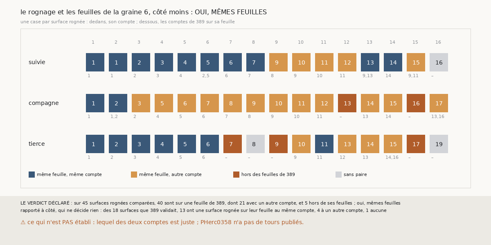

# `398` — Sur la graine 6, côté moins, le rognage fait-il changer de feuille les chaînes ? Non, il change leurs comptes

*`397` a trouvé que rognées, les chaînes de la graine 6, côté moins, perdent 14 surfaces validées sur 18, à surfaces égales. Cette tranche
lance ces chaînes deux fois, comme `389` et comme `397`, et compare chaque surface rognée aux surfaces de `389` de la même chaîne. Sur 45
surfaces rognées comparées, 40 sont sur une feuille de `389`, dont 21 avec un autre compte, et 5 hors de ses feuilles : par la règle
déclarée, oui, mêmes feuilles. Le rognage ne déplace pas les chaînes, il change leurs comptes.*

## 0. Pourquoi cette tranche

C'est `R4-P195`, ouverte par `397`. Si les surfaces rognées sont sur les feuilles de `389`, c'est par les comptes que l'accord a perdu ses
validées ; si elles ont changé de feuille, c'est la chaîne qui part ailleurs.

## 1. Ce qui a été vu avant d'écrire

Tout ce que `296` à `397` publient, dont `R4-F583` et les nombres de feuilles que `389` et `397` publient pour ce côté.

## 2. Ce qui est fait

- **Les chaînes** : les trois chaînes à seize sauts de la graine 6, côté moins, lancées comme `389` puis comme `397` ; leurs nombres de
  feuilles redonnent ceux que les deux tranches publient.
- **La comparaison** : pour chaque chaîne, les paires de `368` entre ses surfaces rognées et ses surfaces de `389`. Une surface rognée est
  sur une feuille de `389` si une surface de `389` de la même chaîne est même feuille qu'elle ; son compte est alors comparé au leur.
- **La règle** : trois quarts des surfaces comparées sur une feuille de `389`, oui ; un quart au plus, non ; sinon, en partie.

Les chaînes ont été lancées et lues sans panne, en 67,2 secondes.

## 3. Ce que disent les paires

| chaîne | même feuille, même compte | même feuille, autre compte | hors des feuilles | sans paire |
|---|---|---|---|---|
| suivie | 10 | 5 | 0 | 1 |
| compagne | 2 | 12 | 2 | 0 |
| tierce | 7 | 4 | 3 | 2 |

⭐⭐⭐⭐ **Le rognage ne déplace pas les chaînes, il change leurs comptes** (`R4-F584`). La compagne a les deux premiers comptes de `389`,
puis un de plus jusqu'au bout : son deuxième saut rogné compte une feuille là où celui de `389` n'en comptait aucune, et sa surface est même
feuille que les deuxième et troisième surfaces de `389`, autrement dit encore à cheval. La suivie saute la surface que `389` gardait sur
place (son cinquième saut, nul) et garde les comptes de `389` jusqu'à son huitième saut.

⭐⭐⭐ **C'est le compte de la compagne qui coûte les validées.** Des 18 surfaces que `389` validait, 13 ont une surface rognée sur leur
feuille au même compte, 4 à un autre compte, et 1 aucune. Les 4 sont les cinquième à huitième surfaces de la compagne, rognées à un compte
de trop.

## 4. Le verdict

**SUR 45 SURFACES ROGNÉES COMPARÉES, 40 SONT SUR UNE FEUILLE DE `389` ET 5 HORS DE SES FEUILLES : OUI, MÊMES FEUILLES**

`R4-P195` est répondue : oui. Ce que le rognage coûte à la graine 6, côté moins, est un compte, pas une feuille.

## 5. Ce que cette tranche ne dit pas

- ⚠⚠ Lequel des deux comptes est juste : PHerc0358 n'a pas de tours publiés. Les comptes de `389` étaient ceux que les trois chaînes
  confirmaient.
- ⚠ Si les autres côtés perdent leurs validées de la même façon.

## 6. Les sondes

Une batterie de **6** contrôles et une figure de **12**. Trois règles cassées exprès ont fait échouer la batterie : le compte ignoré, le
seul plus petit compte de la feuille retenu, et la part exigée ramenée à la moitié. Deux sondes de la figure l'ont fait échouer : la couleur
de « autre compte » prise pour celle de « même compte », et les sauts de `389` écrits à la place de leurs comptes.

## 7. Ce qui reste

`R4-P196`, ouverte ici : sur PHerc0358, des chaînes rognées dont chaque saut est compté sur sa surface entière, avant rognage, gardent-elles
les contradictions défaites par `397` sans perdre ses validées ? `R4-P151`, l'encre, reste en attente de l'auteur.
