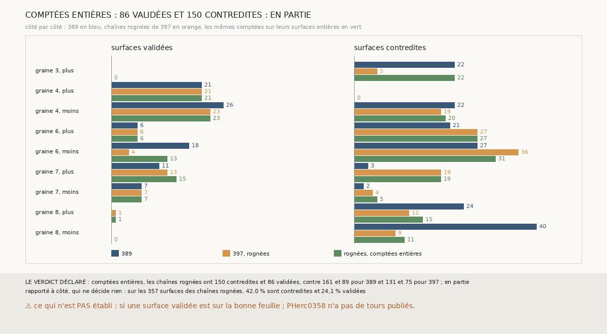

# `399` — Sur PHerc0358, compter la surface entière et ne rogner que le départ garde-t-il les deux gains ? En partie

*`398` a trouvé que le rognage ne déplace pas les chaînes, il change leurs comptes. Cette tranche garde les chaînes rognées de `397`, mais
compte et apparie chaque saut sur sa surface entière, d'avant rognage : le rognage ne sert plus qu'au départ du saut suivant. Les chaînes
ont alors 150 contredites et 86 validées, contre 161 et 89 pour `389` et 131 et 75 pour `397` : par la règle déclarée, en partie. Les
validées reviennent presque toutes ; rapportées aux surfaces, les contredites reviennent au niveau de `389`.*

## 0. Pourquoi cette tranche

C'est `R4-P196`, ouverte par `398`. Le rognage de `397` fait deux choses : il change le départ du saut suivant, et il change la surface que
l'on compte et que l'on apparie. Compter la surface entière sépare les deux effets.

## 1. Ce qui a été vu avant d'écrire

Tout ce que `296` à `398` publient, dont `R4-F583` et `R4-F584`.

## 2. Ce qui est fait

- **Les chaînes** : celles de `397`, rognées de la même façon ; leurs surfaces rognées, comptées comme `397` les compte, redonnent ses
  nombres de feuilles. Chaque surface gardée garde aussi sa forme d'avant rognage.
- **Le compte et l'appariement** : chaque saut est compté de la surface rognée d'où il part à sa surface entière ; les paires de `368`, le
  genre de `369` et l'accord de `374` se font sur les surfaces entières.
- **La règle** : au plus 131 contredites et au moins 89 validées, oui ; au moins 161 contredites ou au plus 75 validées, non ; sinon, en
  partie.

`m7` a été lu sans panne, en 226,6 secondes.

## 3. Ce que dit l'accord

| chaînes | surfaces | validées | contredites | validées par surface | contredites par surface |
|---|---|---|---|---|---|
| `389` | 387 | 89 | 161 | 23,0 % | 41,6 % |
| `397`, rognées | 357 | 75 | 131 | 21,0 % | 36,7 % |
| rognées, comptées entières | 357 | 86 | 150 | 24,1 % | 42,0 % |

⭐⭐⭐⭐ **Compté entier, l'accord retrouve ses validées, et perd l'apaisement de `397`** (`R4-F585`). La graine 6, côté moins, revient à
13 validées (18 pour `389`, 4 pour `397`) et la graine 7, côté plus, monte à 15 (11 et 13). Mais la graine 3, côté plus, revient à 22
contredites (22 et 5) : ce que `397` y défaisait tenait au compte des surfaces rognées, pas aux chaînes.

⭐⭐⭐ **Ce qui reste de l'apaisement tient à des chaînes plus courtes ou à un seul côté.** La graine 8, côté moins, garde 11 contredites
au lieu de 40, sur 28 surfaces au lieu de 45 ; ailleurs les contredites montent, à la graine 6, côté plus (21 → 27) et à la graine 7, côté
plus (3 → 19). La surface validée la plus lointaine est à 9 tours.

## 4. Le verdict

**COMPTÉES ENTIÈRES : 86 VALIDÉES ET 150 CONTREDITES, CONTRE 89 ET 161 POUR `389` ET 75 ET 131 POUR `397` : EN PARTIE**

`R4-P196` est répondue : en partie. Rogner le départ seul ne fait pas mieux s'accorder les chaînes surface par surface ; rogner ce que l'on
compte apaise des côtés et coûte des validées. Aucune des deux variantes ne bat `389` sur les deux tableaux.

## 5. Ce que cette tranche ne dit pas

- ⚠⚠ Si une surface validée est sur la bonne feuille : PHerc0358 n'a pas de tours publiés, et c'est là seulement que les variantes se
  départageraient.
- ⚠ Si le rognage fait du tort sur un rouleau dont les tours sont publiés.

## 6. Les sondes

Une batterie de **4** contrôles et une figure de **15**. Deux règles cassées exprès ont fait échouer la batterie : le compte pris sur la
surface rognée, et le départ pris entier. Deux sondes de la figure l'ont fait échouer : les couleurs de `397` et des chaînes comptées
entières échangées, et un côté omis.

## 7. Ce qui reste

`R4-P197`, ouverte ici : sur PHercParis4, des chaînes qui rognent la plage retombée de leurs surfaces lisent-elles leurs surfaces validées
sur le bon tour aussi souvent que celles de `385` ? `R4-P151`, l'encre, reste en attente de l'auteur.
