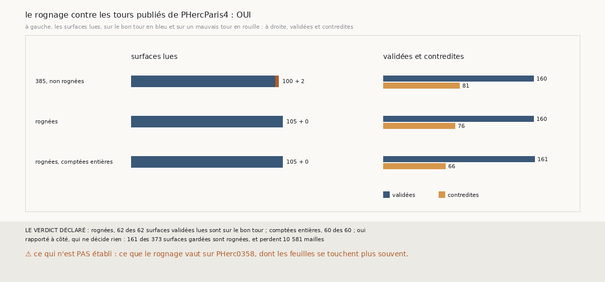

# `400` — Sur PHercParis4, des chaînes rognées lisent-elles leurs surfaces validées sur le bon tour ? Oui

*`399` a conclu que sur PHerc0358 aucune façon de rogner ne bat les chaînes non rognées, et que seuls des tours publiés les départageraient.
Cette tranche lance les trois chaînes de PHercParis4 en rognant chaque surface gardée, et juge les deux façons de compter contre les tours
publiés. Rognées, 62 des 62 surfaces validées lues sont sur le bon tour ; comptées entières, 60 des 60 : par la règle déclarée, oui. Le
rognage ne fait aucun tort là où la vérité est connue, et il ramène sur le bon tour les deux surfaces que `385` lisait sur un mauvais.*

> ⚠⚠⚠⚠ **CORRIGÉ PAR `401`, LE 2026-10-01.** Ce document dit que le rognage « ramène sur le bon tour les deux surfaces que `385`
> lisait sur un mauvais » et « corrige deux comptes », et `R4-P198` demande quel saut `385` comptait de trop. `401` lit les tours de la
> suivie de la graine 7, côté moins : dans `385`, son sixième saut va du tour −3 au tour −6 et `m7` lui donne 2 feuilles, donc **`385`
> comptait une feuille de moins, pas de trop** (ce que `R4-F580` disait déjà). Rognée, la suivie ne fait pas ce saut : ses sixième à
> huitième surfaces sont aux tours −4, −5 et −6. **Ce ne sont pas les mêmes surfaces** : le rognage a changé la chaîne, il n'a pas corrigé
> un compte. ⭐ Les mesures de cette tranche sont intactes, et le verdict, oui, tient.

## 0. Pourquoi cette tranche

C'est `R4-P197`, ouverte par `399`. PHercParis4 a des tours publiés : c'est là qu'un rognage qui ferait tort se verrait.

## 1. Ce qui a été vu avant d'écrire

Tout ce que `296` à `399` publient, dont `R4-F571`, `R4-F580`, `R4-F583` et `R4-F585`.

## 2. Ce qui est fait

- **Les chaînes** : les trois chaînes d'une maille de `379`, dont chaque surface gardée est rognée comme `397`, au pas et au latéral de
  PHercParis4 ; chaque surface garde aussi sa forme entière.
- **Deux façons de compter** : **rognées**, comptées, appariées et jugées sur leurs surfaces rognées ; **comptées entières**, sur leurs
  surfaces entières, chaque saut compté depuis la surface rognée d'où il part. Comptes de `m7` et accord de `385`, vérité de `379`.
- **Le contrôle** : là où aucune surface n'est rognée, les statuts redonnent ceux de `385`. Un seul côté est dans ce cas, la graine 2,
  côté moins, et il les redonne.
- **La règle** : au moins 10 validées lues et toutes sur le bon tour dans les deux façons, oui ; plus d'une sur dix sur un mauvais tour dans
  l'une, non ; sinon, en partie.

`m7` a été lu sans panne, en 720,4 secondes. 161 des 373 surfaces gardées sont rognées, et perdent 10 581 mailles.

## 3. Ce que disent les tours publiés

| chaînes | validées | contredites | validées lues sur le bon tour | toutes lues sur le bon tour |
|---|---|---|---|---|
| `385`, non rognées | 160 | 81 | 58 sur 58 | 100 sur 102 |
| rognées | 160 | 76 | 62 sur 62 | 105 sur 105 |
| rognées, comptées entières | 161 | 66 | 60 sur 60 | 105 sur 105 |

⭐⭐⭐⭐ **Sur PHercParis4, le rognage ne fait aucun tort, et corrige deux comptes** (`R4-F586`). Les deux surfaces que `385` lisait sur
un mauvais tour, les sixième et septième de la suivie de la graine 7, côté moins, sans témoin, au compte 7 et 8, sont rognées au compte 6 et
7, et lues sur le bon tour.

⭐⭐⭐ **Rognées, les chaînes se contredisent un peu moins sans perdre de validées.** Les contredites passent de 81 à 76, ou à 66 comptées
entières ; les validées restent à 160, ou 161.

## 4. Le verdict

**ROGNÉES, 62 DES 62 SURFACES VALIDÉES LUES SONT SUR LE BON TOUR ; COMPTÉES ENTIÈRES, 60 DES 60 : OUI**

`R4-P197` est répondue : oui. Là où la vérité est connue, le rognage de la plage retombée est sans tort et corrige ce que `385` comptait de
trop.

## 5. Ce que cette tranche ne dit pas

- ⚠⚠ Ce que le rognage vaut sur PHerc0358, dont les feuilles se touchent plus souvent ; la compagne de la graine 6, côté moins, y compte une
  feuille de trop une fois rognée (`R4-F584`).
- ⚠ Le contrôle ne porte que sur un côté, faute de côté où rien n'est rogné.

## 6. Les sondes

Une batterie de **4** contrôles et une figure de **13**. Trois règles cassées exprès ont fait échouer la batterie : le rognage au pas de
PHerc0358, la part fausse admise portée à 0,2, et les lues comptées sur tous les statuts au lieu des seules validées. Deux sondes de la
figure l'ont fait échouer : les lues de `385` recomptées sur ses seules validées, et validées et contredites échangées.

## 7. Ce qui reste

`R4-P198`, ouverte ici : sur PHercParis4, quel saut de la suivie de la graine 7, côté moins, `385` comptait-il d'une feuille de trop, et sa
surface était-elle à cheval ? `R4-P151`, l'encre, reste en attente de l'auteur.
