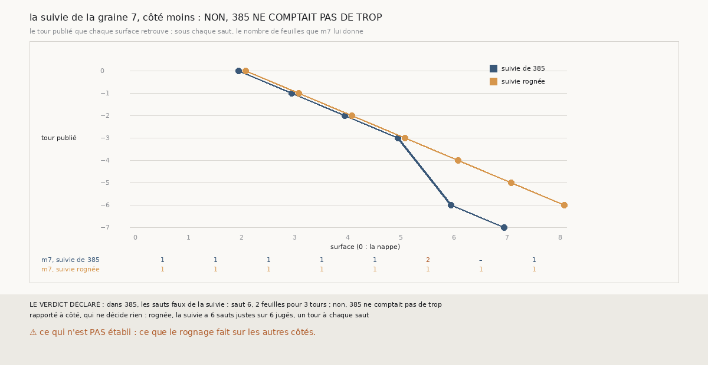

# `401` — Sur PHercParis4, quel saut de la suivie de la graine 7 `385` comptait-il de trop ? Aucun : il en comptait un de moins

*`400` a posé `R4-P198` comme si `385` comptait de trop les deux surfaces que le rognage ramène sur le bon tour ; `R4-F580` disait déjà le
contraire. Cette tranche relance les chaînes rognées et lit, surface par surface, les tours publiés de la suivie de la graine 7, côté moins.
Dans `385`, le seul saut faux de la suivie est le sixième : 2 feuilles pour 3 tours. Par la règle déclarée, non, `385` ne comptait pas de
trop. Rognée, la suivie ne fait pas ce saut : elle descend d'un tour à chaque saut.*

## 0. Pourquoi cette tranche

C'est `R4-P198`, ouverte par `400`. Si le rognage corrigeait le compte d'une surface à cheval, il corrigerait la mesure ; s'il fait faire à
la chaîne un autre saut, il change la chaîne.

## 1. Ce qui a été vu avant d'écrire

Tout ce que `296` à `400` publient, dont `R4-F586` et `R4-F580`, qui disait déjà que le sixième saut de cette suivie compte 2 feuilles quand
les tours en disent 3. La porte a été posée sur une prémisse que ce fait contredisait ; cette tranche le mesure au lieu de le supposer.

## 2. Ce qui est fait

- **Les chaînes de `385`** : sur ce côté, les tours que `379` retrouve pour chaque surface et les comptes de `m7` de chaque saut.
- **Les chaînes rognées** : celles de `400`, relancées ; leurs statuts sur ce côté redonnent ceux de `400`. Pour chaque surface, ses tours
  publiés ; pour chaque saut, son compte de `m7`.
- **Un saut jugé** : ses deux surfaces retrouvent un seul tour ; il compte de trop si `m7` dit plus de feuilles que de tours, pas assez s'il
  en dit moins ; sa surface est à cheval si c'est un mélange.

`m7` a été lu sans panne, en 257,7 secondes.

## 3. Ce que disent les tours

| suivie | tours des surfaces 2 à 8 | sauts jugés justes | saut faux |
|---|---|---|---|
| `385` | 0, −1, −2, −3, −6, −7, – | 3 sur 4 | le sixième : 2 feuilles pour 3 tours |
| rognée | 0, −1, −2, −3, −4, −5, −6 | 6 sur 6 | aucun |

⭐⭐⭐⭐ **`385` ne comptait pas de trop : sa suivie sautait trois tours d'un coup** (`R4-F587`). Son sixième saut va du tour −3 au tour
−6, et `m7` lui donne 2 feuilles : 105 de ses 166 points en comptent 2, 60 en comptent 3. C'est un mélange, donc une surface à cheval, et le
compte majoritaire s'y trompe d'une feuille, par défaut.

⭐⭐⭐⭐ **Rognée, la suivie ne fait pas ce saut.** Sa sixième surface est au tour −4, sa septième au −5, sa huitième au −6. Les surfaces que
`400` dit ramenées sur le bon tour ne sont donc pas les mêmes : le rognage n'a pas corrigé un compte, il a changé la chaîne, qui ne saute
plus trois tours. La compagne descend d'un tour à chaque saut dans les deux cas.

## 4. Le verdict

**DANS `385`, LE SEUL SAUT FAUX DE LA SUIVIE EST LE SIXIÈME, 2 FEUILLES POUR 3 TOURS : NON, `385` NE COMPTAIT PAS DE TROP**

`R4-P198` est répondue : non. Ce que `R4-F586` appelle deux comptes corrigés est un triple saut que la chaîne rognée ne fait pas.

## 5. Ce que cette tranche ne dit pas

- ⚠⚠ Si le rognage évite aussi les sauts de plusieurs feuilles sur PHerc0358.
- ⚠ Une sonde de la figure n'a pas pu échouer : aucune surface de la suivie ne retrouve deux tours, donc un point posé au premier de deux
  tours ne change rien ici.

## 6. Les sondes

Une batterie de **5** contrôles et une figure de **14**. Deux règles cassées exprès ont fait échouer la batterie : le sens du côté ignoré,
et le seuil du mélange porté à la moitié. Une sonde de la figure l'a fait échouer, les tours de `385` posés pour les deux chaînes ; une
autre n'a pas pu échouer, faute de surface à deux tours.

## 7. Ce qui reste

`R4-P199`, ouverte ici : sur PHerc0358, à seize sauts, les chaînes rognées font-elles moins de sauts de plus d'une feuille de `m7` que les
chaînes de `389` ? `R4-P151`, l'encre, reste en attente de l'auteur.
