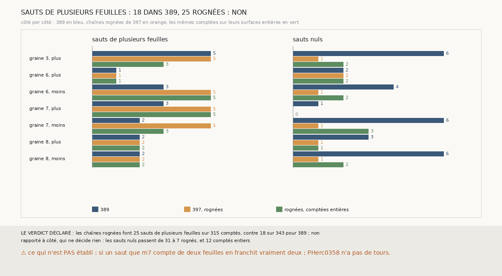

# `402` — Sur PHerc0358, les chaînes rognées font-elles moins de sauts de plusieurs feuilles ? Non

*`401` a trouvé que sur PHercParis4 la suivie rognée de la graine 7 ne fait pas le triple saut de celle de `385`. Cette tranche relit les
nombres de feuilles que `389`, `397` et `399` publient pour chaque saut de PHerc0358. Les chaînes rognées font 25 sauts de plusieurs
feuilles sur 315 comptés, contre 18 sur 343 pour `389` : par la règle déclarée, non. Sur PHerc0358, le rognage ôte les sauts nuls et ajoute
des sauts de plusieurs feuilles. ⚠ Les répartitions ont été vues avant que la règle ne soit écrite : c'est une relecture.*

## 0. Pourquoi cette tranche

C'est `R4-P199`, ouverte par `401`. Si le rognage évite les sauts de plusieurs feuilles, il doit le faire aussi sur PHerc0358.

## 1. Ce qui a été vu avant d'écrire

Tout ce que `296` à `401` publient, dont `R4-F587`, **et les répartitions elles-mêmes** : en préparant la tranche, j'ai compté les nombres
de feuilles des trois mesures avant d'écrire la règle. La règle est celle que la porte appelait, mais elle a été écrite en connaissant le
verdict ; le fichier le dit en tête.

## 2. Ce qui est fait

- **Les sauts** : les nombres de feuilles de `m7` de chaque saut des trois chaînes, sur les seize côtés, tels que `389`, `397` et `399` les
  publient.
- **Un saut de plusieurs feuilles** : `m7` y dit au moins deux feuilles ; la part est prise sur les sauts que `m7` compte.
- **La règle** : une part rognée au plus moitié de celle de `389`, oui ; au moins celle de `389`, non ; sinon, en partie.

## 3. Ce que disent les comptes

| chaînes | sauts comptés | de plusieurs feuilles | nuls |
|---|---|---|---|
| `389` | 343 | 18 (5,2 %) | 31 (9,0 %) |
| `397`, rognées | 315 | 25 (7,9 %) | 7 (2,2 %) |
| `399`, rognées, comptées entières | 317 | 21 (6,6 %) | 12 (3,8 %) |

⭐⭐⭐⭐ **Sur PHerc0358, le rognage ôte les sauts nuls et ajoute des sauts de plusieurs feuilles** (`R4-F588`). Les sauts nuls tombent de
31 à 7 ; ceux de plusieurs feuilles montent de 18 à 25, à la graine 6, côté moins (3 → 5), à la graine 7, côté plus (3 → 5), et à la
graine 7, côté moins (2 → 5). C'est l'inverse de PHercParis4, où la suivie rognée de la graine 7 ne fait plus son triple saut.

⭐⭐⭐ **Les trois côtés où les sauts de plusieurs feuilles montent sont aussi des côtés où `397` se contredit plus** : la graine 6, côté
moins (27 → 36 contredites), la graine 7, côté plus (3 → 19), et la graine 7, côté moins (2 → 4).

## 4. Le verdict

**LES CHAÎNES ROGNÉES FONT 25 SAUTS DE PLUSIEURS FEUILLES SUR 315 COMPTÉS, CONTRE 18 SUR 343 POUR `389` : NON**

`R4-P199` est répondue : non. Sur PHerc0358, une surface rognée de sa plage retombée part plus souvent d'une feuille en sautant par-dessus
une autre, d'après `m7`.

## 5. Ce que cette tranche ne dit pas

- ⚠⚠ Si un saut que `m7` compte de deux feuilles en franchit vraiment deux : PHerc0358 n'a pas de tours, et `R4-F580` montre que `m7` peut
  aussi compter par défaut.
- ⚠ C'est une relecture : la règle a été écrite après que les répartitions ont été vues.

## 6. Les sondes

Une batterie de **4** contrôles et une figure de **18**. Deux règles cassées exprès ont fait échouer la batterie : les sauts non comptés
inclus dans la part, et la moitié portée à 0,8. Deux sondes de la figure l'ont fait échouer : un côté omis, et les sauts nuls de `389`
posés pour `397`.

## 7. Ce qui reste

`R4-P200`, ouverte ici : sur PHercParis4, les sauts que `m7` compte de deux feuilles, rognés ou non, franchissent-ils deux tours publiés ?
`R4-P151`, l'encre, reste en attente de l'auteur.
