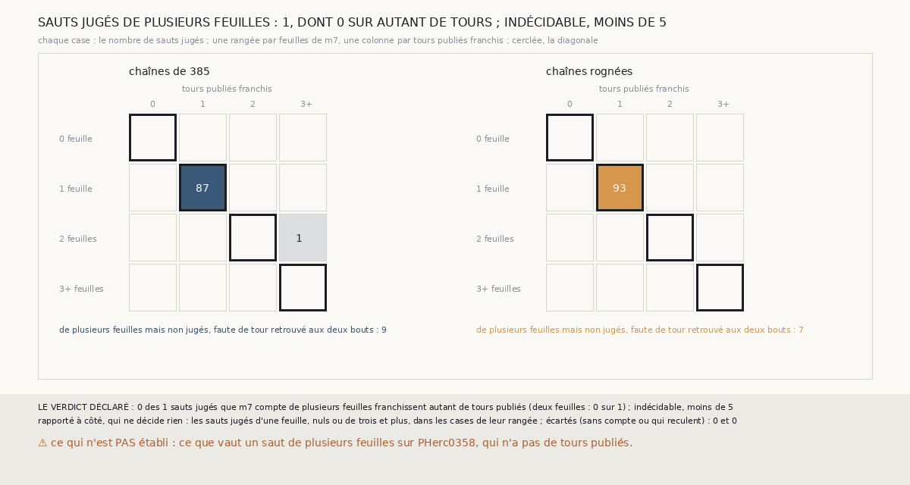

# `403` — Sur PHercParis4, un saut que `m7` compte de deux feuilles franchit-il deux tours publiés ? Indécidable

*`402` a trouvé que, sur PHerc0358, le rognage ajoute des sauts de plusieurs feuilles. PHercParis4 a des tours publiés, qui peuvent dire si
un tel saut franchit vraiment deux tours. Cette tranche relance les chaînes rognées sur les seize côtés et juge chaque saut contre les tours,
comme `401` sur un seul côté. Un seul saut jugé compte plusieurs feuilles, celui que `394` connaissait déjà, et il est faux. Par la règle
déclarée, c'est indécidable : il en faut 5. Les chaînes rognées n'ont aucun saut jugé de plusieurs feuilles. Leurs 7 sauts de plusieurs
feuilles sont tous là où les tours ne jugent rien.*

## 0. Pourquoi cette tranche

C'est `R4-P200`, ouverte par `402`. Sur PHerc0358, rien ne dit si une chaîne rognée saute vraiment une feuille ou si `m7` compte de
travers. PHercParis4 a des tours publiés, qui peuvent le dire.

## 1. Ce qui a été vu avant d'écrire

Tout ce que `296` à `402` publient, dont `R4-F580` : sur les côtés moins, 88 sauts de `385` sont jugés, et le seul de plusieurs feuilles
est le sixième de la suivie de la graine 7, faux. En préparant la tranche, j'ai aussi vu une ligne de plus, sur le côté moins de la
graine 5 : le huitième saut rogné de la suivie y compte 2 feuilles, et sa surface non rognée ne retrouve aucun tour. La famille de `385`
était donc connue d'avance. Ce qui est nouveau, ce sont les chaînes rognées.

## 2. Ce qui est fait

- **Deux familles de chaînes**, sur les seize côtés : celles de `385`, avec les tours que `379` publie, et les chaînes rognées de `400`,
  relancées. Chaque surface rognée est lue contre les tours publiés et chaque saut est compté par `m7`.
- **Un saut jugé**, comme dans `401` : ses deux surfaces retrouvent chacune un seul tour. Il est **juste** si `m7` y compte autant de
  feuilles qu'il franchit de tours.
- **Le contrôle** : les chaînes rognées relancées redonnent les statuts de `400` sur les seize côtés.
- **La règle** : si tous les sauts jugés de plusieurs feuilles sont justes, **oui** ; si moins de la moitié le sont, **non** ; sinon,
  **en partie**. C'est indécidable sous 5 de ces sauts. Un saut rogné identique à un saut de `385` n'est compté qu'une fois.

`m7` a été lu sans panne, en 930,7 secondes ; le contrôle tient sur les seize côtés.

## 3. Ce que disent les tours

| chaînes | sauts jugés | une feuille, un tour | de plusieurs feuilles, jugés | de plusieurs feuilles, non jugés |
|---|---|---|---|---|
| `385` | 88 | 87 | 1 : 2 feuilles pour 3 tours | 9 |
| rognées | 93 | 93 | 0 | 7 |

⭐⭐⭐⭐ **Sur PHercParis4, les chaînes rognées n'ont aucun saut jugé de plusieurs feuilles** (`R4-F589`). Leurs 93 sauts jugés comptent
tous une feuille pour un tour. Le seul saut jugé de plusieurs feuilles des deux familles est le sixième saut de la suivie de `385`, sur la
graine 7, côté moins, que `401` a déjà lu.

⭐⭐⭐⭐ **Les sauts de plusieurs feuilles sont là où les tours ne jugent rien.** Des 7 sauts rognés de plusieurs feuilles, 5 sont sur des
côtés plus : aucune des 190 surfaces rognées de ces côtés ne retrouve un tour. Les 2 autres partent du tour −6, sur les graines 5 et 6, côté
moins, et n'arrivent sur aucun tour. Or une seule surface de chaque famille retrouve le tour −7, et aucun tour −8 n'est publié. `385` a la
même répartition : 6 sauts sur les côtés plus, 3 au-delà du tour −6.

## 4. Le verdict

**INDÉCIDABLE : 1 SAUT JUGÉ DE PLUSIEURS FEUILLES, MOINS DE 5**

`R4-P200` est répondue : indécidable. Les tours publiés de PHercParis4 ne jugent que les sauts qui vont du tour 0 au tour −6. Sur ce
parcours, les chaînes rognées ne font que des sauts d'une feuille.

## 5. Ce que cette tranche ne dit pas

- ⚠⚠ Si les deux sauts de deux feuilles qui partent du tour −6 en franchissent vraiment deux : leur surface d'arrivée ne retrouve aucun
  tour, le tour −7 n'est retrouvé que par une surface de chaque famille, et `R4-F522` le place loin des plages de `m7`.
- ⚠ Ce que vaut un saut de plusieurs feuilles sur PHerc0358, qui n'a pas de tours.

## 6. Les sondes

Une batterie de **7** contrôles et une figure de **17**. Trois règles cassées exprès ont fait échouer la batterie : un saut rogné confondu
avec celui de `385` dès qu'il a le même rang, le minimum ramené à 4, et le seuil de plusieurs feuilles porté à 3. Deux sondes de la figure
l'ont fait échouer : les sauts non jugés mis à zéro, et les valeurs de trois et plus réunies avec celles de deux.

## 7. Ce qui reste

`R4-P201`, ouverte ici : sur PHercParis4, les sauts de deux feuilles qui partent du tour −6 finissent-ils un pas au-delà du tour −7, ou
sur lui ? Les sauts d'une feuille qui partent du même tour servent de témoin. `R4-P151`, l'encre, reste en attente de l'auteur.
