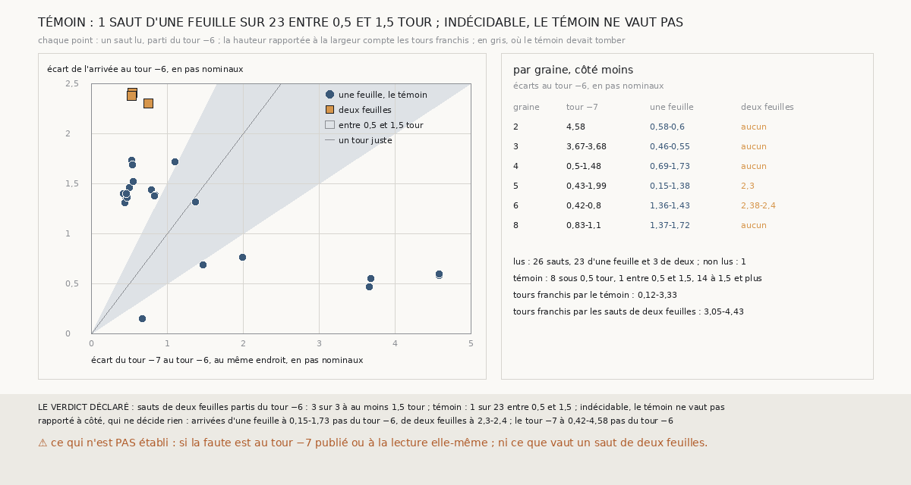

# `404` — Sur PHercParis4, un saut de deux feuilles parti du tour −6 finit-il au-delà du tour −7 ? Indécidable, le témoin ne vaut pas

*`403` a laissé deux sauts de deux feuilles qui partent du tour −6 et n'arrivent sur aucun tour publié. Cette tranche les mesure sans tour
retrouvé : l'écart de leur surface d'arrivée au tour −6, rapporté à l'écart du tour −7 au même endroit, compte les tours franchis. Les sauts
d'une feuille partis du même tour servent de témoin, et le témoin ne vaut pas : un seul sur 23 franchit entre 0,5 et 1,5 tour. Là où
arrivent ces sauts, le tour −7 est à 0,42 à 4,58 pas nominaux du tour −6. Par la règle déclarée, c'est indécidable.*

> ⚠⚠⚠⚠ **CORRIGÉ PAR `405`, LE 2026-10-01.** Ce document dit lire l'écart du tour −7 « au même endroit » que l'arrivée. Son
> code prend la médiane des écarts de l'arrivée sur les sommets du tour −6 qui lui font face, mais celle du tour −7 sur **tous** les
> sommets du tour −6 de la boîte qui font face au tour −7. Les écarts du tour −7 publiés ici ne sont donc pas pris là où arrivent les
> sauts. Relu au même endroit, le témoin ne vaut toujours pas, 2 sauts d'une feuille sur 20, et là où le tour d'arrivée est connu la
> lecture compte juste (`R4-F591`, `R4-C49`). ⭐ Les chaînes, les comptes de `m7` et le verdict, indécidable, tiennent.

## 0. Pourquoi cette tranche

C'est `R4-P201`, ouverte par `403`. Aucun tour −8 n'est publié : un saut qui franchit deux tours depuis le tour −6 ne peut retrouver aucun
tour. Mais sa distance au tour −6 se mesure, et l'écart entre les tours −6 et −7 au même endroit donne l'unité.

## 1. Ce qui a été vu avant d'écrire

Tout ce que `296` à `403` publient, dont `R4-F589` (deux sauts de deux feuilles partent du tour −6 sur les graines 5 et 6, côté moins, et
n'arrivent sur aucun tour), `R4-F522` (le tour −7 est plus loin des plages de `m7` que le tour −6) et `R4-F523` (deux tours publiés
consécutifs sont à 0,53-0,93 pas nominal l'un de l'autre autour des graines). La mesure de `403` donnait les sauts et leurs comptes ; aucune
distance n'y était publiée. La règle est écrite dans le script avant la première distance mesurée.

## 2. Ce qui est fait

- **Les chaînes** : les deux familles de `403`, celles de `385` et les chaînes rognées de `400`, relancées sur les seize côtés. Le
  contrôle : les tours retrouvés redonnent ceux de `403` surface par surface, et le compte de `m7` de chaque saut lu redonne le sien.
- **Les sauts lus** : ceux dont la surface de départ retrouve le seul tour −6 et que `m7` compte d'une feuille (**le témoin**) ou de deux.
  Un saut rogné que rien ne distingue d'un saut de `385` n'est lu qu'une fois.
- **La lecture** : les sommets du tour −6 en face de la surface d'arrivée, à 40 voxels de côté au plus ; l'écart médian de la surface le
  long de leurs normales, et celui du tour −7 au même endroit. Leur rapport est le nombre de tours franchis. Il faut 50 sommets en face pour
  chacun des deux écarts.
- **La règle** : le témoin vaut si au moins 5 de ses sauts sont lus et qu'au moins 80 % d'entre eux franchissent entre 0,5 et 1,5 tour.
  S'il vaut, tous les sauts de deux feuilles à au moins 1,5 tour, **oui** ; aucun, **non** ; sinon, **en partie**.

`m7` a été lu sans panne, en 1709,5 secondes ; le contrôle tient sur les deux familles et les seize côtés.

## 3. Ce que disent les écarts

27 sauts partent du seul tour −6 avec une ou deux feuilles ; 26 sont lus. Le saut non lu est le huitième de la compagne de la graine 2,
côté moins : aucun sommet du tour −7 n'est en face de son arrivée. Tous sont sur des côtés moins.

| graine | tour −7 | arrivées d'une feuille | arrivées de deux feuilles |
|---|---|---|---|
| 2 | 4,58 | 0,58-0,60 | aucune |
| 3 | 3,67-3,68 | 0,46-0,55 | aucune |
| 4 | 0,50-1,48 | 0,69-1,73 | aucune |
| 5 | 0,43-1,99 | 0,15-1,38 | 2,30 |
| 6 | 0,42-0,80 | 1,36-1,43 | 2,38-2,40 |
| 8 | 0,83-1,10 | 1,37-1,72 | aucune |

*Écarts au tour −6, en pas nominaux, là où arrive chaque saut.*

⭐⭐⭐⭐ **Le témoin ne vaut pas** (`R4-F590`). Des 23 sauts d'une feuille lus, 8 franchissent moins de 0,5 tour, 1 entre 0,5 et 1,5, et
14 au moins 1,5. Leurs rapports vont de 0,125 à 3,329 tours.

⭐⭐⭐⭐ **Le tour −7 n'est pas à un écart de tour du tour −6.** Sur les graines 2 et 3, il est à 3,67-4,58 pas du tour −6 ; les 5 sauts
d'une feuille lus y franchissent 0,125 à 0,148 tour. Ailleurs, il est à 0,42-1,99 pas, et 14 des 18 sauts d'une feuille lus y franchissent
au moins 1,5 tour. `R4-F527` et `R4-F529` disent déjà qu'autour des graines 1 à 3, un tour publié est posé sur la feuille de son voisin.

Rapporté à côté, qui ne décide rien : les 3 sauts de deux feuilles lus franchissent 3,05, 4,41 et 4,43 tours. Leurs arrivées sont à
2,30-2,40 pas du tour −6, plus loin que celles des 23 sauts d'une feuille, à 0,15-1,73.

## 4. Le verdict

**INDÉCIDABLE : LE TÉMOIN NE VAUT PAS, 1 SAUT D'UNE FEUILLE SUR 23 ENTRE 0,5 ET 1,5 TOUR**

`R4-P201` est répondue : indécidable. Les 3 sauts de deux feuilles lus sont à au moins 1,5 tour, mais la même lecture met 14 sauts d'une
feuille au-delà de 1,5 tour : elle ne sépare rien.

## 5. Ce que cette tranche ne dit pas

- ⚠⚠ Si la faute est au tour −7 publié ou à la lecture elle-même. Sur les graines 2 et 3, les tours publiés sont déjà mis en doute ;
  ailleurs, rien ne le dit. La lecture n'a jamais été essayée là où le tour d'arrivée est connu.
- ⚠⚠ Si les sauts de deux feuilles partis du tour −6 en franchissent deux. Que leurs arrivées soient plus loin que celles d'une feuille a
  été vu, pas jugé.
- ⚠ Ce que vaut un saut de deux feuilles sur PHerc0358.

## 6. Les sondes

Une batterie de **8** contrôles et une figure de **19**. Trois règles cassées exprès ont fait échouer la batterie : l'unité prise au pas
nominal au lieu de l'écart des deux tours, la part du témoin ramenée à 0,5, et les sauts de trois feuilles lus avec ceux de deux. Quatre
ont fait échouer la figure : l'abscisse et l'ordonnée échangées, les sauts lus famille par famille sans être réunis, la zone grise posée
entre 1 et 2 tours, et la borne haute du témoin portée à 2 dans son décompte.

## 7. Ce qui reste

`R4-P202`, ouverte ici : sur PHercParis4, la lecture de `404` donne-t-elle un tour aux sauts d'une feuille jugés justes du tour 0 au tour
−6, là où le tour d'arrivée est retrouvé ? Elle dirait si la faute est au tour −7 publié ou à la lecture. `R4-P151`, l'encre de PHerc0358, est
la suivante.
