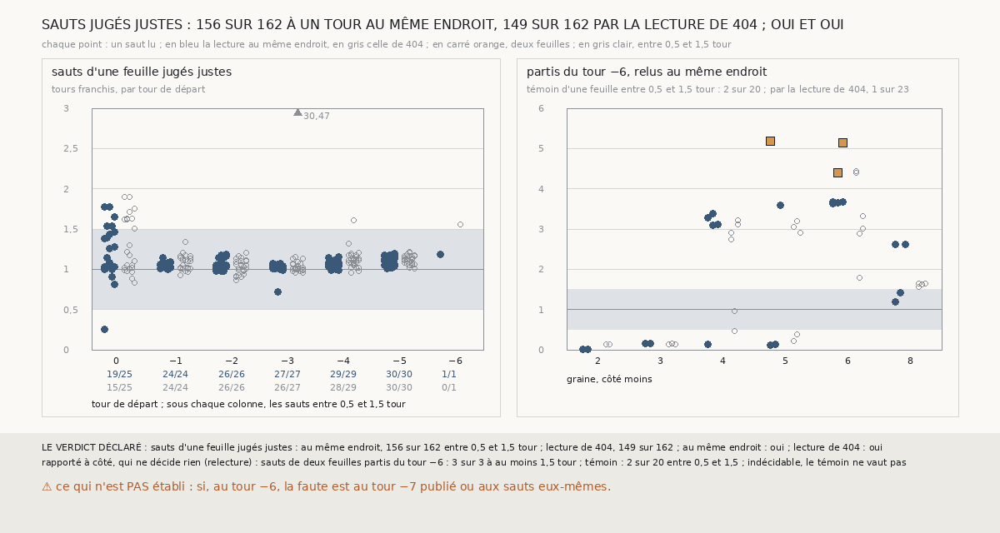

# `405` — Sur PHercParis4, la lecture de `404` donne-t-elle un tour aux sauts d'une feuille jugés justes ? Oui

*Au tour −6, le témoin de `404` ne vaut pas, et la faute pouvait être au tour −7 publié ou à la lecture. Cette tranche essaie la lecture
là où le tour d'arrivée est connu : sur les sauts d'une feuille que `403` juge justes, du tour k au tour k − 1. Elle les lit deux fois, au
même endroit et comme `404`, dont un défaut a été vu en préparant la tranche. Lus au même endroit, 156 des 162 sauts franchissent entre
0,5 et 1,5 tour ; par la lecture de `404`, 149. Par la règle déclarée, oui pour les deux. Relu au même endroit, le témoin du tour −6 ne
vaut toujours pas : la faute n'est pas à la lecture.*

## 0. Pourquoi cette tranche

C'est `R4-P202`, ouverte par `404`. Sur un saut jugé juste, les deux tours sont publiés et l'arrivée retrouve le second : une lecture qui
vaut doit y donner un tour.

## 1. Ce qui a été vu avant d'écrire

Tout ce que `296` à `404` publient, dont `R4-F590` et les sauts jugés de `403`. Les écarts de `404` ne portent que sur les sauts partis du
tour −6 : aucun saut jugé n'avait été lu.

⚠⚠ **Un défaut de `404`, vu en relisant son code.** `404` dit lire l'écart du tour −7 « au même endroit » que l'arrivée. Son code prend
la médiane des écarts de l'arrivée sur les sommets du tour −6 qui lui font face, mais celle du tour −7 sur tous les sommets du tour −6 de
la boîte qui font face au tour −7, en face de l'arrivée ou non. Sur un cas construit, la lecture de `404` donne 0,909 tour là où la
réponse est 1. Le document de `404` porte désormais un bandeau qui le dit.

## 2. Ce qui est fait

- **Les chaînes** : les deux familles de `403` et `404`, relancées sur les seize côtés. Le contrôle : les tours retrouvés redonnent ceux de
  `403` surface par surface, et la lecture de `404` redonne, saut par saut, celle que `404` publie.
- **Les sauts jugés justes** : ceux que `403` juge justes d'une feuille pour un tour. Un saut rogné que rien ne distingue d'un saut de
  `385` n'est lu qu'une fois.
- **Deux lectures** de chaque saut, du tour k au tour k − 1. **Au même endroit** : les deux médianes sur les seuls sommets du tour k qui
  font face à la fois à l'arrivée et au tour k − 1, au moins 50. **La lecture de `404`**, telle qu'elle est publiée.
- **La règle**, la même pour les deux : au moins 80 % des sauts lus entre 0,5 et 1,5 tour, **oui** ; moins de 50 %, **non** ; sinon,
  **en partie**. Indécidable sous 5 sauts lus.
- **Rapporté à côté** : la relecture, au même endroit, des sauts partis du tour −6, jugée par la règle de `404`.

⚠ Une arrivée qui retrouve le tour k − 1 en est à un quart de pas en médiane. Le test ne peut échouer que si la lecture se trompe de
géométrie.

`m7` a été lu sans panne, en 1775 secondes ; le contrôle tient sur les deux familles et les seize côtés.

## 3. Ce que disent les lectures

⭐⭐⭐⭐ **Là où le tour d'arrivée est connu, la lecture compte juste** (`R4-F591`). Les 162 sauts jugés justes sont lus par les deux
lectures. Au même endroit, 156 franchissent entre 0,5 et 1,5 tour, et les 6 autres partent tous du tour 0. Des tours −1 à −5, les 136
sauts lus tombent tous entre 0,5 et 1,5 tour. Par la lecture de `404`, 149 : le défaut en coûte 7, dont 30,47 tours pour le
quatrième saut de la tierce de la graine 3, du tour −3 au tour −4, que la lecture au même endroit lit à 0,71. Lus au même endroit, deux
tours consécutifs y sont à 0,48-1,50 pas nominaux l'un de l'autre.

⭐⭐⭐⭐ **Relu au même endroit, le témoin du tour −6 ne vaut toujours pas.** 2 des 20 sauts d'une feuille lus franchissent entre 0,5 et
1,5 tour, contre 1 sur 23 dans `404`. Sur les graines 4 à 6, 9 d'entre eux franchissent 3,08 à 3,67 tours : le tour −7 y est à 0,43-0,56
pas du tour −6, et leurs arrivées à 1,58-1,74 pas.

Rapporté à côté, qui ne décide rien : relus au même endroit, les 3 sauts de deux feuilles partis du tour −6 franchissent 4,41, 5,14 et
5,19 tours.

## 4. Le verdict

**OUI : 156 SAUTS JUGÉS JUSTES SUR 162 À UN TOUR AU MÊME ENDROIT, 149 PAR LA LECTURE DE `404`**

`R4-P202` est répondue : oui. La lecture n'est pas ce qui fait échouer le témoin au tour −6. `404` reste indécidable, et son défaut ne
change pas son verdict (`R4-C49`).

## 5. Ce que cette tranche ne dit pas

- ⚠⚠ Si, au tour −6, la faute est au tour −7 publié ou aux sauts eux-mêmes. Sur les graines 4 à 6, un saut d'une feuille parti du tour
  −6 arrive à 1,58-1,74 pas de lui, plus loin que tout écart de deux tours consécutifs lu sur les sauts justes. Où est sa surface de
  départ, au même endroit, n'a pas été lu.
- ⚠ Pourquoi la lecture manque 6 sauts partis du tour 0.
- ⚠ Ce que vaut un saut de deux feuilles, ici ou sur PHerc0358.

## 6. Les sondes

Une batterie de **10** contrôles et une figure de **18**. Quatre règles cassées exprès ont fait échouer la batterie : les médianes prises
chacune sur ses propres sommets, comme `404`, la part ramenée à 50 %, la borne haute incluse, et les sauts lus sans tenir compte de leur
partie. Quatre ont fait échouer la figure : la lecture de `404` remplacée par l'autre, la bande grise posée entre 1 et 2 tours, les
valeurs au-delà de l'axe dessinées sans marque, et les colonnes rangées par saut au lieu du tour de départ.

## 7. Ce qui reste

`R4-P203`, ouverte ici : sur PHercParis4, là où l'arrivée d'un saut d'une feuille parti du tour −6 est lue, sa surface de départ est-elle
sur le tour −6 ? Les sauts jugés justes, dont le départ retrouve son tour, servent de témoin. `R4-P151`, l'encre, reste en attente de
l'auteur.
