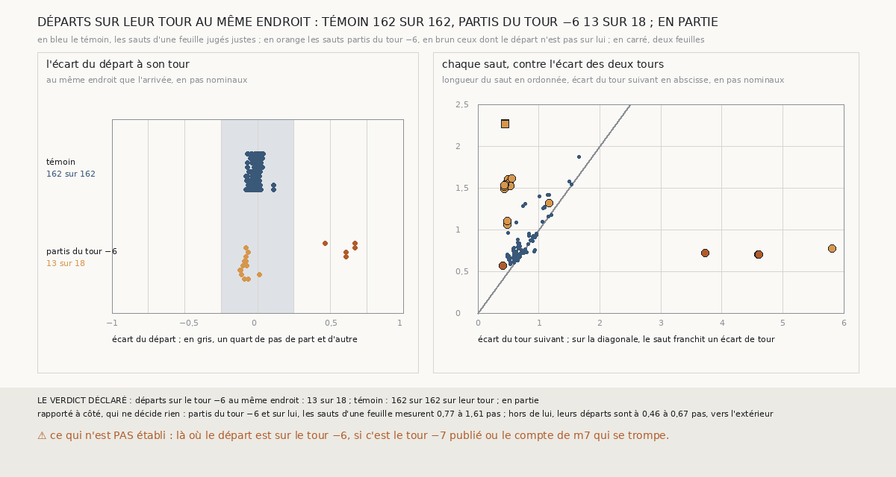

# `406` — Sur PHercParis4, là où son arrivée est lue, le départ d'un saut parti du tour −6 est-il sur ce tour ? En partie

*Au tour −6, le témoin de `404` ne vaut pas, et `405` a montré que la lecture n'y est pour rien. Cette tranche coupe le saut à ses
frontières : là où l'arrivée est lue, elle lit aussi la surface de départ. Les 162 départs du témoin, les sauts d'une feuille jugés justes,
sont tous sur leur tour. Partis du tour −6, 13 départs sur 18 le sont. Par la règle déclarée, en partie. Les deux hypothèses tiennent, sur
des graines différentes : sur les graines 2 et 3, le départ n'est pas sur le tour −6 ; sur les graines 4 à 6, il y est, et c'est le saut
qui va bien au-delà du tour −7.*

## 0. Pourquoi cette tranche

C'est `R4-P203`, ouverte par `405`. La surface de départ retrouve le tour −6 sur l'ensemble de ses sommets en face, mais rien ne disait
qu'elle est sur lui là où l'arrivée est lue. Deux hypothèses restaient ouvertes. **H1** : le départ n'y est pas sur le tour −6. **H2** : il
y est, et c'est le saut lui-même qui va trop loin.

## 1. Ce qui a été vu avant d'écrire

Tout ce que `296` à `405` publient, dont `R4-F591`. `403` à `405` ne lisent que les surfaces d'arrivée : aucun écart d'une surface de
départ n'avait été publié.

## 2. Ce qui est fait

- **Les chaînes** : les deux familles de `403` à `405`, relancées sur les seize côtés. Le contrôle : les tours retrouvés redonnent ceux de
  `403`, et la lecture au même endroit de `405` redonne la sienne, saut par saut.
- **Le témoin** : les sauts d'une feuille que `403` juge justes. **La cible** : les sauts d'une feuille partis du seul tour −6.
- **Le même endroit** : les sommets du tour de départ qui font face à la fois à la surface d'arrivée, au tour suivant et à la surface de
  départ, au moins 50. Sur eux, l'écart médian de chaque surface et du tour suivant, et la longueur du saut d'une surface à l'autre.
- **Un départ est sur son tour** si son écart médian tient dans un quart de pas nominal.
- **La règle** : le témoin vaut si au moins 80 % de ses départs sont sur leur tour. S'il vaut : au moins 80 % des départs de la cible sur
  le tour −6, **oui** ; moins de 50 %, **non** ; sinon, **en partie**.

`m7` a été lu sans panne, en 1705 secondes ; le contrôle tient sur les deux familles et les seize côtés.

## 3. Ce que disent les départs

⭐⭐⭐⭐ **Le témoin vaut** : ses 162 départs lus sont sur leur tour, à −0,08 à 0,11 pas de lui.

⭐⭐⭐⭐ **Partis du tour −6, 13 départs sur 18 sont sur lui** (`R4-F592`). Des 24 sauts d'une feuille partis du tour −6, 18 sont lus.

⭐⭐⭐⭐ **H1 tient sur les graines 2 et 3.** Les 5 départs qui ne sont pas sur le tour −6 sont ceux des graines 2 et 3, et un de la graine
5. Ils sont à 0,46 à 0,67 pas du tour −6, du côté opposé au tour −7. Leurs sauts mesurent 0,56 à 0,72 pas, comme ceux du témoin, de
médiane 0,70 pas. Sur ces graines, `R4-F527` et `R4-F529` disaient déjà qu'un tour publié est posé sur la feuille de son voisin.

⭐⭐⭐⭐ **H2 tient sur les graines 4 à 6.** Là, 10 départs sont sur le tour −6. 9 de leurs sauts mesurent 1,49 à 1,61 pas, quand le
tour −7 est à 0,43 à 0,56 pas ; le dixième mesure 0,77 pas, là où le tour −7 est à 5,80 pas. Sur la figure, le témoin se range près de la
diagonale, où un saut mesure l'écart des deux tours.

Rapporté à côté, qui ne décide rien : les 3 sauts de deux feuilles partis du tour −6 partent de lui, et mesurent 2,26 à 2,27 pas.

## 4. Le verdict

**EN PARTIE : 13 DÉPARTS SUR 18 SUR LE TOUR −6 AU MÊME ENDROIT ; TÉMOIN 162 SUR 162**

`R4-P203` est répondue : en partie. Sur les graines 2 et 3, le témoin de `404` échoue parce que le départ n'est pas sur le tour −6 là où
l'arrivée est lue. Sur les graines 4 à 6, il échoue parce que le saut va au-delà du tour −7, alors que `m7` n'y compte qu'une feuille.

## 5. Ce que cette tranche ne dit pas

- ⚠⚠ Sur les graines 4 à 6, lequel se trompe : le tour −7 publié, à 0,43-0,56 pas du tour −6, ou le compte de `m7`, qui ne voit
  qu'une feuille sur 1,49-1,61 pas.
- ⚠ Pourquoi un départ qui retrouve le tour −6 sur l'ensemble de ses sommets en est à 0,46-0,67 pas là où son arrivée est lue.
- ⚠ Ce que vaut un saut de deux feuilles, ici ou sur PHerc0358.

## 6. Les sondes

Une batterie de **8** contrôles et une figure de **16**. Quatre règles cassées exprès ont fait échouer la batterie : le saut mesuré depuis
le tour au lieu du départ, la borne du quart de pas exclue, le départ laissé hors du masque du même endroit, et la part du témoin ramenée à
50 %. Quatre ont fait échouer la figure : tous les départs de la cible en brun, la bande grise portée à un demi-pas, les sauts de deux
feuilles mêlés au panneau de gauche, et retirés de celui de droite.

## 7. Ce qui reste

`R4-P204`, ouverte ici : sur PHercParis4, graines 4 à 6, `m7` compte-t-il une feuille entre le tour −6 et le tour −7 publiés, au même
endroit ? Les tours consécutifs des sauts jugés justes servent de témoin. `R4-P151`, l'encre de PHerc0358, est la suivante.
