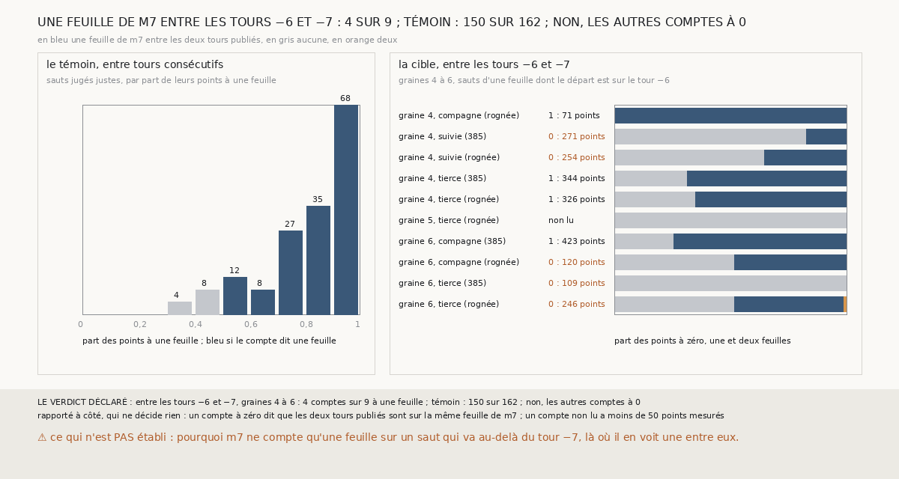

# `407` — Sur PHercParis4, graines 4 à 6, `m7` compte-t-il une feuille entre les tours −6 et −7 publiés ? Non

*`406` a trouvé que, sur les graines 4 à 6, un saut d'une feuille parti du tour −6 va bien au-delà du tour −7. `m7` et le tour −7 publié
ne peuvent pas avoir raison ensemble. Cette tranche compte, pour la première fois, les feuilles de `m7` entre deux tours publiés, là où
arrive chaque saut. Entre les tours consécutifs des sauts jugés justes, 150 comptes sur 162 disent une feuille. Entre les tours −6 et −7
des graines 4 à 6, 4 sur 9 seulement ; les 5 autres disent zéro. Par la règle déclarée, non : là, le plus souvent, le tour −7 publié est
posé sur la feuille du tour −6.*

## 0. Pourquoi cette tranche

C'est `R4-P204`, ouverte par `406`. Si `m7` compte une feuille entre les tours −6 et −7 publiés, le tour −7 est bien la feuille suivante,
et c'est le compte du saut qui se trompe. S'il n'en compte aucune, le tour −7 est posé sur la feuille du tour −6.

## 1. Ce qui a été vu avant d'écrire

Tout ce que `296` à `406` publient, dont `R4-F592`, `R4-F522`, `R4-F527` et `R4-F529`. `345` à `406` comptent les feuilles de `m7` entre
deux surfaces d'une chaîne, jamais entre deux tours publiés.

## 2. Ce qui est fait

- **Les chaînes** : les deux familles de `403` à `406`, relancées sur les seize côtés. Le contrôle : les tours retrouvés redonnent ceux de
  `403`, et la lecture du départ de `406` redonne la sienne, saut par saut.
- **Le témoin** : les sauts d'une feuille que `403` juge justes, du tour k au tour k − 1. **La cible** : les sauts d'une feuille partis
  du tour −6, sur les graines 4 à 6, dont le départ est sur ce tour au même endroit.
- **Le compte** : les tours k et k − 1, ramenés au niveau 2 et pris dans la boîte de la surface d'arrivée, élargie de la marge de `329` ;
  les feuilles de `m7` passées de l'un à l'autre, point par point, comme `345` compte un saut. Le compte que portent le plus de points,
  s'ils sont au moins 50 (`383`).
- **La règle** : le témoin vaut si au moins 80 % de ses comptes disent une feuille. S'il vaut : au moins 80 % des comptes de la cible à
  une feuille, **oui** ; moins de 50 %, **non** ; sinon, **en partie**.

`m7` a été lu sans panne, en 1209,6 secondes ; le contrôle tient sur les deux familles et les seize côtés.

## 3. Ce que disent les comptes

⭐⭐⭐⭐ **Le témoin vaut** : entre les tours consécutifs des 162 sauts jugés justes, 150 comptes disent une feuille et 12 zéro.

⭐⭐⭐⭐ **Entre les tours −6 et −7, sur les graines 4 à 6, `m7` ne compte une feuille que 4 fois sur 9** (`R4-F593`). Des 10 sauts de la
cible, 9 sont lus ; le dixième n'a que 49 points mesurés. Les 5 autres comptes disent zéro : la part de leurs points à une feuille va de
0,00 à 0,48. Les 4 comptes à une feuille ont 0,65 à 1,00 de leurs points à une feuille.

Rapporté à côté, qui ne décide rien : sur la graine 8, les 3 comptes lus de sauts partis du tour −6 disent une feuille.

## 4. Le verdict

**NON : 4 COMPTES SUR 9 À UNE FEUILLE ENTRE LES TOURS −6 ET −7 ; TÉMOIN 150 SUR 162 ; LES AUTRES À 0**

`R4-P204` est répondue : non. Sur les graines 4 à 6, là où arrivent les sauts partis du tour −6, `m7` voit le plus souvent les tours −6 et
−7 publiés sur une seule de ses feuilles. Avec `R4-F592`, la ligne ouverte par `R4-P201` se ferme : au-delà du tour −6, le tour −7 publié
ne sert pas de règle. Sur les graines 2 et 3, le départ n'est pas sur le tour −6 ; sur les graines 4 à 6, le tour −7 est le plus souvent
posé sur la feuille du tour −6.

## 5. Ce que cette tranche ne dit pas

- ⚠⚠ Là où `m7` compte une feuille entre les tours −6 et −7, pourquoi 3 sauts d'une feuille mesurent 1,51 à 1,57 pas quand les deux
  tours sont à 0,43-0,53 pas l'un de l'autre.
- ⚠ Si un saut de deux feuilles en franchit deux, ici ou sur PHerc0358 : aucun juge n'y arrive au-delà du tour −6.

## 6. Les sondes

Une batterie de **8** contrôles et une figure de **15**. Quatre règles cassées exprès ont fait échouer la batterie : le compte pris du tour
de départ à lui-même, aucune boîte, la cible sans la condition du départ sur le tour −6, et les comptes non lus gardés. Quatre ont fait
échouer la figure : la couleur des cases prise à la part de points au lieu du compte, la cible sans la condition du départ, les barres sans
la part à deux feuilles, et la graine 8 mêlée à la cible.

## 7. Ce qui reste

`R4-P205`, ouverte ici : sur PHercParis4, là où `m7` compte une feuille entre les tours −6 et −7, à moins d'un pas l'un de l'autre,
pourquoi 3 sauts d'une feuille mesurent-ils 1,51 à 1,57 pas ? `R4-P151`, l'encre de PHerc0358, est la suivante : `408` commence par vérifier que le détecteur de `296` lit encore
à la résolution de PHerc0358.
