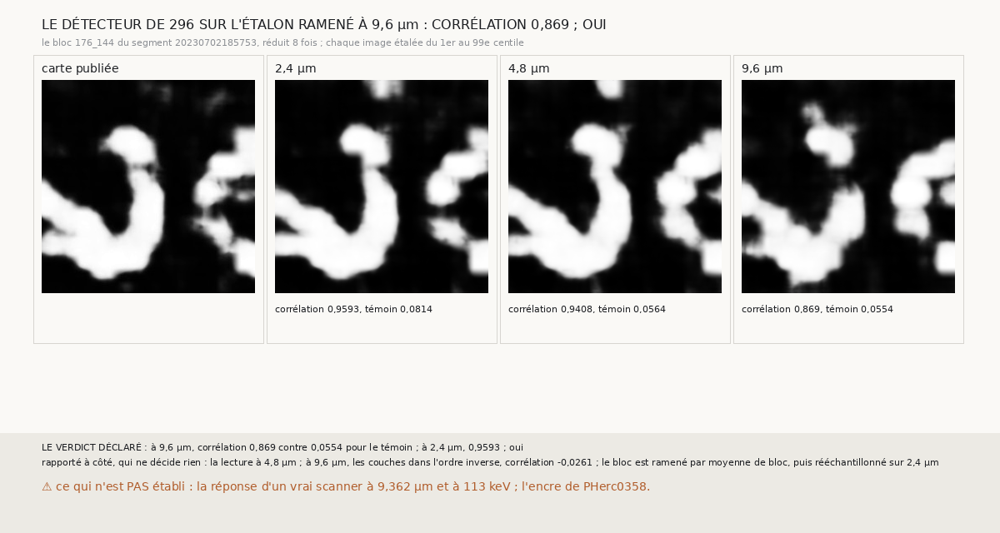

# `408` — Le détecteur d'encre de `296` lit-il encore l'encre de PHercParis4 ramenée à 9,6 µm ? Oui

*PHerc0358, le rouleau sans tracé humain, n'est scanné qu'à 9,362 µm, et le détecteur d'encre de `296` est étalonné à 2,4 µm. Avant de lire
PHerc0358, cette tranche dégrade le bloc étalon de PHercParis4 à 9,6 µm par moyenne de bloc, le rééchantillonne sur 2,4 µm, et le relit.
Sa lecture s'accorde encore à 0,869 avec la carte d'encre publiée, contre 0,0554 pour le témoin décalé ; à pleine résolution, 0,9593. Par
la règle déclarée, oui : le détecteur lit encore à cette résolution.*

## 0. Pourquoi cette tranche

C'est le premier pas de `R4-P151`, l'encre des surfaces que le critère tient sur PHerc0358. Sur un rouleau sans tracé, l'encre est le
seul témoin indépendant du compte des feuilles. Si le détecteur ne voyait plus l'encre de PHercParis4 à la résolution de PHerc0358, sa
lecture de PHerc0358 ne prouverait rien.

## 1. Ce qui a été vu avant d'écrire

Tout ce que `296` à `407` publient, dont `R4-F477` (l'étalonnage de `296` à 0,9593), `R1-F18` à `R1-F20` (le TimeSformer de 2023 n'est
pas établi à 6,48 ni à 9,72 µm) et la règle de `58` : on réduit une résolution par moyenne de bloc, jamais par décimation. Le détecteur de
`296` n'avait jamais été lu à une autre résolution que 2,4 µm.

## 2. Ce qui est fait

- **Le bloc étalon** de `296`, 109 couches de 2048 × 2048 à 2,4 µm.
- **Le ramener à 9,6 µm** : la moyenne de chaque bloc de 4 × 4 × 4 voxels, un peu plus grossier que les 9,362 µm de PHerc0358. Puis un
  rééchantillonnage trilinéaire sur la grille de 2,4 µm, pour donner au détecteur l'entrée qu'il attend.
- **Le détecteur**, tel que `296` le lit, sur l'iGPU, jamais sur le processeur.
- **La comparaison** de l'étalonnage de `296` : la lecture réduite 8 fois contre la carte publiée sous le bloc. **Le témoin** : la carte
  décalée de 64 pixels.
- **Le contrôle**, sans relancer le modèle : la lecture de `296` gardée sur le disque redonne 0,9593.
- **La règle** : une corrélation d'au moins 0,8 et plus haute que le témoin, **oui** ; sous 0,5 ou pas plus haute, **non** ; sinon, **en
  partie**.

Une lecture à 9,6 µm a pris 346,5 secondes sur l'iGPU.

## 3. Ce que lit le détecteur

| résolution | corrélation avec la carte | témoin décalé |
|---|---|---|
| 2,4 µm (`296`) | 0,9593 | 0,0814 |
| 4,8 µm | 0,9408 | 0,0564 |
| 9,6 µm | 0,869 | 0,0554 |
| 9,6 µm, couches dans l'ordre inverse | -0,0261 | 0,0483 |

⭐⭐⭐⭐⭐ **À 9,6 µm, le détecteur de `296` lit encore l'encre de PHercParis4** (`R4-F594`). Les formes des lettres de la carte restent
dans sa lecture, et le témoin décalé reste près de zéro. L'accord perd 0,09 de 2,4 à 9,6 µm.

⭐⭐⭐⭐ **Le détecteur ne lit que dans un sens.** Rapporté à côté, ajouté après la lecture à 9,6 µm : les mêmes couches dans l'ordre
inverse ne donnent plus que −0,0261. Les normales des surfaces de PHerc0358 n'ont pas d'orientation connue. Avant de lire PHerc0358, il faut
fixer dans quel sens empiler ses couches, et le fixer sur un juge, pas sur PHerc0358.

## 4. Le verdict

**OUI : À 9,6 µm, CORRÉLATION 0,869 CONTRE 0,0554 POUR LE TÉMOIN ; À 2,4 µm, 0,9593**

Le premier témoin de `R4-P151` tient. Avant la lecture de PHerc0358, il reste à fixer le sens des couches.

## 5. Ce que cette tranche ne dit pas

- ⚠⚠ La réponse d'un vrai scanner à 9,362 µm : une moyenne de bloc n'a pas sa tache focale ni son bruit. Ni l'effet de l'énergie,
  113 keV pour PHerc0358 contre 78 keV ici. C'est pourquoi `409` lit d'abord, sur PHerc0358 même, si le détecteur sépare la feuille de
  l'entre-deux.
- ⚠ Un seul bloc ; aucune encre de PHerc0358.

## 6. Les sondes

Une batterie de **9** contrôles et une figure de **13**. Quatre règles cassées exprès ont fait échouer la batterie : la réduction par
décimation au lieu de la moyenne, les centres de la grille grossière non alignés, la carte du témoin non décalée, et la règle sans la
condition du témoin. Deux ont fait échouer la figure : la légende à 9,6 µm prise à 4,8 µm, et l'ordre des images échangé. La sonde de la carte décalée ne pouvait pas échouer sur sa première carte, en deux aplats ; elle lit maintenant une
rampe.

## 7. Ce qui reste

`R4-P206`, ouverte ici, pour `409` : le rendu qui lira PHerc0358, appliqué à PHercParis4 depuis son niveau de 9,6 µm, lit-il l'encre de l'étalon, et dans quel sens des
couches, rapporté à la courbure de la feuille ? Puis `R4-P151` elle-même, sur PHerc0358.
