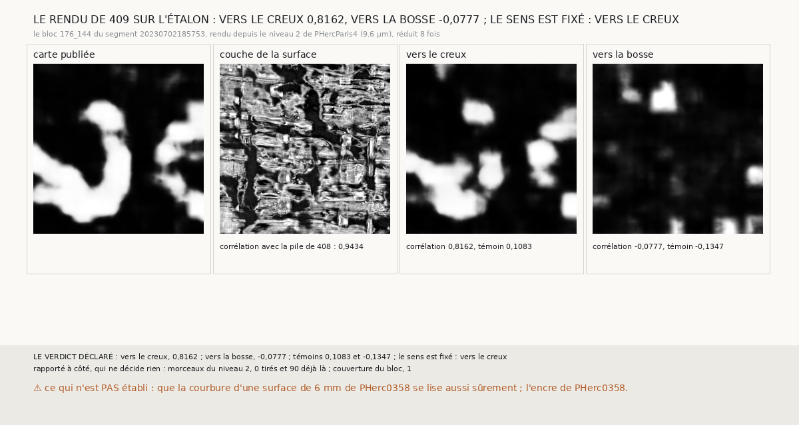

# `409` — Le rendu qui lira PHerc0358 lit-il l'encre de PHercParis4, et dans quel sens ? Vers le creux

*Le détecteur de `296` ne lit que dans un sens des couches (`408`), et les surfaces de PHerc0358 n'ont pas d'orientation connue. Cette
tranche applique au bloc étalon de PHercParis4 le rendu même qui lira PHerc0358, depuis le niveau 2 du volume, 9,6 µm, et empile les
couches dans les deux sens rapportés au creux de la feuille. Vers le creux, la lecture s'accorde à 0,8162 avec la carte d'encre publiée,
contre 0,1083 pour le témoin ; vers la bosse, -0,0777. Par la règle déclarée, le sens est fixé : vers le creux.*

## 0. Pourquoi cette tranche

C'est le deuxième pas de `R4-P151`, l'encre des surfaces que le critère tient sur PHerc0358. Lues dans le mauvais sens, les couches ne
donnent rien (`R4-F594`) : une lecture de PHerc0358 sans sens fixé ne prouverait rien, ni dans un sens ni dans l'autre. La courbure donne
une orientation qui ne dépend pas du rouleau : une feuille enroulée se creuse vers l'axe. Il restait à dire, sur un juge, de quel côté de
ce creux le détecteur lit.

## 1. Ce qui a été vu avant d'écrire

Tout ce que `296` à `408` publient, dont `R4-F594` : le bloc étalon ramené à 9,6 µm par moyenne de bloc se lit à 0,869, et à -0,0261
dans l'ordre inverse des couches. Le rendu de cette tranche n'avait jamais été lu.

## 2. Ce qui est fait

- **La surface** : le maillage du segment de `296` sous le bloc étalon 176_144, ramené au niveau 2 de PHercParis4.
- **Le creux** : la normale moyenne de la surface, et l'écart de ses sommets au plan de son centre ajusté en a·r². Le côté où les bords
  remontent est le creux. Sur ce bloc, la normale de la grille pointe à l'opposé du creux.
- **Le rendu**, celui qui lira PHerc0358 : chaque pixel du bloc, à 2,4 µm, placé sur la surface ; le scan du niveau 2 lu en trilinéaire le
  long des normales ; les couches 23 à 84 d'une pile dont la surface est la couche 54. **Deux piles** : les couches croissant vers le
  creux, et vers la bosse.
- **Le détecteur** de `296`, sur l'iGPU, une lecture par processus. **La comparaison** de l'étalonnage de `296`, contre la carte sous le
  bloc et la carte décalée de 64 pixels.
- **La règle** : si un sens donne au moins 0,8 et plus que son témoin, et l'autre moins de 0,5, **ce sens est fixé** ; si aucun ne donne
  0,8, **non, le rendu ne lit pas** ; si les deux donnent au moins 0,5, **indécidable, les deux sens lisent**.

## 3. Ce que lit le détecteur

| sens des couches | corrélation avec la carte | témoin décalé |
|---|---|---|
| vers le creux | 0,8162 | 0,1083 |
| vers la bosse | -0,0777 | -0,1347 |

⭐⭐⭐⭐⭐ **Le sens est fixé : les couches croissent vers le creux de la feuille** (`R4-F595`). Dans ce sens, les formes de la carte
reviennent dans la lecture ; dans l'autre, il ne reste rien qui lui ressemble.

⭐⭐⭐⭐ **Le rendu place la surface où le segment publié la place.** Sa couche de la surface s'accorde à 0,9434 avec celle de la pile de
`408`, le bloc étalon ramené à 9,6 µm par moyenne de bloc.

⚠⚠ **La marge est mince.** 0,8162 pour un seuil de 0,8. L'accord perd 0,05 depuis la moyenne de bloc de `408` (0,869), et 0,14 depuis la
pleine résolution (0,9593). Le témoin vers le creux monte à 0,1083, contre 0,0554 dans `408`.

## 4. Le verdict

**VERS LE CREUX, 0,8162 CONTRE 0,1083 POUR LE TÉMOIN ; VERS LA BOSSE, -0,0777 : LE SENS EST FIXÉ, VERS LE CREUX**

Le deuxième témoin de `R4-P151` tient. PHerc0358 se lit par ce rendu, les couches empilées vers le creux de chaque surface.

## 5. Ce que cette tranche ne dit pas

- ⚠⚠ Que la courbure d'une surface de 6 mm de PHerc0358 donne son creux aussi sûrement. Le bloc étalon fait 4,9 mm de côté, et un seul
  segment de PHercParis4 a été lu.
- ⚠ Le niveau 2 de PHercParis4 est une réduction de la pyramide publiée, pas un scan à 9,362 µm et à 113 keV comme PHerc0358.
- ⚠ Aucune encre de PHerc0358.

## 6. Rapporté à côté, qui ne décide rien

- **Les morceaux** : les 90 morceaux du niveau 2 que les deux piles lisent étaient déjà sur le disque.
- **Le temps** : une pile de 2048 × 2048 se rend en 156,4 secondes ; la lecture vers le creux a pris 559,8 secondes sur l'iGPU, vers la
  bosse 314,5.
- **Le rendu a d'abord pris plus de vingt minutes par pile.** `les_morceaux_complets`, qui dit quels morceaux une interpolation
  touche, triait des lignes d'indices : 40 à 65 secondes pour 32 lignes de 2048 pixels. Les trois indices tiennent maintenant dans une
  seule clé entière (`965168ca`). La pile vers le creux, rendue par les deux écritures, est identique octet pour octet.

## 7. Les sondes

Une batterie de **8** contrôles et une figure de **12**. Quatre règles cassées exprès ont fait échouer la batterie : le signe du creux
inversé, la pile empilée contre les normales, la règle sans la condition du témoin, et les morceaux du rendu sans leur marge. Trois ont
fait échouer la figure : les légendes des deux sens échangées, l'ordre des lectures inversé, le titre pris au début du verdict. Trois
autres ont fait échouer les trois sondes neuves de `les_morceaux_complets` : les axes échangés dans la clé, le repli supprimé, le voisin du
dessus oublié.

## 8. Ce qui reste

`R4-P151` elle-même, pour `410` : sur PHerc0358, les deux premières surfaces que le critère tient portent-elles plus d'encre propre à leur
feuille que celles qu'il refuse ? Le détecteur doit d'abord y distinguer la feuille de l'entre-deux, sur les nappes de départ.
