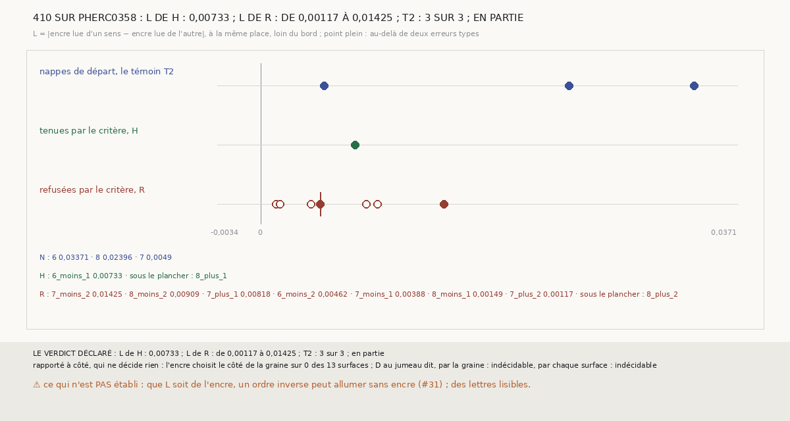

# `410` — Sur PHerc0358, les premières surfaces que le critère tient portent-elles plus d'encre que celles qu'il refuse ? En partie, sans preuve d'encre

*PHerc0358 n'a aucun tracé humain : l'encre y est le seul témoin qui ne doive rien au compte des feuilles. Cette tranche lit, au
détecteur de `296`, les surfaces des chaînes de `354` : les nappes de départ, les surfaces que le critère tient et celles qu'il refuse.
Ce qui décide est L, le contraste entre l'encre lue les couches dans un ordre et dans l'autre, à la même place. Le témoin T2 tient sur les
3 nappes de départ. La seule surface tenue assez grande pour être lue donne L = 0,00733, au milieu des 7 refusées lues (de 0,00117 à
0,01425) : « en partie » par la règle, une issue que la moitié des échanges d'étiquettes donne au hasard. Aucun pixel réduit ne dépasse
0,5 dans aucun ordre, sauf sur 3,6 % d'une nappe de départ. Aucune encre de PHerc0358 n'est établie.*

## 0. Pourquoi cette tranche

C'est `R4-P151` elle-même. Sur PHerc0358, l'encre est le seul témoin qui ne doive rien au compte des feuilles de `m7`, sur lequel repose
le critère de `352`. `354` a désigné les deux premières surfaces que le critère tient ; `408` et `409` ont montré que le détecteur de
`296` lit encore l'étalon de PHercParis4 à 9,6 µm, dans un seul ordre des couches.

## 1. Ce qui a été vu avant d'écrire

Tout ce que `296` à `409` publient, dont `R4-F540` (les statuts de `354`), `R4-F594` et `R4-F595`. Aucune lecture d'encre de PHerc0358
n'existait. La règle a été commitée avant la première lecture (`06e0df86`), puis amendée deux fois, avant qu'une seule valeur d'encre ne
soit regardée.

## 2. Une règle amendée deux fois, à l'aveugle

| commit | ce qui était su | ce qui change | pourquoi |
|---|---|---|---|
| `06e0df86`, 15 h 30 | rien | D = encre de la surface − encre de son jumeau à un demi-pas, chaque surface lue vers son propre creux | — |
| `10019339`, 15 h 39 | rien | chaque surface relue dans l'autre ordre, rapporté | la question de l'auteur : l'encre dirait-elle l'ordre ? |
| `2e87989b`, 16 h 04 | la géométrie seule | le côté du creux de la nappe de départ de la graine, porté par les normales | 5 surfaces sur 13, parallèles à leur nappe, se creusent de l'autre côté |
| `f402bf76`, 16 h 52 | « T2 tel qu'écrit tient », aucune valeur | L décide, sous un masque érodé, avec un plancher et une erreur type | une relecture à l'aveugle par une autre session |
| `fd9b8f92`, 16 h 56 | idem | l'ordre des lectures : L d'abord, les jumeaux à la fin | — |

La relecture, faite sans lire une seule lecture, a montré trois défauts de D : son côté reposait sur des courbures dont la flèche égale
les ondulations ; son jumeau, entre deux feuilles, comparait du papyrus à du vide ; son témoin passait une fois sur deux sur du bruit.

## 3. Ce qui est fait

- **Les chaînes de PHerc0358**, reconstruites comme `354` ; le contrôle : chaque saut redonne le statut publié. Il tient.
- **Les ensembles**, fixés avant toute lecture : H, les 2 surfaces du premier saut que le critère tient ; R, les 8 surfaces des sauts 1
  et 2 qu'il refuse ; N, les 3 nappes de départ.
- **Le rendu** de `409`, chaque surface rééchantillonnée à 2,4 µm, lue dans les deux ordres des couches. 2496 × 2496 pixels par
  lecture.
- **L**, pour chaque surface : la moyenne, réduite 8 fois, de la lecture dans un ordre moins la lecture dans l'autre, en valeur absolue,
  sur les pixels entièrement couverts érodés de 16 pixels réduits. **Net** au-delà de deux erreurs types entre blocs de 32 pixels
  réduits. **Le plancher** : 1000 pixels réduits.
- **T2** : L net sur au moins 2 des 3 nappes. **La règle** : si L de chaque H dépasse L de chaque R, **oui** ; si aucun ne dépasse la
  médiane de R, **non** ; sinon, **en partie**.

## 4. Ce que lit le détecteur

| surface | groupe | couverture | pixels sous le masque | L | erreur type | nette |
|---|---|---|---|---|---|---|
| `N_6` | départ | 0,8047 | 60284 | 0,03371 | 0,00794 | oui |
| `N_7` | départ | 0,2065 | 4225 | 0,0049 | 0,00163 | oui |
| `N_8` | départ | 0,2073 | 4018 | 0,02396 | 0,00969 | oui |
| `H_6_moins_1` | tenue | 0,7612 | 47504 | 0,00733 | 0,0018 | oui |
| `H_8_plus_1` | tenue | 0,1257 | 891 | sous le plancher | — | — |
| `R_6_moins_2` | refusée | 0,7874 | 48858 | 0,00462 | 0,00195 | oui |
| `R_7_moins_1` | refusée | 0,2803 | 5113 | 0,00388 | 0,00275 | non |
| `R_7_moins_2` | refusée | 0,3145 | 4395 | 0,01425 | 0,00667 | oui |
| `R_7_plus_1` | refusée | 0,2278 | 3063 | 0,00818 | 0,00526 | non |
| `R_7_plus_2` | refusée | 0,1748 | 2855 | 0,00117 | 0,00082 | non |
| `R_8_moins_1` | refusée | 0,261 | 5649 | 0,00149 | 0,00295 | non |
| `R_8_moins_2` | refusée | 0,1912 | 5402 | 0,00909 | 0,00573 | non |
| `R_8_plus_2` | refusée | 0,0999 | 19 | sous le plancher | — | — |

⭐⭐⭐⭐ **Le témoin tient : sur les 3 nappes de départ, le détecteur lit sur PHerc0358 quelque chose qui dépend de l'ordre des
couches** (`R4-F596`). Ce n'est pas encore de l'encre : voir le §7.

⭐⭐⭐⭐ **La surface tenue ne se distingue pas des refusées.** Elle est quatrième des huit valeurs lues. Sous tous les échanges des
étiquettes, la règle donne oui 1 sur 8, en partie 3 sur 8, non 4 sur 8 : l'issue lue est celle que la moitié des tirages donne.

## 5. Le verdict

**L DE H : 0,00733 ; L DE R : DE 0,00117 À 0,01425 ; T2 : 3 SUR 3 ; EN PARTIE**

Par la règle déclarée, en partie. ⚠ Écrit d'avance : avec une seule surface tenue au-dessus du plancher, la règle ne pouvait pas
trancher, et un refus a deux causes qu'elle ne départage pas. `R4-P151` n'est pas confirmée par l'encre.

## 6. Rapporté à côté, qui ne décide rien

- **Aucune encre franche.** Sur 12 des 13 surfaces, aucun pixel réduit ne dépasse 0,5, dans aucun ordre ; sur `N_6`, 3,6 % dans un
  ordre. L'encre moyenne lue va de 0,131 à 0,176. Sur l'étalon de PHercParis4, le bon ordre donne 0,30915 et 22,5 % de pixels au-dessus
  de 0,5, l'autre 0,19503 et 5,0 %. **L de l'étalon : 0,11412**, de 3 à 98 fois les L de PHerc0358.
- **Le choix de l'encre** ne départage aucune surface sauf `N_6` : la part au-dessus de 0,5 est nulle des deux côtés partout ailleurs.
- **Le signe de L change d'une feuille à sa voisine parallèle** : `N_6` lit plus du côté « plus » de sa grille, `H_6_moins_1` et
  `R_6_moins_2`, à un et deux sauts, du côté « moins ». Des feuilles voisines d'un même rouleau portent leur recto du même côté : un L
  qui serait de l'encre ne devrait pas changer de signe.
- **Sur les seuls sauts 1**, la même règle dit en partie, et 2 échanges sur 4 donnent non.
- **D au jumeau**, par la graine et par chaque surface, n'est pas lu : les lectures des jumeaux ont été arrêtées le 2026-10-01 à 22 h 31, après 9 sur 26, pour rendre la machine au travail du prix. D compare du papyrus à du vide (§2) et ne décidait rien ; une reprise sauterait les lectures déjà sur le disque.
- **T2 tel qu'écrit d'abord**, D au côté de la graine : 2 nappes sur 3 positives (0,00504, −0,00805, 0,00602).

## 7. Ce que cette tranche ne dit pas

- ⚠⚠⚠ **Que L soit de l'encre.** Un détecteur publié à 9,6 µm allume plus de pixels sur un ordre mélangé que sur le vrai, sur 10
  segments sur 10, et un ordre inverse peut allumer plus que le bon sans encre (`aviad12g/vesuvius-depth-order-control`). Un contraste
  entre deux ordres peut donc naître sans encre. C'est `R4-P208`, l'issue #31 : L contre un ordre mélangé et sur du papyrus connu vierge.
- ⚠⚠ Ce que vaut le critère : une seule surface tenue est lue.
- ⚠ Ce que lirait un détecteur entraîné à 9 µm (`R4-P209`, #32).

## 8. Les sondes

Une batterie de **27** contrôles et une figure de **25**. Vingt règles cassées exprès, au fil des cinq écritures, ont fait échouer la
batterie, dont, pour le second amendement, le masque sans érosion, L sans valeur absolue, le plancher retiré, « net » sans erreur type
et une loi d'échange mal comptée. La sonde du bruit ne pouvait d'abord pas échouer : un bruit blanc s'annule à l'arrondi ; elle lit
maintenant un bruit corrélé par tuile. Cinq règles cassées ont fait échouer la figure, dont un point plein dessiné pour une valeur qui
n'est pas nette, lu sur les pixels de l'image ; la première version de cette sonde lisait la trace et ne pouvait pas échouer.

## 9. Ce qui reste

`R4-P208` (#31) avant tout : sans ses témoins, aucune lecture de PHerc0358 ne prouve l'encre. Puis `R4-P209` (#32). `R4-P207` (#30)
juge le compte des feuilles, sans l'encre, sur un banc public.
