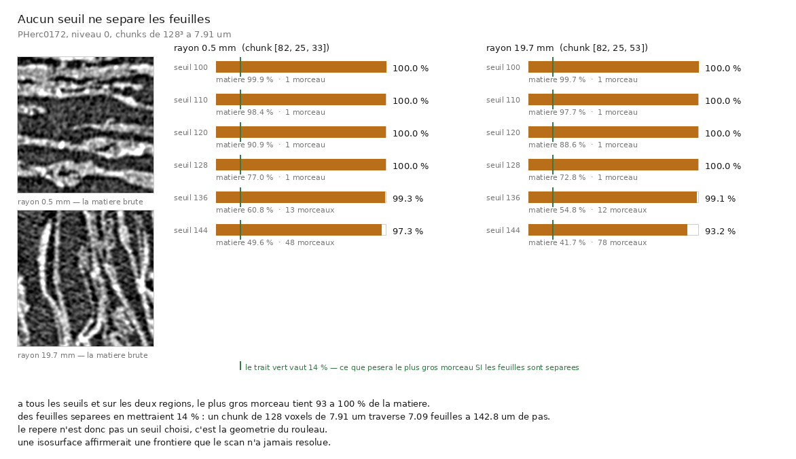

# 79 — Aucun seuil ne sépare les feuilles

> Mesuré le 2026-09-05 sur `PHerc0172`, à pleine résolution (7,910 µm), au **centre** et au
> **bord** du rouleau. Outil : [`src/rendu/topologie_du_volume.py`](../../src/rendu/topologie_du_volume.py)
> (16 contrôles). Figure : [`src/figures/figure_le_seuil_ne_separe_rien.py`](../../src/figures/figure_le_seuil_ne_separe_rien.py)
> (6 contrôles).

⚠⚠ **Pourquoi ce document existe.** [`00`](00_etat_de_lart.md) §10.3 affirme déjà, en une
phrase, qu'*« aucun seuil ne sépare les feuilles »* — et renvoie son détail vers un fichier de
`~/LplKnowledge/store/`, **gitignoré**. C'est la règle du dépôt prise à l'envers : un chiffre
publié dont le calcul n'est pas dans l'arbre n'est pas un résultat. Le calcul est ici, et il est
rejouable.

## 1. 🎯 Ce que ça donne, en une image



Figure : `src/figures/figure_le_seuil_ne_separe_rien.py`, depuis
`docs/mesures/le_seuil_ne_separe_rien.json` et `docs/mesures/coupes_du_seuil/`.

⭐⭐ **Les deux coupes de gauche sont l'argument, pas la décoration.** Elles montrent que le
scan porte une structure lamellaire **visible à l'œil** — les feuilles sont là, on les voit.
C'est ce qui rend le résultat non trivial : ce n'est pas « il n'y a rien à voir », c'est
**« ce qu'on voit ne se sépare pas »**.

## 2. ⭐⭐⭐ Le contrôle est DÉRIVÉ, pas choisi

Juger un seuil par un autre seuil choisi à la main ne dirait rien. L'attente vient de la
géométrie : un chunk de côté $c$ voxels de $v$ µm traverse

$$n = \frac{c \times v}{p}$$

feuilles quand le pas inter-feuilles vaut $p$. Ici $c = 128$, $v = 7{,}910$ µm et
$p = 142{,}8$ µm — le pas **de ce rouleau-là**, mesuré (`docs/mesures/table_champ_0172.json`)
et non emprunté à un autre, ce que [`12`](12_profondeur_de_surface.md) a payé une fois.

$$n = 7{,}09 \quad\Longrightarrow\quad \text{le plus gros morceau pèserait } 1/n = 14{,}1\ \%$$

## 3. Ce qui est mesuré

| | centre (rayon 0,5 mm) | bord (rayon 19,7 mm) |
|---|---|---|
| moyenne / écart-type des voxels non nuls | 149,7 / **25,1** | 145,3 / **23,6** |

| seuil | matière | morceaux ≥ 64 vx | **plus gros morceau** | | matière | morceaux | **plus gros** |
|---:|---:|---:|---:|---|---:|---:|---:|
| 100 | 99,9 % | 1 | **100,0 %** | | 99,7 % | 1 | **100,0 %** |
| 110 | 98,4 % | 1 | **100,0 %** | | 97,7 % | 1 | **100,0 %** |
| 120 | 90,9 % | 1 | **100,0 %** | | 88,6 % | 1 | **100,0 %** |
| 128 | 77,0 % | 1 | **100,0 %** | | 72,8 % | 1 | **100,0 %** |
| 136 | 60,8 % | 13 | **99,3 %** | | 54,8 % | 12 | **99,1 %** |
| 144 | 49,6 % | 48 | **97,3 %** | | 41,7 % | 78 | **93,2 %** |

**93,2 à 100 % contre 14,1 % attendus, à six seuils et sur deux régions.**

⚠ La part de matière est dans le tableau pour une raison : sans elle on pourrait croire que
les seuils hauts *fabriquent* des morceaux en vidant le volume. À 144 il reste **42 à 50 %**
de matière, et le plus gros morceau en tient encore 93 %. Les 48 et 78 morceaux comptés là
sont du poivre au bord des lamelles, pas des feuilles.

⚠ La connexité est à **6 voisins**. En 26-connexité deux feuilles qui se frôlent par un coin
fondraient en une seule, et le contrôle deviendrait incapable d'échouer : tout empilement
serait toujours un seul morceau, quelle que soit la donnée.

## 4. ⚠⚠ Ce que ça interdit

**Une isosurface affirmerait une frontière que le scan n'a jamais résolue.** Toute approche qui
maille un seuil et suit la surface obtenue ne suit pas une feuille : elle suit le bord d'une
motte dont les feuilles sont des reliefs internes. C'est une contrainte sur la **méthode**, pas
sur ce rouleau — et elle explique pourquoi un traceur qui part d'un point quelconque n'a rien
à quoi s'accrocher, ce que [`25`](25_une_graine_choisie_sur_la_planeite.md) mesure par
l'occupation et [`55`](55_les_murs_et_leurs_causes.md) enregistre comme mur.

⭐ Le coût de maillage, tant qu'on y est : **0,32 à 0,79 face par voxel** selon le seuil, soit
jusqu'à **1,0 million de faces** par chunk de 128³. Ce n'est pas le pire cas théorique, c'est
le compte réel des interfaces plein/vide, bords du chunk compris.

## 5. ⚠⚠⚠ Une structure radiale qui n'existe pas — et la sonde qui l'a démentie

La sonde du rouleau entier ([`src/rendu/rouleau_entier.py`](../../src/rendu/rouleau_entier.py)),
au **niveau 5** (253,1 µm par voxel), rend un profil radial spectaculaire :

| rayon (vox de 253 µm) | points | moyenne | **écart-type** |
|---:|---:|---:|---:|
| 0–10 | 314 | 147,5 | 6,5 |
| 40–50 | 2 833 | 146,1 | 6,1 |
| 80–90 | 4 910 | 143,9 | **16,2** |
| 100–110 | 2 006 | 136,8 | **31,9** |
| 110–120 | 414 | 124,3 | 31,5 |

L'écart-type **quintuple** vers l'extérieur, ce qui se lit comme *« la structure est au bord,
le cœur est une motte »*. ⚠⚠ **Et ça ne survit pas à la pleine résolution** : à 7,910 µm
l'écart-type vaut **25,1** au centre et **19,1** à 23,7 mm — il *diminue* légèrement vers
l'extérieur, exactement l'inverse.

⭐ L'explication tient en deux faits déjà connus. Un voxel de niveau 5 fait **253 µm** pour un
pas inter-feuilles de **142,8 µm** : le cœur y moyenne feuilles et interstices dans un même
voxel, ce qui écrase la variance. Et près du bord, un voxel mélange rouleau et **vide du
masque**, ce qui la gonfle. Le profil de niveau 5 mesure donc la **taille du voxel**, pas la
compaction du rouleau.

> ⭐⭐ C'est exactement ce que l'en-tête de `rouleau_entier.py` réclamait : *« conclure “le
> rouleau est un bloc” depuis un chunk serait mesurer un coin et parler du tout »*. La sonde
> a servi — et elle s'est démentie elle-même, ce qui est le meilleur emploi qu'un instrument
> puisse avoir.

⚠ Ce que le niveau 5 dit quand même, et qui tient : **97,4 %** des voxels non nuls du rouleau
entier tombent entre 128 et 176. La plage dynamique de la matière est **étroite** — moyenne
147,2, écart-type 16,9 sur 21,3 M de voxels — et c'est cohérent avec le fait qu'aucun seuil ne
tranche.

## 6. Reproduire

```
# le balayage, centre et bord, avec les coupes que la figure lit
uv run python src/rendu/topologie_du_volume.py \
    --json docs/mesures/le_seuil_ne_separe_rien.json \
    --coupe docs/mesures/coupes_du_seuil/coupe.npy
uv run python src/figures/figure_le_seuil_ne_separe_rien.py

# les deux sondes exploratoires dont ce document part
uv run python src/rendu/rouleau_entier.py /tmp/rouleau_n5.npy    # 36 chunks, ~39 Mo
uv run python src/rendu/sonde_exterieur.py /tmp                  # le bord, pleine resolution
uv run python src/rendu/sonde_maillage.py /tmp/coupe.ppm         # les six niveaux de pyramide

uv run python src/rendu/topologie_du_volume.py --verifier
uv run python src/figures/figure_le_seuil_ne_separe_rien.py --verifier
```

⚠ `rouleau_entier.py` rapporte **3 chunks absents sur 36** : le bucket n'en publie pas le
contenu, et le volume les laisse à zéro. Ils sont comptés et non silencieux.

## 7. ⚠ Ce que ce document ne dit pas

- **Il ne dit pas que le scan est mauvais.** Il dit que la frontière entre deux feuilles n'est
  pas au-dessus d'un seuil d'intensité. Un détecteur qui apprend une texture, ou un champ
  d'orientation, peut parfaitement les distinguer — c'est même ce que font les prédictions de
  surface publiées, dont [`39`](39_le_seam_de_correction.md) mesure la planarité à **0,993**
  là où le volume brut ne dit rien.
- **Il ne teste que deux régions d'un rouleau.** Deux, c'est mieux qu'une — et ce n'est pas
  treize. Ce qui rend le résultat robuste ici est l'**écart** (93 % contre 14 %), pas le
  nombre de régions : aucun réglage ne rattrape un facteur sept.
- **Il ne mesure pas à d'autres résolutions.** Le pas de 142,8 µm ne fait 18 voxels qu'à
  7,91 µm ; à 2,4 µm il en ferait 60, et rien ici ne dit ce qu'un seuil y ferait.
- ⚠ **La « bimodalité » rapportée par `sonde_exterieur.py`** (2 pics au centre, 1 au-delà)
  sort d'un détecteur de pics grossier sur un histogramme lissé. Elle n'est pas reprise comme
  résultat ; le balayage de seuil, lui, ne dépend d'aucun réglage de ce genre.
