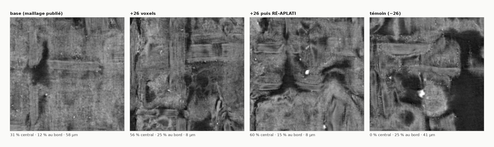
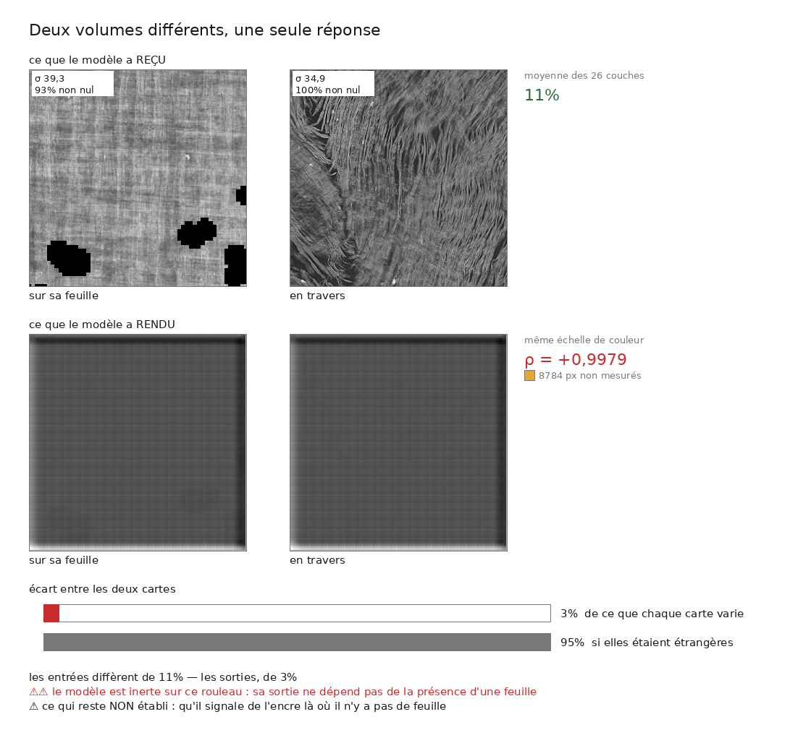
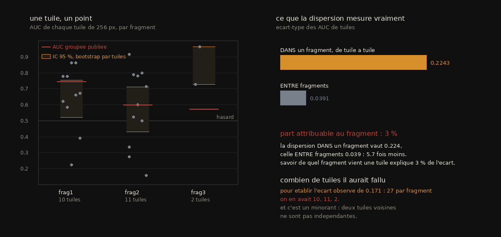
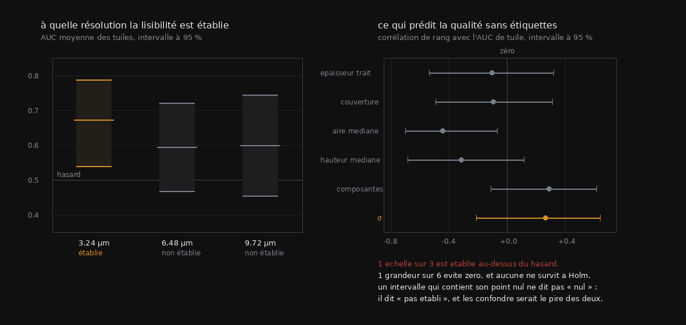

# R1 — L'encre, la règle graduée : ce qu'elle mesure, et ce contre quoi on l'a calibrée

> Rapport de campagne, écrit le **2026-09-11** d'une seule lecture des documents `archive/08`–`10`,
> `12`, `14`, `19`–`24`, `36`, `45`–`46`, `58`–`60`, `63`–`65`, `72` et `archive/75` §C1–C3
> (24 documents et trois sections, 2026-08-17 → 2026-09-05). Convention : `archive/NN §k` cite la
> preuve ; ce rapport est la lecture. Un fait porte un statut (`établi` · `borné` · `réfuté` ·
> `rétracté` · `ouvert`) et son producteur (`src/…`, JSON de même nom dans `docs/mesures/`).
>
> ⚠ Pourquoi `12`, `14`, `19`–`24` sont ici et non dans R2 : ce sont des instruments de **trace**,
> mais leur cible, ce contre quoi ils ont été validés ou réfutés, est la **carte d'encre publiée**.
> Ce rapport est celui de la règle graduée et de tout ce qu'on a mesuré avec elle. La réparation
> elle-même (`03`–`07`, `33`–`34`) est R2 ; le traceur (`25`–`26`, `30`, `35`, `37`–`55`) est R3.

## 0. Fiche

| | |
|---|---|
| question | l'encre n'est pas l'ouvrage, c'est la **règle graduée** (`HANDOFF` §1). Que mesure-t-elle réellement, sur quel régime de scan lit-elle, et peut-on juger un rendu **sans se mentir** — sans vérité de terrain, sans lire du grec, sans qu'un modèle hallucine ? |
| objets | `PHercParis4` segment `20230909121925` (le témoin où le modèle lit, AUC 0,925, 7,91 µm / 54 keV) ; `PHerc1667` (Scroll 4, où il ne lit pas) ; `PHerc0172`, `PHerc0139` (cartes publiées) ; `PHerc1447` et `PHerc0358` (rouleaux du prix, 8,64–9,36 µm) ; les **fragments** `PHercParis2Fr47`, `Fr143`, `PHercParis1Fr34` (seule vérité de terrain d'encre hors entraînement) ; la case vide de `PHerc0139` w046 et `PHerc0500P2` |
| ce qui a été construit | la chaîne complète sur iGPU (`08`), un **juge en aveugle** avec son témoin négatif (`09`), l'instrument de **profondeur** lu à distance par chunk (`12`), `tracecheck` et la règle « écarter avant de payer » (`19`–`21`), le **champ de correction** et son application (`20`), la **typographie** sans lire (`45`), le **témoin négatif géométrique** (`46`), l'échelle de dégradation résolution / profondeur (`58`), le lecteur de piles réparé (`60`), la première AUC contre étiquettes et sa barre d'erreur (`63`–`65`), le **nul verso** et le recalage de la case vide (`75` §C) |
| ce qui a été payé | un σ **257 fois trop petit** pendant sept jours, qui a fondé un résultat négatif publié puis annulé (`60`) ; une règle validée sur 80 segments et **propre à un seul rouleau** (`19` §12) ; une seconde campagne de témoin négatif rendue en 52 min et **manquée d'une fenêtre** (`46` §3 ter) ; trois AUC comparées entre elles alors que leur bruit valait cinq fois leur écart (`64`) |
| réponse au 11 septembre | **La règle lit à 2,4–3,24 µm et n'est pas établie lisible au régime du prix (9,36 µm).** Elle répond partout, y compris là où il n'y a pas de feuille (`46` §3), donc sa sortie seule ne dit rien : ce qui la rend utilisable est le **harnais** — témoin négatif géométrique, juge à condition vierge, contrôle par mélange à 0,500, nul verso, barre d'erreur par tuile. Ce harnais est ce que le dépôt a de soumissible ; l'encre lue sur un rouleau du prix, il ne l'a pas |

## 1. Les faits — `REGISTRE_faits.tsv`

**20 faits** portent cette campagne, un par ligne dans
`REGISTRE_faits.tsv` (`R1-F01` et suivants) : l'énoncé, sa valeur, son statut, la
source qui le prouve et le producteur qui le recalcule. Le §2 les cite par leur
identifiant.

## 2. La campagne en six mouvements

```
 M1 la chaîne, et le juge            08 09 10                    17–18 août
 M2 juger une trace par son encre    12 14 19 20 21 22 23 24     18–19 août (+ 26–27)
 M3 le régime du prix rend-il ?      36 45 46                    20–22 août
 M4 la constante, et ce qu'elle renverse   60 58 59              27–29 août
 M5 la première vérité de terrain    63 64 65                    28 août
 M6 la case vide et le nul verso     72 · 75 §C1 C2 C3           1–5 septembre
```

**M1 — La chaîne, et le juge.** `08` découvre que l'étage « rendu » est déjà publié (`dl.ash2txt.org`)
et que le modèle ne lit que 26 couches d'une pile de 65 ; l'iGPU Arc divise le coût par 4,5 sans
changer la sortie (4,9·10⁻⁶). Le premier chiffre est une AUC de 0,919 sur 7,8 M px d'un segment absent
de l'entraînement ; `10` le porte à **0,925** sur le segment entier et corrige son voisin de la veille :
la « précision plancher » de `08` §5 était pour l'essentiel un effet de taux de base. Ce qui remplace
l'argument est plus fort : là où l'humain n'a rien vu, le modèle ne voit presque rien (`R1-F02`). Les
lettres se lisent à l'œil (rotation 270°) ; ce qu'un papyrologue en dirait, personne ne l'a mesuré.


*`archive/10` §1 · `src/volume/render_segment.py --reduce 4 --rotate 270`.*

`09` est le document qui donne sa colonne vertébrale à toute la campagne : un modèle de langue devant
du grec dégradé **compose** du grec plausible sans lire, et une sortie fausse qui ressemble à une
sortie juste est le motif que le dépôt traque partout. Le protocole exige trois familles mélangées
(positif, **négatif**, inconnu), un ordre irréversible (calibrer avant de montrer l'inconnu), un
format sans commentaire libre (`·` = refus légitime). Le calibrage tient (`R1-F04`) ; la première
soumission réelle avait envoyé la **vérité terrain** au lieu d'un rendu, et le modèle y a affirmé une
régularité d'interligne « exacte » là où la mesure donne deux espacements dans un rapport 2,1 (`09`
§7) : jamais accepter une quantité d'un juge, seulement une identification de forme, et seulement avec
son témoin. Sur Scroll 4 le juge ne sépare pas (1–3), et il lit le **même** panneau différemment selon
son voisin (`R1-F05`). Deux juges mécaniques (Kraken, score structurel) échouent pour des raisons écrites
(`09` §6, `10` §4) : il faudrait plusieurs dizaines de lignes et des glyphes séparables.

**M2 — Juger une trace par son encre.** L'échec de Scroll 4 est repris par `12`, qui devient autre
chose que ce qu'il cherchait : un instrument de trace **sans vérité terrain**. La convention est
vérifiée à la source (`vc_layers_from_ppm -r 32` : la couche 32 est la surface tracée), et la pile
complète de Scroll 4 dit que la trace est posée dans le vide, à 253 µm au moins de toute matière
(`R1-F06`). Deux défauts d'instrument sont trouvés **en portant** la mesure ailleurs, jamais en la
relisant : le contraste ne localise pas (courbe en U à 2,4 µm), et « le tiers central » dépend de la
fenêtre. L'instrument corrigé est validé contre `windcheck` sur 54 segments et répliqué sur `1667`
(`R1-F07`), lu à distance par chunk (`R1-F08`), et son point zéro est mesuré (`R1-F09`). Sa prédiction
pré-enregistrée — « > 50 µm ⇒ pas d'encre lisible » — est testée sur 80 segments : **le sens tient,
le seuil non, la forme forte est réfutée** (60 µm pire que 50 et 70 ; la médiane du corpus vaut
67 µm) (`12` §14).


*`archive/12` §1 bis · `src/figures/figure_profondeur.py` — trois nombres de cette figure ont été
corrigés le 5 septembre parce que l'image publiée ne se régénérait plus depuis ses données.*

`14` (fibres) est la première voie **close** : le désaccord d'orientation entre voisins corrélait aux
croisements à +0,330 sur 12 segments et **−0,192** sur 54. `19` est la première règle qui change une
décision : écarter les segments pauvres en matière améliore ce qu'un corpus rend, contre 2 000
permutations, avec un plateau à 15–25 % — puis un contrôle de robustesse l'affaiblit (§9), puis ce
contrôle s'avère **faux** parce qu'il comparait deux grandeurs (§10 : « la prudence n'est pas une
méthode »), puis la réplication sur trois rouleaux la borne à Scroll 1 (`R1-F13`). `20` mesure ce que
`12` ne pouvait pas : l'erreur d'une trace est **cohérente** entre voisins, une translation n'en
enlève qu'un quart, le résiduel reste sous une feuille (0,33 pas ; 1 segment sur 79 au-dessus), et
le champ ne prédit pas l'encre mais prédit les croisements (faits 10–12). Appliqué le 27 août sur
le segment le plus réparable, il ramène le pic à 8 µm de la trace ; la distorsion visible n'est ni
un repli ni un bruit de normales mais la **courbure** (aire × (1 − 2Hd + Kd²)), et ré-aplatir la
supprime au prix de 2 % de surface qu'aucune statistique ne voyait.



*`archive/20` §9. Les pavés ne sont pas au même endroit : ré-aplatir re-rastérise.*

`21` écrit la soumission au Progress Prize (« Trace quality, measured before you pay for it »), qui
sera périmée par R3 sur son §10 (78 tirages) et rectifiée trois fois sur ses propres chiffres. `22`
clôt le batch : la règle ne réplique pas, l'outil s'applique à `PHerc1447` (`23` : un segment
`z_dbg_gen` hors du papyrus, 9 % de matière), et « la chaîne n'est pas ici » était faux. `24` trace
`PHerc0358` pour la première fois — condamné par deux instruments avant tout rendu, et **la jambe
profondeur est retirée** le jour même (fenêtre de 21 couches = une demi-feuille ; le segment officiel
de référence échoue au critère plus mal que le nôtre).

**M3 — Le régime du prix rend-il ?** `36` teste et réfute l'hypothèse que notre chaîne de rendu
décale sa pile (3,00 contre 17,28 µm sur le **même** segment) et trouve mieux : « officiel » n'est pas
« bon » (tiers central de 18 à 68 % sur quatre segments d'un rouleau). Puis il pose M1ter — *l'encre
est-elle lisible à 9 µm ?* — et répond **non** sur un σ 45 fois plus petit que le témoin, mesuré deux
fois, sur notre rendu et sur le volume publié. `45` outille le seul contrôle sans vérité du papier
fondateur (*« consistent with »*) : quatre grandeurs typographiques mesurées sans lire, un seuil de
périodicité **dérivé** (√(2 ln k)/√n), et sur 80 cartes de Scroll 1 l'épaisseur de trait (AUC 0,857)
et la netteté du pic (0,753) suivent le contraste publié pendant que la séparabilité des lignes va
**contre** (0,319). `46` construit le témoin négatif que le domaine n'a pas : une surface dont `38`
prouve géométriquement qu'aucune feuille n'est à portée (α = +1,01). Le 22 août, positif et négatif
rendent la même carte plate (ρ +0,9979) — et c'est la signature d'un bug.

**M4 — La constante, et ce qu'elle renverse.** Une question de l'auteur (*« c'est quoi ces images
dans `data/encre/` ? »*) fait regarder une donnée : `load_layer_stack` divisait par 65 535, et 211
des 214 piles de l'arbre sont `uint8`. Le partage « répond / inerte » suivait **exactement** le type
(`R1-F14`). Le résultat négatif de `36` est annulé ; `46` est refait et **change de nature** (`R1-F16`) ;
`58` tient parce que son échelle tournait sur les piles `uint16` (`R1-F15`) ; `54` tient. M1ter est
**rouvert**, pas répondu par oui : sur la surface entière de `PHerc1447` la carte est de la
moucheture à l'œil, et σ mesure une dispersion, pas un texte.


*`archive/60` · `src/figures/figure_echelle.py` — les deux panneaux partagent leur étirement.*

Le même jour, `58` corrige la prémisse (le témoin est à **7,91 µm / 54 keV**, pas 2,4) et mesure ce
que coûte une dégradation contrôlée : moyenne de bloc, jamais décimation, étendue commune, σ attendu
comme contrôle. Doubler le plan coûte 5,6 % ; doubler la profondeur **40,8 %** ; les deux s'aggravent.
`59` croit remplacer « ce rouleau-ci » par « la campagne de scan » (p 0,0081) et s'effondre en séparant
trois états : 31 des 38 rouleaux « sans encre » n'ont **jamais été tracés**, et sur les tentés p = 0,50.
Puis l'énergie : 54 contre 116 keV (114,8 %) est nommée comme suspect, puis **contredite** par
l'ablation publiée (sweet spot 100–120 keV à 8 µm, `66` §3), puis refermée par la mesure : le
contraste reçu par le modèle diffère de 1,243 et sa réponse de 1,176 — écart 5,4 % (`58` §8 ter).
Reste un fait de forme : les trois paramètres du scan bougent ensemble ; c'est une **campagne**, pas
un réglage (`58` §8 bis).



*`archive/46` · `src/figures/figure_temoin_negatif.py` — refait le 28 août avec le lecteur réparé.*

Et la typographie de `45` se retourne vers **nos** cartes (`60` §4 ter–quinquies) : calibrée sur
Scroll 1 (réduction 8, fenêtre 256 : 8/12 fenêtres périodiques, 2,4 mm ; mélange 0/12), déclarée
avant la campagne (Fisher contre mélange, ≥ 8 fenêtres, groupé secondaire), elle rend sur les quatre
surfaces publiées de `PHerc1447` un groupé [8, 4, 0, 12], **p = 0,0007** — avec cinq réserves, dont
la plus forte : le mélange est un contrôle **faible**. Le contrôle dur — le témoin négatif de `46`
au même réglage — est rendu en 52 min et **manque d'une fenêtre** (5 fenêtres ; à ce compte un sujet
identique à nos cartes rendrait p = 0,083). Un second témoin tiré par l'outil (`GRAINE=""`, α = +0,99)
permet le groupé : 8/12 contre 1/7, **p = 0,0399**, et une seule fenêtre déplacée le renverse.

**M5 — La première vérité de terrain.** En corrigeant l'angle mort de `59`, les **fragments**
apparaissent : ils publient `inklabels.png`. `63` mesure la première AUC du dépôt contre des
étiquettes hors entraînement, fenêtre choisie sur le masque et jamais sur les étiquettes (0,746), et
élimine la résolution une seconde fois (`R1-F15`). La réplication **ne confirme pas** (0,600), le
troisième point montre que « l'exception » change avec le domaine publié, et `64` dit pourquoi il
n'y avait rien à expliquer : le bruit d'une fenêtre (`R1-F17`). `65` teste deux inférences que le
dépôt faisait depuis des semaines et aucune ne survit telle quelle (`R1-F18`).



*`archive/64` · `src/figures/figure_bruit_dune_fenetre.py`.*



*`archive/65` · `src/figures/figure_ce_que_sigma_ne_dit_pas.py`.*

**M6 — La case vide et le nul verso.** `72` cadre le second papier — les treize rouleaux ont un scan
de **repérage**, F = 0,39 contre 0,73 — et nomme la mesure qui manque : rendre la case vide au régime
du prix contre les étiquettes du témoin de production. `75` §C1 la fait sur `0139` w046 et découvre
que le volume de surface est une **dalle en micromètres** (261 µm en production, 262 au prix), donc
qu'au régime du prix la fenêtre du modèle **est** le volume : l'accord avec la carte publiée monte
en production (0,345 → 0,755) et reste plat au prix (`R1-F20`). Sur `0500P2` le scoring exige un
recalage entre deux aplatissements (Dice 0,971, affine à 3,2 %), et une campagne de champ de bord se
révèle un mirage : le résidu est une **translation** de 425 µm, un champ candidat « invente » 40–60
cases pour 27 de désaccord. §C2 conçoit le contrôle le plus important de la campagne en aveugle : le
**nul verso**, décaler la fenêtre de 26 couches dans la même pile de 109 — et le détecteur ne sépare
pas la feuille du vide (`R1-F19`) ; la cause « fenêtre trop mince » est réfutée le jour même. §C3
mesure H2 avant d'écrire à l'ESRF : d′ 1,44 contre 1,43, le courriel n'est pas justifié.

## 3. Chronologie, document par document

| doc | date | question | ce qui est établi | ce qui est rétracté ou borné |
|---|---|---|---|---|
| `08` | 17 août | la chaîne tourne-t-elle de bout en bout ? | couches publiées, 26 lues sur 65 ; iGPU ×4,5 identique ; AUC 0,919 sur segment jamais vu ; pas 21 gardé (17,9 % de désaccord à 32) | « précision plancher » (§5) rectifié par `10` ; 52 s/cm² → 84 |
| `09` | 17 août → 28 août | un LLM peut-il juger sans se mentir ? | protocole trois familles, ordre irréversible ; 15/16, 0 fabrication ; vierge 0–1 / texte 3–6 ; bande douteuse = vierge ; Scroll 4 ne sépare pas ; jeu du juge transmissible (18 tuiles, étirement commun) | le dépouilleur accusait à tort ; les trois témoins vierges se recouvraient ; la lecture dépend du voisin |
| `10` | 17 août | le segment entier | AUC 0,925 / 44,7 M px, mélangé 0,500 ; rho +0,796 sur 23 bandes ; 41 composantes pour des centaines de lettres | « trou d'annotation » réfuté par le juge ; juge structurel : il faut des colonnes, pas de la longueur ; tâche D : proximité géométrique ≠ lisibilité (rho +0,019, n = 89) |
| `12` | 18–19 août, corr. 5 sept. | où est la feuille dans la pile ? | couche 32 = trace ; intensité localise ; Scroll 4 : 61 % au bord, ≥ 253 µm ; validé vs `windcheck` (54), répliqué (18) ; point zéro ±2,4 µm ; sens de la prédiction 50 µm | le contraste comme localisateur ; le tiers central comme statistique ; le seuil de 50 µm ; 142,8 µm emprunté à `0172` ; « 28 / 32 µm » → 26 / 47 |
| `14` | 18–19 août | les fibres signalent-elles un saut ? | l'orientation se mesure (cohérence 0,64) ; pas de bascule recto/verso visible | **voie close** : +0,330 (n = 12) → −0,192 (n = 54) ; tableau à 11 lignes pour n = 12 |
| `19` | 19 août | une règle qui change une décision | +0,381 p 0,0005 ; plateau 15–25 % ; partielle renforce ; classe de 14 quasi vierges | §9 (contrôle faux) ; effet de plancher couvrait 1 corpus sur 3 ; **règle propre à Scroll 1** |
| `20` | 19 → 27 août | réparer ou reprendre ? | champ réel 148/151 ; part rigide ~25 % ; résiduel 0,33 pas ; prédit les croisements, pas l'encre ; export par fenêtre ; règle « au bord » unique ; appliqué : 58 → 8 µm ; courbure ; ré-aplatir | « la chaîne n'est pas ici » ; 142,8 sur Paris4 (×4) ; « la censure ne déplace rien » (faux sur Scroll 4 : 82,8 µm) ; « strictement meilleur » (2 % de surface perdue) ; loi 1/pile (2,17 % vs 3,03) ; 3 volumes amont ont changé |
| `21` | 19 → 22 août | le texte de la soumission | tracecheck : 6 champs ; ×8,35 ; 800 rouleaux en 0,9 h | mauvais critère cité (+0,384…) ; « three » → four ; « six » → five ; §10 remplacé par 78 tirages |
| `22` | 19 août | répliquer | P ❌ ; Q outil ; S migration = exception (2/6) | R « chaîne absente » périmé le jour même |
| `23` | 19 août | les treize rouleaux | 10/13 sans segment ; `1447` seul à publier des volumes de surface ; `z_dbg_gen` hors papyrus (9 %, 17,4 %, +86 µm) | n = 4 |
| `24` | 19 août | première trace d'un rouleau du prix | 240 auto-intersections (200 µm) avant rendu ; l'image confirme ; 3 pièges silencieux | jambe profondeur retirée ; cause `direction_fields` fausse (`26`) ; 240 = tirage (`30`) |
| `36` | 20–21 août | notre chaîne décale-t-elle la pile ? | non (3,00 vs 17,28 µm, même segment) ; « officiel » ≠ bon ; `spire_suivante.sh` refuse une surface non convergente | M1ter négatif **annulé** (`60`) ; « 2,4 µm » → 7,91 ; ≥ ×9,2 puis ≥ ×18 : sans objet (`38`) |
| `45` | 22 août, §7 28 août | « consistent with », chiffré | seuil dérivé ; trait 0,857, netteté 0,753 suivent ; séparabilité 0,319 va contre ; 5 défauts d'instrument | transport sur 23 tuiles : rien ne survit à Holm ; le trait devient la pire |
| `46` | 22 août, refait 28 | le témoin négatif | preuve géométrique (α) ; contrôle du contrôle : deux entrées pleines ; **répond aussi fort sur du vide** ; groupé p 0,0399 | ρ +0,9979 = bug ; 2100 px → 5128 ; 5 fenêtres = puissance insuffisante ; `rendu_161` = même surface |
| `58` | 27–29 août | résolution ou rouleau ? | 9 % sur les deux axes ; plan 5,6 %, profondeur 40,8 %, interaction ×1,195 ; facteur 2,1 vs 45 ; contraste 1,243 vs réponse 1,176 ; fragments = plan d'expérience | témoin « 2,4 µm » ; énergie comme axe isolé (campagne à 3 paramètres ; ablation publiée) ; « rien à émuler » (étiquettes sans recalage) ; réserves de `65` |
| `59` | 27–28 août | la campagne de scan ? | 31/45 rouleaux jamais tracés ; 0/13 du prix avec encre ; cadre à trois états ; 0 rouleau mesurable | p 0,0081 → 0,50 ; la référence 0,925 est sur le scan grossier ; « aucun corpus ne fait varier indépendamment » (fragments) |
| `60` | 27–28 août | pourquoi le modèle est muet | /65535 sur `uint8` ; 211 vs 3 ; `1447` σ 0,6558 ; refus des piles sous 1/64 ; typographie p 0,0007 ; groupé sans témoin | `36` §5bis ; le groupé avait avalé le témoin ; périodes 30–48 px ; couverture 8,5 % de la 4ᵉ carte |
| `63` | 28 août | la première AUC contre étiquettes | Frag1 0,746 (mélangé 0,500) ; décimer dégrade ; « selon fragment et domaine » | 0,746 non reproductible (0,600) ; « entre 0,60 et 0,75 » |
| `64` | 28 août | expliquer la dispersion | σ tuile 0,2243 vs 0,0391 ; ICC 3 % ; Hanley–McNeil ×100 ; aligner les niveaux dégrade ; 5/23 sous le hasard ; 27 tuiles/fragment | il n'y avait pas de cause : un protocole |
| `65` | 28 août | ce que σ ne dit pas | lisible à 3,24 µm ; pas établi à 6,48 / 9,72 ; découper plus fin ne sauve pas | « σ élevé = signal » → hypothèse |
| `72` | 1–5 sept. | le second papier | F ordonne les verdicts ; 103 cases ; 66 px au régime du prix ; « une mesure manque » | occasion de publication, pas progrès vers le prix ; recalage nécessaire |
| `75` §C1 | 5 sept. | la case vide | dalle en µm ; forme plat / monte ; recalage Dice 0,971 ; résidu = translation 425 µm ; champs candidats inventent ; translation applicable −8,−8 | « ×8 / ×7,7 » = groupement ; support = masque ; champ de bord ne se généralise pas |
| `75` §C2 | 5 sept. | le nul verso | face / vide indiscernables (0,519 / 0,371 / 0,382) ; σ tombe avec la profondeur ; `--pas-couches` exposé | fenêtre « face » posée sur le contraste (couple inversé) ; « le niveau se déplace » |
| `75` §C3 | 4 sept. | écrire à l'ESRF ? | d′ 1,44 vs 1,43, rapport 1,01 → non justifié | lecture à 5–7 fenêtres (1,18 vs 1,64) ; `corpus_par_energie.py` perdait le scan 4,317 |

## 4. Le tableau des statuts

| statut | faits |
|---|---|
| **établi** | #1–12, 14–20 du §1 ; la trace de Scroll 4 est dans le vide (`12` §6–7) ; « officiel » n'est pas une référence (`36` §3) ; les trois paramètres du scan sont une campagne (`58` §8 bis) ; le mélange garde la distribution et détruit la structure (`60` §4 ter) ; deux entrées pleines et distinctes (`46` §4) ; le seuil de périodicité est dérivé (`45` §2) ; le résidu de la case vide est une translation (`75` §C1) |
| **borné** | la lisibilité à 9,72 µm : IC contient 0,5, et cette carte ne peut pas trancher (`65` §2) ; l'écart pic ↔ trace sur piles tronquées : bornes inférieures (`12` §10) ; l'encadrement de la censure : 30 µm Scroll 1, **82,8** Scroll 4 (`20` §8) ; le témoin dur : p 0,0399 renversé par une fenêtre (`46` §3 ter) ; le nul verso : trois segments d'un rouleau (`75` §C2) ; `avec_matiere` : classe d'échecs sur Scroll 1 seulement (`19` §11) ; le nombre de fenêtres qu'une trace peut porter : 5 sur `rendu_41` (`46`) |
| **réfuté** | les fibres comme discriminant de saut (`14` §8) ; le seuil de 50 µm et sa forme forte (`12` §14) ; le champ comme prédicteur de l'encre (`20` §6) ; la règle de `19` comme propriété du problème (`19` §12) ; l'effet de plancher comme explication (`19` §12) ; la campagne de scan comme discriminant (`59` §3 bis) ; la résolution comme cause (`58` §7, `63` §2) ; l'énergie comme axe isolé et limitant (`58` §8 bis–ter, `66` §3) ; « notre chaîne décale la pile » (`36` §2) ; « fenêtre trop mince » au régime du prix (`75` §C2) ; le décalage de niveau par tuile (`64` §3) ; le champ de bord comme correction de la case vide (`75` §C1) |
| **rétracté** | M1ter négatif : « l'encre n'est pas lisible à 9 µm » (`36` §5bis → `60`) ; « le détecteur rend la même carte » (`46` 22 août → 28 août) ; « la précision est un plancher » (`08` §5 → `10` §2 bis) ; « le plateau est un artefact de grille » (`19` §9 → §10) ; la jambe profondeur de `24` ; le §10 de `21` ; « strictement meilleur » du ré-aplatissement (`20` §9) ; « la censure ne déplace aucune décision » (`20` §8) ; « entre 0,60 et 0,75 selon le fragment » (`63` §2 bis) ; « le niveau se déplace » (`75` §C2) ; « ×8 / ×7,7 » (`75` §C1) ; « rien à émuler » (`58` §8 quater) ; 2 100 px pour huit fenêtres (`46` §3 bis) |
| **ouvert** | voir §8 |

## 5. Les contradictions — `REGISTRE_contradictions.tsv`

**42 disputes** tranchées pendant cette campagne,
une par ligne (`R1-C01` et suivants) : *A a dit · B a dit · C tranche · statut*.

## 6. Les lois — `REGISTRE_lois.tsv`

**15 mécanismes** que cette campagne a payés
(`R1-L01` et suivants), rendus en prose groupée dans `FILS_ROUGES.md`.

## 7. Ce que la campagne dit des prix

L'encre n'est pas le graal (`00_carte` §1, `72` réserve du 3 septembre). Ce qu'elle dit des quatre
prix, dans l'ordre où l'argent est :

1. **First Letters (500 000 $) — la matière la plus directement soumissible, et un verdict.** Sur les
   23 rouleaux éligibles, *avec les modèles publiés*, aucun n'a de chance : au régime du prix
   l'accord avec la carte publiée est plat (`75` §C1), la feuille et le vide sont indiscernables
   (`75` §C2), et la lisibilité n'est pas établie à 9,72 µm sur un fragment ouvert et plat (`65`). Ce
   que le site anticipe — *« it may be necessary to train a scroll-specific model »* — le dépôt le
   mesure, et il ne l'a pas exploré (`PRIX.md` §2). Ce qu'il a : le **harnais de non-hallucination**
   complet (témoin géométrique, juge à condition vierge, nul verso, mélange), la seule chose que la
   clause *« Do not include overlap »* et la barre *« we'd rather be slow than wrong »* exigent
   d'une soumission.
2. **Le titre de Paris 4 (50 000 $) — le détecteur y lit, à 2,4 µm.** C'est le seul prix où la haute
   résolution est admise, et le seul objet où la règle est établie (0,925 ; 3,24 µm sur fragment).
   Le dépôt n'a jamais visé la région du titre (`PRIX.md` §3). Ce que R1 apporte : savoir que
   l'instrument répond sur cet objet, et qu'il **hallucine aussi** — donc que le juge de `09` et le
   témoin de `46` sont la condition d'une image qu'un papyrologue accepterait.
3. **Grand Prize (1 000 000 $) — la règle qui valide un déroulage, et sa portée.** Le prix demande
   *« papyrus fibers visible »* et *« ink or fiber continuity »* ; la règle graduée ne lit pas au
   régime des treize (9,36 µm), donc elle ne peut pas être la métrique du graal sur ces objets.
   Ce qui reste utilisable : les instruments de trace validés **contre** l'encre publiée (`12`, `20`)
   et le test de convergence (R3), qui jugent une surface sans lire.
4. **Progress Prizes (≥ 20 000 \$ par mois) — les résultats négatifs, qui sont ici la majorité.** La
   règle qui ne réplique pas avec ses quatre corpus (`19` §12), les fibres closes (`14`), le σ qui
   ne dit pas (`65`), le bruit d'une fenêtre (`64`), le détecteur qui hallucine sur du vide (`46`),
   la constante et son audit des piles (`60`), le cadre à trois états (`59`), le nul verso (`75`
   §C2). Le brouillon de `21` est périmé sur son §10 et rectifié trois fois ; la matière est là, le
   texte est à refaire depuis ce rapport. Miller & Müller ont été payés 1 000 \$ pour un First
   Letters **échoué et publié** (`PRIX.md` §4) : c'est exactement la forme des résultats de R1.

## 8. Les portes ouvertes — `REGISTRE_portes.tsv`

**14 portes** que cette campagne laisse
(`R1-P01` et suivants), classées par prix dans `PORTES_OUVERTES.md`.

## 9. Sources pour un article

- **Le harnais de non-hallucination d'un détecteur d'encre** : `09` §1–3, §9, §12 ; `46` §1, §3–4 ;
  `60` §4 ter–quinquies ; `75` §C2 — juge à trois familles et ordre irréversible, témoin négatif
  géométrique, nul verso dans la même pile, contrôle par mélange. Antériorité : le papier fondateur
  n'a aucun contrôle négatif au sens fort (`32` §4.3, R6) ; *« consistent with »* laissé à l'œil
  (`45`).
- **Juger une trace par son encre, et ce que ça vaut** : `12` §10–14, `19`, `20` §3–6, `21` — un
  instrument de profondeur validé contre un recensement indépendant, une règle qui repère une classe
  d'échecs sur un rouleau et pas sur trois autres, un champ qui prédit les croisements et pas
  l'encre. Antériorité : `windcheck`, `tifxyz-doctor` (R6 `R1-F11`) ; le goulot *conservative failure
  detection* nommé par le concours.
- **Ce que le régime de scan laisse de l'encre** : `58` §4–7, §8 ter, `63` §2, `65` §2, `75` §C1, C3
  — dégradation contrôlée sur les deux axes, lisibilité établie à 3,24 µm et pas à 9,72, accord plat
  au régime du prix, débinage à 1,01. Antériorité : Angelotti et al. Ext. Data Fig. 2 (sweet spot
  d'énergie, `66` §3) ; le nombre de Fresnel de `68` (R6 faits 8–9).
- **Le bruit d'une fenêtre** : `63`, `64`, `65` §1 — la première AUC contre étiquettes hors
  entraînement, la barre d'erreur par tuile contre Hanley–McNeil, σ comme substitut non validé.
  Résultat de **méthode**, parti dans le premier article (`72` §2).
- **Une constante, 257 fois, sept jours** : `60` — comment une normalisation juste pour le type qu'elle
  nomme fonde un résultat négatif publié, et ce qui l'a trouvée.
- Tout chiffre de ce rapport se recalcule par le producteur nommé ; le garde-fou
  `src/depot/verifier_chiffres.py` lit `docs/rapports/`.
