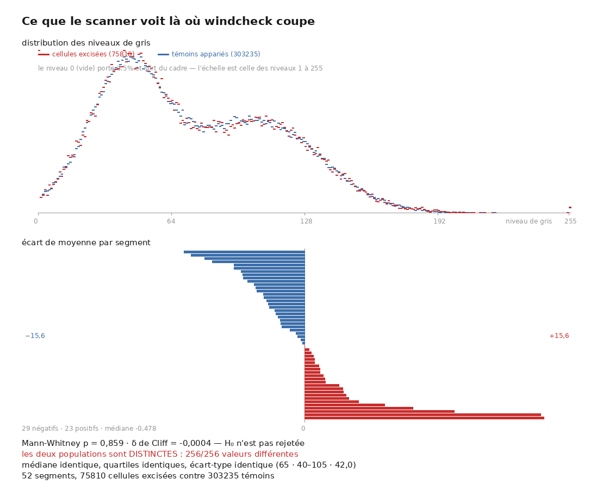

# R2 — L'excision et la réparation : réparer une trace sert-il à quelque chose de mesurable ?

> Rapport de campagne, écrit le **2026-09-11** d'une seule lecture des documents `archive/03`–`07`,
> `11`, `17`, `34` et `archive/75` §D1 (9 documents et une section, 2026-08-16 → 2026-09-05).
> Convention : `archive/NN §k` cite la preuve ; ce rapport est la lecture. Un fait porte un statut
> (`établi` · `borné` · `réfuté` · `rétracté` · `ouvert`) et son producteur (`src/excision/…` sauf
> mention ; JSON ou JSONL de même nom dans `docs/mesures/`).
>
> ⚠ Périmètre. Le fil commun est le **recensement d'auto-intersection** de `windcheck` — le seul
> vérificateur de trace du domaine qui publie ses chiffres — et ce qu'on peut mesurer avec lui,
> contre lui, ou à côté de lui sans trace du tout : la réparation qu'il propose (`03`–`05`, `07`),
> une métrique de proximité validée contre son recensement (`06`, `07`), la phase d'enroulement
> publiée (`17`), le volume lu sans trace (`11`, dont les producteurs vivent dans `src/excision/`),
> et le mode de panne de l'outil officiel du concours (`34`). `33` (la carte des treize) est
> rattaché à R3 avec `16` ; `62` à R5.

## 0. Fiche

| | |
|---|---|
| question | `windcheck` détecte qu'une trace se traverse elle-même et **répare** en excisant quelques quads. Son README dit : *« Whether removing it improves ink, texturing, merging or tracing has not been measured »* (`03` §6). Personne ne l'avait mesuré. Est-ce que la matière excisée était mauvaise ? Est-ce que la réparation change autre chose que le compte de contacts ? Et que peut-on mesurer d'une trace **sans** trace de référence ? |
| objets | `PHerc0172` (Scroll 5 : 53 traces, 52 atteintes, 7,91 µm) ; `PHercParis4` (Scroll 1 : 55 traces, 46 mesurables) ; `PHerc0139`, `PHerc1667`, `PHerc0814` (réplication du rayon) ; le maillage condamné de `PHerc0358` (`24`) pour `34` |
| ce qui a été construit | la reproduction de `windcheck` à trois niveaux (`03`) ; `measure.py`/`analyse.py` (l'excision contre le CT, `04`) ; `proximity.py` et sa famille (`baseline_sweep`, `variant_correlate`, `le_rayon_des_mesures`, `le_seuil_au_bon_rayon`, `le_bruit_de_lechantillon`, `reparation_et_proximite --apparie`, `07`) ; `radial.py`, `fusions.py`, `fusion_scan.py`, `track_z.py`, `sensibilite_centre.py` (le volume sans trace, `11`) ; le lecteur du champ `lasagna` (`17`) ; `lire_selfcross.py` et `repro_empty_verdict.py` (`34`) |
| ce qui a été payé | un rayon de recherche **quatre fois trop grand** pendant dix-sept jours, qui faisait paraître importants trois paramètres qui ne comptaient pas (`07` §9, §11) ; une conclusion de tête renversée par une mesure **sans producteur** puis restaurée (`07` §8–12) ; 12 249 « fusions » qui étaient des changements d'étiquette (`11` §5) ; un contrôle de reproductibilité pris pour un contrôle de stabilité (`07` §10) ; 3 h 15 de récupérateur à énumérer 20 To pour 400 Mo, et trois boucles `pgrep` qui se voyaient mutuellement pendant 15 h (`06` §2.2) |
| réponse au 11 septembre | **La réparation ne déplace pas le défaut.** Les cellules excisées sont du papyrus ordinaire (75 810 cellules, H₀ non rejetée) ; la réparation ramène les contacts à zéro et **ne déplace aucune des cellules** que la proximité anormale signale (7 traces sur 10 comptent exactement les mêmes, borne 0,6 %). Le prédicat vérifié — « sans contact transverse » — est plus étroit que le défaut — « une feuille unique bien plongée ». Et la proximité mesure un défaut de la **trace**, corrélé aux croisements à +0,84 au bon rayon, jamais un défaut du **résultat** (R1 fait 11). Ce qu'on peut mesurer sans trace : un pas inter-feuilles invariant à 1,8 % sur toute la hauteur d'un rouleau (142,8 µm), et quatre sites où l'écart double, qui **migrent** |

## 1. La réponse courte — vingt faits qui tiennent aujourd'hui

| # | fait | valeur | statut | source · producteur |
|--:|---|---|---|---|
| 1 | `windcheck` **reproduit**, sur nos octets, sur deux corpus entiers | 4 et 7 contacts sur le segment nommé ; 53/53 (Scroll 5) et 55/55 (Scroll 1) verdicts et comptes de triangles concordants | établi | `03` §3–5, `06` 1.12, 3.3 · `census_scroll5.tsv` |
| 2 | la réparation est une **excision** : rien n'est déplacé, les coordonnées retenues sont bit-identiques | 6 quads sur 416 398 triangles ; 0,16 % de l'aire en médiane sur Scroll 5, max 2,79 % | établi | `04` §1, `06` 1.5 |
| 3 | **les cellules excisées sont du papyrus ordinaire** : même distribution d'intensité que les témoins appariés | 52 segments, 75 810 contre 303 235 ; médianes 65 et 65 ; Mann–Whitney p 0,859, δ de Cliff −0,0004 ; sans le niveau 0 : p 0,504 | établi | `04` §6 · `measure.py`, `analyse.py`, `excision_samples.tsv` |
| 4 | le résultat tient dans les **deux bandes** de séparation, de signes opposés | < 0,15 tour (43 segments) δ −0,0216 ; ≥ 1,6 tour (9) +0,0090 | établi | `05` §2 |
| 5 | les croisements sévères sont les `auto_grown`, et le « 9× plus atteints » était **tautologique** | bande ≥ 1,6 tour = 10 traces dont 9 `auto_grown` ; traversent jusqu'à 5,04 tours | établi | `05` §1, `06` 1.10 |
| 6 | la réparation supprime le **contact** et laisse l'**approche** : 8 croisements sur 9 survivent à 79 µm, valeurs littéralement inchangées | 974 → 974, 1564 → 1564 colonnes d'écart ; 3 220 cellules retirées (0,2 %) | établi | `05` §4 |
| 7 | l'espacement entre parties non adjacentes est **177 µm**, pas 300 ; 37 % des cellules sont à moins de 158 µm | p5 101, p50 177, p90 303 µm (4 000 cellules) ; 158 µm au cœur → 203 dehors (+28 %) | établi ; « 300 µm » rétracté (emprunté à Scroll 3) | `05` §4 bis, `06` 1.8, 1.11 |
| 8 | la proximité anormale (part des cellules à moins d'un tiers de l'espacement **local** d'une partie non adjacente) **ordonne** les traces par leurs croisements, à longueur contrôlée | rho **+0,769** (46 traces, p 4,3·10⁻¹⁰) ; par tercile +0,820 / +0,944 / +0,739 ; rho longueur ~ croisements 0,05 | établi | `07` §2, §4 bis · `proximity.py`, `correlate.py` |
| 9 | elle **survit à la réparation** sur la trace mesurée : contacts 11 673 → 0, proximité 0,37 → 0,38 % | 3 689 quads retirés (0,12 %) | établi (une trace) ; « quatre fois une saine » rétracté (les 7 saines vont de 0,020 à 0,372 %) | `07` §3, `06` 3.9 |
| 10 | c'est un indicateur **continu**, pas un classifieur : les saines et les réparées se recouvrent | 36 % des atteintes dépassent la pire des saines | établi | `07` §3 |
| 11 | son **domaine de définition** est une trace qui repasse au-dessus d'elle-même : sur Scroll 5, 44 traces sur 53 rendent **zéro** cellule | coupure exactement à 1 tour (mesurées 2,99–9,07 ; écartées 0,50–1,00) ; les 9 survivantes = 9 morceaux d'un segment (n = 1) | établi | `07` §7 |
| 12 | le rayon de recherche était **4× trop grand** et le bon vient de la **physique** : le pas inter-feuilles mesuré ailleurs et avant | 80 vx = 749 µm à 9,362 µm trouvait la spire voisine ; à 142,8 µm : Scroll 1 +0,769 → **+0,840**, `0139` +0,284 → **+0,666** (p 2,3·10⁻⁵), `1667` +0,700 → +0,579 ; le rayon physique bat le meilleur rayon balayé (+0,829) | établi | `07` §9 · `baseline_sweep.py`, `variant_correlate.py` |
| 13 | au bon rayon, **trois paramètres cessent de compter ensemble** : le seuil, la grandeur, la référence locale | `shortfall` +0,340 → **+0,785** (écart au tiers 0,429 → 0,054) ; plateau sur toute la plage (chute 0,477 → 0,025) ; boule 400 +0,560 → +0,803 (écart 0,209 → 0,036) | établi ; `07` §8 et `06` §3.2 **périmés** | `07` §11 · `le_seuil_au_bon_rayon.py` |
| 14 | le mécanisme « l'anomalie normalise sa propre référence » **survit** au bon rayon, plus fort | boule/bande aux cellules signalées 0,750 ; **34/34** traces, Wilcoxon 1,2·10⁻¹⁰ (contre 43/45 avant) ; ce qui reste de la boule est la **couverture** (20,7 %) | établi | `07` §6, §11 · `contamination_scroll1.jsonl` |
| 15 | `fraction_below_third` est validée pour **ordonner** et inutilisable pour une **différence** : le bruit de graine dépasse l'effet de la réparation | 12 graines, même fichier : étendue 35 à 229 % ; réparation 35 % médian ; 9 traces sur 10 ; les +398 % sont une cellule qui en devient cinq | établi | `07` §10 · `le_bruit_de_lechantillon.py` |
| 16 | `shortfall` (déficit moyen, sans coupure) est la colonne de référence : même classement, bruit 4,5× plus serré | étendue de rho 0,028 contre 0,125 ; par trace < 5 % contre 35–229 % | établi | `07` §10–11 |
| 17 | **tirage apparié par position de grille** : la réparation ne déplace **aucune** cellule signalée | effet médian 1,58 % → **0,07 %** (×22) ; 10/10 sous leur bruit de graine ; **7/10 comptent exactement les mêmes cellules** ; grille 756 × 2940 des deux côtés, 142 cellules perdues sur deux millions | établi ; borne 0,6 % au pire | `07` §12 · `reparation_et_proximite.py --apparie` |
| 18 | `windcheck transform` **n'est pas bit-reproductible**, et c'est une propriété déclarée : un budget d'horloge par segment décide combien de composantes atteignent le solveur exact | 6 runs : 3 698, 3 696 ×4, 3 691 quads ; (163 exact, 18 glouton) → 3 696, (164, 17) → 3 691 ; `improvement_budget_s_per_segment: 120.0`, `phase_exact_s` 128–134 ; `--threads 1` n'y change rien ; variation 0,19 % | établi ; rétracté une fois puis rétabli | `07` §10 |
| 19 | sans trace : le pas inter-feuilles de `PHerc0172` est **invariant sur toute la hauteur**, et le centre n'a pas besoin d'être juste | rayon/feuilles **138–148 µm, cv 1,8 %** (20 tranches, rho feuilles ~ rayon +0,927) ; déplacer le centre de 3,16 mm (22 écarts) bouge l'invariant de 1,75 % ; 176 feuilles au maximum → **~14 m** de papyrus (borne inférieure) | établi | `11` §3, §12 · `radial.py`, `sensibilite_centre.py` |
| 20 | quatre sites où l'écart entre feuilles **double** tiennent en z et **migrent** (1,50 mm de rayon par mm de hauteur) ; la migration est l'exception | 4 cellules sur 1 392 ; coïncidences 7,0 % contre 1,1 % (p 0,0001, 2 000 tirages) à 0,8 mm ; étendue radiale 4,75 mm contre 1,42 fixe (p 0,0010, Bonferroni 0,005) ; 2 bandes sur 6, témoin positif ressort, Fisher p 0,079 | établi (le site) ; borné (la règle) | `11` §7–8, §11, §13 · `fusions.py`, `fusion_scan.py`, `track_z.py` |

Et deux échecs propres : la **marche de phase** du champ `lasagna` ne prédit pas les croisements
(+0,517 à n = 8 → +0,306 à n = 30 → **+0,150 à n = 38** ; le niveau 3 est le plus fin publié ;
médiane des marches 12,2/255, zéro trace nulle : `17`) ; et `vc_tifxyz_selfcross` rend **« propre »
et « rien mesuré » par le même champ** (`--maxedge` sous le pas de la trace : 0 paire testée,
`clean: true`, code 0 ; au réglage par défaut dès qu'un maillage grossit : 240 → 123 → 0 → 0 : `34`).

## 2. La campagne en six mouvements

```
 M1 reproduire, et mesurer l'excision     03 04 05          16–17 août
 M2 la proximité, et ses trois paramètres 06 07 §1–9        17–18 août
 M3 le volume sans trace                  11 · 06 §7        17–19 août
 M4 la phase publiée                      17                18–19 août
 M5 le verdict qui ne mesure rien         34                20 août
 M6 renverser, puis restaurer             07 §8bis–12 · 75 D1   3–5 septembre
```

**M1 — Reproduire, et mesurer l'excision.** `03` rattrape l'état de l'art en le reproduisant : le
segment nommé rend les 4 et 7 contacts annoncés, le recensement relancé sur les octets relus sous les
deux triangulations reproduit, et les 53 segments de Scroll 5 concordent trace par trace avec la
publication (fait 1). Le fait qui compte est dans le README : *whether removing it improves ink […]
has not been measured*. `04` est écrit **avant** le code, avec son hypothèse nulle et le contrôle qui
attrape les bugs de l'échantillonneur (une cellule retenue doit rendre la même valeur depuis l'original
et depuis la réparée, au bit) : les cellules excisées sont **indiscernables** du papyrus gardé (fait 3).
Un préliminaire sur 5 segments disait le contraire (δ −0,072, 4/4) : c'étaient les quatre pires
segments d'une seule famille, contigus par ordre alphabétique. `05` trouve la donnée que personne
n'exploitait — la séparation en tours — et montre que le résultat tient dans les deux bandes, que les
sévères sont les `auto_grown`, et que **la réparation retire le contact et laisse l'approche**
(fait 6). Puis il paie le piège nº 6 : « 300 µm entre spires » venait d'un README sur Scroll 3 ;
mesuré, 177 µm, et la moitié du §4 tombe (fait 7). La leçon de conception de toute la campagne est
là : **une proximité se normalise par l'espacement local, jamais par une constante.**



*`archive/04` §6 · `src/figures/figure_excision.py` (19 témoins), depuis `excision_samples.tsv`. Les écarts par segment s'étalent sur ±15,6 niveaux et s'annulent en agrégat : « pas de différence en moyenne » n'est pas « pas de différence ».*

**M2 — La proximité, et ses trois paramètres.** `07` construit la métrique que `05` §5 réclamait :
part des cellules dont la distance à une partie **non adjacente dans la paramétrisation** vaut moins
d'un tiers de l'espacement local. Trois traces du même rouleau et de même longueur l'ordonnent
(0,09 / 0,15 / 0,37 % pour 0 / 52 / 408 croisements), 46 traces la corrèlent à +0,769 sans confond de
longueur (fait 8), et le test qui tranche est qu'elle **survit à la réparation** (fait 9). `06` §3
mène les mesures satellites : le seuil d'un tiers défendu par un plateau (3.7, 3.14), la référence en
boule 3D « nettement pire » (3.2), le second rouleau où la métrique est **inapplicable** parce que 44
traces sur 53 ne font pas un tour (fait 11) — et la mesure 3.8, qui appartient à R1 : la proximité
ne prédit pas la lisibilité (rho +0,019, n = 89). Puis `07` §9 trouve, en cherchant pourquoi la
métrique réplique sur `1667` et pas sur `0139`, que le rayon de recherche en voxels valait **749 µm**
à 9,362 µm — plusieurs écarts inter-feuilles, donc il trouvait la spire voisine. Le bon rayon est
choisi par la **physique**, pas par la courbe : 142,8 µm, le pas que `11` §3 avait mesuré ailleurs et
avant (fait 12). Le gain est le plus grand sur `0139`, à la résolution du prix.


*`archive/07` §11 · `src/figures/figure_le_rayon_trouve_la_voisine.py`. Le cercle de gauche est un minorant (≥ 382,6 µm = 2,7 pas) ; le pas de 142,8 µm vient de `11` §3.*

**M3 — Le volume sans trace.** L'idée de l'auteur — *envoyer une onde traversant toutes les couches
depuis le centre* — donne un compte de feuilles indépendant de tout traçage. Le code de la première
mesure avait été perdu en `python -c` et récupéré du transcript (158 feuilles, 22,7 mm, 11,2 m, centre
re-dérivé à 0,0 voxel) : c'est la naissance de la règle *un chiffre dont le calcul n'est pas dans
l'arbre est une anecdote* (`06` §5.6, `11` §1). Le balayage en z donne un profil en U régulier
(150–176 feuilles) et **l'invariant** : rayon/feuilles à cv 1,8 %, donc le compte suit le rayon et
l'espacement ne bouge pas (fait 19) — c'est ce 142,8 µm que `07` §9 réutilise. Le maximum sur z, pas
la moyenne, estime le nombre de spires (une soudure ne peut que réduire le compte) : ~14 m. Puis quatre
formulations pour localiser les fusions sur l'image dépliée, dont trois échecs instructifs : compter par
rayon (475 sites, tous au centre : une carte du détecteur), suivre les spires (**12 249 « fusions »**
pour 158 feuilles : des changements d'étiquette, 125 murs sur 126 étant appariés à chaque colonne ; le
Hongrois est pire que le glouton pour une raison de fond), chaîner des marques intermittentes. La
quatrième — densité de doublement d'écart par cellule, normalisée par l'espacement local, cœur exclu
sous 4,7 mm parce que trente colonnes y lisent le même pixel — rend **4 candidats stables** groupés
dans le tiers externe (fait 20). Ils tiennent en z quand les coupes sont à l'échelle de la structure
(0,8 mm, pas 22,3), et le site **migre** : 1,50 mm de rayon par mm de hauteur, ce qu'une inclinaison
d'axe ne peut pas expliquer (elle va dans le sens opposé). Le crible au niveau 2 (89 % des murs pour
1/64 du coût) ne trouve **pas les mêmes sites** : c'est un crible, pas un substitut.


*`archive/11` §4 · `radial.py deplier --png`. À grande échelle les spires ne sont pas horizontales : le rouleau est écrasé, et le dépliage n'exige que la douceur (0,125 voxel par colonne).*

**M4 — La phase publiée.** Le groupe `lasagna` expose un canal `cos` de la phase d'enroulement, la
quantité que `00` §2 nommait comme celle qui rend le saut de spire nommable. Sa période vaut 3 à 7 pas
inter-feuilles (le champ est diffusé, donc un saut y laisse une marche). Le premier code comparait une
cellule sur quarante quand le docstring disait « voisines » ; corrigé en segments contigus. Puis
l'effet fond avec n : +0,517 (8), +0,306 (30), **+0,150 (38)** — *un effet réel ne fond pas quand on
l'échantillonne mieux*. Le soupçon du niveau 3 est levé deux fois : c'est le niveau le plus fin publié,
et la quantification n'écrase rien (médiane 12,2/255, 0 trace nulle). Échec **définitif et propre** ;
le lecteur du champ reste.

**M5 — Le verdict qui ne mesure rien.** `34` relit les 240 auto-intersections de `24` sous neuf
`--maxedge` : elles survivent à la désactivation du filtre (le verdict est une propriété de la trace),
et le maillage propre apparié rend 0 partout. La découverte est à `maxedge 20` : `clean: true`,
**`pairs_tested: 0`**, 48 040 quads jetés — *propre et rien mesuré sortent par le même champ*, et
`--fail-on-crossing` rend le code 0. Ça arrive **au réglage par défaut** dès qu'un maillage grossit :
sur une géométrie qui ne change pas, 240 → 123 → 0 → 0 (décimation ×1 à ×4), deux pertes distinctes
(le maillage, puis le filtre qui transforme 72 et 49 en zéros muets). Six scripts du dépôt lisaient
`transverse` sans regarder `pairs_tested` ; `lire_selfcross.py` est le seul lecteur désormais et
refuse (code 3). La mesure a été **perdue** par un commit de rangement qui a écrit `"lignes": []`
par-dessus, restaurée depuis l'historique et vérifiée par l'image régénérée octet pour octet ; le
maillage source n'existant plus, la copie est la seule.


*`archive/34` §0 · `src/figures/figure_sensibilite.py`, depuis `sensibilite_maillage.json` (restauré depuis `79fba93`).*

**M6 — Renverser, puis restaurer.** Le 3 septembre, en voulant rendre recalculable le « 0,37 → 0,38 % »
pour l'article, une mesure sur deux `auto_grown` de Scroll 5 montre la réparation **faisant baisser**
la proximité de 50 et 22 % : la conclusion de tête de `07` est déstabilisée, et `75` D1 est ouvert.
Deux jours de mesures la restaurent, pour une bien meilleure raison :
1. la mesure qui a renversé **n'avait aucun producteur** (faite au terminal) ; `reparation_et_proximite.py`
   existe désormais (`07` §8) ;
2. le « cas non montable » était une généralisation depuis le mauvais rouleau : Scroll 1 a **34**
   traces éligibles (sales et > 1 tour), curatées ; à provenance égale, le **signe** change
   (+398 % / −17 %) ;
3. le contrôle écrit pour protéger ce résultat **ne pouvait pas échouer** : trois runs de la même
   commande vérifient la reproductibilité, pas la stabilité sous ré-échantillonnage (`07` §10) ;
   `choice(points.shape[0])` change de tirage dès qu'un quad disparaît, et 12 graines déplacent
   `fbt` de 35 à 229 % — plus que la réparation sur 9 traces sur 10 (fait 15) ;
4. `shortfall`, déjà publié par l'outil, a un bruit sous 5 % ; sur lui la réparation ne déplace rien
   de mesurable (fait 16) ;
5. le producteur `run_proximity.sh` **ne tournait plus** (`python -m excision.proximity`, erreur
   avalée, « 0 mesurées, 55 sans mesure », code 0) — c'est pourquoi personne n'avait rejoué le §8 au
   bon rayon ; rejoué, trois paramètres cessent de compter ensemble (fait 13) et le mécanisme du §6
   survit (fait 14) ; les fichiers se datent eux-mêmes par `measured` (`le_rayon_des_mesures.py`) ;
6. le tirage **par position de grille** retire le bruit au lieu de le borner : 7 traces sur 10
   comptent exactement les mêmes cellules avant et après (fait 17). **D1 est fermé.**

Et en chemin, la réparation elle-même : non déterministe (affirmé sur deux sorties de terminal),
rétracté (trois certificats identiques), **rétabli** (six runs, trois géométries) — la rétractation
était fausse par chance, et son propre commentaire disait que trois répétitions étaient une preuve
faible. La cause est dans la politique gelée de `windcheck` (fait 18) : *« an optimization failure
[…] costs an optimality claim, never an artifact »*. Réparer une fois et garder la sortie.


*`archive/07` §12 · `src/figures/figure_tirage_apparie.py` (9 contrôles). Le trait vertical est le bruit de graine propre à chaque trace.*

## 3. Chronologie, document par document

| doc | date | question | ce qui est établi | ce qui est rétracté ou borné |
|---|---|---|---|---|
| `03` | 16 août | `windcheck` fait-il ce qu'il annonce ? | 4/7 contacts reproduits ; recensement indépendant sous les deux diagonales ; 53/53 sur Scroll 5 ; réparation 99,9989 % conservée ; Scroll 5 = 1 saine sur 53 ; `auto_grown` 9× (médiane 192 contre 21) | « réparer sert » : non établi, par le README lui-même ; le 9× est un effet de longueur (`05`) ; 80 tests sautés ≠ verts |
| `04` | 16–17 août, recalculé 22 août et 5 sept. | les cellules excisées étaient-elles mauvaises ? | H₀ non rejetée (p 0,859, δ −0,0004 ; sans niveau 0 p 0,504) ; le 512 ms/voxel était un chunk par accès (×8 en groupant) ; recalcul dans l'arbre identique | le préliminaire (−0,072 sur 4/4) : biais alphabétique ; la ligne par segment (30/22, −0,011) reste irreproductible ; `n = 1761` mal lu |
| `05` | 17 août | le prédicat vérifié | deux bandes (43 < 0,15 tour ; 9 ≥ 1,6, jusqu'à 5,04) ; les sévères = `auto_grown` ; la réparation laisse l'approche (8/9 à 79 µm) ; espacement 177 µm, p5 101, p90 303 | « le même papyrus rendu deux fois » (40 vx = spire voisine) ; le résultat à 20 vx (158 µm est banal : 37,2 %) ; « 300 µm » emprunté |
| `06` | 17 → 19 août (+ 4 sept.) | le carnet : faites, en attente, écartées | 1.1–1.18 ; 3.1 (+0,769 par tercile), 3.2 (boule pire), 3.5 (niveau 2 : 89 % des murs, ×64), 3.7 (plateau 0,15–0,40), 3.8 (proximité ≠ lisibilité), 3.9 (pas de plancher), 3.10 (le défaut dérive), 3.13 (domaine : un tour), 3.14 ; §2.4 dommage en cœur (20 %), pas un U ; §2.4bis rouleau elliptique 1,26–1,57 ; §5 sept règles | 2.1 `winding.py` supprimé ; 2.3 clos sans ombilic ; « facteur trois » → +28 % ; 3.2 et 3.14 **périmés** au bon rayon (`07` §11) |
| `07` | 17 août → 5 sept. | la réparation déplace-t-elle le défaut ? | métrique ordonne à longueur contrôlée ; survit à la réparation ; +0,769 sur 46 ; domaine = un tour ; rayon physique 142,8 µm (+0,840) ; bruit de graine ; `shortfall` ; trois paramètres tombent ensemble ; mécanisme survit 34/34 ; tirage apparié ×22 ; non-déterminisme = budget d'horloge | « quatre fois une saine » ; « nettement pire » (boule) ; §8 seuil ni arbitraire ni supprimable ; la déstabilisation de l'en-tête (sans producteur) ; signe instable à n = 2 ; « déterministe » à 3 runs ; « même ensemble de valeurs » |
| `11` | 17–19 août | compter les feuilles sans trace | 158 → 176 feuilles, ~14 m ; invariant 142,8 µm cv 1,8 % ; profil en U ; 4 candidats groupés à 17–18 mm ; tiennent en z à 0,8 mm (p 0,0001) ; migrent 1,50 mm/mm (p 0,0010) ; inclinaison écartée (sens opposé) ; niveau 2 = crible ; centre faux de 3,16 mm → 1,75 % ; migration = exception (2/6, témoin positif) | « 11,2 m » (moyenne → maximum) ; sens de la borne noté à l'envers ; 12 249 fusions = étiquettes ; « 20 000 tirages » → 2 000 ; premier test en z (22,3 mm) ne pouvait rien détecter ; rectitude p 0,82 ; 3 tranches fabriquaient une marche |
| `17` | 18–19 août | la phase publiée détecte-t-elle un saut ? | le canal `cos` se lit (période 3–7 pas) ; le lecteur existe ; l'instrument de profondeur tient sur `0139` (+0,369, p 0,045, 3ᵉ corpus) | ❌ **échec définitif** : +0,517 → +0,306 → +0,150 ; une cellule sur 40 au lieu de voisines ; le niveau 3 est le plus fin publié ; la quantification n'écrase rien |
| `34` | 20 août, restauré 4 sept. | les 240 survivent-ils au filtre ? | oui, à tous les réglages > 30 ; propre apparié 0 partout ; `pairs_tested: 0` → `clean: true` ; 240 → 123 → 0 → 0 au défaut ; `26` §9 audité : ses zéros ne sont pas muets mais ne se valent pas (pas 40 = 51 %) ; `lire_selfcross.py` seul lecteur ; `repro_empty_verdict.py` hors ligne | la mesure écrasée par `a5901be` (`"lignes": []`), restaurée ; le maillage source a disparu |
| `75` D1 | 3–5 sept. | re-fonder l'arc | voir M6 ; `shortfall` référence ; tirage par position opt-in ; grille inchangée (142/2 M) ; D1 fermé | `sweep_PHerc0139*`, `sweep_s1_pas` sans déclaration d'échelle : à régénérer |

## 4. Le tableau des statuts

| statut | faits |
|---|---|
| **établi** | #1–20 du §1 ; la reproduction à trois niveaux (`03`) ; le contrôle bit-identique de l'échantillonneur (`04` §3) ; les sévères = `auto_grown` (`05` §1) ; la métrique n'a pas de plancher (7 saines de 0,020 à 0,372 %, `06` 3.9) ; le niveau 2 conserve 89 % des murs (`06` 3.5) ; le cœur de `0172` est le plus dégradé (20 %), l'extérieur non (`06` §2.4) ; le rouleau est elliptique (1,26–1,57, `06` §2.4bis) ; le cœur du dépliage est dégénéré par construction (`11` §6) ; l'inclinaison d'axe ne peut pas expliquer la migration (`11` §8) ; `pairs_tested` doit être lu (`34` §5) |
| **borné** | l'effet de la réparation sur `shortfall` : < 0,6 % au pire, 0,07 % médian (`07` §12) ; la migration : 2 bandes sur 6, Fisher 0,079 (`11` §13) ; les 4 candidats : compatibles avec soudure, déchirure ou vide, non tranché (`11` §7) ; la longueur du papyrus : ~14 m, borne inférieure (`11` §3) ; le signe de l'effet à n = 2 : non lisible (`07` §8) ; 15 à 35 chunks par rouleau pour la carte de `16` (→ R3) ; la fréquence du verdict muet en pratique : non mesurée (`34` §6) |
| **réfuté** | « les cellules excisées lisent de la mauvaise matière » (`04`) ; « 300 µm entre spires » (`05` §4bis) ; « le même papyrus rendu deux fois » (`05` §3) ; la référence en boule comme remède de principe (`06` 3.2, `07` §6) — nuancé au bon rayon ; le seuil d'un tiers comme sélecteur de régime (`07` §11) ; « aucune grandeur sans seuil ne l'égale » (`07` §8 → §11) ; le glouton comme cause de la fragmentation, le Hongrois comme remède, les pistes en sursis, le détecteur qui perd les murs (`11` §5) ; la rectitude comme discriminant (`11` §11) ; la phase d'enroulement comme détecteur de saut (`17`) ; « le niveau 3 était notre choix » (`17` §10) ; « la réparation fait baisser la proximité » (`07` en-tête → §12) ; graine + un fil comme remède au non-déterminisme (`07` §10) |
| **rétracté** | « les `auto_grown` sont 9× plus atteints » (`03` → `05`) ; « quatre fois au-dessus d'une trace saine » (`07` §3) ; « nettement pire » pour la boule (`06` 3.2 → `07` §11) ; « la réparation est déterministe » (3 runs → 6 runs) ; « les deux séries tombent sur le même ensemble » ; « le signe n'est pas stable » (n = 2 → bruit de graine) ; « la déstabilisation » de l'en-tête de `07` ; 12 249 fusions ; « 11,2 m » ; « 20 000 tirages » ; « la mesure de `07` ne se généralise pas » ; « 8 à 16 » et « 7 à 12 voxels » (`16`, → R3) |
| **ouvert** | voir §8 |

## 5. Contradictions et corrections internes à la campagne

Chaque ligne : *A a dit · B a dit · C tranche · statut*. À reporter dans `REGISTRE_contradictions.md`.

| A | B | C | statut |
|---|---|---|---|
| `03` §5 : les `auto_grown` sont 9× plus atteints | `05` §1 : la bande sévère **est** les `auto_grown` ; `06` 1.10 | tautologie ; normaliser par l'aire | tranché |
| `04` préliminaire : δ −0,072, répliqué 4/4 | `04` §6 : 52 segments, δ −0,0004 | famille `20250926*` (8 segments, −0,0242) contre les 44 autres (+0,0047) ; ordre alphabétique | tranché |
| `04` §6 : par segment 30 négatifs / 22 positifs, médiane −0,011 | recalcul : 29 / 23, −0,478 (moyennes) ; 29 / 17 / 6 nuls, −1 (médianes) | une troisième quantité dont le code n'est pas dans l'arbre | **irreproductible**, signalé |
| `05` §3 : à 40 vx le même papyrus est rendu deux fois | 40 vx = 316 µm = l'écart entre spires | à 5 vx l'effet disparaît ; énoncé restreint à 79–158 µm | tranché |
| `05` §4 : le résultat à 20 vx (158 µm) | `05` §4bis : 37,2 % des cellules sont aussi proches | espacement médian 177 µm, mesuré sur la trace | tranché ; 10 vx tient (2,1 %) |
| `06` §5.1 : l'espacement varie d'un facteur trois | `06` 1.11 : 158 → 203 µm, +28 % | le chiffre était faux, la règle (ordinal) tient | tranché |
| `06` §2.3 : le centre est un barycentre biaisé, il faut l'ombilic | `11` §12 : `umbilicus.txt` n'existe nulle part ; le centre est ajusté sur la monotonie (1,000) ; 3,16 mm → 1,75 % | l'invariant ne dépend pas du centre | tranché |
| `06` 3.2 : la boule 3D est nettement pire (+0,560 vs +0,769) | `07` §11 : au bon rayon +0,803 vs +0,840 | écart 0,209 → 0,036, sous le bruit du rho (0,125) ; ce qui reste est la couverture | tranché ; « nettement » rétracté |
| `07` §3 : la réparée vaut quatre fois une saine | `06` 3.9 : les 7 saines vont de 0,020 à 0,372 % | un seul témoin, bas | tranché |
| `07` §5, `06` §C : il faut un second rouleau | `07` §7 : Scroll 5 est hors du domaine (44/53 sous un tour) | la population, pas les chiffres ; les vrais seconds rouleaux sont `0814`, `1667`, `0139` | tranché |
| `07` §8 : le seuil d'un tiers n'est ni arbitraire ni supprimable (plateau puis effondrement) | `07` §11 : au bon rayon, plateau sur toute la plage ; `shortfall` +0,785 | l'effondrement était l'artefact du rayon (la spire voisine admise) | tranché ; §8 périmé |
| `07` §9 : la métrique réplique sur `1667` et pas `0139` = résolution | balayage du rayon sur la donnée grossière : +0,609 à 20 vx, −0,143 à 160 | ce n'est pas la résolution, c'est le rayon | tranché |
| `07` §9 (3 sept.) : `1667` n'a aucun volume à 7,91 µm, la ligne est illisible | `1667` publie `20231117161658-7.910um` ; l'artefact déclare `voxel_um 7,91`, 18 vx = 142,4 µm | erreur de catégorie (volumes de surface ≠ scans) ; `ou_vit_ce_rouleau.py` | tranché ; la ligne est lisible |
| `07` en-tête (3 sept.) : la réparation fait baisser la proximité (−49,8 %, −22,3 %) | `07` §8 : à provenance égale le signe change ; §10 : le bruit de graine dépasse l'effet ; §12 : apparié, 0,07 % | la mesure de l'en-tête n'avait pas de producteur, comparait deux rouleaux et deux provenances, sur une colonne dominée par son bruit | tranché ; titre restauré |
| `07` §8 : trois runs identiques donc les écarts sont réels | `07` §10 : reproductibilité ≠ stabilité sous ré-échantillonnage | 12 graines, même fichier : 35–229 % | tranché (péché capital, dans une précaution) |
| `07` §10 : `transform` non déterministe (2 sorties) → déterministe (3 runs) | 6 runs : 3 698 / 3 696 ×4 / 3 691 | la rétractation était fausse par chance ; budget d'horloge de la politique gelée | tranché ; rétabli |
| `07` §10 : les deux séries tombent sur le même ensemble | un second échantillon : 3 698 n'est pas réapparu | inclusion dans un petit ensemble, union ≥ 3 | tranché |
| `07` §10 : graine + `thread_limit: 1` (remède de `44`) | `--threads 1` : trois géométries encore | ni parallélisme ni flottant : un budget d'horloge | tranché |
| `06` 3.8 (D) : bloqué, le maillage de `20230909121925` n'est pas dans le jeu | `ppm_to_tifxyz.py` : le `.ppm` porte la même information | prudence mal placée | tranché (→ R1) |
| `06` §2.2 / `07` §11 : `run_proximity.sh` produit `proximity_scroll1.jsonl` | il appelait `python -m excision.proximity` qui ne résout plus, erreur avalée, code 0 | corrigé ; le fichier au bon rayon est écrit à part | tranché |
| `11` §1 : 158 feuilles, 11,2 m | `11` §3 : le maximum sur z informe (176, 13,87 m) ; le biais est à sens unique | moyenne → maximum | tranché |
| `11` §2 : borne supérieure | deux feuilles fondues comptent pour une | borne **inférieure** ; ordre de grandeur | tranché |
| `06` §7 / `11` §5 : 12 249 fusions | 125 murs sur 126 appariés ; 1 piste neuve par colonne | changements d'étiquette | tranché |
| `11` §5 : le glouton fragmente → Hongrois | 17 pistes longues contre 69 | l'optimalité globale n'est pas le bon objectif | tranché |
| `11` §8 : 0 coïncidence sur 21, indistinguable du hasard | coupes espacées de 22,3 mm ; fond stable à 6,4–7,0 % (20 σ) | à 0,8 mm : 7,0 % vs 1,1 %, p 0,0001 | tranché ; dose-effet |
| `11` §8 : p sur 20 000 tirages | les quatre artefacts portent `trials: 2000` | facteur dix | tranché |
| `11` §10 : rien ne coïncide au-delà de 0,8 mm = défauts d'un millimètre | `11` §11 : le défaut migre 1,50 mm/mm, la fenêtre fixe le perd | appariement prédictif ; 3 bras | tranché |
| `11` §11 : la rectitude discrimine | 1,000 observé, p 0,82 | trois points sont monotones une fois sur deux ; l'étendue tranche | tranché |
| `11` §12 (3 tranches) : marche de 4 % dès la plus petite perturbation | 6 tranches : 1,75 %, aucune marche | bruit d'échantillonnage ; même forme que fibres n = 12 et phase n = 8 | tranché |
| `17` §2 docstring : continuité entre voisines | le code prenait une cellule sur 40 | signal inversé = aucun signal | tranché |
| `17` §8 : refaire au niveau 0 ou 1 changerait peut-être tout | `17` §10 : le niveau 3 est le seul publié ; médiane des marches 12,2/255 | échec définitif | tranché |
| `34` §0 : la mesure existe dans l'arbre | `a5901be` a écrit `"lignes": []` par-dessus | restaurée depuis `79fba93`, image identique octet pour octet ; `sensibilite_maillage.sh` refuse d'écrire vide | tranché |
| `26` §9 : `step_size ≥ 20` rend une trace propre (zéros aux pas 15–40) | `34` §4 : `quads_dropped = 0`, `pairs_tested` non nul partout, donc pas de zéro muet ; mais pas 40 ne retrouve que 51 % | la règle tient ; ses zéros ne se valent pas | tranché (→ R3) |
| `75` D1 (4 sept.) : le remède du non-déterminisme est connu (`44`) | `07` §10 : testé, réfuté | politique gelée | tranché |

## 6. Les lois que la campagne a payées

À reporter dans `FILS_ROUGES.md`.

1. **Le prédicat vérifié est plus étroit que le défaut.** « Sans contact transverse » n'est pas « une
   feuille unique bien plongée » : la réparation supprime le contact et laisse l'approche (`05` §4),
   les cellules excisées sont du papyrus ordinaire (`04`), et la proximité anormale survit (`07` §12).
   Un consommateur qui lit « propre » en déduit le second.
2. **Un chiffre emprunté n'est pas une mesure** — la loi est née ici. « 300 µm » d'un README sur un
   autre rouleau (`05` §4bis) ; puis payée en R1 trois fois. Remède : mesurer sur l'objet, et le pas
   inter-feuilles de `11` §3 est ce qui l'a rendu possible partout.
3. **Une proximité se normalise par l'espacement local, ou reste ordinale.** 101 à 303 µm selon
   l'endroit, +28 % du cœur au bord (`05`, `06` §5.1) ; c'est la règle nº 1 du dépôt.
4. **Un paramètre en voxels a une valeur physique par campagne.** 80 voxels = 749 µm à 9,362 et
   192 µm à 2,403 (`07` §9) ; un rayon qui couvre plusieurs écarts trouve la spire voisine et
   inverse même le signe (−0,143 à 1 498 µm). Le remède est de le dériver de la physique, mesurée
   ailleurs et avant — et **un paramètre choisi sans regarder la réponse a fait mieux que celui
   choisi en la regardant**.
5. **Une grandeur validée pour ordonner ne se transporte pas à une différence.** `fbt` : signal
   entre traces 403 %, bruit de graine 82 %, effet de la réparation 35 % (`07` §10). Le
   classement tient, la différence ne se lit pas.
6. **Reproductibilité n'est pas stabilité.** Trois runs de la même commande rendent le même nombre
   quoi qu'il arrive (`07` §10) ; et une réserve écrite (« trois répétitions sont une preuve faible »)
   ne dispense pas de la mesure qu'elle appelle.
7. **Une mesure ou un contrôle sans producteur ne peut être ni relancé ni audité.** Le code perdu en
   `python -c` (`11` §1, `06` §5.6) ; la mesure qui a renversé `07` (§8) ; les quatre nombres du §6
   venus du terminal (§11) ; le contrôle « trois runs » qu'aucun garde ne pouvait voir parce qu'il
   n'était pas une batterie (§10).
8. **Un producteur qui ne tourne plus ressemble à une population vide.** `run_proximity.sh` : erreur
   avalée, « 0 mesurées », code 0 (`07` §11) — c'est pourquoi le §8 n'a jamais été rejoué au bon
   rayon. Un run qui ne mesure rien ne sort plus en 0.
9. **Un fichier de mesure doit porter son instrument.** Aucune date n'est fiable ; `measured` date
   les fichiers par la donnée (`le_rayon_des_mesures.py`) ; le bloc `echelle` partagé par
   `proximity.py` et `baseline_sweep.py` a tranché la ligne `1667` (`07` §9, §11).
10. **Une référence locale doit être large dans la direction où l'anomalie est petite.** La boule
    centrée sur un site est pleine du site (`07` §6, 34/34 au bon rayon) ; la bande de colonnes
    traverse tout le segment.
11. **Le domaine de définition s'écrit dans l'outil, avec sa raison.** Une trace sous un tour rend
    « 0 cellule », ce qui ressemble à une panne (`07` §7) ; « propre » et « rien mesuré » par le même
    champ (`34`). Refuser avec sa raison plutôt que rendre un zéro.
12. **Un effet réel ne fond pas quand on l'échantillonne mieux.** Phase +0,517 → +0,150 (`17`) ;
    trois tranches fabriquent une marche que six effacent (`11` §12) ; le préliminaire de `04`.
13. **Échantillonner à l'échelle de la structure, pas de l'objet.** Des coupes à 22,3 mm ne peuvent
    pas voir une soudure (`11` §8) ; à 0,8 mm, p = 0,0001. Deux points font une relation dose-effet.
14. **Le maximum informe quand le biais est à sens unique.** Une soudure ne peut que réduire le
    compte : 176, pas 161 (`11` §3).
15. **L'optimalité globale n'est pas le bon objectif en suivi.** Le Hongrois échange un appariement
    quasi certain pour améliorer la somme (`11` §5) ; et un suivi churne des étiquettes, pas des
    feuilles : mesurer la disparition d'un mur, pas la mort d'une piste.
16. **Une mesure perdue par un commit de rangement** (`34` : `"lignes": []` écrit par-dessus, maillage
    disparu) : un producteur refuse d'écrire vide, et l'image régénérée octet pour octet est la
    preuve que la donnée restaurée est la bonne.

## 7. Ce que la campagne dit des prix

1. **Progress Prizes — la matière la plus directement soumissible de R2.** Le goulot *conservative
   failure detection* et le problème nº 7 (*métriques d'évaluation*) sont nommés par le concours
   (`07` §6). Ce que le dépôt a : *la vérification que tout le monde utilise laisse passer quelque
   chose, voici la mesure et voici le contrôle* — l'excision est du papyrus ordinaire (`04`), la
   réparation ne déplace pas la proximité (`07` §12), le rayon physique (`07` §9), le verdict muet de
   `vc_tifxyz_selfcross` (`34`), le non-déterminisme déclaré de `windcheck transform` (`07` §10). Plus
   deux résultats négatifs documentés avec leur puissance (`17`, la boule 3D). Et le pas inter-feuilles
   sans trace (`11`) recoupe l'atlas `winding-ruler` (R6 fait 12 : 187 µm médian sur la collection ;
   142,8 sur `0172`, 172,8 sur Paris4).
2. **Grand Prize — où le graal a commencé.** `11` est l'ancêtre de R4 : compter les feuilles sans
   traceur, déplier en polaire, localiser où l'écart double, mesurer qu'un défaut migre. La règle
   « un pas d'indice = une feuille » de `76` et le champ d'enroulement de `77` sont la même question
   posée avec le référent humain en plus. Et `34` borne ce que « zéro croisement » veut dire pour tout
   marcheur : nécessaire, jamais suffisant, et muet au-delà d'un pas de maillage.
3. **First Letters et le titre** : rien de direct. `06` 3.8 (→ R1) dit que la proximité ne prédit pas
   la lisibilité ; R2 ne juge que la trace.

## 8. Portes ouvertes de R2

À reporter dans `PORTES_OUVERTES.md`.

**Progress Prizes**
- Les 34 traces éligibles de Scroll 1 sous le tirage apparié (10 mesurées, `07` §12) ; et
  `--population` à plusieurs graines sur les 46 pour trancher si le classement se dégrade
  (`07` §10 : deux hypothèses mortes, la troisième est un instrument).
- Régénérer `sweep_PHerc0139*`, `sweep_0139_*`, `sweep_s1_pas` pour qu'ils déclarent leur échelle
  (`75` D1 restant).
- La ligne par segment de `04` (30/22, −0,011) : une quantité sans code dans l'arbre.
- La fréquence du verdict muet de `vc_tifxyz_selfcross` en pratique, et le pas de maillage au-delà
  duquel un compte de croisements n'est plus comparable (`34` §6).
- Ce que la queue de la métrique attrape sur une trace sans croisement (facteur 18 entre les 7
  saines, `07` §5) : approches légitimes ou bruit.

**Grand Prize**
- Ce que sont les 4 candidats de `11` §7 : soudure, déchirure ou vide — regarder à 2,4 µm est
  impossible (`0172` ne publie que 7,91 µm, `18` M3) ; l'instrument volumétrique de `75` §C
  (`la_nappe_en_obj.py`, `lpl-scrollwalk`) répond à « posée sur de la matière », pas à la forme.
- Pourquoi le rayon varie si le nombre de spires est fixe : écrasement (1,26–1,57) et perte de
  matière jouent tous deux (`06` §2.4bis).
- Le lien entre la migration d'un site (1,50 mm/mm) et l'axe courbe de Paris4 (`90`, R4) : même
  géométrie, deux rouleaux.
- Le lecteur du champ `lasagna` (`17`) : écrit, contrôlé, sans idée qui l'emploie.

## 9. Sources pour un article

- **La réparation ne déplace pas le défaut** : `03` §6, `04` §1–6, `05` §4, `07` §3, §10–12,
  `75` D1 — reproduction, hypothèse nulle écrite avant le code, tirage apparié par position, borne
  0,6 %. Antériorité : le README de `windcheck` (*has not been measured*), sa politique gelée
  (`round28-greedy-first-v1`, `failure_rule`).
- **Une métrique de proximité et ses trois paramètres qui ne comptaient pas** : `07` §2, §4bis, §6,
  §9, §11 — le rayon dérivé de la physique, la contamination de la référence, l'ordonner/différence.
  Antériorité : six vérificateurs qui s'arrêtent au même endroit (R6 fait 11).
- **Compter les feuilles sans trace** : `11` §3, §6–8, §11–13 — l'invariant à 1,8 %, le doublement
  d'écart, la migration, le crible. Antériorité : `winding-ruler` (R6), l'ombilic de ThaumatoAnakalyptor
  (non publié pour ces rouleaux).
- **Un verdict qui ne mesure rien** : `34` — le mode de panne d'un outil officiel, son reproducteur
  hors ligne, et la perte-restauration d'une mesure.
- **Deux échecs propres** : `17` (la phase publiée), `06` 3.2/`07` §6 (la boule) — chacun avec la
  puissance qui l'aurait détecté.
- Tout chiffre de ce rapport se recalcule par le producteur nommé ; `src/depot/verifier_chiffres.py`
  lit `docs/rapports/`.
