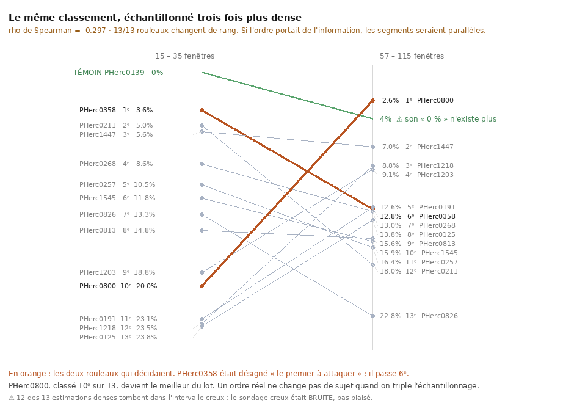
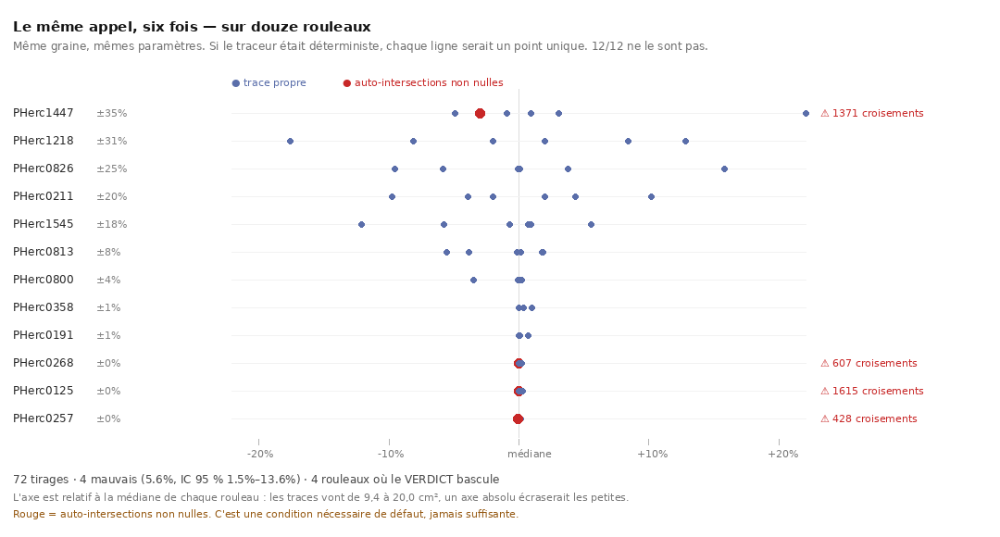
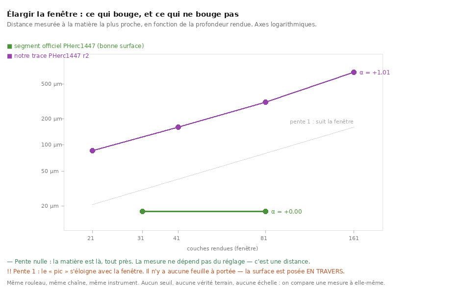
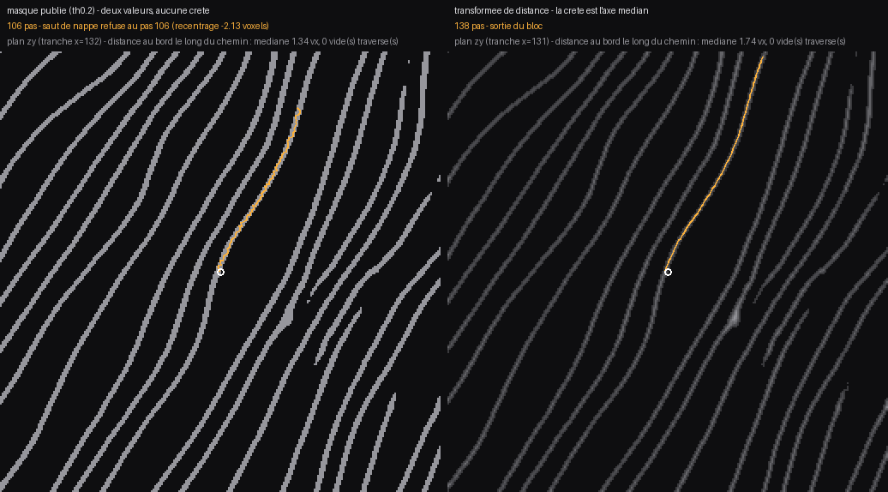
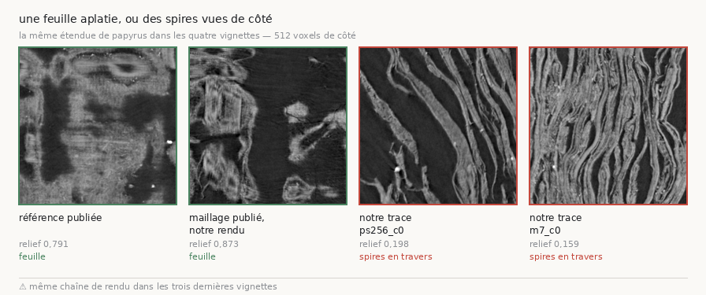

# R3 — La graine et le traceur : le traceur est-il un tirage, et qu'est-ce qui gouverne où il va ?

> Rapport de campagne, écrit le **2026-09-11** d'une seule lecture des documents `archive/16`,
> `25`, `26`, `30`, `33`, `35`, `37`–`44`, `47`–`55` (25 documents, 2026-08-18 → 2026-09-05).
> Convention : `archive/NN §k` cite la preuve ; ce rapport est la lecture. Un fait porte un statut
> (`établi` · `borné` · `réfuté` · `rétracté` · `ouvert`) et son producteur (`src/nappe/…` sauf
> mention ; JSON de même nom dans `docs/mesures/`).
>
> ⚠ Périmètre. Le fil commun est le traceur officiel `vc_grow_seg_from_seed` et ce qu'on peut
> savoir de la surface qu'il produit : **où commencer** (`16`, `33`, `25`, `40`, `48`), **ce qui
> gouverne sa trajectoire** (`26`, `30`, `35`, `37`), **comment la juger sans vérité terrain**
> (`38`, `47`, `49`–`53`), **comment la corriger** (`39`, `41`, `42`), **comment l'enchaîner**
> (`43`, `44`) et le bilan des causes (`54`, `55`). `45`–`46` sont à R1 (leur objet est la carte
> d'encre). `39` et `40`, que la carte rangeait dans le procédé, portent des faits — le seam de
> correction et la référence de 44 spires — et sont lus ici.

## 0. Fiche

| | |
|---|---|
| question | Le traceur produit une surface depuis une graine. Trois questions emboîtées : **quel rouleau et quelle graine** ; **ce qui décide de la trajectoire** (le champ de direction, les douze poids, la graine, le hasard) ; **comment juger** une trace sans segment de référence. Et une quatrième, qui a mangé les trois autres : pourquoi aucune de nos traces n'est une feuille. |
| objets | les 13 rouleaux du prix (la carte, `16`/`33`) ; `PHerc0358` (la graine et les budgets, `25`, `30`, `35`) ; `PHerc1447` (la chaîne des spires depuis l'officiel `20250702235910`, ses 15 segments publiés, `38`, `43`, `44`) ; `PHercParis4` (les candidats `ps256`/`m7`, la calibration sur 80 segments, le témoin positif `20230702185753`, `48`, `52`–`54`) ; `PHerc0139` (témoin de séparabilité, `16`) ; `PHerc0172` (la mosaïque de référence, `40`) |
| ce qui a été construit | la carte : `espacement_spires.py`, `separabilite_scan.py`, `incertitude_carte.py`, `comparer_cartes.py` ; la graine : `trouver_graine.py`, `campagne_graines.sh`, `apparier_volumes.py` ; le champ : `valider_champ_normal.py`, `poids_growpatch.py` ; le tirage : `campagne_thread_limit.sh`, `campagne_tirages.sh`, `table_tirages.py`, `comparer_plafond.py`, `choisir_tirages.py`, `table_second_axe.py` ; le juge : `test_convergence.py`, `le_drapeau_de_normale.py`, `derive_avec_profondeur.py`, `audit_profils_plats.py`, `appui_de_pente.py`, `fenetre_utilisable.py`, `calibration_corpus.py`, `decouper_tifxyz.py`, `temoin_du_rendu.sh`, `etalonner_rendu.sh`, `effet_du_cache.py` ; la correction : `suivre_nappe.py`, `boucle_de_correction.sh` ; la chaîne : `spire_suivante.sh`, `table_chaine.py`, `derive_ou_loterie.py`, `geometrie_chaine.py`, `projeter_tangentiel.py`, `chainer_tangentiel.sh`, `recalage_de_la_chaine.sh`, `couverture_publiee.py`, `etendre_nappe.sh`, `rogner_nappe.py`, `carte_segments.py` ; Paris4 : `eligibilite_aval.py`, `comparer_predictions.py`, `matiere_des_piles.py`, `niveau_du_maillage.py`, `matiere_au_point.py` ; le bilan : `murs_et_causes.py` ; la référence : `assembler_mosaique.py` |
| ce qui a été payé | 240 auto-intersections expliquées trois fois (`24`, `25`) avant d'être **un tirage** (`30`) ; trois hypothèses sur la forme de nos traces tombées le même jour (`38`) ; **vingt séries qui rendaient le même nombre**, l'identité du couple de fenêtres (`51`) ; cinq rendus vides lus comme cinq surfaces plates (`54`) ; un rendu qui **swappait** depuis le début, 4 h 32 pour rien (`50`) ; un paramètre (`resume_generations`) que personne ne lisait (`44` §7) ; un seuil transporté trois fois en une nuit (`52`) ; une extrapolation de « plus de douze heures » depuis un seul échantillon de débit (`48`) |
| réponse au 11 septembre | **Le traceur est un tirage** : quatorze traces d'une même graine, treize propres et une à 79 croisements, 5 verdicts sur 78 qui basculent d'un tirage à l'autre. **Rien de ce qu'on peut régler ne gouverne la trajectoire** hors la graine et la géométrie du pas : champ chargé ou non, axes permutés, grilles de normales à 10 Go, la croissance est identique au centième. **Nos traces ne sont pas des feuilles** : elles coupent l'empilement (α ≈ +1 quand l'officiel rend 0,00), aucune des 75 séries publiées convergentes n'a leur profil, et l'image tranche — le publié est une feuille de face, les nôtres des rubans de spires en travers. La seule surface produite par le dépôt qui converge est la **chaîne radiale** de spires depuis l'officiel : six tours, le septième casse, 113 µm entre nappes, 15,6 % d'érosion par tour. Et la portée d'une chaîne **tangentielle** sur la matière est le mur : 580 µm en géométrie pure ; +19,0 points au-dessus du hasard à 768 µm, +6,9 à 5,76 mm avec recalage ; la chaîne **glisse** d'un côté selon une loi linéaire qui explique 68 % de l'écart |

## 1. La réponse courte — vingt faits qui tiennent aujourd'hui

| # | fait | valeur | statut | source · producteur |
|--:|---|---|---|---|
| 1 | la carte des treize : **dix rouleaux sur treize sont aussi lâches ou plus** que le témoin lu, la compression n'est pas l'excuse | Paris4 173 µm médian ; 1218 147, 0125 150, 1447 156 … 0826 225 ; 108 sondes ; 0257/0800/0268 à 0 % sous 150 µm | établi | `16` §1–5 (refait 27 août) · `espacement_spires.py` |
| 2 | la séparabilité feuille/interstice est celle du témoin **sauf dans une queue locale** | `0139` médian d′ 1,45, 0 % sous 1,0 ; 6/13 aussi séparables ; queue 4–24 % contre 0 % | établi (ordre de grandeur) ; « `0358` désigné » rétracté | `16` §6, `33` · `separabilite_scan.py` |
| 3 | **la carte n'est pas résolue** par ses propres données | 0/78 paires séparées ; 0/13 distinguable du témoin après Holm ; les 13 ensemble 42/300 contre 0/24, p 0,031 ; campagne dense : rho **−0,297**, 13/13 changent de rang | établi | `33` §1–4bis · `incertitude_carte.py`, `comparer_cartes.py` |
| 4 | la graine choisie sur la **planéité** bat la graine de voisinage, appariée sur 13 rouleaux | 11 – 2, p 0,0225 ; 11/11 sur paires informatives, p 0,0010 ; 4 exécutions de même graine : croissance identique 118 gén. | établi (l'appariement) ; « la planéité guérit les 240 » **rétracté** (fait 5) | `25` §3–4 · `trouver_graine.py`, `campagne_graines.sh` |
| 5 | **le traceur est un tirage** | 14 traces d'une graine : 13 propres, 1 à 79 croisements ; aire 5,69–10,34 cm² (53,5 %) ; même graine, `thread_limit 1` : 0,003 % d'aire et 0 contre 240 | établi | `30` · `campagne_thread_limit.sh` |
| 6 | sur 13 rouleaux, le **verdict** bascule d'un tirage à l'autre, et l'aire ne le signale pas | 5/13 rouleaux, 5/78 = 6,4 % [2,1 ; 14,3] ; plafond 400 gén. : dispersion 0,55 → **86 %** (×156), `0358` 19,83 → 211 cm² et 9 907 croisements | établi | `35` §1–3bis · `campagne_tirages.sh`, `table_tirages.py`, `comparer_plafond.py` |
| 7 | **l'aire d'une trace est le plafond de son budget**, pas une grandeur | 19,821 592 et 19,823 246 cm² sur deux rouleaux (gén. 119/120) ; 600 gén. → 127,9 cm² ; huit graines Paris4 : 0,3174–0,3176 cm² | établi | `25` §2, `48` §7 |
| 8 | **rien de réglable ne gouverne la trajectoire** hors la graine et la géométrie du pas | champ chargé : croissance identique au centième (118 gén., 1985,73 mm²) même axes permutés ; grilles de normales ×29 et ×22 plus lent, trajectoire identique ; `step_size` 15 diverge dès la gén. 0 ; 12 poids dérivés du source | établi | `26` §2–8 · `valider_champ_normal.py`, `poids_growpatch.py` |
| 9 | les deux axes de jugement (géométrie, profondeur) **ne s'accordent pas** | 1 accord sur 8 comparaisons (le hasard en donnerait ~4) ; sur 2/4 rouleaux le condamné est le meilleur en profondeur | établi ; recadré par `38` (distances sans objet) | `37` · `choisir_tirages.py`, `table_second_axe.py` |
| 10 | **le test de convergence** : rendre la même surface dans des fenêtres croissantes, α = log(croissance)/log(élargissement) | officiel `20250702235910` : 17,3 µm à 31 comme à 81 couches, α **+0,00** ; notre `r2` : 86,4 → 682,6 µm, α **+1,01** → aucune feuille à portée sur 4 spires | établi | `38` §1–3 · `test_convergence.py` |
| 11 | α ≈ 1 a **deux causes** indiscernables : le pic qui recule et le pic qui n'existe pas | amplitude 0,0194 < 0,02, écart = demi-fenêtre exacte ; 24/111 séries non discriminantes, 0 convergente touchée | établi | `49` · `audit_profils_plats.py` |
| 12 | **une pente a deux appuis** : vingt séries rendaient l'identité du couple de fenêtres | +1,0135 = log(192/48)/log(161/41) ; 138 séries : 92 exactes, 16 majorants, 30 sans appui, **39 verdicts tombent**, 75 convergentes intactes ; 26/27 séries Paris4 tombent | établi | `51` §1–4 · `appui_de_pente.py` |
| 13 | la fenêtre étroite plate **condamne** sans être nécessaire | convergentes 0/75, condamnées 34/63 ; seuil 2,25× **retiré** : le relief dépend de la fenêtre plan (exposant −0,830) | établi | `51` §5–7, `52` · `calibration_corpus.py` |
| 14 | calibrée sur **80 segments** publiés du même rouleau, notre meilleure trace est **dernière** | relief médian 0,744 ; `ps256` 0,1978 = 1ᵉʳ/80 (×0,27 de la médiane) ; la coupure entre familles réfutée (`m7` lisible 0,1589) | établi | `52` §2–4, `54` §3quater |
| 15 | **la chaîne de rendu est fidèle** : le déficit est celui de nos traces | maillage publié découpé à la taille des candidats, rendu par notre chaîne : 0,8726 (72ᵉ/80) contre 0,7912 pour le segment publié | établi | `53` · `decouper_tifxyz.py`, `temoin_du_rendu.sh` |
| 16 | **cinq rendus vides** : un maillage au niveau 2 rendu contre le niveau 0, et le vide suit la graine | rapport 4,0000 ; 13 piles noires sur les cellules `m7` (bloc absent) ; audit 322 piles : 291 matière, **31 noires** ; publié = feuille de face, nôtres = rubans parallèles | établi | `54` §1–3octies · `matiere_des_piles.py`, `niveau_du_maillage.py`, `matiere_au_point.py` |
| 17 | marcher une nappe : « au plus proche » **saute**, la crête s'arrête au trou ; la prédiction publiée est un masque | écart max 5,94 vx contre 0,67 ; transformée de distance : 106 → 138 pas, 283 points ≈ 2,4 mm | établi | `41` §1–5 · `suivre_nappe.py` |
| 18 | la **boucle de correction** tourne et ne change pas la nature de la trace | témoin α +0,98, corrigé +1,03, 0 → 11 753 croisements ; 318 points = 0,56 % ; les 4 séries indiscernables de leur plafond | établi | `42`, `49` · `boucle_de_correction.sh` |
| 19 | **la chaîne radiale converge six tours et casse au septième** ; ce qui décide est la portée, pas le pas | officiel + 6 spires `gen_neighbor` : 4/7 convergent, 7ᵉ +1,475 ; pas 0,5 → 6/7 ; optimum en U, bassin 0,25–0,5 ; portée = `neighbor_exit_count` × pas ; repousse libre : casse au 3ᵉ tour | établi | `43` §1–6 · `spire_suivante.sh`, `table_chaine.py` |
| 20 | **la chaîne avance d'une nappe à la fois, et s'érode** | 113 µm entre nappes (100–138) ; érosion **15,6 %/tour** sur l'aire utile (58 → 23 % valides) ; ~10 % d'un tour par nappe → une colonne, pas une bande ; rayon refusé (résidu 0,5 mm pour 0,113 d'écart) | établi ; « 4,0 % » rétracté | `44` §1–7 · `geometrie_chaine.py` |

Et la **chaîne tangentielle**, mesurée dans `44` §7 et suivants (`projeter_tangentiel.py`,
`chainer_tangentiel.sh`, `recalage_de_la_chaine.sh`, `couverture_publiee.py`) : la portée d'un
bond unique culmine à 238 µm (amplitude 0,2162) et perd le bord à 381 µm ; enchaîner à petit pas
est un levier ×1,5 (580 contre ~380 µm), mais une chaîne **purement géométrique** explose au
septième maillon (615 points au maillon 20, ×2 692) ; à pas **fixe** avec recalage sur la matière
elle reste au-dessus du plancher du hasard — **+19,0 points à 768 µm, +15,1 à 1 920, +6,9 à
5 760** — et elle **glisse** d'un côté (−69 µm à 5,76 mm, 73 % du même côté), selon une loi
linéaire hors échantillon qui enlève 68,3 % de l'écart (p 0,0015). Et l'**extension** d'une nappe
(`etendre_nappe.sh`, `rogner_nappe.py`) : ×3 en aire est **un tirage sur trois** (0 / 596 / 0
croisements) rendu reproductible octet pour octet par `VC_GROWPATCH_RNG_SEED` + `thread_limit 1` ;
le budget est ce qui casse (200 gén. : 25 036 croisements, α +1,313) ; rogner par génération ramène
à 0 % au bord et l'extension converge vers un **point fixe** de ~6 cm² ; et sur les 15 segments
publiés de `PHerc1447`, **aucune paire** n'est à moins de 40 µm — un patch par feuille.

## 2. La campagne en six mouvements

```
 M1 quel rouleau, quelle graine            16 33 25 40          18–20 août, refait 27
 M2 le traceur est un tirage               26 30 35 37          19–22 août
 M3 juger sans vérité terrain              38 47 49 50 51 52 53 20–24 août (+5 sept.)
 M4 corriger la trace                      39 41 42             20–22 août
 M5 la chaîne radiale, et sa portée        43 44 §1–6 §8        21–26 août
 M6 la chaîne tangentielle, Paris4, bilan  44 §7– 48 54 55      22–26 août (+5 sept.)
```

**M1 — Quel rouleau, quelle graine.** `16` mesure l'espacement des spires sur les treize rouleaux
du prix depuis la prédiction publiée, contre un témoin qui a été lu (`PHercParis4`, 173 µm) :
dix sur treize sont aussi lâches ou plus, donc la compression n'explique pas qu'ils ne soient pas
lus (fait 1). Le document a été **refait** le 27 août sur toute l'étendue : le corpus est plus dur
que mesuré d'abord, et deux quantifications publiées (« 8 à 16 », « 7 à 12 voxels ») étaient
fausses toutes les deux. La séparabilité d′ ajoute que la difficulté est **locale** — une queue de
fenêtres à 4–24 % là où le témoin est à 0 % (fait 2), ce que la page des problèmes ouverts du
concours dit avec ses mots (*scan quality is local*). Puis `33` fait ce que `16` n'avait pas fait :
les intervalles exacts. Aucune paire de rouleaux n'est séparée, aucun n'est distinguable du témoin
après Holm, et une campagne dense au dépouilleur écrit **avant** renverse le classement (rho −0,297,
`0358` passe du 1ᵉʳ au 6ᵉ rang) : le choix de `0358` était un choix par défaut, pas une conclusion
(fait 3). La marge du prix (« < 10 % ») porte sur une fraction de surface, pas de fenêtres.
`25` choisit ensuite la **graine** : le critère précédent saturait (huit candidats à 255 sur une
prédiction seuillée), la planéité du tenseur de structure distingue une feuille (1,00) d'une jonction
(0,00), et l'argmax saturait à son tour un étage plus haut — moyenne 3³ et part planaire (fait 4).
La campagne appariée sur treize rouleaux est positive ; mais son résultat de tête — 240 → 0
auto-intersections — sera rétracté par `30`. Et `40` fixe la **référence** : 44 spires consécutives
de `PHerc0172` (052 → 095, sans trou) assemblées depuis les cartes d'encre publiées, 21 Mo en trois
minutes, en disant à chaque ligne que *nous ordonnons, nous ne déroulons rien*. Les rouleaux du prix
sont ceux qui n'ont **aucune** carte d'encre (`1447` : 4 volumes de surface, 0 carte ; `0800`,
`1203` : rien).



*`archive/33` §4bis · `src/figures/figure_comparaison.py`, depuis `comparaison_cartes.json`. Treize rouleaux sur treize changent de rang ; douze restent dans leur intervalle de confiance — la carte est bruitée, pas biaisée.*

**M2 — Le traceur est un tirage.** `26` isole ce qui gouverne la trajectoire, et la réponse est
*presque rien de réglable*. Le contrat du champ de direction est dérivé du binaire, l'encodage
mesuré (pic à 128 ; le défaut 0,7071 est du remplissage lu comme donnée sur 46 % de la couverture) ;
champ chargé, axes permutés, grilles de normales calculées depuis le volume (3,44 Go, ×22 plus lent)
— la croissance est **identique au centième**, et le champ n'agit que sur l'étape finale
(0 → 1 176 → 16 983 auto-intersections selon l'axe). Le seul contrôle positif est la géométrie du
pas : `step_size` 15 diverge dès la génération 0 (fait 8). Les douze poids de perte (pas dix, et
sous d'autres noms que ceux du README) sont lus dans le source ; les fibres en `h+v` cassent la
trace, `sdt_weight` ne mord pas — et α disait l'inverse, parce qu'il comparait des bornes censurées
(`26` §9bis). Puis `30` fait la mesure que personne n'avait faite : **relancer la même graine**.
Quatorze fois : treize traces propres et une à 79 croisements, une aire qui varie de moitié
(fait 5). Le diagnostic de `24` (le champ) et celui de `25` (l'occupation à 1,000) tombent ensemble :
les 240 étaient un tirage. *Un seul tracé n'est pas une mesure*, et la littérature ne répète pas
(R6). `35` généralise à 78 tirages sur 13 rouleaux : le verdict bascule sur cinq rouleaux, l'aire
ne prévient pas, et la dispersion apparente (0,3 %) est un artefact du **plafond** — à 400
générations elle passe à 86 %, et `0358` fait 211 cm² avec 9 907 croisements (fait 6, fait 7).
Trois tirages indépendants donnent 99,75 % d'en avoir un propre *si le juge existe*. `37` essaie
le juge à deux axes — géométrie et profondeur — et ils **ne s'accordent pas** (1/8 ; sur deux
rouleaux le condamné est le meilleur en profondeur, fait 9). La méthode « sélectionner sur un axe,
valider sur l'autre » est négative ; il faut sélectionner sur les deux, donc un rendu par tirage.



*`archive/35` §1 · `src/figures/figure_tirages.py`, depuis `table_tirages.json`. Cinq rouleaux sur treize ont un tirage condamné parmi six propres ; aucune aire ne le désigne.*

**M3 — Juger sans vérité terrain.** Le 20 août, trois hypothèses sur la forme de nos traces
tombent le même jour — une spire, deux spires, la forme — parce que **la mesure suivait le
réglage**. `38` construit le test qui n'en a pas : rendre la même surface dans des fenêtres de
profondeur croissantes et regarder si l'écart à la feuille voisine grandit avec la fenêtre.
L'officiel rend α +0,00 (17,3 µm à 31 comme à 81 couches) ; notre trace +1,01 (86 → 683 µm de
21 à 161) — **aucune feuille à portée sur quatre spires**, et l'image montre des striations : la
trace coupe l'empilement (fait 10). Toutes nos distances antérieures (94, 146–187, 311 µm) sont
**sans objet**. `47` généralise : un critère mesuré à une profondeur ne juge pas une trace rendue
à une autre (13/16 au plafond à 21 couches, plafond ×2,00 pour ×1,95 de profondeur — le réglage),
et les critères bornés dérivent aussi. Puis le juge est audité trois fois. `49` : α ≈ 1 a deux
causes, le pic qui recule et **le pic qui n'existe pas** (amplitude sous 0,02, écart égal à la
demi-fenêtre exacte), 24 séries sur 111 sont non discriminantes, et aucune convergente n'est touchée
(fait 11). `51` : **une pente a deux appuis** — quand l'appui étroit est au bord, α est un majorant,
pas une valeur, et vingt séries rendaient +1,0135, l'identité du couple (192/48, 161/41). Recensées,
138 séries : 92 exactes, 16 majorants, 30 sans appui, 39 verdicts tombent ; les 75 convergentes
tiennent toutes, parce que le seul biais observé est le majorant (fait 12). Vingt-six des vingt-sept
séries Paris4 tombent. `50` explique pourquoi la profondeur manquait : le rendu **swappait** (RSS
28,2 Go, CPU 23,7 % d'un cœur), le cache de 16 Go par défaut n'avait jamais été réglé sur 28 appels,
la fenêtre 161 demandait 38,2 Go ; la pyramide préserve α à 0,02 près ; et 4 h 32 de rendu partent
avec un script édité en cours. La leçon est d'un autre ordre : l'image qui aurait tranché
(croisillon contre tourbillons) coûtait 40 s et n'a jamais été faite — *regarder avant de mesurer*.
`52` calibre sur le corpus : 80 segments publiés du même rouleau, relief médian 0,744 ; notre
meilleure trace vaut 0,1978, **première sur quatre-vingts**, et la coupure entre familles est réfutée
(fait 14). `53` pose le témoin positif que tout ce qui précède réclamait : un maillage publié découpé
à la taille des candidats, rendu par **notre** chaîne, sort à 0,8726 — la chaîne est fidèle, le
déficit est celui des traces (fait 15).



*`archive/38` §2 · `src/figures/figure_convergence.py`, depuis `convergence.json`. L'écart de l'officiel ne bouge pas quand la fenêtre s'élargit ; le nôtre suit la fenêtre — il n'y a pas de feuille voisine, il y a le bord.*


*`archive/51` §2 · `src/figures/figure_appuis.py`, depuis `appui_de_pente.json`. Vingt séries sur la même droite : elles ne mesuraient pas une trace, elles mesuraient le rapport de deux fenêtres.*

**M4 — Corriger la trace.** `39` lit l'API qui vaut le prix dans l'aide de l'outil : `--resume
--rewind-gen --correct` est le *wrap by wrap copy tool* du papier de juin 2026, l'endroit où les
25 heures par spire sont dépensées, et une correction est **une liste de points 3D**. La chaîne
entière devient nommable — tracer, juger, *dire où la surface aurait dû passer*, appliquer,
revérifier — et un seul maillon manque, étroit et bien défini. Mais l'instrument de profondeur ne
trouve rien sur nos traces (`part_plates` 1,000) : une surface couchée dans le plan des spires n'a
pas de feuille au-dessus ; la sortie est de corriger depuis la **prédiction** (planarité 0,993 au
point de départ, occupation 0,457, aucune fenêtre saturée). `41` construit le marcheur : « au plus
proche » saute d'une spire à l'autre par un trou de 17 voxels avec un chemin connexe et plausible,
invisible à tout contrôle de régularité ; la crête de la transformée de distance s'arrête au trou
(fait 17). Trois gestes (normale par tenseur, recentrage sous-voxel, reprojection), une garde, et la
découverte que la prédiction publiée est un **masque** — pas de gradient, donc l'axe médian. Deux
mesures ont failli être publiées fausses (blocs de rayons différents ; une projection sur une
tranche). Et une **panne d'installation prise pour un fait** : `numcodecs` absent, un chunk rendu
`None`, « graine non couverte » alors qu'il y avait 19,3 % de matière (`41` §6bis). `42` ferme la
boucle : le seam tourne (`--resume --rewind-gen --correct`), le témoin apparié rend α +0,98, la
corrigée +1,03 avec 0 → 11 753 croisements — **la correction change la trace, pas sa nature**
(fait 18). 318 points sont 0,56 % de la surface ; le mode `--nappe` en donne 10 % et ne fait pas
mieux ; le poids de correction ne mord pas (1 et 100 rendent le même 8 % au tiers central) ; et
les quatre séries sont indiscernables de leur plafond (`49`). Deux faits latéraux qui comptent :
les croisements sont une propriété **indépendante** de α (0 → 11 753 sans le déplacer, `42` §4), et
`gen_neighbor` est l'outil public de spire à spire que personne n'avait lancé (`42` §6) — c'est M5.



*`archive/41` §2 · `src/figures/figure_marche.py` (29 témoins dont un négatif). Le chemin rouge est connexe et plausible ; il a changé de spire.*

**M5 — La chaîne radiale, et sa portée.** `43` lance `gen_neighbor` depuis l'officiel : six spires,
quatre convergent, deux intermédiaires, la septième casse (+1,475) — la **première surface produite
par le dépôt qui converge**, contre dix-sept graines à α ≈ 1 (fait 19). La garde refuse une spire 0
non convergente (piège de `PHerc1447_officiel`, +1,02). La repousse libre d'une spire (mode
`resume`) double la surface et la fait passer de 0 à +0,42, puis casse au troisième tour : *ce qui
garde une surface sur sa feuille, c'est de ne pas la laisser croître librement*. Le sens (in/out)
ne change rien ; α oscille sans dérive forte (ρ lag-1 +0,299, p 0,34, puissance 68 % à 0,7) ; un
juge à un seul rendu n'existe pas (ρ +0,226). Le pas du rayon a un **optimum en U** (1,0 → +0,357,
0,5 → +0,129, 0,25 → +0,102, 0,125 → +0,327), et le mécanisme est dans la source :
`neighbor_exit_count` compte des **pas**, la portée vaut `count × step`, et `exit_count 2` à pas 0,125
rend exactement le résultat du pas 0,25 — *c'est la portée, pas le pas*. « Ne change rien » publié
après trois tours était faux : une chaîne se juge au tour où la référence cède. Un quart des
verdicts est fragile (< 0,2 du seuil), donc la table refuse de classer à ±0,2. `44` §1–6 mesure où
la chaîne se trouve : la flèche discrimine l'axe là où l'ajustement de cercle rendait 3,9 rad sur
une droite ; trois défauts trouvés par les vraies données (sentinelle −1, deux maillages par spire,
axe circonférentiel transposé par `gen_neighbor`). Neuf nappes, 22,5 cm² utiles, **113 µm** entre
nappes : la chaîne avance d'une nappe à la fois, et l'érosion réelle sur l'aire utile est **15,6 %
par tour**, pas 4,0 % (fait 20). Le rayon est refusé : deux estimateurs à ×2 l'un de l'autre et un
résidu de 0,5 mm pour un écart de 0,113 — un cercle n'est pas un modèle de ce rouleau. Et `44` §8
pose le contrôle qui recadre tout : **l'indice de spire prédit α** (ρ +0,530) mieux que l'érosion,
l'arc, l'aire ou le bord — tout est un proxy de la profondeur dans la chaîne ; une spire repoussée à
93 % de valides casse quand même (+1,461), donc l'érosion n'est même pas nécessaire. `44` §8bis
trouve le seuil α **écrit deux fois** (0,70 et 0,75, une spire avec deux verdicts) et dédoublonne
75 → 48 séries.


*`archive/44` §7 · `src/figures/figure_matiere_de_la_chaine.py`. Le plancher est mesuré par maillage ; à 1 920 µm la chaîne géométrique est **sous** le hasard, et le « croisement » bond/chaîne publié à cette distance était deux mesures mortes.*

**M6 — La chaîne tangentielle, Paris4, et le bilan.** `44` §7 pose le fait géométrique : deux nappes
consécutives sont séparées par la circonférence entière, donc `gen_neighbor` fait une **colonne**,
pas une bande, et il faut une chaîne **tangentielle** — qu'aucun mode de l'outil ne fait
(`expansion` est un `seed` déguisé, semé à l'horloge ; `resume` dérive). `projeter_tangentiel.py`
lit les tangentes dans le `tifxyz` ; les sondes bon marché rendent le même chiffre de 0 à 2,4 mm
(bloc de 307 µm pour des feuilles de 10–20 µm), donc la portée se mesure par **rendu** : amplitude
maximale à 238 µm, bord perdu à 381 µm, 61 % au bord à 2,4 mm — et trois corrections de la même
courbe (3, 6, 9 points) rendaient trois formes plausibles et fausses. Enchaîner cinq bonds de
238 µm fait ×2,38 sur la boîte quand le bond direct fait ×1,10 : super-linéaire, mais **c'était le
pas** — à 95 µm par maillon, trois maillons font ×1,01. L'instrument d'alerte est le pas *réel*
parcouru (238 → 963 µm au maillon 5), qui précède la boîte. À petit pas la chaîne est un **levier
×1,5** sur la portée (580 contre ~380 µm) ; puis l'horizon d'une chaîne purement géométrique : six
maillons, et l'explosion (615 points au maillon 20). 580 µm est un centième de tour — la géométrie
seule ne fera jamais le tour. `recalage_de_la_chaine.sh` mesure le **contact avec la matière**
contre un plancher du hasard par maillage : à trois maillons la chaîne est au niveau du publié
(78,9 %, +30,5 points) ; l'emballement vient du pas de grille (rétroaction) ; à pas **fixe** en
voxels vingt maillons tiennent 14 280/14 280 points mais la matière tombe à 39,7 % à 768 µm — deux
pannes distinctes ; à 1 920 µm la chaîne est **sous** le hasard, et le « croisement » publié est
rétracté. Pas fixe **et** recalage : +19,0 à 768 µm, +15,1 à 1 920, +6,9 à 5 760 (60 maillons, un
plateau bas, et l'extrapolation « zéro à 7,5 mm » était trop pessimiste), avec un contrôle de
circularité (projeté avant/après identiques). `couverture_publiee.py` mesure, sans lire un voxel,
que la chaîne **glisse** : écart signé monotone jusqu'à −69 µm à 5,76 mm, 73 % du même côté, sortie
de la bande « même feuille » vers 3,5 mm, dérive qui décélère ; une droite par l'origine ajustée sur
cinq maillons enlève **68,3 %** de l'écart hors échantillon (p 0,0015 sur 2 000 tirages ; sur du bruit
pur une affine enlève 1,8 %), et corrigée la chaîne sur-corrige (+21,8 µm). L'hypothèse « sort par le
bord » est écartée (0,1 %), après qu'une première sonde **ne pouvait pas se déclencher** (marge de
cinq cases). Le 5 septembre désigne le volume du maillage par une contrainte dure — la boîte monte à z = 73 635 et un seul des cinq volumes publiés de Paris4 la contient, celui à 2,400 µm : la constante était juste, elle est désormais mesurée (`le_volume_du_maillage.py`). Puis l'**extension**
(`44` §7 suite) : `resume_generations` n'est lu par personne, le vrai bouton est `generations` ;
l'extension ×3 est un tirage sur trois (0/596/0), rendue reproductible ; le budget est ce qui casse
(200 gén. → 25 036 croisements, α +1,313 ; 400 → 168 104) ; enchaîner à budget constant n'existe
pas (le compteur reprend) ; **la qualité de la source compte au moins autant que le pas** (2×50 :
α +1,806 avec 0 croisement depuis une source à 12 % au bord) ; rogner par génération ramène le bord
à 0 % (gén. ≤ 10, 6,02 cm², +41 %) et le cycle converge vers un **point fixe** de ~6 cm². Et
`carte_segments.py` sur les 15 segments publiés de `1447` : 51 boîtes sur 105 se recouvrent,
**aucune paire à moins de 40 µm** — un patch par feuille, pas un raccordement.


*`archive/44` §7 · `src/figures/figure_couverture.py`, depuis `couverture_publiee.json`. Zéro voxel lu : la référence est la surface publiée, et la dérive est d'un seul côté.*

`48` cherche où monter l'expérience à l'aval : les rouleaux **traçables** (13) et les rouleaux
**lisibles** (3 : `0172`, `1667`, `Paris4`) ne se recouvrent pas ; `Paris4` est le seul avec un
détecteur mesuré. Ses huit candidats rendent **zéro convergence**, et sept écarts sur huit sont la
demi-fenêtre exacte (48,0 / 192,0 µm) — l'absence de pic de `49`. Une extrapolation « plus de douze heures » depuis
un seul échantillon de débit (57 Ko/s) était fausse : 1 108 à 5 861 Kio/s mesurés ensuite ; huit aires à 0,3174–0,3176 cm² sont le
plafond de la génération 59, pris pour un coût. Le 2×2 croisé (« c'est l'endroit ») ne tient pas :
`54` montre que les cellules de la graine `m7` sont **vides** (le maillage suit le repère de la
graine, écrit au niveau 2, rendu contre le niveau 0 ; le traceur imprime `value is 0` et trace quand
même), que le drapeau `alive` de `depth_profile` était **incapable d'échouer** sur des zéros, que
`voxelsize 2,4` écrit pour un produit à 9,6 faussait les aires ×16 — et l'image tranche : le
publié est une feuille de face, nos traces des rubans parallèles (fait 16). `55` rend le bilan
depuis `registres/murs_et_causes.tsv` : quatre murs, **56 causes, 39 éliminées, 14 confirmées, 3
bloquées** (le relief au niveau 2, les résidus du champ d'orientation sous Nyquist, le raccrochage
sur les piles publiées à 5,9 µm près). *Une cause absente n'est pas une cause éliminée.*



*`archive/54` §3quinquies · `src/figures/figure_feuille_ou_tranche.py` (512 voxels = 1,2 mm ; refus si les étendues diffèrent). Le publié montre la feuille de face ; les nôtres montrent des spires en travers — c'est la même chose que α +1, vue.*


*`archive/55` · `src/depot/murs_et_causes.py --rendre`, depuis `registres/murs_et_causes.tsv` ; figure `src/figures/figure_murs.py`.*

## 3. Chronologie, document par document

| doc | date | question | ce qui est établi | ce qui est rétracté ou borné |
|---|---|---|---|---|
| `16` | 18 août, refait 27 | quel rouleau attaquer ? | espacement 147–225 µm médian sur 13 ; 10/13 aussi lâches que le témoin lu ; 3 rouleaux à 0 % sous 150 µm ; d′ témoin 1,45, 6/13 aussi séparables ; la difficulté est locale (queue 4–24 %) | « 8 à 16 » et « 7 à 12 voxels » (8,3–12,0) ; « `0358` désigné » ; d′ et écart ne se comparent pas entre résolutions |
| `33` | 20 août | la carte est-elle résolue ? | IC exacts ; 0/78 paires ; 0/13 après Holm ; ensemble p 0,031 (borne basse) ; puissance : 50 fenêtres pour 80 % ; campagne dense rho −0,297, 12/13 dans l'IC | le classement de `16` ; « < 10 % » lu en fenêtres (c'est une surface) |
| `25` | 19–22 août | une graine sur la planéité | critère saturé → planéité 3³ moyennée ; appariée 11–2 (p 0,0225) ; aire = plafond ; 4 exécutions identiques ; profondeur : notre trace en travers (50,1 % contre 28,8 %) | « planéité guérit les 240 » (→ tirage) ; l'officiel du §5 n'était pas une référence (`36`) ; 3/5 sondes passaient au vert |
| `26` | 19–20 août (+4 sept.) | ce qui gouverne la trajectoire | contrat du champ dérivé ; encodage mesuré ; croissance identique au centième champ ou non ; 12 poids ; grilles ×29/×22 identiques ; `step_size` seul contrôle positif ; 5 détruit, ≥ 20 propre, 10–15 non reproductible ; `tl=1` ×3 payé pour rien | « le champ organise (densité ÷12) » ; α sur bornes censurées ; mesure perdue par `a5901be`, restaurée |
| `30` | 19 août | le traceur est-il un tirage ? | 14 tirages : 13/1 ; aire 53,5 % ; même graine 0,003 % et 0 contre 240 | les diagnostics de `24` et `25` ; cause du tirage non identifiée |
| `35` | 20–22 août | le tirage sur 13 rouleaux | 5/13 basculent, 6,4 % [2,1 ; 14,3] ; l'aire ne signale pas ; plafond 400 : ×156 ; `1203` comblé | « p 0,55 » sans producteur (→ 0,10) ; campagne 400 arrêtée 13/24 |
| `37` | 20 août | les deux axes | 1 accord sur 8 ; condamné = meilleur en profondeur sur 2/4 ; censure 13/16 | distances sans objet (`38`) |
| `38` | 20–21 août (+5 sept.) | juger sans seuil | α ; officiel 0,00, nôtre +1,01 ; en travers ; toutes nos distances sans objet ; `--flip-normals` renumérote la pile (41/41) | trois hypothèses du matin ; « beaucoup de croisements » n'est jamais un critère (`ng2` 112 139 → α +0,65) |
| `39` | 20 août | où l'humain se branche | l'API existe (`--resume --rewind-gen --correct`) ; une correction = points 3D ; un seul maillon manque ; prédiction planaire à 0,993 | rien n'a tourné ; `--rewind-gen` demande une génération |
| `40` | 20 août | la référence | 44 spires consécutives de `0172` ; `0139` 023 → 059 ; les rouleaux du prix n'ont aucune carte d'encre ; largeur croît avec la spire | `score_de_lignes` publié et pas utilisé (37/44 élisent l'axe vertical) |
| `41` | 20–21 août | marcher une nappe | le plus proche saute (5,94 contre 0,67 vx) ; masque → transformée de distance ; 283 points ≈ 2,4 mm ; le traceur calcule déjà un champ signé, c'est le poids qui manque | « graine non couverte » (panne `numcodecs`) ; deux mesures failli publiées fausses ; « il ne reste que la géométrie » trop fort |
| `42` | 21–22 août | la boucle | le seam tourne ; +0,98 → +1,03 ; 0 → 11 753 ; 318 pts = 0,56 % ; croisements indépendants de α ; témoin bat toutes les corrections au tiers central | « 187,24 = demi-fenêtre » fausse piste ; poids 100 fuit (204 → 3 603 cm²) |
| `43` | 21–22 août | la chaîne des spires | 6 tours, 7ᵉ casse ; repousse casse au 3ᵉ ; optimum en U ; portée = count × step ; bassin 0,25–0,5 ; `spike_window` inerte ; pas de dérive forte | « pas 0,5 ne change rien » (après 3 tours) ; érosion 4,0 % (→ 15,6 sur l'aire utile) ; ¼ des verdicts fragiles |
| `44` | 21–26 août (+5 sept.) | où la chaîne se trouve | flèche ; 113 µm ; 15,6 %/tour ; rayon refusé ; colonne pas bande ; portée 238/381 µm ; levier ×1,5 ; horizon 580 µm ; plancher du hasard ; pas fixe + recalage +19,0/+15,1/+6,9 ; glisse −69 µm, loi 68,3 % ; extension = tirage ; point fixe 6 cm² ; un patch par feuille ; indice prédit α | 3 défauts géométriques ; « strictement pire » (c'était le pas) ; « croisement à 1 920 » ; « zéro à 7,5 mm » ; `resume_generations` ; seuil écrit deux fois ; « 49 » → 45 + 4 |
| `47` | 22 août | le critère doit être relatif | 13/16 au plafond ; plafond ×2,00 pour ×1,95 ; deux voxels, deux plafonds ; `au_bord` et `part_plates` en sens opposés (ρ −0,528) | la figure traçait un seul plafond ; « deux » séries → 92 |
| `48` | 22–24 août | où monter l'expérience | traçables ∩ lisibles = ∅ ; Paris4 ; 8 candidats, 0 convergence ; 7/8 = demi-fenêtre ; 8 aires = plafond gén. 59 | « l'aval ne répond pas sur `1447` » (renversé par `60`) ; « plus de douze heures » (un échantillon de débit) ; « c'est l'endroit » (`54`, `51`) |
| `49` | 22 août | α et deux pannes | pic absent : amplitude 0,0 et demi-fenêtre ; 24/111 non discriminantes ; 0 convergente touchée ; le témoin de `46` tient | les campagnes qui réécrivent leur destination détruisent la preuve |
| `50` | 23 août | le rendu attendait la mémoire | swap ; `--cache-gb 16` jamais réglé ; fenêtre 161 impossible ; pyramide préserve α ; arrondi impair | 4 h 32 pour rien ; l'image de 40 s jamais faite ; les α de 60 vs 200 gén. sans appui (`51`) |
| `51` | 23–24 août | une pente a deux appuis | identité +1,0135 ; 138 séries : 92/16/0/30, 39 tombent, 75 tiennent ; couple (81, 321) ; contraste 0/75 vs 34/63 ; relief dépend de la fenêtre plan | 26/27 Paris4 ; `rendu_161` illisible (IFD 0) ; fenêtre paire asymétrique → majorant ; seuil 2,25× retiré |
| `52` | 24 août | calibrer sur son corpus | 80 segments, médiane 0,744 ; `ps256` 0,1978 = 1ᵉʳ/80 ; `m7` lisible 0,1589 ; refus de deux géométries | trois transports en une nuit ; « 65 couches » = 109 ; `m7 0,0000` (rendus vides) |
| `53` | 24 août | le témoin positif | maillage publié découpé rendu par nous : 0,8726 → chaîne fidèle | garde `find` corrigée ; 3 morceaux non rendus |
| `54` | 24 août, relu 28 | cinq rendus vides | niveau 2 contre niveau 0 (4,0000) ; le vide suit la graine ; `alive` incapable d'échouer ; aires ×16 ; 31 piles noires sur 322 ; feuille ou tranche | « cinq surfaces plates » ; « l'endroit » fermée pour `m7` ; 9 piles illisibles en cours |
| `55` | 24 août | les murs | 4 murs, 56 causes : 39 ❌ 14 ✅ 3 🔒 | — |

## 4. Le tableau des statuts

| statut | faits |
|---|---|
| **établi** | #1–20 du §1 ; l'encodage du champ et son défaut lu comme donnée (`26` §2) ; `step_size` 5 détruit, ≥ 20 propre, 10–15 non reproductible (`26` §9) ; trois tirages indépendants → 99,75 % (`35`) ; `--flip-normals` renumérote (`38`) ; le seam existe et une correction est une liste de points (`39`) ; la prédiction publiée est un masque (`41` §5) ; les croisements sont indépendants de α (`42` §4) ; `spike_window` inerte (`43`) ; la flèche discrimine l'axe (`44` §1) ; l'indice de spire prédit α (`44` §8) ; la portée d'un bond : 238/381 µm (`44` §7) ; l'extension est un tirage reproductible par graine (`44` §7) ; un patch par feuille sur les 15 publiés (`44`) ; traçables ∩ lisibles = ∅ (`48`) ; la pyramide préserve α (`50`) ; le relief dépend de la fenêtre plan (`51` §7) ; la chaîne de rendu est fidèle (`53`) ; le maillage suit le repère de la graine (`54` §3sexies) |
| **borné** | la chaîne tangentielle au-dessus du hasard : +6,9 points à 5,76 mm, plateau bas (`44`) ; la loi de glissement : 68,3 % hors échantillon sur 5 maillons, sur-corrige (`44`) ; la dérive de la chaîne radiale : pas forte, modérée non exclue (`43`, puissance 68 % à 0,7) ; la carte des treize : 42/300 contre 0/24, borne basse (`33`) ; la relation d′/écart entre résolutions : non comparable (`16`) ; le point fixe de l'extension : ~6 cm² sur deux cycles (`44`) ; le raccrochage sur les piles publiées : 5,9 µm manquants (`55`) ; 9 piles illisibles (`54`) |
| **réfuté** | « la planéité guérit les auto-intersections » (`25` → `30`) ; « le champ de direction gouverne la trajectoire » (`24`, `26`) ; « l'occupation à 1,000 désigne la graine » (`25` → `30`) ; « l'aire signale le mauvais tirage » (`35`) ; « sélectionner sur un axe, valider sur l'autre » (`37`) ; les trois hypothèses de forme du 20 août (`38`) ; « beaucoup de croisements = mauvaise trace » (`38`, `42` §4) ; « au plus proche » comme marche (`41`) ; « il ne reste que la géométrie » (`41` §6ter) ; « la correction change la nature de la trace » (`42`) ; « une repousse libre tient » (`43` §6) ; « le pas du rayon ne change rien » (`43`) ; « un cercle modélise le rouleau » (`44` §5) ; « enchaîner est strictement pire » (`44` §7, c'était le pas) ; « croisement bond/chaîne à 1 920 µm » (`44`) ; « la chaîne sort par le bord » (`44`) ; « c'est l'endroit » (`48` → `54`) ; « α sépare deux pannes » (`49`) ; « le seuil 2,25× se transporte » (`51`, `52`) ; « la coupure entre familles `ps256`/`m7` » (`52`, `54`) ; « cinq surfaces plates » (`54`) |
| **rétracté** | « 240 → 0 » comme effet de la graine (`25`) ; « 8 à 16 » et « 7 à 12 voxels » (`16`) ; « `0358` désigné » (`16`) ; « le champ organise, densité ÷12 » (`26`) ; « p 0,55 » (`35`, sans producteur) ; « l'aval ne répond pas sur `1447` » (`48`) ; « 12 h » (`48`) ; « érosion 4,0 %/tour » (`43` → `44` §5) ; « zéro à 7,5 mm » (`44`) ; « 49 segments hors portée » → 45 + 4 (`44`) ; « `m7` 0,0000 » (`52` → `54`) ; « 65 couches » (`52`) ; « graine non couverte » (`41` §6bis) ; « 187,24 = demi-fenêtre » (`42` §7) ; le seuil α à 0,75 (`44` §8bis) |
| **ouvert** | voir §8 |

## 5. Contradictions et corrections internes à la campagne

Chaque ligne : *A a dit · B a dit · C tranche · statut*. À reporter dans `REGISTRE_contradictions.md`.

| A | B | C | statut |
|---|---|---|---|
| `16` (18 août) : espacement quantifié « 8 à 16 » puis « 7 à 12 voxels » | `16` refait (27 août) : 8,3–12,0 sur 108 sondes | les deux formulations étaient fausses ; le corpus est plus dur | tranché |
| `16` §6 : `0358` désigné par sa queue de 4 % | `33` : IC [0,1 ; 18,3 %], indistinguable du témoin ; campagne dense : 6ᵉ | choix par défaut, pas conclusion | tranché |
| `16`/`33` : la marge du prix « < 10 % » se lit en fenêtres | `33` §3 : c'est une fraction de surface | les 4–24 % ne se confrontent pas aux 10 % | tranché |
| `24` : les 240 auto-intersections viennent du champ de direction | `25` : de l'occupation à 1,000 de la graine | `30` : 13/14 tirages propres — c'était un tirage | tranché ; les deux diagnostics tombent |
| `25` §2 : la planéité ramène 240 → 0 et 8,48 → 19,82 cm² | `25` §2 : la même aire à six décimales sur deux rouleaux différents, gén. 119/120 | l'aire est le plafond du budget | tranché |
| `25` §5 : profondeur en fenêtre de 21 couches | `25` §5 : 21 couches = demi-pas, 61 % de profils plats | jambe retirée, refaite à 1,2 mm | tranché |
| `25` §5 : l'officiel du témoin transporte 2 % au tiers central | `36` : cet officiel n'était pas une référence | témoin changé (→ R1) | tranché |
| `26` §4 : le champ organise (densité ÷12) | `26` §4 : sans filtre `maxedge` la densité double | artefact du filtre ; mesure perdue par `a5901be`, restaurée | tranché ; rétracté |
| `26` : le README nomme dix poids `surface_sdt`/`spaceline` | `poids_growpatch.py` : douze, `sdt_weight`/`space_line_weight`, `NORMAL` pèse 10 et rend 0 sans grille | la table est dérivée du source | tranché |
| `26` §9bis : α dit que les quatre poids améliorent | tiers central : 32 % témoin contre 6–9 % | α comparait des bornes censurées (84,26 = 9 couches) | tranché |
| `24` §4 : `step_size` petit est plus propre | `26` §9 : 5 détruit (~800/cm²), ≥ 20 propre, 10–15 non reproductible | l'inverse ; et 10–15 est un tirage | tranché |
| `35` : « un test exact donne p ≈ 0,55 » | aucun producteur dans l'arbre | recalculé : p 0,10 | tranché ; anecdote retirée |
| `35` : dispersion 0,3 % vs 12,8 % sépare les rouleaux | `35` §3bis : à 400 gén. 0,55 → 86 % | confond du plafond (×40) | tranché |
| `37` : sélectionner sur la géométrie, valider sur la profondeur | 1 accord sur 8 ; condamné = meilleur sur 2/4 | sélectionner sur les deux ; puis `38` : distances sans objet | tranché |
| `38` matin : une spire / deux spires / la forme | `38` : α +1,01, l'écart suit la fenêtre | la mesure suivait le réglage | tranché |
| `38` : beaucoup de croisements = coupe l'empilement | `essai_scale1` 0 croisement α +0,99 ; `ng2` 112 139 → +0,65 ; l'officiel converge sans croisements | symptôme, jamais critère | tranché |
| `38` : `--flip-normals` teste l'hypothèse du sens de normale | A[k] = B[n−1−k] 41/41 octet pour octet | le drapeau renumérote la pile ; hypothèse inexprimable | tranché |
| `41` : « graine non couverte » (chunk `None`) | 19,3 % de matière ; `numcodecs` absent | panne d'installation prise pour un fait ; `decode` lève `CodecIndisponible` | tranché |
| `41` §6ter : sans les poids de données il ne reste que la géométrie | `thresholdedDistance` existe (terme de données non suivi) | « trop fort » ; deux leviers jamais essayés → `26` §9bis (dégradent) | tranché |
| `42` : 318 points corrigent | témoin +0,98, corrigé +1,03, 0 → 11 753 | change la trace, pas sa nature | tranché |
| `42` §7 : 187,24 µm = demi-fenêtre explique le tiers central | fenêtre valide de 19 couches (0,95 pas) : témoin 22 % bat toutes les corrections | fausse piste | tranché |
| `43` (3 tours) : le pas 0,5 ne change rien | 6/7 contre 4/7 au tour 7 | une chaîne se juge au tour où la référence cède | tranché ; publié faux |
| `43` : optimum au pas 0,25 | `neighbor_exit_count` × pas ; `exit_count 2` à 0,125 = 0,25 | c'est la portée, pas le pas | tranché |
| `43` : érosion 4,0 %/tour | `44` §5 : 15,6 % sur l'aire utile (58 → 23 % valides) | la grille compte des cases, pas de la matière | tranché |
| `43` : le rayon de courbure caractérise la chaîne | `44` §5 : deux estimateurs ×2, résidu 0,5 mm pour 0,113 | un cercle n'est pas un modèle | tranché ; refusé 9/9 |
| `44` §7 : enchaîner est strictement pire (×2,38) | 3 × 95 µm : ×1,01 comme le bond | c'était le pas ; l'alerte est le pas réel parcouru | tranché |
| `44` §7 : bond et chaîne se croisent à 1 920 µm | 35,4 % contre plancher 37,1 % : sous le hasard | deux mesures mortes | tranché ; rétracté |
| `44` §7 : zéro contact à 7,5 mm par extrapolation | 60 maillons : +6,9 à 5 760 µm, plateau | trop pessimiste | tranché |
| `44` §7 : la chaîne sort par le bord | sonde à marge de 5 cases : ne pouvait pas se déclencher ; corrigée : 0,1 % | écartée pour la bonne raison | tranché |
| `44` : `resume_generations` contrôle l'extension | variable locale, lue par personne ; le vrai bouton est `generations` | `spires_repousse` tournait à 100 gén. | tranché |
| `43` §6 : la repousse est établie | `44` : l'extension ×3 est un tirage sur trois | 17 essais `seed` renforcés ; repousse non établie | tranché |
| `44` : le seuil α vaut 0,70 | ailleurs 0,75 ; `spire04` +0,722 rend deux verdicts | seuil importé une fois ; 11/48 verdicts fragiles | tranché |
| `44` : 49 segments hors portée | 45 ≥ 318 µm + 4 hors portée | compte corrigé | tranché |
| `44` : le total des séries publié quatre fois le 21 août | `--depuis` recalcule ; 75 → 48 après dédoublonnage (`spire00` ×9) | écrit une seule fois | tranché |
| `47` : deux séries comparables | 92 séries disponibles (la cohorte) | « deux » = deux traces à deux profondeurs | tranché |
| `48` : « l'aval ne répond pas sur `1447` » | `60` : σ 76,4 %, ρ −0,01 | renversé (→ R1) | tranché |
| `48` : rendre coûtera plus de douze heures (57 Ko/s) | 1 108–5 861 Kio/s mesurés | extrapolation d'un seul échantillon de débit | tranché |
| `48` §7 : huit aires égales = coût du rendu | 0,3174–0,3176 cm² = plafond de la gén. 59 | un réglage pris pour un coût | tranché |
| `48` 2×2 : « c'est l'endroit » | `54` : les 8 cellules `m7` sont vides ; `51` : identité +1,0135 | non porté | tranché |
| `49` : le refus « max des amplitudes » juge la série | `51` : juste pour « y a-t-il quelque chose », faux pour « quelle pente » | appui au bord = borne | tranché |
| `50` : 60 vs 200 gén., α +0,89 → +0,95 | `51` : ces séries sont sans appui | « même calcul rend le même nombre » tient, « α » non | tranché |
| `51` : rendu 41/83 au niveau 2, α +1,06 | fenêtre paire asymétrique (182,4 = l'autre bord) | majorant ; `juger_serie` prend le plus large couple qui mesure | tranché |
| `51` §7 : seuil 2,25× du plancher | `52` : relief 0,046 → 0,146 de 1 024 à 256 px, exposant −0,830 | se compare à l'intérieur d'un instrument, jamais entre deux | tranché ; retiré du README |
| `52` : notre trace est plate (0,046) | à la géométrie du corpus : 0,1978, pas plate, mais 1ᵉʳ/80 | artefact de fenêtre en partie | tranché |
| `52` : `m7` rend 0,0000, coupure entre familles | `54` : rendus vides ; `m7_c0` lisible 0,1589 | coupure réfutée | tranché |
| `52` : « 65 couches » | `tracecheck` écrit `layers` : 109 | géométrie lue, pas supposée | tranché |
| `54` : cinq surfaces plates | cinq piles à max 0 ; `alive = peak >= floor × max` vrai sur des zéros | rendus vides ; pile vide refusée | tranché |
| `54` : le maillage suit le volume ouvert | il suit le repère de la **graine** (produit `-L2-`) | 4 913 blocs lus dans le mauvais repère, aucun refus | tranché |
| `54` : `voxelsize 2,4` pour `m7` | 9,6 réel ; aires ×16 | `min_area_cm` évalué dans deux unités | tranché |
| `53` : garde `find -path "*rendu*"` | prenait le maillage (119 px) | composant de chemin ; `GARDER_RENDU=1` | tranché |
| `44` : pas 0,25 = 9 nappes = presque un tour | ~10 % d'un tour par nappe ; deux nappes consécutives séparées par la circonférence | colonne, pas bande | tranché |

## 6. Les lois que la campagne a payées

À reporter dans `FILS_ROUGES.md`.

1. **Un seul tracé n'est pas une mesure.** Quatorze tirages d'une même graine (`30`), 78 sur treize
   rouleaux (`35`), une extension sur trois (`44`) : le traceur est un tirage, et toute conclusion
   sur *une* trace est une conclusion sur un tirage. Le remède est d'échantillonner et de juger — et
   le juge coûte 0,05 s là où la trace coûte 14 s.
2. **La grandeur qu'on mesure est le plafond qu'on a réglé.** L'aire d'une trace est son budget
   de générations (`25`, `48` §7) ; la dispersion entre rouleaux est celle du plafond (`35` §3bis) ;
   le plafond de l'écart est la demi-fenêtre (`47`, `49`) ; 8 aires identiques sont la génération
   59 (`48`). Un critère bornée par un réglage mesure le réglage.
3. **Une vérification qui suit son réglage ne vérifie rien.** Trois hypothèses tombées le même
   jour parce que la mesure suivait la fenêtre (`38`) ; le remède est le test sans seuil, sans
   vérité terrain et sans échelle : ce qui bouge avec la fenêtre n'était pas une feuille.
4. **Une pente a deux appuis, et un appui au bord est une borne.** α n'est une valeur que si les
   deux fenêtres mesurent ; sinon c'est un majorant, et vingt séries rendaient l'identité de leurs
   fenêtres (`51`). Le seul biais observé protège les convergences — ce qui rend le juge
   utilisable — mais 39 verdicts sur 138 sont tombés.
5. **Un juge indistinguable de son plafond ne classe pas.** Les quatre séries de `42` et les
   condamnées de `49` sont à moins de 0,2 de l'identité ; la table de `43`/`44` refuse de classer à
   cette résolution, et le seuil écrit deux fois (0,70/0,75) rendait deux verdicts pour une spire.
6. **Un vide ressemble à une surface plate.** Cinq rendus vides lus comme cinq surfaces plates
   (`54`), un drapeau `alive` vrai sur des zéros, un chunk `None` lu comme « pas de matière »
   (`41` §6bis), `rendu_161` illisible avec un IFD à zéro (`51`) : trois pannes différentes, un même
   symptôme. Une pile vide se **refuse**, elle ne se juge pas.
7. **Une coordonnée a un repère, et le maillage suit celui de la graine.** Niveau 2 contre niveau 0,
   rapport 4,0000, 4 913 blocs lus sans refus (`54`) ; `voxelsize 2,4` sur un produit à 9,6, aires
   ×16. Un nombre sans son repère est un autre nombre.
8. **Ce qui gouverne une trajectoire se mesure par ce qui la change.** Champ, poids, grilles :
   identique au centième ; `step_size` : diverge à la génération 0 (`26`). Un contrôle positif est
   ce qui rend un « ne change rien » lisible.
9. **Une chaîne se juge au tour où la référence cède**, jamais avant. « Le pas ne change rien »
   après trois tours était faux au septième (`43`) ; « strictement pire » sur cinq bonds était le
   pas (`44`) ; le « croisement » à 1 920 µm était sous le hasard.
10. **C'est la portée, pas le pas.** `neighbor_exit_count × step` (`43`) ; un pas de 95 µm tient
    six maillons et un pas de 238 en tient deux ; la boîte est la conséquence, le pas réel parcouru
    est l'alerte (`44` §7). Et une chaîne purement géométrique explose à un centième de tour.
11. **Un pas n'est pas une marche : l'erreur se compose, et d'un seul côté.** La chaîne glisse
    (73 % du même côté, −69 µm à 5,76 mm) selon une loi linéaire (`44`) — un biais, pas un bruit.
    Un biais se corrige ; un bruit se moyenne ; les confondre sur-corrige (+21,8 µm).
12. **La qualité de la source compte au moins autant que le pas.** Une extension depuis une
    source à 12 % au bord rend α +1,806 avec zéro croisement (`44`) ; rogner par génération ramène
    à 0 % ; et le cycle converge vers un point fixe. Refuser les sources avec réserve.
13. **Un seuil appartient à sa géométrie** — trois transports en une nuit (`52`) : le 2,25× de
    `51` dépendait de la fenêtre plan (exposant −0,830), « 65 couches » étaient 109, et deux
    signaux (0/75, 6/75) venaient de deux corpus. Calibrer sur son corpus, refuser deux géométries.
14. **Un témoin positif avant de conclure au déficit.** Le rendu d'un maillage publié par notre
    chaîne à 0,8726 (`53`) est ce qui autorise à dire que le 0,1978 est celui de la trace.
15. **Regarder avant de mesurer.** L'image de 40 s jamais faite (`50`), l'image qui tranche
    feuille/tranche (`54` §3quinquies), la marche rouge connexe et plausible (`41`) : l'œil trouve
    ce qu'aucun invariant ne nomme.
16. **Un paramètre lu par personne est un paramètre qui ment** — `resume_generations` (`44`),
    `spike_window` inerte (`43`), `SUIT_LA_FENETRE` morte (`44` §8bis). Dériver la table du source,
    et un contrôle positif par bouton.
17. **Une campagne qui réécrit sa destination détruit la preuve** (`49` : `spire03` à 14 h 29
    pour un verdict de 8 h 02) ; un script édité pendant qu'il tourne meurt (`50`) ; une mesure
    sans producteur est une anecdote (« p 0,55 », `35`).
18. **Une panne d'installation ressemble à un fait sur l'objet.** `numcodecs` absent → « graine
    non couverte » (`41`) ; `imagecodecs` absent → LZW illisible (`54`) ; `verifier_zarr.sh`
    existait, orphelin. Le décodeur lève, il ne rend pas `None`.

## 7. Ce que la campagne dit des prix

1. **Progress Prizes — la matière la plus abondante du dépôt.** Trois résultats que le concours ne
   publie pas et que tout le monde paie : **le traceur est un tirage** avec son taux (5/78, `30`,
   `35`) ; **l'aire est le plafond du budget** (`25`, `35` §3bis, `48`) ; et **α**, un test de trace
   sans seuil ni vérité terrain (`38`), avec son audit complet — deux pannes (`49`), deux appuis
   (`51`), calibration (`52`), témoin positif (`53`). Plus les audits d'outil : les douze poids
   dérivés du source (`26`), `gen_neighbor` et sa portée `count × step` (`43`), `expansion` semé à
   l'horloge et `resume_generations` mort (`44`), le rendu qui swappe par défaut (`50`), le maillage
   qui suit le repère de la graine (`54`). Et un registre de 56 causes avec leur verdict (`55`).
2. **Grand Prize — c'est ici que le mur a été trouvé.** R4 est né de `43` et `44` : la chaîne
   radiale est la seule surface produite qui converge, et la chaîne tangentielle bute sur la
   **portée** — 580 µm en géométrie, un plateau bas au-dessus du hasard à 5,76 mm avec recalage,
   et une dérive d'un seul côté que la loi linéaire explique aux deux tiers. Le seam de correction
   (`39`) est l'endroit exact où l'humain se branche, et `41`/`42` montrent que des points de
   passage tirés de la prédiction ne changent pas la nature d'une trace qui coupe l'empilement :
   le remplaçant de l'humain n'est pas une correction, c'est un marcheur qui reste sur la matière.
   Le point fixe de l'extension (~6 cm²) et « un patch par feuille » sur les 15 publiés disent que
   la voie *tracer puis raccorder* n'a pas de raccord.
3. **First Letters — quel rouleau.** La carte des treize n'est pas résolue par ses données (`33`) ;
   ce qui tient est que dix rouleaux sur treize sont aussi lâches que Paris4 (`16`) et que la
   difficulté est locale. Traçables et lisibles ne se recouvrent pas (`48`) ; les rouleaux du prix
   n'ont aucune carte d'encre (`40`). Le choix d'objet reste une décision, pas une conclusion.
4. **Titre de Paris 4** : rien de direct ; les huit candidats de `48` sont à zéro convergence, et
   la calibration sur ses 80 segments (`52`) est l'instrument qui jugerait une nouvelle trace.

## 8. Portes ouvertes de R3

À reporter dans `PORTES_OUVERTES.md`.

**Grand Prize**
- La cause du tirage (`30`) : non identifiée ; la prédiction distante changée n'est pas écartée
  proprement. `VC_GROWPATCH_RNG_SEED` + `thread_limit 1` rend l'extension reproductible (`44`) ;
  le même contrôle sur la trace initiale reste à faire.
- `neighbor_max_distance` et `min_clearance` de `gen_neighbor` (`43`) : jamais balayés.
- La validation par l'encre de la chaîne radiale (`43`) : six tours convergents, aucun rendu jugé.
- La chaîne tangentielle : combien lisser, le critère d'arrêt, la loi de glissement à plus de cinq
  maillons et sur un second rouleau (`44`) ; la « feuille voisine » à 250 µm n'est jamais atteinte.
- Le raccrochage sur les piles publiées : 5,9 µm manquants (`55`) ; les résidus du champ
  d'orientation sous Nyquist (64 vx = 3,89 écarts).
- Le seam : `--rewind-gen` demande une génération et le juge porte sur une trace entière (`39`) ;
  un juge par génération n'existe pas.

**Progress Prizes**
- Le relief au niveau 2 contre le niveau 0 (`55`, bloqué) ; les 9 piles illisibles de `54`.
- `score_de_lignes` (`40`) : publié, pas utilisable (37/44 élisent l'axe vertical).
- La coupure de `depth_profile` : la première batterie (14 témoins) est à compléter sur les piles
  publiées.
- Une puissance de 80 % sur la carte des treize demande 50 fenêtres par rouleau (`33`) : la
  campagne dense en a 57–115 mais l'IC reste creux — la carte n'est pas un instrument de choix.

**First Letters**
- Le d′ et l'écart entre résolutions (`16`) ne se comparent pas ; un instrument commun aux
  résolutions du corpus n'existe pas.
- `PHerc0172` a 92 % de lisibilité et pas de `representations/` : l'expérience aval qui l'utiliserait
  attend une prédiction (`48`).

## 9. Sources pour un article

- **Le traceur est un tirage** : `30`, `35` §1–3bis, `44` §7 (extension 0/596/0 et la graine qui
  la fixe) — le taux, l'IC, le plafond qui masque la dispersion, le remède par graine.
  Antériorité : la littérature ne répète pas (R6, `27` §2–3) ; `windcheck transform` non
  déterministe par politique (R2 fait 18).
- **Un test de trace sans seuil ni vérité terrain, et son audit** : `38`, `47`, `49`, `51`, `52`,
  `53` — α, ses deux pannes, ses deux appuis, sa calibration sur 80 segments, son témoin positif.
  Antériorité : `tracecheck` (relief, `edge_pinned`) et les six vérificateurs qui s'arrêtent au
  même endroit (R6 fait 11).
- **Ce qui gouverne la trajectoire** : `26` §2–9bis, `24` — le champ, les douze poids, les grilles,
  et le seul contrôle positif. Antériorité : le README de `vc_grow_seg_from_seed`, le papier de
  juin 2026 (25 h par spire).
- **La chaîne des spires et sa portée** : `43`, `44` §1–8bis — six tours, `count × step`, 113 µm,
  15,6 %, la colonne, le levier ×1,5, l'horizon géométrique, le plancher du hasard, la loi de
  glissement, le point fixe de l'extension, un patch par feuille. Antériorité : `gen_neighbor`
  (*wrap by wrap copy tool*), les 15 segments publiés de `1447`.
- **Le seam de correction et ce que des points de passage ne font pas** : `39`, `41`, `42`.
- **Où on ne peut pas monter l'expérience** : `16`, `33`, `40`, `48` — traçables contre lisibles,
  la carte non résolue, la référence de 44 spires. Antériorité : la page *open problems* (*scan
  quality is local*).
- **Le vide lu comme une surface** : `54`, `50` — cinq rendus vides, le repère de la graine, le
  rendu qui swappait.
- Tout chiffre de ce rapport se recalcule par le producteur nommé ; `src/depot/verifier_chiffres.py`
  lit `docs/rapports/`.
