# R4 — Le déroulement : qu'est-ce qui remplace l'humain du transfert de spire à spire ?

> Rapport de campagne, écrit le **2026-09-11** d'une seule lecture des documents `archive/76`–`79`,
> `81`–`86`, `90`–`112`, `114`, `archive/75` §A/§A′ et `archive/75` §C — la campagne `0500P2` des 5–7
> septembre (lignes 1476–3835 et 6268–6738), étiquetée « C » dans le registre parce qu'elle a commencé
> par une case vide d'encre, et qui est du déroulement d'un bout à l'autre (34 documents et un cahier,
> 2026-09-03 → 2026-09-11).
> Convention : `archive/NN §k` cite la preuve ; ce rapport est la lecture. Un fait porte un statut
> (`établi` · `borné` · `réfuté` · `rétracté` · `ouvert`) et son producteur (`src/…`, JSON de même
> nom dans `docs/mesures/`). Les statuts sont ceux du **11 septembre**, `archive/113` comprise.

## 0. Fiche

| | |
|---|---|
| question | l'état de l'art déroule 31 spires en ~775 h d'humain, dépensées à corriger le **transfert de spire à spire** (`archive/68` §1, `84` §1). Le prix en tolère 8. **Qu'est-ce qui remplace cet humain ?** |
| objets | `PHerc0139` (37 spires publiées), `PHerc0172` (44), **`PHercParis4`** (120 spires en 28 bandes, seule vérité de terrain du goulot), `PHerc0500P2` (l'objet courant du dépôt jusqu'au 6 septembre, 13 spires) |
| ce qui a été construit | un **champ d'enroulement** (`77`), un **masque d'approbation** écrit et accepté par `villa` (`75` A3), une **lecture par plage HTTP** des volumes distants (`77` §10, `95`), un **critère à seuil matériel** (`98`), un **marcheur** sans référent humain (`102`, `107`), et l'appareil qui l'audite (`104`–`112`) ; et, deux jours avant le marcheur, un **dérouleur aveugle sur `0500P2`** avec son oracle, ses deux ancres, sa nappe lissée et sa confiance par cellule (`75` §C) |
| ce qui a été payé en réseau | `102` 7 h · `107` 3,53 h · `110` 2050 s · `111` 1158 s · `106` 2393 s · `103` 25 min · `113` en cours (~7 h) — chaque fois pour relire les mêmes voxels, jusqu'à ce que `111` garde les profils |
| réponse au 11 septembre | **Personne encore.** Ce que la campagne a établi est *où* l'humain travaille (l'identité de la feuille, pas la qualité locale), *contre quoi* on ne peut pas le juger (le maillage humain, qui bouge d'une demi-feuille selon qui le tient), et *ce que la matière donne sans lui* (un pas et une direction, confirmés à 57 % par pas, dont on ne sait pas encore la portée : `113`) |

## 1. Les faits — `REGISTRE_faits.tsv`

**30 faits** portent cette campagne, un par ligne dans
`REGISTRE_faits.tsv` (`R4-F01` et suivants) : l'énoncé, sa valeur, son statut, la
source qui le prouve et le producteur qui le recalcule. Le §2 les cite par leur
identifiant.

## 2. La campagne en six mouvements

```
 M1 le référent          76 77 78 79 · 75 A1–A3        3–5 sept.
 M1′ le dérouleur aveugle 75 §C (0500P2, 13 spires)     5–7 sept.
 M2 le corpus est le mur 81 82 83 84 85 86             6–7 sept.
 M3 ce que l'humain fait 90 91 92 93 94 95 96 97        8 sept.
 M4 interroger la matière 98 99 100 101 102 103        9–10 sept.
 M5 l'instrument s'audite 104 105 106 107 108 109 110 111 112   10–11 sept.
 M6 rouvrir, et lever le plafond 114 · 113                11 sept.
```

**M1 — Le référent.** Les spires publiées portent un indice ; personne ne l'avait lu. `76` mesure son
sens et en tire un écart inter-feuilles sans traceur. `77` en fait un prédicat d'identité (le champ
d'enroulement), le mesure sur un rouleau (sépare), puis sur le second (ne sépare pas), trouve la cause
**en regardant** (un trou de matière), écrit le masque d'approbation que l'article annonçait (`75` A3),
et découvre en coupe que la surface publiée serpente sous la feuille (§10). `78` trouve cinq axes
publiés et montre qu'ils ne suffisent pas. `79` ferme la voie du seuil. **Ce mouvement établit que le
référent est bon à une feuille près et faux en dessous** — et qu'il faut l'avoir mesuré contre lui-même
pour le savoir.

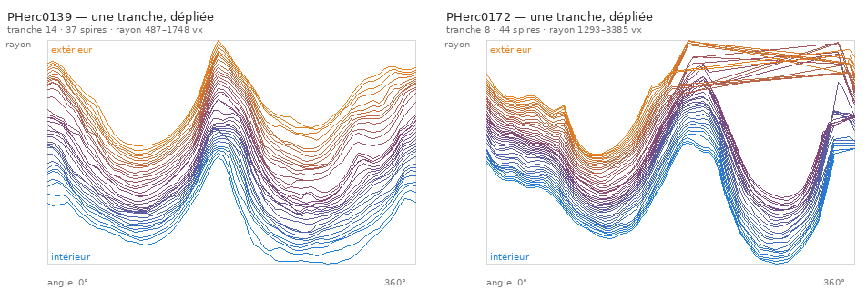

*`archive/77` §8 — `src/figures/figure_les_spires_vues_a_plat.py`. Le trou de matière qui empêche le prédicat de séparer sur le second rouleau, vu au premier coup d'œil et non par les quatre statistiques testées avant.*

**M1′ — Le dérouleur aveugle sur `0500P2`.** Le 5 septembre, en cherchant où remplir une case vide
d'encre, l'index publie **treize spires** consécutives de `PHerc0500P2` que rien n'avait ouvertes
(cinquième fois de l'angle mort ; l'auteur : *« regarde sur les autres serveurs »*). En deux jours la
campagne va d'une primitive (un écart le long de la normale atterrit à 60 µm de la spire suivante) à
un dérouleur qui perd la feuille au deuxième tour, puis à tout ce qui aurait pu le sauver et qui est
mesuré **apparié, sur un pas et sur une marche** : le raccrochage à la matière gagne 13 µm sur un pas
et ne survit pas à un tour ; deux ancres encadrantes valent 35,9 µm et la troisième ne paie pas ;
l'oracle prend 23,8 µm dans la même fenêtre pendant que seize gabarits en rendent 0,9 ; la moitié du
coût d'un pas est un plancher de direction que rien le long de la normale n'atteint ; et **sur une
marche, le raccrochage porte moins loin que ne rien faire** (2 bras contre 4), parce que l'erreur
devient la surface où le bras suivant estime ses normales. Ce qui sort de là est le marcheur le plus
simple du dépôt — **pas normal + nappe lissée, 5 bras sur 6** — un gain constant sur cinq ancres, un
bras gagné sur une seule, et la première distinction entre *« quelle méthode fait le meilleur pas »*
et *« quelle méthode va le plus loin »*, qui sont deux questions avec deux réponses. La campagne
s'arrête sur le mur que `81`–`82` nomment le lendemain : le corpus de `0500P2` ne demande que six
bras, et le septième vaut 7,4 feuilles.

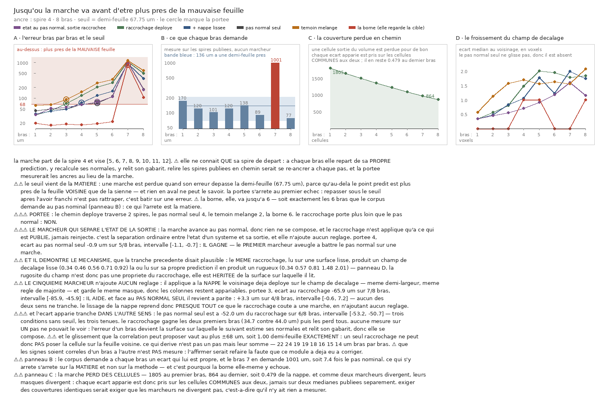

*`archive/75` §C l. 3453 — `src/figures/figure_la_portee_du_raccrochage.py` (17 contrôles). Le raccrochage qui gagne sur un pas perd sur une marche : les deux questions ne sont pas la même.*

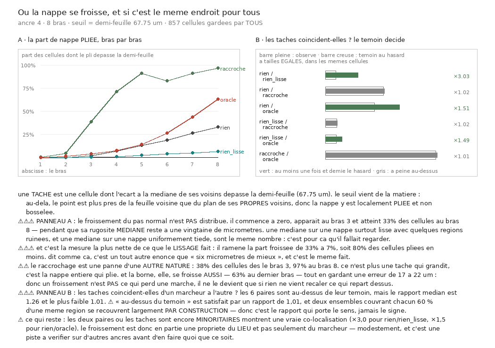

*`archive/75` §C l. 6513 — `src/figures/figure_ou_la_nappe_se_froisse.py` (11 contrôles). Une médiane dit combien ; cette carte dit où — et le froissement du pas normal commence à zéro et atteint un tiers des cellules pendant que sa médiane ne bouge pas.*

**M2 — Le corpus est le mur.** En cherchant sur quel rouleau du prix mesurer, `81` découvre qu'aucun
ne publie de rang de spire, et qu'un « 6 » cité depuis des semaines est un trou géométrique dans une
numérotation continue. `82` relit deux JSON déjà publiés et montre que toutes les portées du dépôt
étaient **censurées à droite**. `83` déplace la boîte 1 296 fois : le fragment est mauvais partout.
`84` compte les franchissements contenus dans une maille : Paris4 en a 92, tout le reste zéro. `85` et
`86` chiffrent le sens du rang et la demi-feuille. **Ce mouvement change d'objet de fait** — la
décision formelle reste à l'auteur (`81` §6).

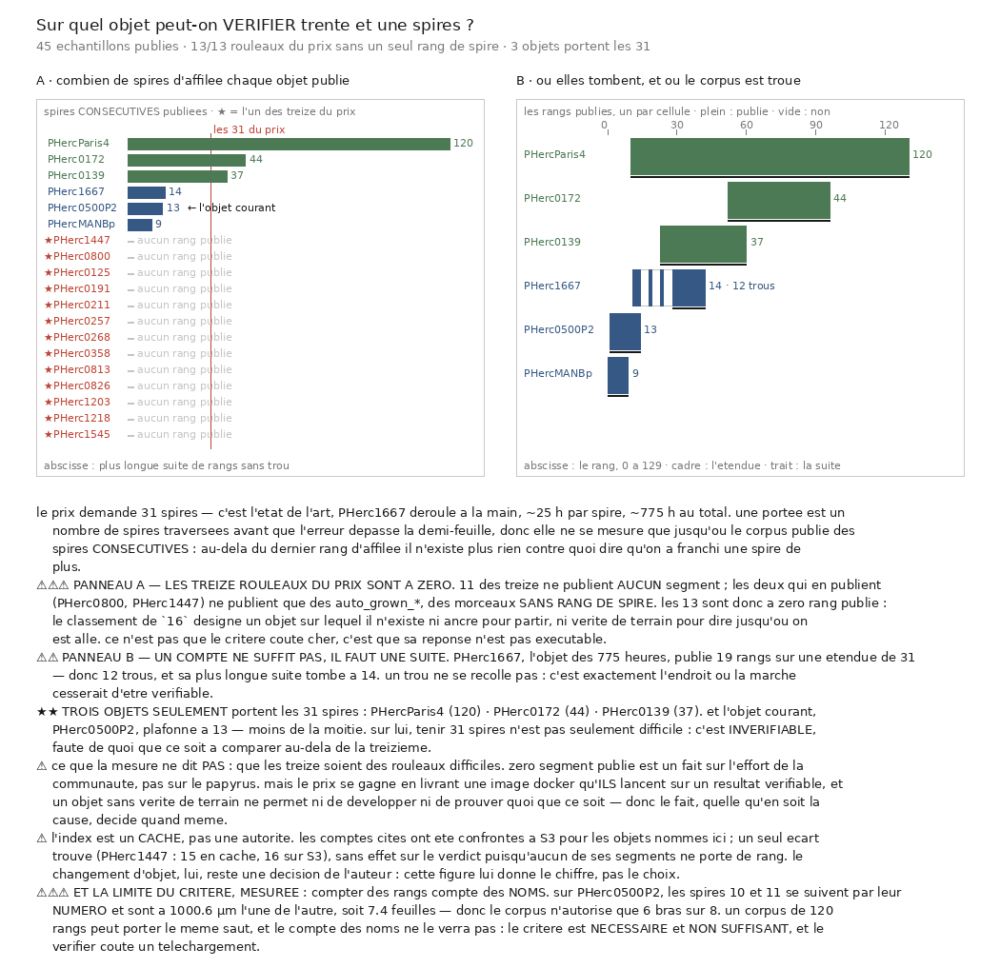

*`archive/81` — `src/figures/figure_les_spires_consecutives.py`. Compter des segments ferait croire que deux des treize sont exploitables ; compter des rangs dit que zéro l'est.*

**M3 — Ce que l'humain a produit.** Sur les 28 bandes humaines de Paris4 : l'axe est une courbe
(`90`), le pas vaut 164 µm (`91`), la continuité casse au bord ×31 (`92`), les spires sont parallèles
au milieu et désalignées au bord (`93`). Trois candidats de **signal de confiance** échouent : le pli
est anti-prédictif (`94`), la pose sur la matière aussi (`95`), la fermeture d'un tour a le bon signe
mais ne se calibre pas (`96`). `97` explique pourquoi : deux humains divergent d'une demi-feuille
partout. **La cible d'un automate ne peut pas être « égaler le maillage humain ».**

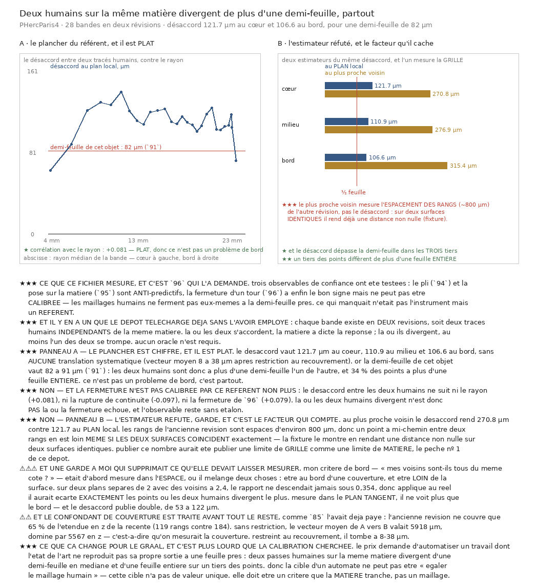

*`archive/97` — `src/figures/figure_deux_humains_sur_la_meme_matiere.py`. Le plancher que `95` et `96` nommaient sans pouvoir le chiffrer.*

**M4 — Interroger la matière.** `98` construit le premier critère dont le seuil vient d'un modèle nul
et non d'un maillage ; `99` le retourne en décision (quel pas ?) ; `100` réfute l'explication évidente
d'un écart et trouve une obliquité de 34° ; `101` montre par le volume seul que l'obliquité est celle
de la matière ; `102` enchaîne pas et direction sans référent humain et **bat l'automate naïf**
(2 pas contre 0) ; `103` réfute l'économie de lecture. Premier acquis positif, censuré par un plafond
de six pas.

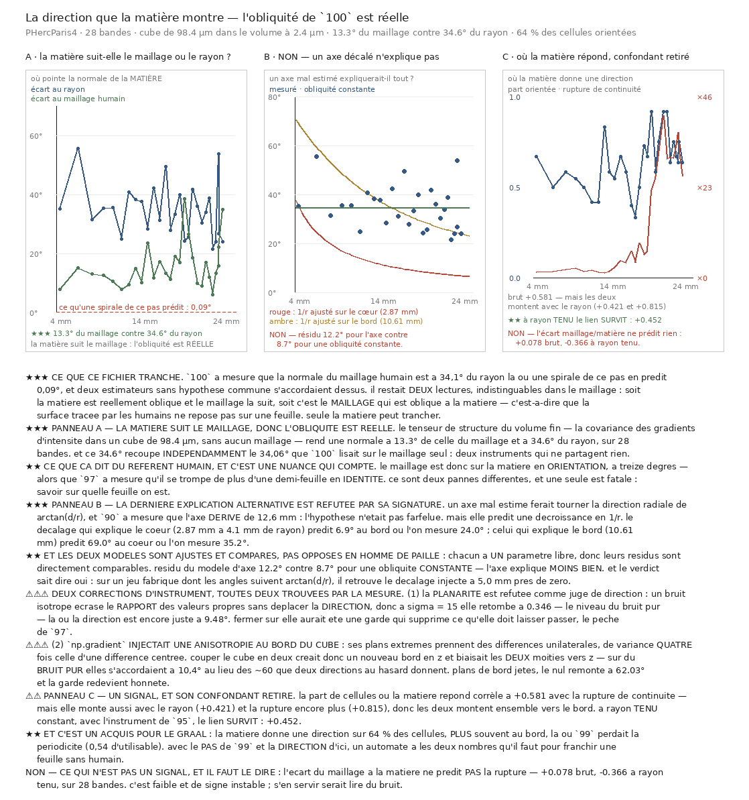

*`archive/101` — `src/figures/figure_la_direction_que_la_matiere_montre.py`. Avec le pas de `99`, les deux nombres qu'un automate doit connaître pour franchir une feuille sans humain.*

**M5 — L'instrument s'audite.** `104` mesure que le critère accepte 0,68–1,38 feuille par pas
confirmé ; `105` que le sélecteur lit +18,4 % trop haut ; `106` que la périodicité suivie n'est pas
l'espacement d'un empilement parallèle. `107` refait la marche avec le bon pas, garde les étapes, et
trouve deux populations ; `108` ce qui les sépare ; `109` que la portée publiée était une lecture du
critère ; `110` que le compte suit le pas dans le mode qui compte ; `111` que la bimodalité était
**instrumentale** (un plancher de fréquence relatif à la fenêtre) ; `112` pourquoi le remède ne
descend pas au pas. Neuf documents, aucune lecture neuve pour six d'entre eux.

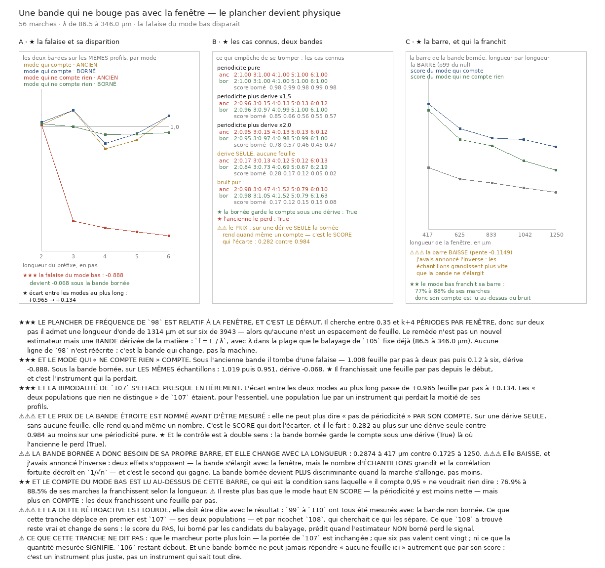

*`archive/111` — `src/figures/figure_une_bande_qui_ne_bouge_pas_avec_la_fenetre.py`. Le mode qui « ne comptait rien » franchit 0,951 feuille par pas.*

**M6 — Rouvrir, et lever le plafond.** `114` rouvre légitimement une cause éliminée (`55` exige une
mesure neuve : le champ d'enroulement en est une) et répond non. `113` lève le plafond de pas de 6 à
20 depuis les mêmes départs que `107`, en gardant départ, étapes et profils — parce que **56 marches
sur 56 avaient touché le plafond** et que la portée n'avait donc jamais été mesurée.


*`archive/113` — `src/figures/figure_jusquou.py`. Une ligne par marche, ordonnée par rayon ; une case par pas, pleine si le pas est confirmé. Les vingt-huit lignes vont jusqu'au mur : rien n'arrête une marche. Et le vidage de haut en bas est le résultat que le taux global et le taux par profondeur moyennaient tous les deux.*

`115` relit ces mêmes étapes et retourne la lecture : ce vidage n'est pas une matière qui durcit,
c'est un volume qui cesse de répondre. Un tiers des pas ne lit rien, aucun de ceux-là ne confirme,
et le rayon ne survit pas aux marches qui ont lu.

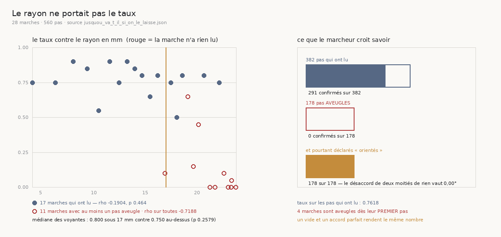

*`archive/115` — `src/figures/figure_ce_qui_porte_le_taux.py`. À gauche, les deux nuages superposés : la pente n'existe que parce que les marches qui n'ont rien lu sont à droite. À droite, le défaut — les 178 pas aveugles portent tous le drapeau `oriente`, parce que deux moitiés de rien rendent un désaccord de 0,00°.*

`116` va au bout de cette relecture : la cécité est **absorbante**. Sur les onze marches qui cessent
de lire, aucune ne relit, là où un tirage au hasard en ferait relire sept. Le marcheur avait donc
son critère d'arrêt depuis le début, et il marchait dans le vide au lieu de s'en servir.

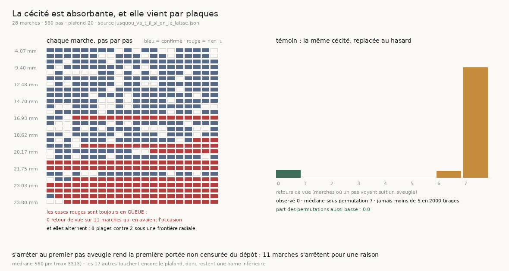

*`archive/116` — `src/figures/figure_la_cecite_est_absorbante.py`. Les cases rouges ne sont jamais au milieu d'une marche, toujours en queue ; le témoin de droite montre ce que le hasard en ferait. Et elles alternent avec des marches entières jusqu'à 22,17 mm : huit plages contre deux sous une frontière radiale, donc le vide n'est pas le bord du rouleau.*

`117` ferme le mouvement en décomposant les 91 refus qui restent : **deux tiers d'entre eux sont la
fenêtre de l'instrument, pas la matière**.

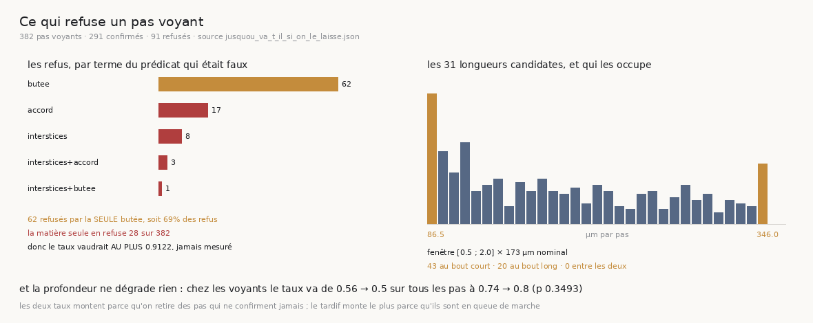

*`archive/117` — `src/figures/figure_qui_refuse_un_pas_voyant.py`. À gauche, les refus par terme faux du prédicat ; le bloc ambre est `en_butee` seule. À droite, les trente et une longueurs candidates : les pas en butée sont exactement aux deux bouts, jamais entre. La matière seule refuse 28 pas sur 382.*

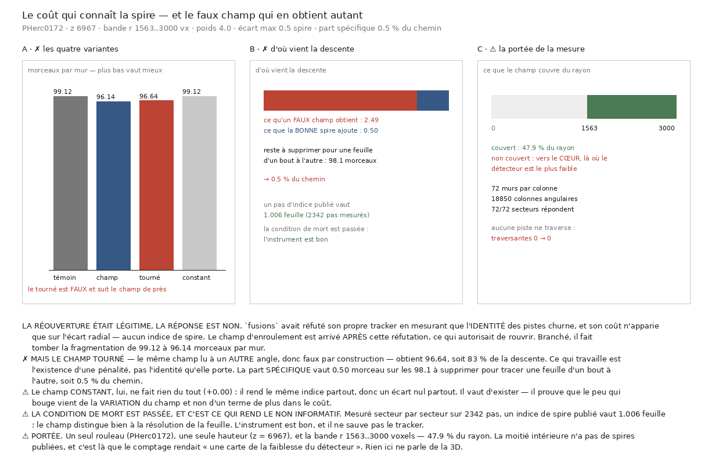

*`archive/114` — `src/figures/figure_le_cout_qui_connait_la_spire.py`. La réouverture était légitime, la réponse est non : 0,5 % du chemin.*

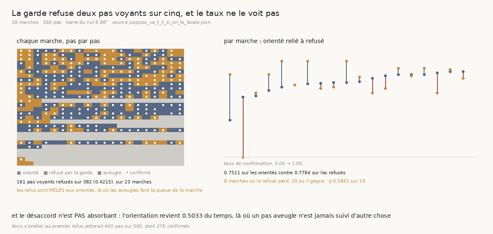

*`archive/129` — `src/figures/figure_ce_que_la_garde_refuse.py`. À gauche, une ligne par marche et une case par pas : ambre pour un pas que la garde refuse, bleu pour un pas orienté, gris pour un pas aveugle, point clair pour un pas confirmé. Les aveugles font la queue de la marche — c'est ce qu'« absorbant » veut dire — alors que les refus sont partout. À droite, le taux de chaque marche sur ses pas orientés relié à celui de ses pas refusés : les traits se croisent dans les deux sens, et aucun seuil ne sépare les deux populations.*

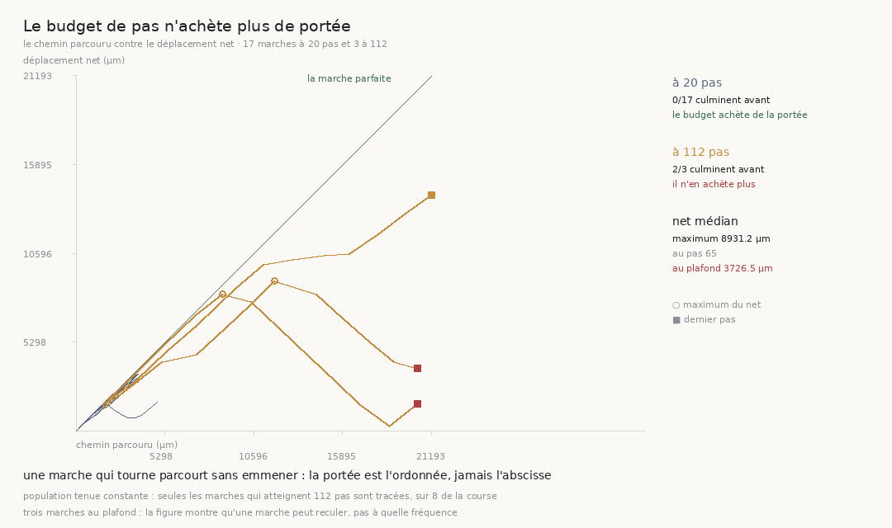

*`archive/130` — `src/figures/figure_jusquou_le_net_progresse.py`. En abscisse le chemin parcouru, en ordonnée le déplacement net, mêmes échelles, et la diagonale est la marche parfaite. Les dix-sept marches de vingt pas la tiennent et s'arrêtent là ; les trois marches de cent douze la quittent, culminent au cercle, et deux redescendent jusqu'au carré rouge pendant que l'abscisse continue. La portée est l'ordonnée, jamais l'abscisse.*

## 3. Chronologie, document par document

Format : *question → résultat · statut · ce que ça déplace*. Les producteurs sont dans `src/nappe/`
sauf mention ; le JSON porte le même nom dans `docs/mesures/`.

**`75` §C · 2026-09-05 → 07 · la campagne `0500P2`** (`les_wraps_publies.py`, `le_pas_normal_atteint_la_spire.py`,
`derouler_par_le_pas_normal.py`, `le_raccrochage_a_la_matiere.py`, `derouler_en_raccrochant.py`,
`derouler_des_deux_bords.py`, `combien_dancres.py`, `le_cout_dun_seul_pas.py`, `lecart_apparie.py`,
`le_gabarit_lu_ailleurs.py`, `le_critere_du_raccrochage.py`, `la_lissite_de_la_feuille.py`,
`loracle_est_il_atteignable.py`, `la_direction_du_pas.py`, `le_champ_lisse_par_construction.py`,
`ou_vit_le_champ_de_fibres.py`, `la_portee_du_raccrochage.py`, `la_portee_tient_elle_ailleurs.py`,
`la_cellule_sait_elle_quelle_a_tort.py`, `ou_la_nappe_se_froisse.py`, `combien_lisser_la_nappe.py`)
Treize spires publiées, écart voisines 135,5 µm (12 paires ; 4 anormales : 232, 292, 327, 65 µm) ; le
segment de la case vide est ailleurs (2 134 µm = 15,7 feuilles). Faits 21–30 du §1 bis. Ce qui a été
fermé, dans l'ordre : le raccrochage itéré, la lecture de la longueur locale (ce qui revient est un
tirage uniforme dans la fenêtre : 0,292 contre 0,293 attendu), la troisième ancre, la parabole,
l'écart déjà franchi comme prédicteur (ρ −0,119), seize gabarits, la lissité au-delà du 3×3, la
rotation du pas, les surfaces lisses par construction, l'orientation (donnée absente), « combien
lisser » (l'ancre vivante meurt). Ce qui a été ouvert : la confiance par cellule (pli, obscurité), le
critère d'arrêt observable sans cible. → désigne `PHercParis4` ; rejoint par `81`–`84`.

**`76` · 2026-09-04 · le sens des indices** (`excision/le_sens_des_indices.py`, `paver_ou_echantillonner.py`)
`w` compte vers l'extérieur (95,0 / 95,1 %) ; un pas d'indice = 154,1 µm (`0139`), 147,4 (`0172`) ;
le voxel ne se lit pas dans le nom du volume (3 noms pour 37 segments) mais se décode de
`area_cm2/area_vx2` = 9,362 µm. Rouleau écrasé : p10–p90 du rayon d'une spire = 566 vx (~17
feuilles). Défauts du référent : `w045`/`w046` même surface, `w041`/`w042` demi-feuille, `0172`
`w075`/`w076`. Une spire approuvée fait 38,4 cm² (×6,4 le point fixe rogner-étendre de 6,02). §7 : le
traçage automatique **échantillonne** (1447 : 29 % avec une voisine), la curation **pave** (100 %) —
la médiane toutes paires ne discrimine pas (2202 vs 1901 µm). → corrige l'article §5.7 ; ouvre A2.

**`77` · 2026-09-04/05 · le prédicat d'identité** (`excision/le_champ_denroulement.py`,
`le_masque_dapprobation.py`, `le_trou_angulaire.py`, `extraire_la_spire_suivante.py`,
`la_surface_et_la_feuille.py`, `alpha_et_le_placement.py`, `volume/couches_distantes.py`,
`nappe/le_volume_du_maillage.py`)
La grandeur est l'**avance d'indice sur un tour** (pas l'étendue : une spire spirale d'un écart par
tour). `0139` : spire −0,005 [−0,170 ; +0,230], saut d'une feuille 1,103 [0,753 ; 1,479] — séparées
sur la spire entière, sur 2 tranches au moins, jamais sur une. Les deux sauts fabriqués qui ne
montent pas sont exactement les défauts de `76`. `0172` : la rampe se reproduit (0,02/1,07/2,00/2,98)
mais les populations se recouvrent ; quatre causes testées n'expliquent pas (couverture, dérive de
l'axe jusqu'à 106 feuilles par tranche, spires par cellule, monotonie) ; §8 la figure montre un
**trou** 330–360° (7 spires sur 43 à 0 %) ; l'écarter restaure la séparation à 16 tranches, écarter
6 secteurs sains non ; coût 8 % de circonférence. Masque `approval.tif` (§6) : deux prédicats —
placement (partie fractionnaire, seuil 0,30) et identité (avance, 0,45) ; quart de pas approuvé
92,7 %, demi-pas 2,1 %, saut 0,0 % ; retirer la spire qui borne fait passer le demi-pas à 37,6 %
(bug corrigé). §9 : le champ porte **une feuille** au-delà du bord (47 µm = 0,31), c'est un juge pas
un générateur. §10/§12 : la surface publiée est à 0,121–0,146 feuille de la matière sur trois
rouleaux ; première version gonflée de 25–37 % par un centre de masse qui enjambait deux feuilles.
§11 : α ne se calcule pas sur un volume de surface, et sur 65 couches le positif est soit circulaire
soit confondu par le serpentage — **B2 reste ouverte**. Correction du 09-05 : `PHercParis4` publie
cinq volumes, aucun à 7,91 µm ; celui de `44` est à 2,400 (seul contenant du maillage).
→ ferme A1, A2 (par rouleau), A3 ; ouvre A2 bis.

**`78` · 2026-09-04/05 · l'ombilic publié** (`excision/lombilic_publie.py`, `laxe_ne_suffit_pas.py`,
`nappe/le_champ_de_fibres.py`)
Cinq rouleaux publient un axe (`0125`, `0139` 391 pts, `0211`, `0332`, `0826`) ; le centre ajusté en
diffère de 3,01 mm médian, et la mesure appariée n'en bouge pas (94,8 % / 155,8 → 156,8 µm) :
l'immunité vient de l'appariement, pas du centre. §4 : Archimède (axe + pas) rend 11,36 feuilles
d'erreur, le champ des spires 0,088 — la **forme** vaut ×130. Fibres publiées : `nx`, `ny`,
`presence` (pas de `nz` ; |nz| récupérable, signe perdu), niveaux 3–4 seulement (19,2 µm : 7,8
cellules par pas). → A2 bis borné par la résolution.

**`79` · 2026-09-05 · aucun seuil ne sépare les feuilles** (`rendu/topologie_du_volume.py`)
Attendu dérivé : 128 × 7,910 / 142,8 = 7,09 feuilles par chunk → plus gros morceau 14,1 % ; mesuré
93,2–100 % à six seuils, centre et bord, 6-connexité. 97,4 % des voxels non nuls entre 128 et 176.
Le profil radial du niveau 5 (σ ×5 vers l'extérieur) était un artefact de la taille du voxel.
→ interdit l'isosurface ; le calcul que `00` §10.3 renvoyait hors de l'arbre est dans l'arbre.

**`81` · 2026-09-06 · le rouleau désigné ne publie rien** (`depot/les_spires_consecutives_publiees.py`,
`ce_que_les_serveurs_publient.py`)
Treize rouleaux du prix : 0 rang de spire (11 sans segment ; `0800` et `1447` en `auto_grown`
sans rang). Suites : Paris4 120 (intervalles `w010-027`…), `0172` 44, `0139` 37, `1667` 14,
`0500P2` 13. Le « 6 » de `la_portee_du_raccrochage` n'est pas 13/2 : le bras 10→11 demande
1000,6 µm = 7,4 feuilles. Compter des noms n'est pas compter des voisines. → la décision de `31` §10
(choisir un des 13 par la part comprimée) n'est ni dans le budget (×315) ni exécutable ; le
changement d'objet est à l'auteur.

**`82` · 2026-09-06 · la borne était le mur** (`le_mur_du_corpus.py`, hors ligne)
Oracle = plafond du corpus sur 5/5 ancres (10 − ancre) ; « la borne vaut 6 » devient « ≥ 6, inconnue ».
Ce qui tient : à l'ancre 4, pas normal 4 < lissé 5 < plafond 6, donc le gain du lissage n'est pas
touché. **Rétracté** : « il ne reste qu'un bras de marge ».

**`83` · 2026-09-06 · le corpus, pas la boîte** (`ou_poser_la_boite.py`)
1 296 placements : meilleur plafond 8 (minorant : treillis 480 → 7, 240 → 8) ; 597 sans un bras ;
40 % des 8 589 bras hors pas nominal (2 226 lacunes, 1 169 doublons) ; la paire 10→11 varie de
19,4 à 1 224,8 µm selon la boîte (×63). Déplacer la boîte rend +2 bras, sans changer d'objet.

**`84` · 2026-09-07 · une surface, combien de spires** (`depot/une_surface_combien_de_spires.py`)
Paris4 : 28 bandes, 120 spires, 4,29 spires par surface, plus longue 18 → **92 franchissements
contenus dans une maille** ; les cinq autres objets : 1 spire par surface, 0. Longueurs 18 10 8 7 6
5 5 4 4 4 4 4 3×9 2×7, monotones, sans trou = la courbe de coût du déroulage manuel. 18 < 31.

**`85` · 2026-09-07 · le sens du rang** (`le_sens_du_rang.py`, `tifxyz-transformed` à 45,532 µm)
27/27 montées de rayon (7,41 mm au rang 10 → 24,84 au rang 128). Une passe humaine couvre une
longueur de feuille à peu près constante ; 9 paliers de quantification. **Rétracté par `90`** : le
« second régime » de la bande du cœur (838 mm) était une erreur d'axe. Limite de grille dite : cellules
à 905 µm, le pas inter-feuilles ne se lit pas dessus.

**`86` · 2026-09-07 · la demi-feuille par objet** (`la_demi_feuille_par_objet.py`, atlas
`winding-ruler`, 36 objets)
Le 135,5 µm du dépôt (12 paires de `0500P2`) est au **percentile 27** de l'atlas du même fragment
(196,6 médian, p25 131,1) : les portées 4/5/6 sont des bornes basses (+45 % de tolérance à la
médiane). Paris4 : 91,2 µm ; les 13 du prix : 86,4–103,7 (×1,20) — la géométrie ne désigne aucun
rouleau. Ce n'est pas une contradiction, c'est une population (local vs fragment) ; l'atlas surestime.

**`90` · 2026-09-08 · l'axe est une courbe** (`laxe_est_une_courbe.py`)
Centre par tranche : 12,6 mm en x, 19,8 en y sur 144 mm, en revenant sur ses pas ; 11,6 mm hors de
sa droite = 63,9 feuilles. 100 % des 36 secteurs occupés par tranche (pas un artefact). Sous l'axe
courbe : 27/27, longueur par passe 362 mm (273–460, ×1,68). Verdict de courbure en épaisseurs de
feuille (droit 1,0, courbé 14,1). → aucun repère global ne remplace l'humain ; le remplaçant est local.

**`91` · 2026-09-08 · le pas lu sur les transferts** (`le_pas_lu_sur_les_transferts.py`)
L'étendue déclarée d'une bande est son nombre de tours mesuré (−0,01 tour médian ; 27/28 à moins de
0,1 ; exception `w010-027` : 12,75 pour 18). Pas 164 µm (136–207) vs 182,4 à l'atlas : deux
instruments sans rien en commun, à 10 %. **Rétracté avant publication** : un gradient « 1000 µm au
bord », artefact de fenêtre (pente sur 10/6/4/3/2/1 tours d'une même bande : 202/208/224/287/523/1817).

**`92` · 2026-09-08 · la continuité des transferts** (`la_continuite_des_transferts.py`)
Plus grand saut entre cellules voisines / pas d'échantillonnage : cœur 1,7, milieu 5,9, bord 31,0.
Même un humain rend une surface discontinue au bord. Corrélation sauts↔gonflement 0,80 mais retirer
les lignes à saut change la pente de 0,2 % : **pas la cause**.

**`93` · 2026-09-08 · où les spires sont parallèles** (`deux_modes_dechec_du_transfert.py`)
Rapport désalignement un tour / adjacent : `w073-076` (14 mm) ×1,23 ; `w128-129` (24 mm) ×4,18 ;
`w010-027` non résolue (27 colonnes par tour). En U, minimal au milieu. Les deux modes d'échec
(brisé, désaligné) sont au **bord**. Faute gardée : comparer la bande 0 à la bande 7 en l'appelant
« le bord » inversait la conclusion.

**`94` · 2026-09-08 · le froissement mesure la rugosité** (`le_froissement_mesure_la_rugosite.py`)
Pli médian : cœur 15,2 µm, bord 3,8 — anti-prédictif (ρ −0,957 rayon, −0,825 rupture). Fixture : le
champ est aveugle à la courbure lisse et mesure la rugosité (×1,1 entre R = 5 et 20 mm) ; le réel
chute ×5,2 → les maillages humains sont **cinq fois plus lisses au bord** : signature d'un pontage.
Sagitta (accord 1,11 médian) réfutée par la fixture (prédit 20,2 µm où le champ rend 0). Ne rétracte
pas `75` (pli prédictif par cellule à rayon constant) ; **tout signal de confiance se vérifie à
travers les rayons** (une marche de 31 spires change le rayon ×6).

**`95` · 2026-09-08 · la surface et la feuille par rayon** (`la_surface_et_la_feuille_par_rayon.py`,
`commun/voxel_distant.py`)
Dispersion surface↔ruban à 2,4 µm : cœur 20,0 µm, bord 13,85 — la surface est **mieux posée là où le
transfert casse** (ρ −0,702 ; partielle masque retiré −0,550 ; tient de 5 à 30 % de remplissage). Le
volume fin est une nécessité mesurée (à 45,5 µm un demi-écart = 2 voxels). **Motif nommé** : au bord,
l'humain trace proprement *une autre feuille* ; ce qui échoue est l'**identité**, qu'aucune observable
locale ne peut voir. Défaut d'outillage : un résultat qui bougeait entre deux runs (coupures réseau
silencieuses, 65 cellules sur 90) → réessais et compte publié.

**`96` · 2026-09-08 · la fermeture d'un tour** (`la_fermeture_dun_tour.py`)
Part de cellules hors demi-feuille après un tour : 0,621 cœur, 0,804 bord (ρ +0,858 rayon) — premier
signal au bon signe ; le pas est juste partout (0,95–1,02). Immune à l'ovalité. Bruit ou structure :
fenêtre ×5 → réel −11 %, bruit → 0 : **structure**. Mais 62 % d'échec au cœur, là où tout est intact :
un référent qui ne ferme pas lui-même ne calibre rien.

**`97` · 2026-09-08 · deux humains sur la même matière** (`deux_humains_sur_la_meme_matiere.py`)
Désaccord au plan local : 121,7 / 110,9 / 106,6 µm par tiers (plat, ρ +0,081) ; hors demi-feuille
0,61–0,63 ; > 1 feuille 0,30–0,34 ; aucune translation systématique (8–38 µm). Plus proche voisin
réfuté (270–315 µm : limite de grille). Ne corrèle ni au rayon, ni à la rupture, ni à la fermeture de
`96`. **La cible d'un automate ne peut pas être le maillage humain** ; `94`–`96` mesuraient contre
une règle qui bouge d'une demi-feuille selon qui la tient.

**`98` · 2026-09-09 · combien d'interstices** (`combien_dinterstices_traverses.py`)
Gabarit *brillant–sombre–brillant*, corrélation normalisée (sans seuil d'amplitude : l'étendue varie
×146 dans une bande) ; barre = p99 du bruit blanc = 0,331. Par tiers : la matière répond 0,740 /
0,690 / 0,540 ; ρ rupture −0,411 (bon signe, faible). La cellule part **sur** la feuille une fois
sur deux (marge franche). Réfuté : compteur de minima proéminents (invariant d'échelle → aucun point
de fonctionnement). **Réfuté par `104`** (la quantité) : la famille {1, 2, 3} ne dit jamais « moins
d'une feuille » ; remplacée par `feuilles_franchies` (continu, cos θ à 0,0022).

**`99` · 2026-09-09 · le pas que la matière montre** (`le_pas_que_la_matiere_montre.py`)
Le même filtre balaie la distance (moitié → double du nominal, k = 1). Premier résultat, 147 µm,
**identique sur du bruit pur** : un nul pour chaque quantité rapportée, pas seulement la confiance
(nul par candidat 0,158 → 0,093) ; comparaisons multiples (62 essais : barre 0,331 → 4,357 σ). Après
calibration : 198,9 µm cœur, 214,05 bord ; > 81 % des cellules à plus de 10 % du nominal ; KS réel
vs nul D = 0,603. La part « matière répond » corrèle **−0,845** à la rupture — le signal au bon signe
le plus fort. **Biaisé** (`105`) : le sélecteur calibré lit +18,4 % trop haut ; corrigé 164,3 µm.

**`100` · 2026-09-09 · la normale n'est pas le rayon** (`la_normale_nest_pas_le_rayon.py`)
L'explication « obliquité » de l'écart de `99` (1/cos = 1,212 vs 1,213 observé) est **réfutée** : pas
radial / pas normal = 1,018 vs 1,184 prédit ; ρ(rapport, 1/cos) = +0,153 ; l'instrument voit une
obliquité fabriquée (35° → 1,238). Fait plus lourd : la normale du maillage est à **34,1°** du rayon
(ACP 33,6°) où une spirale en prédit 0,09° ; plateau à 21° avec 1000 voisins ; 14,6° hors plan,
24,0° dans le plan. Corrige `98` (« segment ⟂ empilement » faux ; ce qui le sauve : le pas ne dépend
pas de la direction, raison inexpliquée). `106` reprend : l'anomalie survit (1,000 vs 1,155).

**`101` · 2026-09-09 · la direction que la matière montre** (`la_direction_que_la_matiere_montre.py`)
Tenseur de structure à 2,4 µm, cube de 98,4 µm : la matière est à 13,32° du maillage et **34,59°** du
rayon (recoupe `100`) ; orientée sur 63,6 % des cellules. Axe décalé réfuté par sa signature 1/r
(résidu 12,2° contre 8,7° pour une obliquité constante). Planarité réfutée comme juge (le bruit ×6 du
signal laisse la direction juste) → garde = accord des deux moitiés du cube (barre 8,88°) ;
`np.gradient` injectait une anisotropie au bord (nul 10,4° au lieu de 62°). À rayon tenu, la part
orientée suit la rupture (+0,452) : **la direction survit là où le pas ne survit pas**. Le maillage
humain est juste en orientation (13°), faux en identité (`97`) : deux pannes, une fatale.

**`102` · 2026-09-10 · combien de pas la matière porte** (`combien_de_pas_la_matiere_porte.py`, 7 h)
Pas confirmés consécutifs : matière **2,00** vs automate naïf **0,00** (médiane de médianes, 4
cellules par bande) ; 583,9 µm portés ; 0 sortie du volume ; aucun référent humain dans la boucle
(direction `101`, pas `99`, vérification `98`). Témoin : à 0° naïf = matière = 6. **Censuré** :
17/28 bandes au plafond de 6 pas (budget : 15,4 s par cube). Première vérification **incapable
d'échouer** (le balayage trouvait 211 µm dans la fenêtre → naïf 8/8) → `99` décide, `98` vérifie à
gabarit fixe. Statut du « 2,00 » au 11 septembre : **rétracté comme portée** (`109`), borne inférieure
d'une lecture du critère.

**`103` · 2026-09-10 · le cube lu moins cher** (`le_cube_lu_moins_cher.py`)
Un voxel sur deux : ×1,72 de gain (pas ×7,44 : le coût suit les plages d'octets, plancher 3,76 s)
mais 7,3 % des cellules à plus de 10° → 36,5 % des marches de six pas abîmées. **Réfuté.** La sonde
sur deux bandes disait 0 %.

**`104` · 2026-09-10 · un pas confirmé n'est pas une feuille** (`un_pas_confirme_nest_pas_une_feuille.py`, hors ligne)
Bande d'acceptation du critère de `102` : 0,68–1,38 feuille (0,72–1,32 à σ = 30 ; indépendante du
bruit = pouvoir de la forme) → 120 pas confirmés = 82 à 166 spires ; le retard est invisible, le saut
visible ; les quatre pas publiés (164, 173, 199, 214 µm) tombent tous dans la bande. Leçon chiffrée :
**un agrégat ne se désagrège pas** — `102` a marché 224 fois et gardé une médiane par bande, sa survie
n'est bornée qu'à 0,5 près. Le registre passe avant la portée.

**`105` · 2026-09-10 · le balayage rend-il le pas injecté** (`le_balayage_rend_il_le_pas_injecte.py`)
Sur profils fabriqués : brut +0,0016, calibré +0,050 (jusqu'à +0,112). Mécanisme : le nul par
candidat décroît avec la longueur, la calibration favorise les longs (retient 181,7 pour 173 injectés
avec un accord 0,9882 < 1,0000) — deux questions, une statistique. Le contrôle de `99` relisait le
sélecteur brut, pas celui de la production. Apparié sur le vrai volume (28 × 120, mêmes lectures) :
brut 164,3 / calibré 194,6 / deux rôles 164,3 (**+18,4 %**, 28/28 bandes) ; 164,3 = même case de
grille que les transferts humains (164,0). Le marcheur de `102` franchissait 1,184 feuille par pas
(120 pas = 142 spires), **dans** la bande de `104`. `99`–`102` non recalculés.

**`106` · 2026-09-10 · le pas selon la direction** (`le_pas_selon_la_direction.py`, éventail ±50°)
Modèle parallèle contre constante, un paramètre chacun, normale de `101` imposée : ∥ gagne 70 %,
gain ×1,355, résidu 19,30 µm contre **0,72** sur pile fabriquée (×22,3) ; amplitude 173 µm mesurée
vs 85 prédits. L'anomalie de `100` survit (1,000 vs 1,155). Réfuté : incohérence d'orientation sur la
sonde (le rapport monte). Fautes gardées : normale non orientée (rayon écrêté au bord de l'éventail =
limite de grille), médiane signée d'angle lue comme un accord (+2,50° pour 25,0° en absolu).

**`107` · 2026-09-10 · le marcheur avec le bon pas** (`le_marcheur_avec_le_bon_pas.py`, 3,53 h, étapes gardées)
Pas corrigé : 1,0 pas confirmés contre 1,0 (5/28 au plafond). **Le risque par pas baisse** : 0,382
(pas 1–3) → 0,105 (4–6), ×3,63, p = 0,042 — « la difficulté est de s'accrocher, pas de porter ».
Registre du trajet : 10 trajets à 1,08 feuille par pas, 14 à 0,125, même partage pour les deux
sélecteurs ; le score du **trajet** est plus haut pour les mauvaises (0,483 vs 0,371). Lire le cube
moins souvent refusé (la direction tourne de 10,12° par pas, barre 8,88°). Coût d'une étape : 55 s
(38 seul, 58,5 sous contention exclu). **Revu par `109` et `111`** : la portée est un run consécutif ;
les deux populations sont surtout celles de l'instrument.

**`108` · 2026-09-10 · ce qui sépare les deux populations** (`ce_qui_separe_les_deux_populations.py`, hors ligne)
Onze candidats déclarés avant, permutation sur le maximum (sans correction : 42,7 % de faux gagnants
sur du bruit). Deux survivent : score médian du **balayage** (force 0,664, p 0,0008) et accord de
l'interstice (0,563). Contraste : le score du pas (230 µm) sépare à l'endroit, celui du trajet
(1250 µm) à l'envers — une dérive lente s'ajuste mieux sur une longue fenêtre. Trois pas suffisent
(p 0,010), un non. Le mode qui ne compte rien marche **plus loin** (1276 vs 1189 µm). **Revu par
`111`** : le fait tient (il prédit quand l'estimateur non borné perd le signal), l'interprétation et
« repartir après trois pas » tombent.

**`109` · 2026-09-10 · un pas non confirmé n'est pas une chute** (`un_pas_manque_nest_pas_une_chute.py`, hors ligne)
Sur les 56 marches de `107` : confirmés médiane **4,0** contre run **1,0** ; 24 marches à 5–6/6 dont
6 créditées 0–1. Le run est déterminé par le taux (0,5744). Manques **non groupés** : rafale 2,286 vs
2,213 sous l'indépendance à même taux (p 0,28 ; mode haut p 0,59 ; nul à taux commun aurait dit
groupés, p 0,001 — faux sur fixture). Les marches entièrement confirmées dépassent (+0,292 feuille
par pas : troisième route vers `104`/`105`). Survie de 120 spires si « chute » : 2,7e-9 ; si
« manque » : 18 confirmations manquées. Ne prouve pas 120 spires.

**`110` · 2026-09-10 · le compte suit-il le pas** (`le_compte_suit_il_le_pas.py`, 56 lectures)
Préfixes des polylignes de `107` (départ re-dérivé, graine 613 : 48/56 reproduisent). Mode qui compte :
1,012 → 1,085 feuille par pas (+0,073, 9/22 baissent) — **aucun biais**. Mode bas : 1,008 → 0,12.
Ensemble : 1,008 → 0,199 (−42 spires sur 120) = **artefact de mélange**. Une dérive seule reproduit la
falaise sur une périodicité intacte (4/12 ; 0,128 vs 0,12) → observation indistinguable. 20 min
perdues par un `KeyError` d'agrégation → écrire les lectures avant le verdict.

**`111` · 2026-09-10 · une bande qui ne bouge pas avec la fenêtre** (`une_bande_qui_ne_bouge_pas_avec_la_fenetre.py`, profils gardés)
Le plancher `F_MIN = 0,35` de `98` est relatif à la fenêtre (λ admise 1314 µm à 2 pas, 3943 à 6).
Bande bornée par λ physiques (86,5–346 µm, les candidats de `105`), aucune ligne de `98` réécrite :
le mode bas passe de −0,888 à **−0,068** et franchit 0,951 feuille par pas ; écart entre modes
+0,965 → +0,134 ; ensemble −0,809 → −0,032. Prix : une bande étroite ne dit plus « pas de
périodicité » par son compte (dérive seule → 0,84 plausible) ; c'est le **score** qui écarte (0,28 →
0,02), et sa barre **baisse** avec la longueur (0,2874 → 0,1725 : 1/√n l'emporte). Dette : `99`–`110`
mesurés avec la bande non bornée.

**`112` · 2026-09-11 · pourquoi le remède ne descend pas au pas** (`pourquoi_le_remede_ne_descend_pas_au_pas.py`, hors ligne)
Sur un segment d'un pas (208 µm), f_lo = 0,6021 : aucun mode de Fourier retirable, le premier mode
**est** le signal → gain exactement 0 sur cinq dérives (contamination jusqu'à 0,34). Possible dès
2 pas (L ≥ λmax = 346 µm). Fautes de base : polynôme de degré 2 absorbe 0,9585 du gabarit ; grille
harmonique non entière 1,0 (rang par SVD, pas `qr`). Sur les segments réels : +6 à +9 points au-dessus
de la barre dès 2 pas, mais une fenêtre longue confirme moins souvent (0,607 vs 0,69).

**`114` · 2026-09-11 · le coût qui connaît la spire** (`excision/le_cout_qui_connait_la_spire.py`, 29 s)
Réouverture légitime (`55`) : l'indice d'enroulement dans le coût du tracker polaire (`0172`,
z = 6967, bande r 1563–3000, 72 murs par colonne). Morceaux par mur : témoin 99,12, champ 96,14,
constant 99,12, **tourné (faux) 96,64** → part spécifique 0,50 sur 98,1 = **0,5 % du chemin**.
Condition de mort passée : 1,006 feuille par pas d'indice (2342 pas, secteur par secteur ; 78
négatifs = section écrasée). Trois défauts attrapés par sonde : témoin translaté = no-op, métrique
`traversantes` dégénérée (0 partout), verdict OUI sur inégalité stricte. ⚠ Les 12 249 « fusions » de
`fusions_0172.json` sont des changements d'étiquette d'un tracker antérieur : **ne plus les citer**.
→ l'identité ne se récupère pas dans une coupe ; la question retourne en 3D (conservation de flot aux
jonctions d'une nappe).

**`113` · 2026-09-10 → 11 · jusqu'où va-t-il si on le laisse** (`jusquou_va_t_il_si_on_le_laisse.py`, 5 h 11)
Plafond de pas levé de 6 à 20, mêmes départs que `107`. **28 marches sur 28 le touchent encore**,
0 sortie de volume : la portée reste censurée, seule la borne inférieure bouge (1250 → 3966,3 µm).
Le taux ne baisse **pas** avec la profondeur (0,56 → 0,50, p 0,3253) mais **suit le rayon** : rho
−0,7188, p 1,6·10⁻⁵ sur 28 bandes de 4,07 à 23,8 mm ; taux par marche de 0,00 à 0,90, dispersion
9,887. Les deux agrégats de la course moyennaient sur l'axe où l'écart se trouve ; la figure l'a
montré. → **le marcheur n'échoue pas en avançant, il échoue là où il part**, et les deux remèdes
diffèrent.

**`115` · 2026-09-11 · ce qui porte le taux** (`ce_qui_porte_le_taux.py`, quelques secondes, hors ligne)
Relit les 560 étapes de `113` sans une lecture distante. **178 pas sur 560 (31,8 %) ne lisent rien**
— désaccord 0,00° ET planarité 0,000 — et **aucun ne confirme**. Sur les **17 marches voyantes** le
rho du rayon passe de −0,7188 (p 1,6·10⁻⁵) à **−0,1904 (p 0,4642)** : là où le volume répond, le
marcheur tient **0,7618** de ses pas à tout rayon (0,800 sous 17 mm contre 0,750 au-dessus,
p 0,2579). ⚠⚠ Et le vide est **déclaré orienté 178 fois sur 178** (`oriente = désaccord < barre`,
et deux moitiés de rien rendent 0,00°) — la forme de `54`, `60` et `41` §6bis. → **le marcheur n'a
pas de dérive au grand rayon ; ce qui lui manque est de savoir quand il ne lit rien**, et la
signature est disponible avant le pas.

**`116` · 2026-09-11 · la cécité est-elle absorbante** (`la_cecite_est_elle_absorbante.py`, une seconde, hors ligne)
Relit les mêmes 560 étapes. **Aucune des 11 marches qui cessent de lire ne relit** : 167 transitions
aveugle → aveugle, **0** aveugle → voyant, là où une permutation intra-marche à compte constant rend
**7 retours en médiane** et jamais moins de 5 sur 2 000 tirages. S'arrêter au premier pas aveugle
donne donc **la première portée non censurée du dépôt** : 11 marches sur 28 s'arrêtent pour une
raison, médiane **579,5 µm** (max **3312,9 µm**) ; les 17 autres touchent encore le plafond et
restent une borne inférieure. Et rangées par rayon, les marches aveugles font **8 plages** contre
**2** sous une frontière radiale (14 sous permutation, p 0,0095) : le vide n'est pas le bord du
rouleau. → **le marcheur avait son arrêt depuis le début**,
et ce qui reste censuré est la portée sur matière lisible.

**`117` · 2026-09-11 · qui refuse un pas voyant** (`qui_refuse_un_pas_voyant.py`, une seconde, hors ligne)
Décompose les **91 pas voyants refusés** par le terme du prédicat qui était faux — après avoir
vérifié que le prédicat reconstruit rend `confirme` sur les **560 pas, 0 désaccord**. **62 n'ont que
`en_butee` contre eux**, soit **69 % des refus qui touchent la fenêtre** ; et les 63 pas en butée
sont **exactement aux deux bouts** de la fenêtre [0,5 ; 2,0] × 173,0 µm — 43 à 86,5 µm, 20 à
346,0 µm, **0 entre les deux**. La matière seule n'en refuse que **28 sur 382**, donc le taux
vaudrait **au plus 0,9122** (borne supérieure : un pas en butée aurait pu échouer aussi). Et chez
les voyants, le taux va de **0,74 à 0,80** avec la profondeur (p 0,3493) — le même test sur tous les
pas retrouve exactement le 0,56 → 0,50 de `113`, ce qui est le contrôle du lecteur. → **il n'y a pas
d'accumulation d'erreur à corriger sur vingt pas**, et ce qui refuse est réparable par une re-course.

**`118` · 2026-09-11 · la fenêtre est globale, l'espacement est local** (`la_fenetre_est_globale_lespacement_est_local.py`, une seconde, hors ligne)
⚠ Corrige une supposition de `117` : son §5 avançait, sans le mesurer, que les deux bouts de la
fenêtre ne voulaient pas dire la même chose. **Les deux sont de vrais pas.** L'espacement local
qu'impliquent les pas en butée vaut **80,7 µm** au bout court (q3 85,5, sous la borne 86,5) et
**380,2 µm** au bout long (q1 349,5, au-dessus de 346,0) — de part et d'autre de la fenêtre, comme
une butée le prédit. Le contrôle est ce qui les rend lisibles : sur **287** pas libres, le déduit
s'accorde au choisi à un rapport apparié de **1,015** [0,955 ; 1,070], rho **+0,7515**. Et la
variation **n'est pas radiale** (rho +0,2895, p 0,2293 sur 19 marches ; les deux bouts aux mêmes
rayons, 14,70 mm contre 13,63, p 0,7729), donc un pas fonction du rayon ne suffirait pas. → **il faut une fenêtre centrée
sur l'espacement mesuré à l'endroit du pas**, ce que `R2-F08` sait déjà faire.

**`119` · 2026-09-11 · le marcheur dérive-t-il** (`le_marcheur_derive_t_il.py`, une seconde, hors ligne)
Regarde la **trajectoire** et non le taux : une marche peut confirmer ses vingt pas en tournant
lentement pour longer la feuille. La trajectoire est reconstruite exactement (écart 0,5 µm au
`parcouru_um` de la course) et coupée au premier pas aveugle. **Elle n'accumule rien** : rectitude
**0,944** sur la première moitié contre **0,942** sur la seconde (p **0,8906**), virage par pas
**11,5°** → **13,6°** (p **0,3736**), rotation cumulée autour de l'axe médiane **+13,2°**
(p **0,1564**) — pas de spirale. Et contre un tirage qui garde **exactement** le virage de chaque
pas mais en tire la direction au hasard, la marche réelle est plus droite : **0,928 contre 0,811**,
**17 marches sur 19**, p **0,00141**. → **le marcheur ne dérive pas, il revient** ; ⚠ sur vingt pas,
soit un sixième de l'étendue radiale.

**`120` · 2026-09-11 · la garde existait et personne ne l'appelait** (`combien_de_pas_la_matiere_porte.py`, réparation)
Répare `R4-P23`, et la cause n'était pas celle qu'on croyait. La garde contre le vide **existait** :
`planarite` rend exactement **0,0** sur un tenseur nul, sa docstring dit que « le cas dégénéré doit
être DÉTECTÉ, pas répondu », et sa batterie asserte que « seule la planarité peut l'écarter ». Le
marcheur la **calculait, la publiait et ne la lisait pas** — `oriente` ne consultait que le désaccord
des deux moitiés, et deux moitiés de rien rendent **0,00°**. `oriente` exige désormais une
planarité strictement positive — un test de dégénérescence et jamais une barre, parce qu'une barre de
planarité supprimerait ce que la garde doit laisser passer — et le pas porte `rien_lu` écrit à la
source. ⚠ **Aucun chiffre publié ne bouge** : les cinq tranches qui relisent `113` reproduisent leur
JSON octet pour octet. → **un contrôle qui décrit un devoir d'appelant ne vérifie rien tant qu'aucun
appelant ne le remplit** (`R5-F21`).

**`121` · 2026-09-11 · recentrer ou élargir la fenêtre** (`recentrer_ou_elargir_la_fenetre.py`, hors ligne)
Avant de payer une re-course pour élargir la fenêtre, mesure ce que chaque changement coûte.
**Recentrer est exact** : le nul par candidat est invariant par changement d'échelle à
**2,6·10⁻¹⁶** près, sur toute la plage que `118` déduit (80 à 400 µm), parce qu'il ne dépend que
des rapports des longueurs à la plus longue. **Élargir ne l'est pas** : le nul se déplace de
**1,2 σ** pour [0,3 ; 3,0] et **2,0 σ** pour [0,25 ; 4,0], et le score calibré vaut
`(score − mu)/sd`. Contrôle positif : le nul n'est pas plat (**0,1582 → 0,0925**, soit **24,4
erreurs-types**), sans quoi « pas d'écart » serait une propriété d'une constante. → **la fenêtre
peut suivre l'espacement local sans rien recalibrer** ; l'élargir exigerait son propre nul, et le
remède spontané de `117` aurait coûté une re-course et une barre fausse.

**`122` · 2026-09-12 · la re-course est écrite, testée, et pas lancée** (`combien_de_pas_la_matiere_porte.py`, analytique)
Le marcheur gagne deux options, toutes deux **défaillant à l'ancien comportement** : une fenêtre de
pas **recentrée sur l'espacement local à largeur constante** — ce que `121` rend gratuit et ce que
la garde vérifie, un refus valant mieux qu'une barre fausse — et un **arrêt au premier pas aveugle**,
que `116` rend sans coût. Démonstration sur une pile dont le pas décroît de 0,04 µm/µm : la fenêtre
fixe est **3 fois en butée** et confirme **21 pas sur 26**, la locale **jamais**, confirme **26 sur
26** et descend à **50,0 µm** sous le bout court de **86,5**. Et le plafond est **dérivé** :
traverser 4,07 → 23,8 mm à 177 µm d'espacement demande **112 pas**. → **les deux portes qui restent
demandent la même re-course, et elle est prête** ; elle n'est pas lancée, elle demande des
lectures distantes sur des heures.

**`123` · 2026-09-12 · le marcheur reste-t-il verrouillé** (`le_marcheur_reste_t_il_verrouille.py`, analytique)
`119` mesurait **où** le marcheur va ; celui-ci mesure **sur quelle feuille il tombe** — la panne que
l'humain répare d'une spire à l'autre. Elle n'est pas mesurable sur le vrai volume, où l'on ne sait
pas où sont les feuilles ; elle l'est au centième de feuille sur une pile fabriquée. **Le décalage ne
grandit dans aucune des quatre conditions** : 0,1249 → 0,1249 sur pile propre, et à 35° d'obliquité
il **diminue** (0,1620 → 0,1354, p **0,0137**) — le marcheur se re-verrouille. L'avance vaut
**1,0037 à 1,0067 feuille par pas**, donc moins d'une feuille d'excès sur les 112 pas d'une
traversée. ⭐ Le témoin donne au résultat sa puissance : un pas nominal imposé sur la même pile
oblique **dérive** (0,2287 → 0,2713, p **0,0005**), n'avançant que de 0,8192 = cos(35°). → **la
panne du transfert ne vient pas du mécanisme** ; ⚠ analytique, le rouleau n'est pas une pile plane.

**`124` · 2026-09-12 · la nappe se déchire-t-elle** (`la_nappe_se_dechire_t_elle.py`, analytique)
`119` et `123` portent sur **une** marche ; une image déroulée est une **nappe**. Huit marches
parties de la même feuille, écartées de 96 µm, pile à 35° bruitée, 112 pas : **9 lots sur 12 se
déchirent**, saut médian entre voisines **1,020 feuille**, étendue 0,116 à 20,59. ⭐ L'issue n'est pas
graduelle — **aucun lot entre 0,504 et 1,011** : ou la matière tient les marches, ou elle ne les
tient pas. ⚠⚠ Et la déchirure **ne s'annonce pas** : rho **+0,4545** (p **0,1377**) entre la
dispersion au pas 16 et le saut final, là où la cécité, elle, a une signature disponible avant le
pas. ⚠⚠⚠ La première mesure portait sur **une seule graine** et rendait 0,504 — la quatrième plus
basse des douze. → **c'est là que vit la valeur de l'humain** : il recoud ce que le mécanisme sépare,
et la séparation ne se voit pas venir.

**`125` · 2026-09-12 · la fenêtre locale s'emballe** (`la_fenetre_locale_semballe.py`, hors ligne)
La re-course a trouvé le défaut **en une bande**, et il est dans ce que `122` a écrit. L'échelle de
la fenêtre part de **1,000** et atteint **32,6645** — amplitude **×549** — avec un pas de
**7644,4 µm**, soit **44,2 feuilles**. ⚠⚠ Et elle n'a pas aidé : part en butée **0,2202** contre
**0,1649** à fenêtre fixe, taux **0,7156** contre **0,7618**. ⭐ La cause est structurelle :
l'espacement suivi vaut `avance / feuilles`, or `avance` est choisi dans la fenêtre **déjà mise à
l'échelle** — rho **+0,8916** entre l'échelle d'un pas et l'espacement qu'il déduit. ⚠⚠ La
démonstration de `122` ne pouvait pas le voir : une pile fabriquée n'a **qu'un** pas vrai, donc rien
ne pouvait dériver. → **une fixture à réponse unique valide le mécanisme là où il ne peut pas
échouer** (`R5-F22`), et `118` demandait un espacement **mesuré**, pas **déduit**.

**`126` · 2026-09-12 · le bruit n'était pas porté par la matière** (`combien_de_pas_la_matiere_porte.py`, analytique)
⚠⚠⚠ `VolumeFabrique` tirait son bruit **à chaque lecture** : le même point rendait **91,25** puis
**78,27**. Invisible pour une marche seule, qui ne repasse pas ; faux dès que **deux** marches lisent
le même voxel — c'est-à-dire exactement ce que `124` mesure. Corrigé : le bruit est une fonction du
voxel (écart-type **7,948** pour 8,0 demandé). ⭐ Et la correction rend le résultat **pire** : la
nappe se déchire **12 fois sur 12** au lieu de 9, et le saut minimum passe de **0,116** à **0,7769**
— aucun lot ne tient plus. La raison est que le bruit cesse d'être **lavé** par les 68 921 voxels du
cube et devient une structure persistante qui dévie toujours dans le même sens. → **une fixture dont
le bruit n'est pas porté par l'objet ne peut pas produire les pannes de deux lecteurs sur la même
matière** (`R5-F23`), jumelle de `R5-F22`.

**`127` · 2026-09-12 · le lien latéral entre marches** (`un_lien_lateral_entre_marches.py`,
analytique)
`R4-P25` demandait ce qui tient deux marches voisines ensemble. Chaque marche est ramenée, après
chaque pas, d'une fraction **λ** vers la moyenne de ses voisines, le long de son propre axe
d'avance. ⭐⭐ À **λ = 0,25** les déchirures passent de **6 lots sur 6 à 0 sur 6**, le saut maximal
de **11,9866 à 0,2971 feuille**, et le taux ne bouge pas (coût **−0,0006**). ⚠⚠⚠ Mais sur une pile
portant un décrochement **réel** de **1,1561 feuille**, l'écart à la vérité passe de **0,1503**
sans lien à **2,5976** — et à **13,9878** pour λ = 0,50. ⚠⚠ Il ne le **masque** pas, il
l'**amplifie** : tirer une marche vers une voisine assise une feuille plus loin l'arrache à la
sienne. ⚠ Et la force n'est **pas monotone** — λ = 0,50 laisse **5 lots sur 6** se déchirer, donc
λ ne se règle pas par un balayage, et le chercher sur le corpus qui juge serait régler un seuil sur
ce qui passe. → **le lien ne distingue pas une déchirure de bruit d'une discontinuité réelle : il
répare la première en cassant la seconde** (`R4-F55`). Ce qui manque est un lien qui sait **quand
se relâcher**, et ce qu'il faudrait pour décider est exactement ce que `R4-F53` dit indisponible —
la déchirure ne s'annonce pas. `R4-P25` se referme sur elle-même.

**`128` · 2026-09-12 · une faille d'une feuille n'existe pas** (`la_faille_se_dit_elle_dans_la_lecture.py`,
analytique)
`127` laisse `R4-P25` sur un lien qui devrait savoir **quand se relâcher** ; il lui faut donc un
signal disponible AU pas. ⚠⚠⚠ Le témoin de `127` ne pouvait pas poser la question — il décalait
les **départs**, pas la matière — d'où une pile dont l'empilement est lui-même rompu.
⭐⭐⭐⭐ **Un saut d'EXACTEMENT une feuille rend un volume dont l'écart maximal vaut 0,000000**
sur 2000 points de part et d'autre du plan, contre **79,999989** à une demi-feuille, soit le
contraste entier de la pile : le saut est une **phase**, donc une pile fonction de la phase seule
est invariante par un décalage entier. ⭐ Vrai aussi sur la pile à **pas variable** de `122`, donc
l'espacement qui varie d'un facteur cinq (`118`) n'y change rien. ⭐⭐⭐ Et ce n'est pas une panne
du lecteur : une faille **fractionnaire** se dit à **88,52°** de désaccord des moitiés pour une
barre de **10,06°** (p **0,0005**, 12 graines), avec une portée qui est exactement le cube —
entier jusqu'à **20** voxels, **48,52** à 25, **8,64** contre **8,61** à 30. ⚠⚠ Et la marche
**prend la faille pour une feuille** : au pas de la rencontre la part de son avance perpendiculaire
au plan vaut **1,0000** contre **0,0147** intacte, elle parcourt **216,2 µm** en travers, et 12
marches sur 12 quittent le demi-cube dès ce pas (excursion **105,21** voxels contre **15,32**). La
garde refuse le pas et le pas est pris quand même. ⚠⚠ Ma première lecture résumait chaque marche
par sa **médiane** et ratait tout — la faille ne touche qu'un pas sur vingt-quatre : le péché
capital du dépôt commis sur mon propre instrument. → **l'identité d'une feuille n'est pas portée
par la matière mais par le COMPTE** (`R4-F56`, `R4-F57`), et un compte ne se vérifie que contre un
autre compte — ce qui fait de `R4-F53` une conséquence et non un manque de mesure. Porte neuve
`R4-P26` : le vrai rouleau, lui, n'est pas périodique ; quelque chose de local y distingue-t-il la
feuille *n* de la feuille *n+1* ?

**`129` · 2026-09-12 · ce que la garde refuse** (`ce_que_la_garde_refuse.py`, sur la course de
`113`, zéro lecture distante)
`128` mesure qu'une faille fait crier la garde et que **le pas est pris quand même**. Sur la vraie
matière : ⭐⭐⭐⭐ **161 pas voyants sur 382 — 42,15 % — sont pris dans une direction que la garde
refuse**, sur **23 marches sur 28**, désaccord médian **14,56°** pour une barre de **8,88°**, p99
**89,11**, maximum **90,0**. ⭐⭐⭐⭐ **Et le prédicat publié ne les distingue pas** : taux
**0,7511** sur les orientés contre **0,7764** sur les refusés, écart médian par marche
**−0,0202**, **p 0,5861** sur 19 marches — le test échoue à rejeter. Les deux taux se recomposent
exactement en **0,7618**, celui de `115`, donc le nombre publié depuis est bien celui-là et il ne
dit pas ce qu'on lui fait dire. ⚠⚠⚠ **Et ce document réfute le remède que `128` suggérait** :
s'arrêter au premier refus jetterait **443 pas sur 560** (**0,7911**), dont **276 CONFIRMÉS**, et
**87616,2 µm**. ⭐⭐⭐ La raison est que **le désaccord n'est pas absorbant** — retour
**0,5033**, 19 marches sur 23 qui en avaient l'occasion, là où la permutation en attend **19,0** —
alors que dans les mêmes données `aveugle→aveugle` vaut **167 sur 167**. Le remède de `116` ne se
transporte pas. ⚠⚠ `oriente` est RECALCULÉ et jamais lu : le drapeau enregistré date d'avant
`120` et déclarait orientés les 178 pas aveugles, ce que la batterie asserte. ⚠ Ma première
version du verdict sur le premier rang demandait un facteur > 1,5 et la mesure a rendu **1,533** :
remplacé par Fisher exact, qui rend **p 0,0529** et renverse la réponse. → **le taux publié ne
veut pas dire « le marcheur suit la matière »** (`R4-F58`, `R4-F59`), et `oriente` reste la
meilleure gâchette disponible — pour relâcher un lien, jamais pour arrêter.

**`130` · 2026-09-12 · le budget n'achète plus de portée** (`jusquou_va_t_il_si_on_le_laisse.py`,
`le_marcheur_derive_t_il.py`, zéro lecture distante après la course)
La re-course à plafond **112** avec `--arret-sur-vide` répond à `R4-P20`. ⭐⭐⭐⭐ **La portée
cesse d'être censurée** : **3 marches sur 8** touchent le plafond (0,375) contre **56 sur 56** à
`107`, quatre s'arrêtent parce que le volume ne répond plus, une sort du champ.
⭐⭐⭐⭐ **Et ce que le budget achète est du CHEMIN, pas de la portée** : sur les trois marches
qui vont au bout, à population constante, le déplacement net culmine à **8931,2 µm au pas 65**
puis retombe à **3726,5** au pas 112 pendant que le chemin atteint **20389,8** — **2 marches sur 3
culminent AVANT le plafond**, contre **0 sur 17** au plafond de vingt. ⭐⭐⭐ C'est la panne que
`119` avait NOMMÉE sans pouvoir la voir (« longer la feuille au lieu de la traverser ») : ses
virages se compensaient à vingt pas (0,928 contre 0,811, 17/19, p **0,00141**) et ce n'est plus
établi à cent douze (**0,665 contre 0,438**, 5/7, p **0,375**) ; rectitude médiane **0,9323** →
**0,7597**, angle entre les deux moitiés **20,5°** → **56,3°**. ⚠⚠⚠ **Et le taux ne voit rien** :
**0,7468** global, il ne baisse pas avec la profondeur (0,762 / 0,787, p **0,6162**) et ne suit pas
le rayon (rho **+0,0952**, p **0,8225**) — une marche qui revient confirme aussi bien qu'une marche
qui avance, troisième document d'affilée à mesurer que `confirme` est aveugle à ce qui compte.
⚠⚠ Une lecture de ma part corrigée par son propre contrôle : la rectitude décroît avec la
longueur (rho **−0,8295**, p **0,0109**) mais l'effet **disparaît à longueur égale** (28 pas, rho
**−0,1482**, p **0,7511**) — c'est la longueur qui coûte, pas la marche. → **ce qui manque n'est
pas un meilleur pas, c'est un CAP** (`R4-F60`, `R4-F61`) : le module n'a qu'un bit de supervision,
le sens initial, et il tient vingt transferts. ⚠ n = 3 au plafond : la fréquence du recul n'est
pas mesurée, et la prochaine course doit élargir les marches avant d'allonger les pas.

**`131` · 2026-09-13 · doubler les bandes n'a pas doublé les marches** (`jusquou_va_t_il_si_on_le_laisse.py`,
`le_marcheur_derive_t_il.py`, zéro lecture distante après la course)
`130` laissait une commande précise — plus de MARCHES, pas plus de pas. ⭐⭐⭐⭐ **Seize bandes au
lieu de huit n'achètent qu'UNE marche au plafond de plus** : **4 sur 16** (part **0,25**) contre 3
sur 8, parce que **11 des 16 s'arrêtent sur « plus rien à lire »** et une sort du champ — à
16,93 mm une marche fait **3 pas**. Il faut donc ~4 bandes par marche utile, et ~80 bandes pour
n = 20, soit plusieurs jours de lecture. ⭐⭐⭐⭐ **Et la compensation des virages de `119` reste
non établie alors que la puissance a doublé** : **10 marches sur 14** et p **0,19373**, contre 5/7
et p 0,375 à huit bandes, contre **17/19** et p **0,00141** à vingt pas. Le p a glissé mais la
**proportion n'a pas bougé** (0,714 contre 0,714) : si seule la puissance manquait elle serait
remontée vers 0,895. L'effet est donc plus FAIBLE sur une traversée complète, pas seulement moins
puissant. ⭐⭐⭐ Confirmé sur seize marches : la portée reste non censurée, le net culmine avant
le plafond pour les **mêmes deux** marches (les deux nouvelles sont monotones), et le taux vaut
**0,7526** sur **1043** pas voyants sans suivre le rayon — rho **−0,025**, p **0,9267**, la
réfutation la plus plate de `R4-P21` à ce jour. ⚠⚠ La rectitude médiane remonte de 0,7597 à
**0,8563** et l'angle entre moitiés tombe de 56,3° à **29,0°**, mais ce n'est PAS une amélioration
du marcheur : ce sont des marches courtes qui entrent dans le lot, et **deux médianes sur des lots
de longueurs différentes ne se comparent pas**. ⚠ `secondes` vaut **60355,1** dont ~9 h 30 de
sommeil de la machine — dernière course à porter le défaut. → **la fréquence du recul ne se
tranchera pas par plus de lecture** (`R4-F62`, `R4-F63`) ; ce qui reste est une fixture à réponse
connue, et `VolumeFabriqueEnSpirale` en est une : sa normale TOURNE, donc un cap rigide y coûte
quelque chose, là où une pile plane le rend gratuit.

**`132` · 2026-09-13 · le marcheur n'avait pas de gouvernail** (`un_cap_a_memoire.py`, analytique
sauf la relecture de la course de `131`)
En cherchant où brancher le cap que `130` réclame, le code a répondu qu'il n'y avait nulle part :
⭐⭐⭐⭐ **`sens` ne choisit que le SIGNE**, la direction d'un pas est entièrement celle du tenseur
local. `marcher` reçoit donc `memoire_du_cap`, une moyenne exponentielle de la direction retenue,
et une mémoire NULLE rend exactement le marcheur d'avant. ⭐⭐⭐⭐ **Et la matière enroulée ne
demande presque aucun virage** : sur une traversée radiale complète (rayon **8000** →
**27358,8 µm**, angle parcouru **0,2806°**) la normale vraie tourne de **0,1571°** en tout, soit
**0,0103° par pas**, quand le marcheur vire de **2,83°** — facteur **273,9**. ⚠⚠⚠ C'est une
correction de la prémisse qui a fait construire la spirale : sa normale tourne avec l'ANGLE, et un
marcheur qui traverse des feuilles avance radialement. ⭐⭐⭐⭐ **Et sur la vraie matière le virage
ALTERNE** : cosinus entre virages consécutifs **−0,2061**, **14 marches sur 14** négatives, p
**0,000122** — donc du bruit, pas une matière qui courbe, et c'est le mécanisme derrière les
« virages qui se compensent » de `119`. ⭐⭐⭐ Une mémoire de **0,75** fait tomber l'écart à la
normale connue de **1,965°** à **0,699°** pour un coût en taux de **0,0**. ⚠⚠⚠ **Mais aucune
fixture du dépôt ne reproduit la dérive** : sur la pile plane bruitée de `124`, `127` et `128`, le
marcheur rend une rectitude de **0,9994** sur cent douze pas et confirme tout, là où `130` mesure
0,183 et 0,078 sur le vrai rouleau. → **le cap existe et devrait marcher, et il ne peut être jugé
que par une course qui l'emploie** (`R4-F64`, `R4-F65`, `R4-F66`). Porte neuve `R4-P27` : ni
l'enroulement ni le bruit d'intensité ne font virer le marcheur — qu'est-ce qui le fait virer de
14,3° par pas ? L'hypothèse désignée sans être mesurée : des feuilles **non parallèles**.

**`133` · 2026-09-13 · la course se regarde pendant qu'elle dure, et le cap redresse en raccourcissant**
(`voxel_distant.py --chronometrer`, `jusquou_va_t_il_si_on_le_laisse.py --trace --memoire-du-cap`,
`figure_la_course_en_3d.py`, `un_cap_change_t_il_la_course.py` ; une course de 33 min)
Parti d'une question de planification — paralléliser les bandes, ou le réseau est-il la limite ? —
et la mesure a répondu autre chose. ⭐⭐⭐⭐ **Le lecteur lisait ses plages EN FILE** : le pool était
mappé sur les chunks, un cube de 41 voxels tombe dans un seul chunk de 128 qui demande 41 plages,
donc une tâche pour quarante-et-une requêtes en séquence. Ni le réseau ni le CPU : la latence.
Chronométré sur le cube du marcheur au premier départ de `131` : **15,276 s** à un fil, **0,574 s**
à 64, identiques au bit, facteur **26,6** ; quatre cubes lus en même temps donnent un rapport de
**2,09**, donc un pool par bande doublerait encore le débit — non construit, une course ne borne
plus une tranche (`R4-F67`). ⭐⭐⭐⭐ **Donc le coût de `131` était périmé et sans producteur** :
`agreger` publie `secondes_par_pas` — **144,05 s** (borne haute, sommeil de machine) contre
**2,34 s** ; seize bandes au plafond de 112 ont coûté **1983,4 s** (`R4-F69`, note de `R4-F62`).
⭐⭐⭐ **Et la course se regarde** : `--trace` écrit une ligne par pas, vidangée, et une figure en
trois dimensions la relit sous une caméra orthographique qu'on tourne — rendu pur, incapable de
perturber la course. ⭐⭐⭐⭐ **Le cap, couru sur les seize départs de `131`, redresse et
raccourcit** : rectitude médiane **0,8563 → 0,9715**, **15/16** plus droites, p **0,00269** ; pas
voyants médians **58,5 → 46,5**, **2/16** plus longues, p **0,04392** ; au plafond 4 → 2, « plus
rien à lire » 11 → 14 ; le virage par tiers tombe de **15,9°/13,3°** à **4,9°/5,1°**, exactement la
moyenne du bruit alternant que `132` avait prédit. ⚠⚠ Deux verdicts en sens contraire, séparés
exprès : le cap supprime le retour sur soi et arrive plus tôt là où le volume cesse de répondre ;
le net des deux marches au plafond culmine toujours **avant** le plafond (2/2). ⚠ La marche de
8,02 mm passe de **1 pas** à **112**, donc « plus droit parce que plus court » ne tient pas. →
**la question se déplace de « pourquoi le marcheur tourne » à « pourquoi la matière cesse de se
lire »** (`R4-F68`) ; `R4-P27` est mise à jour : la grandeur sur laquelle calibrer une pile à
feuilles non parallèles est le désaccord des deux moitiés du cube, nul sur toute fixture du dépôt.

**`134` · 2026-09-13 · des feuilles non parallèles, calibrées sur le désaccord et non sur la
dérive** (`une_pile_a_feuilles_non_paralleles.py`, `VolumeFabriqueOndulee`, analytique sauf la
lecture des courses gardées)
La fixture que `132` a nommée, construite, et **calibrée sans regarder ce qu'on lui demande** : par
bissection, chaque pile reçoit l'amplitude qui rend la **médiane réelle du désaccord des deux
moitiés du cube** (**8,19°** [4,84 ; 13,58] sur 1043 pas voyants de `131` ; pile plane **2,81°**),
à trois longueurs d'onde dérivées du cube (une, deux, quatre fois son côté). ⭐⭐⭐⭐ **Un
froissement partagé par toutes les feuilles ne fait PAS virer** : désaccord reproduit (8,44 / 8,13 /
8,4°), virage **3,1 / 5,57 / 4,67°** par pas pour **13,59°** [13,28 ; 14,54] réels, rectitude
≥ 0,9963 (`R4-F70`) — l'hypothèse simple de `132` est réfutée. ⭐⭐⭐⭐ **Un froissement propre à
chaque feuille, à quatre cubes, fait virer autant que le rouleau** — **14,72°** par pas, amplitude
47,469 µm — **mais il ne dérive pas** : ses virages alternent deux fois plus (cos **−0,4624** contre
**−0,2061** réel), rectitude **0,9642** contre 0,8563 (`R4-F71`). Donc ce qui fait VIRER est une
orientation qui change d'une feuille à la suivante ; ce qui fait DÉRIVER est la PERSISTANCE de ce
changement, qu'aucune fixture n'a encore. ⭐⭐⭐ **Et le cap y a un coût que `confirme` ne voit
pas** : mémoire 0,75, virage 14,72 → **3,2°**, rectitude → 0,9931, erreur à la normale VRAIE
**2,788 → 10,929°**, taux **1,0 → 1,0** (`R4-F72`) — sur les piles en phase la mémoire ne coûte
rien, le coût n'apparaît que quand les feuilles diffèrent. ⚠ Ma première version de la batterie
exigeait que la variante par feuille vire DAVANTAGE, au nom d'un raisonnement sur le marcheur
idéal ; la mesure a rendu l'inverse à forte amplitude (9,2° contre 29,71°), et le contrôle a été
réécrit pour ne demander que ce qui est sûr. → **`R4-P27` a sa moitié : le virage est expliqué,
la dérive non** ; `R4-P26` gagne la première matière fabriquée qui distingue ses feuilles.

**`135` · 2026-09-14 · là où la matière cesse de se lire, c'est la surface du rouleau**
(`ou_la_matiere_cesse_de_se_lire.py`, 25 arrêts relus sur le volume fin, 1209,0 s)
Personne n'était allé REGARDER l'endroit où une marche s'arrête sur « plus rien à lire ». Or
`rien_lu` a une définition exacte — le cube est constant, donc entièrement au remplissage du volume
masqué — et un volume masqué est au remplissage là où il n'y a pas de rouleau. Deux mesures sans
hypothèse commune : la matière AU-DELÀ de l'arrêt sur seize pas le long de la dernière direction, et
la surface extérieure lue sur le rayon MÊME de l'arrêt (sonde 5³ tous les 50 µm depuis l'axe de la
bande, dernier échantillon avec matière). ⭐⭐⭐⭐ **Les arrêts sont la surface extérieure** : course à
cap **14/14** sortis du rouleau (écart médian **0,3 mm**, remplissage sur les seize pas), course λ = 0
**10/11** (écart médian **0,26 mm**), le 25ᵉ à **0,11 mm** de la surface avec 2,8 % de matière dans le
cube suivant ; rayon extérieur médian **21,62** et **21,05 mm**, et sur les rayons des arrêts la
surface va de **16,8** à **29,75 mm** — le rouleau est écrasé (`90`), ce qui est pourquoi `116`
réfutait une frontière radiale (`R4-F73`, `R4-P22`). ⭐⭐⭐⭐ **Donc une marche « arrêtée » est une
marche ARRIVÉE** : elle a traversé le rouleau de son départ à l'extérieur. Et les marches au plafond
sont exactement celles qui n'ont PAS atteint la surface — sept marches à **5,79** à **21,06 mm**
sous elle, revenues sur elles-mêmes (`R4-F74`). → **`R4-F62` se relit à l'envers** : ce qui arrête
onze marches sur seize n'est pas le volume qui cesse de répondre, c'est le rouleau qui finit ; et
**le second verdict de `133` se retourne** : « le cap raccourcit » veut dire « le cap arrive plus
tôt » — 14 sorties sur 16 avec cap, 11 sans. La portée n'est bornée ni par le budget ni par le
volume : par le retour sur soi, que le cap supprime (`R4-P20`).

**`136` · 2026-09-14 · le marcheur compte juste, mais une feuille n'est pas un rayon**
(`combien_de_feuilles_le_marcheur_croit_franchir.py`, zéro lecture distante)
`135` ayant établi qu'une marche traverse de son départ à la surface, l'étendue traversée est connue
et le compte de feuilles du marcheur devient comparable aux **deux** espacements de `R4-F14`
(**164** µm par les transferts humains, **182,4** par l'atlas). ⭐⭐⭐⭐ **Le compteur est juste, et
c'est une fixture qui le dit** : direction IMPOSÉE à 0 / 20 / 35 / 50° de la normale, le compte rend
l'ÉPAISSEUR traversée (**1,011 / 1,041 / 1,014 / 1,018**) et non la distance parcourue (1,011 /
0,978 / 0,831 / **0,654**) ; et un chemin qui alterne ne le fait pas recompter (écart **−0,009**,
témoin à angle nul zéro) — `R4-F75`. ⭐⭐⭐⭐ **Sur le rouleau, son compte s'accorde à l'espacement
humain le long de son CHEMIN et pas le long du RAYON** : 22 traversées, espacement impliqué par le
chemin **166,4 µm** (dans la fourchette), par le rayon **140,3 µm** (dessous), rapport **1,186**
contre un 1/cos médian de **1,184** entre normale et rayon — `R4-F76`. Donc le marcheur ne se trompe
pas de compte ; traduire son compte en étendue radiale coûterait **+8,4 spires** par traversée.
⭐⭐ **Le cap gagne un troisième effet** : l'écart tombe de **11,6 à 5,3** spires, 7 bandes sur 9,
p **0,03906** — `R4-F77`. ⚠⚠⚠ **Ce document a changé de conclusion trois fois, et chaque fois c'est
une mesure qui l'a fait** : « le marcheur sur-compte » (faux comme lecture), « il compte le long de
son chemin » (réfuté par la fixture malgré une corrélation à rho +0,8952, p 2·10⁻⁸), « une fréquence
est positive donc un aller-retour compte double » (réfuté par le zigzag). ⚠⚠ Et le contrôle du §3
était d'abord INCAPABLE D'ÉCHOUER : sans `interroge_la_matiere=False`, `marcher` se remet sur la
normale et chemin et épaisseur sortent égaux à 0,1 %. → porte neuve **`R4-P28`** : l'obliquité de la
normale est invisible sur une cellule (`la_normale_nest_pas_le_rayon` : pas normal / pas radial
**1,018**, corrélation au 1/cos **0,153**) et visible sur un cumul de cinquante feuilles ; les deux
mesures sont justes et ne parlent pas de la même chose.

**`137` · 2026-09-14 · le chemin penche sur le rayon, il ne serpente pas autour**
(`le_chemin_penche_t_il_ou_serpente_t_il.py`, zéro lecture distante)
Le **1,186** de `136` est un cumul — chemin divisé par étendue radiale sur cinquante feuilles — et
il a deux lectures que le cumul ne sépare pas : un chemin qui **penche** (oblique du même côté, donc
corrigible par une rotation connue) ou qui **serpente** (oblique de part et d'autre, donc du bruit
qui ne se transporte pas). Les courses de `133` portent la direction de chaque pas, donc la question
se tranche sans rouvrir le volume. ⭐⭐⭐⭐ **Le chemin penche de 25,48° sur le rayon** (quartiles
16,23 à 38,08, p90 48,36, sur 622 pas de 13 marches arrivées à cap ; 36,35° sans cap) — et c'est la
**fixture** qui donne l'échelle : le même instrument lit **0,22°** sur une spirale dont
l'inclinaison analytique vaut 0,394°, **0,08°** à dix-huit millimètres pour 0,088, et **0,01°** sur
une pile plane. Il lit le penchant, il ne le fabrique pas — `R4-F78`. ⭐⭐⭐⭐ **Et il penche au lieu
de serpenter** : la cohérence tangentielle — déplacement non radial net sur chemin non radial
parcouru — vaut **0,925** avec cap et 0,719 sans, là où deux marches fabriquées de même angle médian
rendent 1,0 et 0,008. ⭐⭐ **Le penchant vaut, en niveau, l'obliquité du maillage tracé à la main**
(28,05° contre 33,24°, p apparié **0,14648**) : troisième instrument, aucune hypothèse partagée.
⚠⚠ Mais les rangs sont **anti-corrélés** (rho −0,6868, p 0,00951) — accord de niveau, pas de place.
⭐⭐⭐ **La part non radiale est plus axiale qu'azimutale** (0,334 contre 0,193) et son sens **n'est
pas préféré** (6 bandes sur 13, p 1,0), donc ce n'est pas un biais de l'instrument : le marcheur
glisse le long de la longueur du rouleau, de **43,2 µm** par pas — `R4-F79`. ⭐⭐⭐⭐ **Le cap
supprime entièrement les retours vers l'axe** : 0 pas sur 622 contre 56 sur 540 — quatrième effet
mesuré, et la lecture géométrique de « le cap redresse » — `R4-F80`. ⚠⚠ **Ce que ça ne tranche
pas**, et la mesure dit maintenant pourquoi : sous un cap, la pile **froissée** de `134` rend une
cohérence de 0,859 contre 0,925 pour le rouleau, donc la cohérence ne sépare pas des feuilles
inclinées de feuilles froissées. `R4-P28` reste ouverte et réclame désormais sa fixture par une
mesure. ⚠ Au passage, le rayon **sphérique** de `135` et `136` surestime l'étendue radiale de
**1,0098** en médiane (1,1922 au plus) : aucun verdict ne bouge, celui de `136` se renforce.

**`138` · 2026-09-14 · deux jumelles ne restent pas sur la même feuille, et ce n'est pas la matière
qui les sépare** (`deux_marches_jumelles_lisent_elles_la_meme_feuille.py`, 84 min de lecture)
`R4-P26` demande si la matière porte l'identité d'une feuille ; sa forme opérationnelle est le métier
de l'humain que le graal doit remplacer — **deux sondes posées sur une même feuille y sont-elles
encore après la traversée ?** La mesure est deux marches **jumelles**, écartées dans le PLAN de la
feuille (jamais sur le rayon, qui en est à 25° — `137`), et la différence de leurs comptes.
⭐⭐⭐⭐ **Les deux fixtures répondent comme elles doivent** : une pile PÉRIODIQUE ne sépare pas ses
jumelles (dérive vraie **0,05** feuille sur 24,95 traversées), une pile dont chaque feuille a son
froissement les sépare **14,7 fois** plus (**0,736**) — `R4-F81`. ⚠⚠ Le contrôle porte du BRUIT,
sans quoi il serait incapable d'échouer : deux jumelles sur une pile périodique sans bruit lisent une
matière littéralement identique. ⭐⭐ Et l'erreur de comptage de chaque marche (**0,927** sur 25)
s'ANNULE dans leur différence (0,05) : une paire est un instrument plus fin qu'une marche seule.
⭐⭐⭐⭐ **Le rouleau sépare ses jumelles trois fois plus que la matière qui distingue ses feuilles** :
**3,045** feuilles, **85 %** des paires au-delà d'UNE feuille contre 24 % et 40 % sur les fixtures,
lot distinct des deux (rang, p **8,82e-07** et **2,9e-09**) — `R4-F82`. ⭐⭐⭐⭐ **Et ce n'est pas la
matière qui les sépare** : à **un voxel** (2,4 µm), là où les deux cubes de lecture partagent 40
colonnes sur 41, la dérive vaut **déjà 2,743** feuilles et ne croît pas avec l'écart latéral (rho
**−0,1156**, p **0,4774**) ni avec le désaccord des moitiés au départ (rho −0,2743, p 0,08676) —
`R4-F83`. Une séparation qui ne dépend pas de la distance entre deux sondes n'est pas une propriété
de ce qu'il y a entre elles : **le marcheur amplifie 2,4 µm en presque trois feuilles.**
⚠⚠ **Donc `R4-P26` ne se décide pas par une paire de marcheurs libres**, et la dispersion propre de
la paire (trois feuilles) est plus grande que la quantité à trancher (une feuille). Ce que le graal
doit contraindre n'est pas le compteur — `136` l'a mesuré juste — c'est la liberté qu'ont deux sondes
voisines de partir chacune de son côté, ce qui est exactement le mécanisme de la PINCE. ⚠ Piste
abandonnée avec sa raison : la reproductibilité de l'espacement local, que la porte demandait
littéralement, est confondue (sur une pile périodique deux jumelles corrèlent quand même, r +0,14 à
+0,33, à des écarts sans aucun voxel partagé). ⚠ Le fait ne sépare pas « elles ont marché ailleurs »
de « elles ont compté autrement le même chemin » : les positions d'arrivée ne sont pas gardées.

**`139` · 2026-09-14 · une inclinaison uniforme est impossible, et un froissement ne suffit pas**
(`une_inclinaison_uniforme_est_elle_possible.py`, zéro lecture distante)
`R4-P28` réclamait « une spirale dont la normale soit à un angle FIXE du rayon » pour expliquer le
**1,186** de `136`. ⭐⭐⭐⭐ **Cette matière n'est pas un rouleau**, et c'est de la géométrie : un
rouleau croise UNE feuille par tour, or une inclinaison uniforme α en fait croiser `2πρ·sin(α)/s` —
aux rayons de la campagne et pour les DEUX espacements de `R4-F14`, les 34,06° mesurés en feraient
croiser **78,52 à 399,53**. L'inclinaison qu'un enroulement autorise vaut **0,0803 à 0,4087°**,
**83,3 fois** moins, et c'est exactement celle de la spirale d'Archimède (`R4-F16`). Les 34,06° sont
donc nécessairement un VAGABONDAGE — `R4-F84`. ⭐⭐⭐⭐ **Et le vagabondage ne suffit pas** : sur une
spirale FROISSÉE dont la normale analytique est vérifiée aux différences finies à **1,1e-05 degré**,
à l'amplitude qui rend exactement ces 34,09°, le marcheur paie **1,0078** — le rouleau lui coûte
1,186. Pour atteindre 1,186 il faut **2,31 fois l'espacement** d'amplitude, et là la phase RECULE
sur **29,2 %** du rayon : les feuilles se croisent, ce n'est plus une pile. Le plus haut rapport
atteignable sur une matière encore empilée est **1,0228** — `R4-F85`. ⭐⭐ **Au passage, ce que le cap
récupère est chiffré pour la première fois : 73 %** de l'obliquité que le champ de normales
imposerait ; il ne suit pas la normale, il la moyenne. Ce qui retourne le verdict d'un cran — le
champ du rouleau doit être ENCORE plus oblique que les 25,48° que `137` lit sur le chemin.
⚠⚠ **Ce qui reste est déjà mesuré ailleurs : le rouleau est ÉCRASÉ** (`90`, et `135` qui lit la
surface extérieure de **16,8 à 29,75 mm** selon le rayon — précisément pourquoi `116` ne trouvait
pas de frontière RADIALE). Sur une section écrasée, la direction du centre n'est pas la normale de
la feuille, et l'écart entre les deux est grand, lentement variable, donc COHÉRENT sur une marche —
ce que `137` mesure (0,925) et qu'un froissement, qui alterne, ne produit pas. La fixture suivante
est une spirale écrasée, et elle est maintenant nommée par une mesure et non par une intuition.

**`140` · 2026-09-14 · l'écrasement donne la cohérence, le froissement donne le reste**
(`lecrasement_explique_t_il_lobliquite.py`, zéro lecture distante)
`139` avait éliminé les deux explications évidentes du **1,186** ; le candidat restant était déjà au
dossier — le rouleau est **écrasé**, `135` lisant une surface extérieure de **16,8 à 29,75 mm**, soit
un rapport des axes de **1,771** et un aplatissement de **0,2782** qui se DÉRIVE et ne s'ajuste pas.
⭐⭐⭐⭐ **À cet écrasement, plus un froissement de 100 µm, les trois grandeurs du rouleau tombent
ensemble** : rapport **1,1212**, penchant **24,48°**, cohérence **0,942** contre 1,186 · 25,48° ·
0,925 — pire des trois écarts **5,5 %**. Aucune cause seule n'y arrive : écrasement seul **0,08**
mais en DOUBLANT l'aplatissement mesuré, froissement seul **0,5112** — `R4-F87`. ⭐⭐⭐⭐ **Et c'est
la COHÉRENCE qui les sépare** : un écrasement seul en donne **0,999** (sa normale tourne avec
l'angle polaire, de période π, donc elle est constante à l'échelle d'une marche), un froissement seul
**0,3925** (il alterne), et le rouleau vaut 0,925 — `R4-F86`. ⚠ Ça éclaire `139` : le cap y
récupérait 73 % de l'obliquité d'un froissement, alors que sur un écrasement mesuré et prédit
coïncident presque — **le cap enlève ce qui alterne, pas ce qui persiste**, donc un dérouleur ne peut
pas se débarrasser du 1,186 en lissant davantage. ⭐⭐ **La conversion feuilles → rayons est donc
IRRÉDUCTIBLE, et prévisible depuis une mesure que le dépôt sait déjà faire.** ⚠⚠ Reste la QUEUE : le
p90 du penchant du rouleau vaut 48,36° là où la fixture reste bien en deçà, donc il subsiste du local
que ni l'ellipse ni la sinusoïde ne fabriquent. ⚠ Deux fixtures neuves, dont les contrats sont
assertés par la batterie du module qui les porte : `VolumeFabriqueEnSpiraleEcrasee` (une feuille par
tour, identique au bit à la spirale ronde à écrasement nul, normale = gradient à **10⁻⁶ degré**) et
la composition des deux, rendue possible par une correction — la norme du gradient, que le
froissement empruntait sous forme de formule CIRCULAIRE, est devenue une méthode ; les nombres de
`139` sont inchangés au bit après ce changement, ce qui était la condition pour le faire.

**`141` · 2026-09-14 · la queue du penchant n'est pas locale : elle est celle du marcheur**
(`la_queue_du_penchant_est_elle_locale.py`, zéro lecture distante — le rouleau n'est pas remarché,
ses angles pas à pas sont déjà dans la mesure de `137`)
`140` laissait une seule chose ouverte et la nommait : le p90 du penchant du rouleau (**48,36°**)
dépassant celui de la fixture, sa distribution d'angles aurait une queue que deux causes régulières
ne produisent pas. C'était la question qui décidait de la FORME de la pièce manquante — s'il restait
du **local**, une machine aurait besoin d'une alarme, et son taux se mesurerait. ⭐⭐⭐⭐ **Mesuré à
armes égales, le rouleau tombe DANS la distribution des fixtures et ne la dépasse sur aucune des
quatre grandeurs de forme** : autocorrélation **0,7912** contre une pire fixture à **0,944**
(**35 %** des soixante marches de fixture au-dessus), part du sommet 20 % **0,3652** contre
**0,7275** (**55 %**), gini **0,3205** contre **0,6629** (**45 %**), z **5,81** contre **8,54**
(**53,33 %**) — `R4-F88`. ⭐⭐⭐⭐ **Et le témoin dit pourquoi : la spirale NUE est la plus groupée de
toutes.** Sans écrasement, sans froissement, sans bruit, donc sans le moindre excès à porter
(**0,0**), elle se groupe à **0,9347**, au-dessus du rouleau : ce que ces statistiques mesurent
d'abord est le **cap** du marcheur, qui corrèle les directions successives par construction — un test
de permutation sur le rouleau seul aurait été incapable d'échouer — `R4-F89`. ⭐⭐ **Ce qui manque à
la matière est donc du NIVEAU, pas une forme** : excès moyen par pas **0,1193** contre **0,0503**,
un facteur deux et demi, pendant que les formes se recouvrent — `R4-F90`. ⚠⚠ **Conséquence pour le
graal, et elle est négative** : il n'existe pas d'endroits où le chemin part de travers qu'une alarme
locale pourrait signaler, les **4** morceaux de **3,5** pas qui portent la moitié de l'excès d'une
traversée faisant **7,41** pour cent pas contre **12,0** à la matière régulière. La correction de
spire à spire n'aura pas la forme d'une alarme : elle se prévoit depuis l'écrasement et s'applique
partout, ou elle s'interdit par une contrainte — `R4-P26`, la pince. ⚠ Trois pièges payés sur cette
tranche même : la grandeur ÉVIDENTE (p90/médiane) range le rouleau à **1,3125** SOUS la spirale nue
à **1,4**, parce qu'un rapport de quantiles monte dès que le dénominateur ne porte rien ; un `z` de
permutation croît avec la longueur de la marche, et celles du rouleau font **45** pas contre **75**
aux fixtures, donc le verdict porte sur des grandeurs sans longueur ; et les statistiques étaient
calculées sur les angles pleins alors que les angles rangés étaient arrondis, donc les chiffres
publiés n'étaient pas reproductibles depuis les angles publiés.

**`142` · 2026-09-14 · une pince tient la feuille que la sonde lâche**
(`la_pince_tient_elle_la_feuille.py`, zéro lecture distante — la vérité est connue parce que la
mesure est sur fixture)
L'idée est celle de l'auteur — **deux rouleaux compresseurs** — et trois tranches l'avaient préparée :
`138` établit qu'il faut **contraindre** le marcheur et non mieux le mesurer, `140` que la correction
est prévisible depuis l'écrasement, `141` qu'elle n'a **rien à détecter**. Transposée dans le volume,
une **mâchoire** est un appui large qui repose sur un **interstice**, et une **pince** en a deux, une
de chaque côté de la même feuille. ⭐⭐⭐⭐ **Sur la spirale à l'écrasement mesuré (0,2782) et à bruit
16, un tour entier, 12 départs : une sonde à une seule mâchoire finit sur la bonne feuille 2 fois sur
12, la pince 10 fois sur 12** — et elle boucle **11** tours contre **7**, en **809** pas contre
**1811** — `R4-F91`. ⭐⭐⭐⭐ **Et les deux ingrédients paient séparément** : la seconde mâchoire
divise la dérive par **18,178** parce qu'elle **mesure** l'épaisseur (**151,1 µm**) là où une seule ne
peut que la supposer, et le refus de changer d'interstice la divise par **1,586** de plus, soit
**28,826** en tout — `R4-F92`. ⭐⭐ **Une mâchoire rend son orientation sans tenseur de structure
parce qu'elle a une LARGEUR** : **4,358°** d'erreur à bruit 8 pour **219** lectures, contre
**53,514°** pour un gradient central, et **68921** lectures pour le tenseur qu'emploie `marcher`.
⚠⚠ **Elle ne gagne pas partout, et c'est la moitié importante** : **5** des **14** cases qui séparent
quelque chose, les **6** autres étant des témoins où les trois bras réussissent tout. Elle **perd**
sur les matières froissées, parce qu'elle exige de voir ses **deux** interstices et qu'un froissement
assez raide lui en cache un ; et sur la matière que `140` retient — écrasée **et** froissée à 100 µm —
**aucun** bras ne boucle un tour — `R4-F93`. ⭐ Le partage avec le cap se lit alors tout seul : `139`
mesure que le cap récupère 73 % de l'obliquité d'un froissement et `140` qu'il enlève ce qui
**alterne** ; la pince tient contre ce qui **persiste**. Les deux instruments ne se remplacent pas.
⚠ Le verdict est un **couple** — sur quelle feuille on finit *et* jusqu'où on va — sans quoi un bras
qui refuse tout serait déclaré le meilleur ; et « la même feuille » se décide à une **demi-feuille**,
là où l'appariement au plus proche bascule, pas à une tolérance réglée. ⚠ Quatre pièges payés sur
cette tranche : un minimum accepté au **bord** de sa fenêtre fait s'effondrer l'épaisseur et la pince
se referme sur elle-même ; une fenêtre qui part de zéro au lieu d'être centrée sur l'endroit attendu
manque un interstice poussé plus loin par le froissement ; une dérive de **exactement 1,0000** feuille
par tour est la **coupure angulaire** de la fixture et non un échec ; et un de mes propres contrôles
était **incapable d'échouer**.

**`143` · 2026-09-14 · le cap et la contrainte ne se complètent pas : ils se remplacent**
(`la_pince_garde_t_elle_son_cap.py`, zéro lecture distante)
`139` donne le cap contre ce qui **alterne**, `142` la pince contre ce qui **persiste**, et aucun des
deux ne passe seul la matière du rouleau : la marche suivante était leur composition. ⭐⭐⭐⭐ **La
mesure corrige ma prédiction.** Le refus de la pince tombe de **297** à **zéro** quand la mémoire du
cap monte — 297, 194, 28, 0, 0 — et dès **0,75** la pince marche **exactement** comme un bras libre,
pas à pas, dans **15 cases sur 15** : un cap suffisant empêche en amont la situation même que le refus
existe pour attraper — `R4-F94`. ⭐⭐⭐ **Le cap échange de la fidélité contre de la distance** :
bonnes feuilles **121 → 105**, tours bouclés **93 → 125**, et les réussites — boucler le tour **et**
revenir sur la même feuille — passent par un maximum (**92 · 96 · 98 · 100 · 95**). L'optimum est
**0,75** pour les trois bras, et un réglage **unique** n'y coûte que **3** réussites sur **103** —
`R4-F95`. ⚠⚠ Mais sur la grille entière, **une seule mâchoire munie d'un cap passe devant la pince**,
**117** contre **100** : neuf des quinze cases portent un froissement, et une pince paie de devoir
voir ses **deux** interstices. Sur l'écrasement seul à bruit 16 elle garde son avantage, **10**
réussites contre **1**. Et la barre de `140` n'est franchie par personne : sur la matière écrasée
**et** froissée à 100 µm, **aucun** bras ne réussit un transfert à aucune mémoire — au mieux **1**
tour bouclé et **9** bonnes feuilles, jamais ensemble — `R4-F96`. ⚠⚠ **Un piège payé sur cette
tranche même, et c'est le plus instructif** : ma première barre comptait séparément les tours bouclés
et les bonnes feuilles, et elle a été déclarée **franchie** par une marche qui bouclait son tour en
revenant sur une **autre** feuille — une bonne feuille sur douze. Un contrôle satisfait par autre
chose que ce qu'il demande ne contrôle rien ; une réussite est désormais **jointe**, ce qui rend au
passage le résultat de `142` plus net encore (une mâchoire réussit **1** transfert sur 12, la pince
**10**). ⚠ Le cap agit sur la **normale** et ne peut pas agir ailleurs : dans le plan du tour, la
perpendiculaire à une normale est unique au signe près. ⚠ La mémoire est **balayée**, jamais posée —
que l'optimum retombe sur le 0,75 de `137` est une convergence, pas une justification. ⭐⭐ **La
demande devient autre** : non plus composer les deux instruments, mais en construire un qui **lit**
laquelle des deux causes domine et règle sa mémoire en conséquence, ce que `140` rend possible
puisque la cohérence du penchant sépare les deux causes et se mesure sur une marche.

**`144` · 2026-09-14 · la règle lit la cause, jusqu'à ce que le bruit la couvre**
(`un_cap_qui_lit_la_cause.py`, zéro lecture distante)
`143` a montré que le bon réglage de cap dépend de la cause, et qu'un réglage unique coûte. ⭐⭐⭐⭐
**Une mémoire de cap peut se LIRE au lieu de se poser, et elle fait mieux** : la normale tourne
franchement quand la cause **persiste** et alterne quand elle **alterne**, donc la cohérence de ses
incréments sépare les deux et la mémoire vaut **`m = 1 − c`**, sans aucune constante ajustée. Sur les
trois bras elle bat le meilleur réglage posé — la pince passe de **100** à **108** réussites
(**+8**), deux mâchoires libres de 100 à **107**, une mâchoire de 117 à **120** — `R4-F97`.
⭐⭐⭐⭐ **Et sans bruit elle lit exactement ce qu'elle prétend lire** : **0,0000** sur la spirale nue
**et** sur la spirale écrasée, **0,7204** sur un froissement de 42,4 µm, **0,8603** sur un
froissement de 100 µm — sans avoir jamais vu ces matières — `R4-F98`. ⚠⚠ **Sa limite est mesurée
exactement** : la lecture sépare tant que l'écart **entre** matières dépasse la dispersion **dans**
une matière — **0,8603** contre **0,0292** à bruit nul et les six fenêtres y arrivent, **0,1284**
contre **0,0881** à bruit 8 et seule la fenêtre **32** y arrive, **0,0891** contre **0,1197** à bruit
16 et plus aucune. ⚠ Mais l'**ordre** des matières survit à tous les bruits : ce que le bruit détruit
est la séparation, pas le classement — `R4-F99`. ⚠⚠ Et la barre de `140` reste au sol : **zéro**
transfert réussi, à chacune des six fenêtres et à chacun des trois bruits. ⚠ **Quatre pièges payés
sur cette tranche**, et le premier est le plus instructif : ma règle retirait d'abord la moyenne des
incréments pour ôter l'enroulement, or une dérive lente a par construction un résidu de moyenne nulle
— l'écrasement recevait la mémoire **maximale**, l'inverse de ce que la règle veut dire, et **c'est
la batterie qui l'a dit avant la mesure** ; un optimum au **bord** d'un balayage n'est pas un optimum
(étendu de 32 à 128, il en révèle un **intérieur** à 32 pour les bras à deux mâchoires) ; un verdict
qui **choisit** une fenêtre pour raconter est déjà un choix de trop, puisque celle qui sépare le
mieux sans bruit n'est pas celle qui résiste le mieux au bruit ; et un `min` qui portait sur des
listes au lieu des fenêtres. ⭐⭐ **La demande devient** : lire la cause là où le bruit s'annule,
c'est-à-dire sur davantage de matière, et non changer de règle.

**`145` · 2026-09-14 · lire plus loin et marcher mieux ne sont pas le même réglage**
(`lire_la_cause_sous_le_bruit.py`, zéro lecture distante)
`144` laissait la lecture de la cause s'arrêter à bruit 8. ⭐⭐⭐⭐ **Le plancher de bruit d'une
cohérence se calcule EXACTEMENT** — pour `n` incréments indépendants de moyenne nulle il vaut
**1/√n**, mesuré sur 200 tirages de 64 incréments — et le retrancher fait séparer les causes à bruit
**16** : écart entre matières **0,1366** contre une dispersion de **0,1294**, là où la règle brute
donne **0,0891** contre **0,1197** — `R4-F100`. ⚠⚠ **Mais la pince tombe de 108 réussites à 97.** La
correction relève la mémoire lue partout — à bruit 16, de **0,7615** à **0,8206** sur la spirale nue
et de **0,8484** à **0,9547** sur le froissement fort — et `143` mesure que la mémoire échange de la
fidélité contre de la distance : lire plus loin pousse donc le suiveur dans le régime qui lui coûte
des réussites. ⭐⭐ **Aucune des cinq variantes n'est à la fois la meilleure lectrice et la meilleure
marcheuse** — `R4-F101`. ⭐ **Et le bloc n'achète rien** : un froissement de période `p` pas s'annule
dans un bloc de `p`, la période vaut ici **4 pas**, et « bloc 4 » perd le bruit 8 que la brute tenait.
Le piège était **nommé avant la mesure**, et un balayage sans son piège ne borne rien — `R4-F102`.
⚠ **Le témoin interne est vert** : la variante « bloc 1, brut » **est** la règle de `144` et la
reproduit exactement (114, 107, **108**) ; sans lui, une différence de protocole serait passée pour un
effet de la correction. ⚠ **Deux pièges payés**, et le second est un vrai défaut trouvé chez `144` :
ma fixture s'asseyait **exactement sur l'égalité** entre l'écart et la dispersion, donc elle testait
l'ordre des dernières décimales flottantes et répondait au hasard ; en la corrigeant, j'ai vu que
`144` comparait un écart calculé sur des médianes **arrondies** à une dispersion calculée sur des
valeurs **brutes** — sur les vraies données le producteur arrondit des deux côtés, vérifié, la mesure
de `144` est inchangée, mais s'appuyer sur cette coïncidence est ce que ce dépôt proscrit. ⭐⭐ **La
demande devient un instrument à deux étages** : diagnostiquer la cause avec la lecture corrigée, qui
tient jusqu'à bruit 16, et conduire le suiveur avec la mémoire que ce diagnostic désigne.

**`146` · 2026-09-14 · un suiveur n'a rien à quoi se comparer**
(`un_suiveur_na_rien_a_quoi_se_comparer.py`, zéro lecture distante)
L'instrument à deux étages que `145` demande suppose un premier étage qui **classe** la matière — donc
qu'un suiveur qui ne voit que son propre nombre puisse en déduire sur quoi il marche. ⭐⭐⭐⭐ **Les
quinze lectures que `145` publie se recouvrent** : **7 inversions sur 15**, une matière sans aucune
cause lisant au moins aussi haut qu'une matière qui en porte une, la pire étant la **spirale nue** à
bruit 16 à **0,8206** contre la **spirale écrasée** sans bruit à **0,0000** — `R4-F103`. « La lecture
sépare » est un énoncé sur une GRILLE ; un suiveur n'a pas de grille. ⭐⭐⭐ **Et la seule référence
absolue qu'il possède ne supplée pas** : l'enroulement `avance / rayon`, qu'il calcule seul, rend
**39** réussites contre **108** (règle brute) et **97** (corrigée), et ne lit pas plus loin non plus —
à bruit 16, écart **0,0043** pour une dispersion de **0,0207** — `R4-F104`. ⚠⚠ **Et la mesure corrige
mon énoncé.** J'avais posé que ce qui excède l'enroulement n'est ni lisible ni voulu : sur la spirale
**écrasée**, elle lit **0,8107** là où les deux règles de cohérence lisent **0,0000**. L'écrasement
excède l'enroulement, et c'est pourtant la forme qu'il faut **suivre** — supprimer tout l'excès, c'est
supprimer la matière — `R4-F105`. ⚠ **Les deux témoins internes sont verts** (114 · 107 · **108** et
115 · 98 · **97**). ⚠ **Deux pièges payés**, tous deux dans le producteur : un `… or True` qui rendait
un **verdict** incapable d'échouer, et `0.0 or 1.0` qui vaut `1.0` en Python — un zéro légitime avalé,
et précisément celui que la règle de l'enroulement doit rendre sur une spirale nue. ⭐⭐ **La demande
devient étroite et nommée** : séparer ce qui excède l'enroulement de façon **cohérente**, qu'il faut
suivre, de ce qui l'excède **sans cohérence**, qu'il faut supprimer.

**`147` · 2026-09-14 · un cap peut tourner à un taux qu'il connaît, jamais à un taux qu'il lit**
(`un_cap_qui_tourne.py`, zéro lecture distante)
La mémoire de `143` retient une **orientation fixe** : à mémoire 0,8 le suiveur garde quatre
cinquièmes de sa direction, donc il résiste aussi aux **2π** que le tour lui impose — un cap statique
ne lisse pas seulement le froissement, il freine l'enroulement. Trois règles font **tourner** la cible
du mélange (à l'enroulement, au taux lu, au taux planché), la mémoire de `144` restant inchangée :
la seule variable est que le cap tourne. ⭐⭐⭐⭐ **Prédire depuis sa propre lecture est franchement
nuisible** : **89** réussites contre **108**, soit **1 gagnée pour 20 perdues** sur les 180 départs
appariés ; le taux planché, qui n'est la lecture qu'à moitié, en perd la moitié (4 pour 15) —
`R4-F106`. ⚠⚠ **Et tourner à ce qu'il connaît ne fait que déplacer** : 110 contre 108, mais
**8 gagnées pour 6 perdues**. Le mécanisme revendiqué prédisait zéro perte, puisqu'un coût
systématique enlevé ne se paie nulle part — `R4-F107`. ⭐⭐ **La raison est exacte** : les cinq règles
rendent **36 sur 36** sur la spirale nue et **0 sur 36** sur la matière de `140`, parce que la mémoire
de `144` vaut zéro sur les matières lisses. Un cap ne s'engage que là où ça froisse, et l'enroulement
y est marginal devant ce qu'il combat — `R4-F108`. ⚠ **Les deux témoins internes sont verts**
(114 · 107 · **108** et 115 · 98 · **97**), ce qui prouve aussi que le module partagé n'a rien déplacé
de publié. ⚠⚠ **Deux pièges payés, tous deux chez moi.** Mon verdict comparait des **totaux**, donc il
était satisfait par un **déplacement** — c'est le piège de `143`, et la victoire est devenue jointe :
plus de réussites **et** aucune perdue. Et ma borne « dérivée » sur l'enroulement l'était sur la
mauvaise excursion — j'avais oublié que le départ est recalé sur la feuille la plus proche et qu'un
tour ajoute un pas de feuille, défaut invisible dans une batterie qui marche un vingtième de tour.
⭐⭐ **Conséquence pour le graal** : l'échange fidélité contre distance que `143` mesure n'est **pas**
un artefact d'un cap qui refuse de tourner, et la demande de `146` reste entière avec un chemin de
moins.

**`148` · 2026-09-14 · un cap ne sait pas distinguer le bruit de la cause, et il supprime les deux**
(`la_memoire_fait_elle_avancer_de_travers.py`, zéro lecture distante)
`147` avait éliminé l'explication évidente du coût de la mémoire ; il en restait une, purement
mécanique. Un cap mélange la normale, donc il incline la **tangente** le long de laquelle on avance :
une part du pas **traverse** la feuille au lieu de la longer. ⭐⭐⭐⭐ **Le sens de l'effet dépend de
ce que le cap supprime, et il est unanime sur les cinq matières** : sur les deux **lisses** il fait
traverser moins (nue **29,118 → 15,44**, écrasée **28,42 → 15,232**), sur les trois **froissées** il
fait traverser plus (**27,953 → 44,271**, **20,408 → 42,996**, **4,079 → 11,725**) — `R4-F109`.
⭐⭐⭐ **La raison est exacte** : sur une matière lisse un cap ne supprime que le bruit de lecture,
qui n'est pas la forme de la feuille ; sur une froissée il supprime aussi sa rotation **réelle**, et
la tangente cesse de la longer. Sur la matière que `140` retient, la normale employée penche de
**40,569°** contre 25,686° sans cap. ⭐⭐ **Le raccrochage des mâchoires rattrape presque tout** —
**19,292** feuilles traversées en chemin pour **0,052** réellement perdue — et une mâchoire seule
traverse deux fois plus qu'une pince (**37,43** contre 19,292) : la contrainte de `142` se lit dans
une monnaie neuve — `R4-F110`. ⚠ **Tirer la tangente de la lecture ne répare pas** : 94 réussites
contre 108, **3 gagnées pour 17 perdues**, et elle traverse davantage — `R4-F111`. ⚠⚠ **Trois pièges
payés.** Mon verdict comparait la médiane de la **grille entière** (21,942 contre 19,292) et
concluait « non » : il moyennait **sur l'axe où la différence vit**, et les deux moitiés vont en sens
contraire. Une **sonde sur un vingtième de tour** disait l'inverse du signe pour la réparation (820
contre 1575). Et une sonde de figure déplaçait un champ que la bande ne lit plus. ⚠ **Deux témoins
internes**, dont un gratuit : « sans cap » **est** le bras à mémoire nulle de `143` et retombe sur ses
neuf nombres (96/110/111 · 90/109/95 · **92/121/93**). ⭐⭐ **Conséquence pour le graal** : le coût de
la mémoire a une grandeur physique et une cause, et c'est littéralement l'incapacité que `146`
demande de lever — elle se chiffre désormais en feuilles traversées.

**`149` · 2026-09-14 · la pince ne meurt pas de dérive, elle meurt d'arrêt**
(`ou_les_marches_sarretent.py`, zéro lecture distante)
⭐⭐⭐⭐ **Le compte qui déplace le travail, et il était déjà dans les données de `148`** : sur **180**
marches de la pince, **108** réussissent, **49 s'ARRÊTENT** et **13** seulement bouclent leur tour sur
une autre feuille. `142` à `148` traitent toutes l'identité de la feuille — **quatre échecs sur cinq
sont d'une autre nature** — `R4-F112`. ⭐⭐⭐ **Et c'est la POSE qui échoue** : une marche arrêtée
meurt à **0,067** de tour avec **21** refus de pose et **0** refus de contrainte, quand une bouclée
fait **631,5** pas sans un seul refus. ⭐⭐⭐⭐ **La raison est géométrique et elle explique la barre
de `140`** : la fenêtre de `142` ne contient l'interstice que s'il n'a pas bougé de plus d'une
**demi**-épaisseur (**86,5 µm**), or le froissement du rouleau le déplace de **99,836 µm** au maximum
et sort de la fenêtre sur **33 ‰** de la matière — quand un froissement de 42,4 µm n'en sort jamais
(maximum **42,343 µm**, **0 ‰**). La matière du rouleau est structurellement hors d'atteinte —
`R4-F113`. ⚠⚠ **Élargir ne répare pas, et les deux estimateurs échouent de la même manière** : leur
marge **sature son plafond** (86,5 µm des deux côtés), donc la fenêtre double partout et attrape
l'interstice **voisin** — **54** et **52** réussites contre 108, **0 gagnée** pour 54 et 56 perdues,
et **113** et **115** arrêts contre 49 — `R4-F114`. ⭐ **Mais la géométrie est confirmée là où elle
s'applique** : sur la matière de `140`, la part du tour atteinte passe de **0,0217** à **0,0939**.
⚠⚠ **Trois pièges payés.** Une **rétroaction positive**, deux fois : toute quantité que
l'élargissement enfle lui-même est impropre à décider de cet élargissement — la marge est partie à
772 µm pour un pas de 173 avant d'être plafonnée sur le pas nominal, puis le même défaut est réapparu
dans l'attente. L'écart **entre appuis** mesure l'ondulation en travers de la mâchoire, pas le
déplacement le long de la marche. Et une **sonde courte** a menti une troisième fois d'affilée.
⭐⭐ **Conséquence pour le graal** : la fenêtre est centrée sur une **attente**, et c'est l'attente
qu'il faut corriger, pas sa largeur.

**`150` · 2026-09-14 · la mâchoire n'échoue pas parce qu'elle est large, elle cherche de travers**
(`la_pose_cherche_t_elle_de_travers.py`, zéro lecture distante)
`149` laissait un fait et un trou : les marches meurent de refus de POSE, et on ne savait pas
pourquoi la pose refuse. ⭐⭐ **La mesure ne marche pas, elle POSE** — à un départ recalé sur une
feuille, pour quelques lectures, donc mille fois moins cher qu'une grille. ⭐⭐⭐ **La largeur est
réfutée, unanimement** : la pose réussit de **850** à **1000 ‰** à toutes les largeurs et sur les
cinq matières, **917 ‰** à la largeur de référence sur la matière du rouleau contre **933 ‰** à une
largeur quatre fois moindre — et `142` avait bien balayé la largeur, mais sur une spirale **écrasée
sans froissement**, là où elle ne peut rien rencontrer — `R4-F115`. ⭐⭐⭐⭐ **L'inclinaison, elle,
effondre la pose sur les cinq matières** : à cinquante degrés une spirale **nue** tombe de 1000 à
**0 ‰**, un froissement de 42,4 µm de 1000 à **100 ‰**, la matière du rouleau de **917** à **300 ‰**.
⭐⭐ **Et voici le maillon qui manquait** : `148` mesure que le cap incline la normale employée de
**40,569°** sur cette matière, et la pose n'y réussit plus que **633 ‰** — un pas sur trois échoue,
chacun divisant l'avance par deux, ce qui est exactement la mort que `149` compte — `R4-F116`.
⚠⚠ **Et la réparation symétrique de `148` échoue aussi** : poser sur la **lecture** rend **96**
réussites contre 108, **3 gagnées pour 15 perdues**, et **73** arrêts contre 49 — la lecture a un pas
d'âge quand l'avance vaut un quart de longueur d'onde — `R4-F117`. ⚠ **Deux pièges payés** : ma
prédiction géométrique était belle et hors sujet (elle décrivait bien la vague, pas ce qui fait
échouer une pose), et un balayage existant n'est pas un balayage pertinent. ⭐⭐ **Conséquence pour le
graal** : la chaîne causale des arrêts est complète et chaque maillon est mesuré — il faut aux
mâchoires une direction **droite et fraîche**, et les deux sources déjà mesurées sont épuisées.

**`152` · 2026-09-14 · poser deux fois converge vers le plan moyen, pas vers la feuille**
(`la_pose_en_deux_temps.py`, zéro lecture distante)
`150` laissait une demande précise et aucune réponse : il faut aux mâchoires une direction **droite
et fraîche**, et les deux sources mesurées sont épuisées. La troisième n'avait jamais été essayée —
poser une première fois pour **lire** la normale ici et maintenant, une seconde pour s'y tenir, sans
aucune constante. ⚠⚠⚠ **Et la première chose à dire est un théorème, pas une mesure** : le second
temps n'a lieu que si le premier a rendu quelque chose, donc une pose en deux temps ne peut pas
réussir plus souvent qu'une pose simple. Ce qu'elle peut acheter est la **justesse** de la normale,
et c'est elle qu'on mesure. ⭐⭐⭐⭐ **À l'angle que `148` mesure sur la matière du rouleau, l'écart
apparié du second temps vaut +1,188° : il DÉGRADE**, avec **6 redressées contre 28 dégradées** sur
34 appariées, pour **4 poses perdues** (633 → **567 ‰**) et **876 lectures au lieu de 438**.
⭐⭐⭐ **Et un troisième temps nomme le mécanisme** : il n'ajoute que **+0,001°**, donc la pose atteint
son **point fixe** dès le second — et ce point fixe est le **plan moyen** de la mâchoire sur sa
largeur, jamais la normale de la feuille — `R4-F118`. ⭐⭐ **Le partage par cause porte l'énoncé et
réfute au passage l'hypothèse naturelle** : **0** case sur **14** dégrade quand la matière porte une
cause au plus (médiane −0,005°), **9** sur **10** quand elle porte les deux (médiane +0,130°) — et
sur la matière du rouleau le second temps dégrade **déjà à normale droite**, +0,147° à zéro degré,
donc l'inclinaison du cap n'a rien à voir avec cette panne — `R4-F119`. ⚠⚠ **Une sonde qui ne
mordait pas, remplacée** : « le second temps repart du même centre » était posé sur une spirale nue
à un départ recalé, où le centre trouvé **est** le départ — donc elle passait au vert avec le code
cassé. Reposée sur la matière froissée, où les deux choix donnent des poses distantes de 30,4 µm, et
elle vérifie d'abord que les deux choix **diffèrent vraiment**. ⭐⭐ **Conséquence pour le graal** :
les trois endroits où chercher une direction sont épuisés, et la demande change de forme — non plus
« où trouver une direction droite » mais « qu'est-ce qui rendrait le plan moyen d'une mâchoire égal
à la normale de la feuille ». C'est une question sur la **géométrie de la mâchoire**, et `150` a déjà
réfuté la réponse la plus évidente : la largeur n'y change rien. ⚠ Aucune grille n'a été payée.

**`153` · 2026-09-14 · la mâchoire est un instrument plan, la matière froissée ne l'est pas**
(`la_machoire_est_plane_la_matiere_ne_lest_pas.py`, zéro lecture distante)
`152` laissait la question de la **géométrie de la mâchoire**. Ce document la referme entière, et la
réponse est structurelle. ⭐⭐⭐⭐ **La vraie normale sort du plan du tour si et seulement si la matière
froisse** : `|n·z|` vaut **0,0 exactement** sur la spirale nue **et** sur l'écrasée — dont la normale
penche pourtant de 22,9° sur le rayon — et **0,278624** sur la matière du rouleau, soit **16,178°**
hors plan en médiane et **51,995°** au pire. Or `une_machoire` rend `n' = t' × z`, donc **zéro**
composante axiale par construction, ce que la batterie vérifie sur la **sortie** de l'instrument.
Ce n'est donc pas que la mâchoire estime mal, c'est qu'elle **ne peut pas exprimer** ce qu'il y
aurait à estimer — `R4-F120`. ⭐⭐⭐ **Les deux réglages qui restaient sont réfutés, chacun avec son piège** :
la largeur descend à **1,38 µm**, **sous le voxel**, et l'écart ne tombe pas (**24,295°** contre
22,325° à 86,5 µm) ; le nombre d'appuis monte à dix-sept et l'écart **empire**, **22,624° → 30,845°**
pour **2482** lectures au lieu de 292 — `R4-F121`. ⚠⚠ **Et ma propre dérivation est réfutée au
passage** : trois appuis équidistants rendent la sécante d'une sinusoïde, donc le rapport vaut
exactement `sin(kw)/kw` ; la **forme** est juste et le **niveau** est faux, `sinc` prédisant 0,995 à
largeur quasi nulle là où la matière rend 0,807. ⭐⭐ **Le remède que ça désigne est mesuré avec sa
borne** : une mâchoire en **croix**, qui ajuste un plan au lieu d'une droite, récupère **−5,702°** et
**−5,143°** sur les froissements modérés (médiane **−5,422°**) et **−1,499°** seulement sur la
matière du rouleau, où c'est **17 mieux contre 15 pire** — un tirage à pile ou face — pour **876**
lectures au lieu de 438 — `R4-F122`. ⭐⭐ **Conséquence pour le graal** : la famille des réglages de
mâchoire est close, et la demande devient une **longueur** — sur quelle distance la normale
reste-t-elle constante à la précision que la pose demande ? ⚠⚠ Et ceci rejoint **`134`, qui n'est
toujours pas clos** : une composante axiale de la normale **est** un vrillage, et `R4-F79` mesure
déjà sur le vrai rouleau que le penchant est plus **axial** qu'azimutal (0,334 contre 0,193).

**`154` · 2026-09-14 · jusqu'où une mâchoire peut être juste, et où elle y est déjà**
(`jusquou_une_machoire_peut_elle_etre_juste.py`, zéro lecture distante)
`153` mesurait la borne de la croix sans l'expliquer : on ne savait pas si elle **échoue** sur la
matière du rouleau ou si elle **a fini** et que la matière demande davantage. La différence décide de
la suite. ⭐⭐⭐ **L'échelle se calcule sans une seule lecture** — la variation de la vraie normale sur
le patch de la mâchoire, par `normale_locale`, à la demi-largeur de **43,25 µm**. ⭐⭐⭐⭐ **Et le
partage est net** : le **segment** est à **2,18×**, **3,15×** et **3,12×** son échelle sur les trois
froissées, la **croix** descend à **0,75×** et **0,92×** sur les deux modérées — elle **bat la
variation qu'elle couvre**, comme sur les lisses (**0,0×** et **0,04×**) — et reste à **2,84×** sur
celle du rouleau — `R4-F123`. ⚠⚠ Ce rapport n'est **pas** une borne inférieure : pour un patch
symétrique d'une surface lisse le plan des moindres carrés a la normale du centre au premier ordre,
donc un instrument peut être plus juste que la variation qu'il couvre — c'est le **point bas des
matières lisses** qui rend le rapport lisible. ⭐⭐ **Le second axe porte exactement zéro là où la
matière est lisse** et davantage que le premier là où elle froisse : **4,983°** contre 4,184°,
**4,328°** contre 3,247°, **9,047°** contre 8,196° — donc une mâchoire en segment est le **mauvais
instrument** et non un instrument mal réglé — `R4-F124`. ⚠⚠ **Et une troisième formule géométrique
entre au cimetière à moitié** : `arctan(D/2w)`, où `D` est l'étalement des appuis, rend **4,446°**,
**3,689°** et **11,968°** contre 9,122°, 10,226° et 25,562° mesurés — l'**ordre** est parfait, le
**niveau** est faux d'un facteur stable **2,05 / 2,77 / 2,14**, parce qu'avec trois appuis
l'étalement peut se jouer sur `w` et non `2w` — `R4-F125`. ⭐⭐ **Conséquence pour le graal** : sur
les matières modérées aucun instrument de cette taille ne peut faire mieux et la seule voie est de
**rétrécir** ; sur celle du rouleau il reste un **facteur trois à taille égale**, donc un défaut
encore à trouver qui n'est ni la taille ni la dimension. ⚠⚠ Et les deux contraintes tirent en sens
opposé — `153` mesure que rétrécir sous le voxel n'y fait pas tomber l'erreur, `R4-F113` que la
fenêtre y est déjà trop étroite de quinze pour cent — donc la tranche qui les départagera devra les
mesurer **ensemble**. ⚠⚠⚠ **Deux défauts de ma batterie, corrigés** : un contrôle **faux** (j'avais
supposé l'échelle nulle sur une matière lisse, or la spirale **courbe**, donc sa normale tourne le
long de `t̂` même sans froissement) et un contrôle **incapable d'échouer**, retiré plutôt que réparé.

**`155` · 2026-09-14 · rejeter un appui qui a sauté d'interstice**
(`rejeter_un_appui_qui_a_saute.py`, zéro lecture distante)
`154` laissait un facteur **2,84×** à prendre à taille égale et deux voies qui se contredisaient.
⭐⭐⭐ **Elles sont départagées ENSEMBLE pour la première fois, et elles s'additionnent** : élargir la
fenêtre fait poser **plus souvent** et **plus faux** à chacune des quatre largeurs — **22,325° →
29,287°** à la plus grande, **24,295° → 36,768°** à la plus petite, et les poses montent de **30 à
39** — et sur les cinq matières la meilleure case est **sans marge**. L'hypothèse qui les
réconciliait, qu'une mâchoire étroite puisse se permettre une fenêtre large, est réfutée —
`R4-F126`. ⭐⭐ **Ce qui paie est la quatrième et dernière piste de `153`** : les appuis **aberrants**
n'existent que là où la matière porte les **deux** causes — **0 sur 720** appuis sur un froissement
de 42,4 µm seul, **7 sur 669** sur le même froissement écrasé, **37 sur 648** sur celle du rouleau,
où le p90 de l'étalement vaut **108,367 µm** contre une demi-épaisseur de 86,5 — `R4-F127`.
⭐⭐⭐⭐ **Les rejeter fait passer la croix de 25,659° à 11,127°**, soit **2,84× → 1,23×** l'échelle de
**9,047°** que `154` mesure : le **premier gain depuis `142` qui rapproche l'instrument de sa
matière** au lieu de déplacer des réussites. 13 poses touchées, **12 mieux**, **1 pire** — donc un
gain et pas une garantie — `R4-F128`. ⚠ **L'énoncé du rejet n'a aucun seuil** : les interstices sont
espacés d'une épaisseur, donc « à plus d'une demi-épaisseur de la médiane de sa mâchoire » et « sur
un autre interstice » sont le même énoncé, et c'est la **médiane** et non la moyenne, qu'un aberrant
emporterait. ⚠⚠⚠ **Deux défauts de mes propres mesures, trouvés et corrigés** : un recensement qui ne
regardait qu'**une** mâchoire sur quatre — d'où « zéro aberrant » à côté de « six poses touchées » —
et un compteur de poses touchées qui comparait deux normales à **1e-9**, une tolérance **sous** la
reproductibilité de la décomposition sur un tableau recopié, donc qui comptait du **bruit numérique**
(dix poses « touchées » pour zéro mieux et zéro pire). Le remède n'est pas une tolérance plus grande
mais **aucune** : une mâchoire publie désormais combien d'appuis elle a rejetés. ⚠⚠ **Et deux
fixtures de batterie ont dû être dimensionnées sur l'effet** — dix poses ne séparaient pas deux
degrés, et un aberrant à cinq pour cent peut manquer sur trente-six appuis. ⭐⭐ **Conséquence pour le
graal** : `poser(..., en_croix=True, rejeter=True)` existe et `suivre` ne le passe toujours pas —
c'est la première fois depuis `142` qu'une **grille** vaut son prix.

**`156` · 2026-09-14 · la croix marche-t-elle le tour ?**
(`la_croix_marche_t_elle_le_tour.py`, zéro lecture distante)
La première grille depuis `142` qui paie un instrument **réparé** plutôt qu'un réglage :
`poser(..., en_croix=True, rejeter=True)` existait depuis `155` et `suivre` ne le passait pas.
⭐⭐⭐⭐ **Le partage n'est pas celui qu'on attendait : la moitié CHÈRE ne paie pas sur une marche et
la moitié GRATUITE paie presque tout.** La croix coûte **×1,9921** de lectures médianes (546708
contre 274434) et rend **+1** réussite — 109 contre 108, **9 gagnées pour 8 perdues**, un pur
déplacement ; le rejet coûte **×1,0003** (274521) et en rend **+15** — **123**, 19 gagnées pour 4
perdues ; les deux ensemble rendent **124** pour **×1,9994** — `R4-F130`. ⚠⚠ **La victoire JOINTE de
`147` n'est PAS acquise** sur la grille entière : **19 gagnées pour 3 perdues** sur **180** départs
appariés, donc la barre de `144` tient. ⭐⭐⭐ **Mais elle l'est aux bruits 0 et 8**, lus et non
choisis — **+1 / −0** puis **+7 / −0** — et les trois pertes sont **toutes** au bruit 16, celui où
`144` mesure que sa propre lecture cesse de séparer les causes (0,0891 contre 0,1197). Les deux
faits sont co-localisés et publiés comme tels — `R4-F129`. ⭐⭐ **L'attente de `149` et `150`, écrite
avant la mesure, est confirmée pour le rejet et réfutée pour la croix** : les marches arrêtées
tombent de **49** à **35** avec le rejet, montent à **50** avec la croix seule, et les poses refusées
au départ passent de **10** à **11** dès que la croix est employée — une mâchoire en croix a besoin
de **deux** barres de matière pour se poser — `R4-F131`. ⚠⚠ **Et ce que `155` ne pouvait pas voir :
le rejet travaille surtout contre le BRUIT DE LECTURE.** `155` recense les aberrants sur des matières
**sans bruit** ; sur une grille bruitée le rejet seul rend **+0 / −0** au bruit 0, **+6 / −0** au
bruit 8 et **+13 / −4** au bruit 16. Une lecture bruitée pose un appui sur l'interstice voisin
exactement comme un froissement, et l'énoncé du rejet ne demande pas **quelle** cause l'y a mis.
✗ **La barre de `140` reste au sol** : **0** transfert pour la pince sur les trente-six départs de la
matière du rouleau, **31** arrêts inchangés sous les quatre instruments, et le seul non-zéro de la
campagne tient à **1** départ d'une mâchoire seule munie du rejet — `R4-F132`. ⚠⚠⚠ **Deux sondes de
ma batterie ne mordaient pas**, trouvées en cassant le code : la première ne mordait que sur la pose
de **départ** — un suiveur qui aurait posé la croix au départ puis le segment à chaque pas serait
passé au vert — et ce qui isole le pas est son **prix** ; la seconde comparait des arrêts que la
fixture rendait d'accord. ⚠⚠ **Et une fixture entière était trop courte** : à bruit nul la pince ne
franchit pas le premier pas sur la matière du rouleau, donc toute sonde du rejet y passait au vert
pour la raison **inverse** de celle qu'elle annonçait. ⭐⭐ **Conséquence pour le graal** : la demande
change de place et devient étroite — les pertes sont toutes au bruit où la lecture du cap ne sépare
plus rien, donc la question n'est plus « comment poser plus juste » mais « pourquoi une pose plus
juste perd-elle trois départs là-bas ». C'est la première fois de la campagne qu'un gain et une perte
sont séparés par un **paramètre mesuré** plutôt que mélangés dans un total. ⚠ Et la **croix** est un
chemin **fermé** pour la marche, ce qu'aucune tranche ne pouvait dire avant.

**`157` · 2026-09-14 · ce que la seconde mâchoire achète encore**
(`ce_que_la_seconde_machoire_achete_encore.py`, zéro lecture distante et zéro marche)
La grille de `156` **relue** : les trois bras y partent du **même point**, donc l'appariement
**entre bras** est exact — ce que `apparie` de `147` ne savait pas faire, puisqu'il compare le même
bras sous deux règles. ⭐⭐⭐⭐ **Le total menait, l'appariement dit ce qu'il a coûté** : la mâchoire
**seule** rend **128** réussites contre 123 pour la pince sous le rejet, mais **13 gagnées pour 8
perdues**, et sous **aucun** des quatre instruments elle ne bat la pince **jointement** — 16/10,
12/13, 13/8, 11/7. Elle échange, elle n'ajoute pas ; elle lit en revanche la moitié (**142788**
lectures médianes contre **274521**) — `R4-F133`. ⭐⭐⭐ **La seconde mâchoire achète encore quelque
chose, et moins** : mesuré sur la **queue** de la dérive, le rapport passe de **5,85** sous `144`
(p90 **17,011** feuilles contre **2,908**) à **1,697** sous le rejet (**2,929** contre **1,726**) —
la première moitié de la décomposition de `142` se resserre d'un facteur trois sans se fermer —
`R4-F134`. ⭐⭐ **La seconde moitié, elle, est remplacée** : la contrainte gagne **0** et perd **0**
départ contre une paire libre sous les trois instruments réparés, alors qu'elle refuse **20** fois
contre **10** sous `144`, où elle achetait **1** réussite. C'est le motif de `143`, où la mémoire du
cap faisait tomber le refus de **297** à zéro — un mécanisme suffisant en amont rend redondant celui
qui rattrapait en aval — `R4-F135`. ⭐⭐⭐⭐ **Et sur la matière du rouleau le mur a reculé d'un facteur
cinq** : la part du tour médiane parcourue passe de **0,0217** à **0,109** pour la pince et de
**0,0776** à **0,4063** pour la mâchoire seule, à **zéro** réussite inchangé. Un compte nul ne dit
pas si le mur a bougé ; la part du tour le dit, et c'est le premier mouvement depuis `142` là-bas.
⚠ La croix y est **pire** que le rejet seul sur les deux bras — troisième mesure de suite qui va
contre elle — `R4-F136`. ⚠⚠⚠ **Et une de mes conclusions a été réfutée par sa propre vérification** :
j'avais lu dans le rapport des **maxima** que le rejet profite au bras qui MESURE (×2,864 contre
×1,513) et j'allais en faire un mécanisme ; le **p90**, ajouté exprès comme compagnon, dit l'inverse
(×5,808 contre ×1,685). Un maximum est **une seule marche** sur cent soixante-dix, donc ce rapport
est publié et ne porte **aucun** énoncé — `R4-F137`. ⚠⚠ **Et une fixture écrite au jugé m'a fait
signaler un achat qui n'existait pas** : j'avais mis en face de la pince une liste dont une marche
dérive de deux feuilles, donc **pas** une réussite au sens de `une_reussite`, et la contrainte
« achetait » un départ que ma fixture lui avait donné. Une fixture se **dérive** du prédicat.
⭐⭐ **Conséquence pour le graal** : un instrument à **une** mâchoire coûte la moitié des lectures, et
ce qui l'empêche encore de remplacer la pince n'est pas un compte de réussites mais une **queue de
dérive** moitié plus longue.

**`158` · 2026-09-14 · de quoi meurt-on sur la matière du rouleau ?**
(`de_quoi_meurt_on_sur_la_matiere_du_rouleau.py`, zéro lecture distante et zéro marche)
`157` mesure que le mur de la matière du rouleau a reculé ×5 à **zéro** réussite inchangé. Un mur qui
recule sans tomber pose la question que ni `156` ni `157` n'ont posée : de quoi meurt-on
**maintenant** ? C'est le patron de `149`, appliqué à la seule matière qui compte — la spirale
écrasée à **0,2782** et froissée à **100 µm**, **12** départs et trois bruits, relue du record de
`156`. ⭐⭐⭐⭐ **La mort a changé de NATURE pour un seul bras** : une mâchoire **seule** munie du rejet
y boucle **13** tours sur **34**, et **8** avec la croix, là où **aucun** ne se bouclait depuis
`142` ; la pince et la paire libre en bouclent **0** sous les quatre instruments. Les vingt et un
tours sont **tous** aux bruits 8 et 16, **zéro** au bruit 0 — ce qui recoupe `156` : le rejet
travaille contre le **bruit de lecture** — `R4-F139`. ✗ **Mais ces tours ratent la feuille** : dérive
médiane **3,975** feuilles sous le rejet (entre **0,214** et **12,309**) et **6,155** sous la croix
et le rejet, pour **1** seule réussite JOINTE de chaque côté. **Le tour n'est plus le mur : la
feuille l'est**, et c'est la question du graal déplacée d'un cran — `R4-F140`. ⚠⚠ **Et « revenir sur
la même feuille » récompense l'IMMOBILITÉ ici** : pour les trois bras, l'instrument qui en compte le
plus n'est jamais celui dont ces marches vont le plus loin — pour la pince **15** marches à
**0,0171** de tour contre **6** à **0,09**, et sous la croix seule ses **13** marches « sur la bonne
feuille » ont parcouru **0,0029** de tour. La tautologie que `142` nommait est devenue un couple de
nombres, et l'égalité se tranche vers celui qui va le plus loin pour ne pas fabriquer la conclusion
mesurée — `R4-F138`. ⚠ **La pince, elle, meurt de la même mort** : **31** arrêts sur **31** avant
comme après, avec **davantage** de poses refusées (médiane **21,0** → **29,0**) tout en marchant
**2,571** fois plus loin — le rejet y achète de la distance, pas de la survie. Et la croix
**raccourcit** les marches (**×0,405** pour la pince), quatrième mesure de suite qui va contre elle —
`R4-F141`. ⚠ Piège payé : un interligne posé redevient faux au **douzième** bras, et les deux
tableaux de la figure dérivent désormais le leur de la place disponible.

**`159` · 2026-09-15 · le déroulage de la phase suppose ce qu'on lui demande**
(`le_deroulage_suppose_ce_quon_lui_demande.py`, zéro lecture distante)
⚠⚠⚠ **La question de `158` recevait une réponse fabriquée par l'instrument.** Le déroulage de
`suivre` fait `d - round(d)`, donc il **borne tout pas à une demi-feuille par construction** : lui
demander si un pas en franchit davantage, c'est demander à une règle graduée jusqu'à cinquante
centimètres si quelque chose dépasse cinquante centimètres. Sa propre docstring le disait comme une
**hypothèse**. ⭐⭐⭐⭐ **L'entier se LIT sur l'angle**, seule coupure de la phase, et il faut l'angle
**elliptique** de la fixture — l'angle circulaire du compteur de tour serait faux exactement sur la
matière écrasée. Un arbitre qui échantillonne le chemin entre deux centres jusqu'à ce qu'**aucun
sous-pas ne soit replié** tranche **2879** litiges sur **2881** pour le déroulage exact, **0** pour
le replié, **2** non tranchés, sur **44** marches ; le plus grand pas réellement franchi atteint
**20,937993** feuilles — ce n'est pas l'avance qui borne un pas mais le **recentrage** des mâchoires
— `R4-F142`. ⭐⭐⭐ **La portée suit la difficulté sans exception** : **0** marche touchée sur **108**
pour la spirale nue, **7** sur **102**, **22** sur **108**, **43** sur **99**, et **86** sur **96**
pour celle du rouleau, avec **0**, **107**, **515**, **922** puis **6991** pas repliés à tort. Le
défaut vit exactement là où vivent les questions ouvertes, et les deux matières à deux causes sont
touchées **dès le bruit nul** — `R4-F143`. ⭐⭐⭐⭐ **La barre de `144` ne bouge pas** : **108** contre
**108**, alors que **54** de ses **170** marches sont touchées et **2077** de ses pas repliés à tort.
La raison est structurelle — un pas replié à tort décale d'une feuille **entière**, donc il fait
**sortir** de la bande « même feuille » bien plus facilement qu'il n'y fait entrer. ✗ Mais les gains
du rejet fondent (**123 → 118**) et une mâchoire seule passe **derrière** la pince (**128 → 115**) :
le total que `157` mettait en avant est **retiré**, et son verdict **joint** en sort confirmé par une
seconde voie — `R4-F144`. ⚠⚠⚠ **Et mon premier arbitre avait le défaut exact de l'instrument qu'il
jugeait** : son critère était « deux échantillonnages successifs s'accordent », or deux
échantillonnages trop grossiers replient le **même** sous-pas, rendent deux fois le **même nombre
faux** et se déclarent d'accord. Quatre vrais pas l'ont dit, tous dans une même marche, dont les
parties fractionnaires coïncidaient au millionième et dont seul l'entier différait — de 4, 14, 6 et
1. Le critère honnête est qu'**aucun sous-pas n'ait été replié**, le plafond est **déclaré**, et un
pas non tranché ne compte **ni pour l'un ni pour l'autre**. ⭐ **Conséquence pour le graal** : rien
n'est remplacé — `derive_en_feuilles` reste le nombre de toutes les tranches antérieures et l'exact
est publié **à côté** — mais la question de `158` reste entière, et l'instrument pour y répondre
existe désormais.

**`160` · 2026-09-15 · la dérive est-elle un fluage ou des sauts ?**
(`le_fluage_ou_les_sauts.py`, zéro lecture distante)
La question de `158`, posable depuis que `159` a réparé le déroulage. L'énoncé n'a **aucun seuil** :
les feuilles sont espacées d'une épaisseur, donc « ce pas a franchi plus d'une **demi**-feuille » et
« ce pas a changé de feuille » sont le même énoncé — celui du demi-pas de la contrainte de `142` et
de la demi-épaisseur du rejet de `155` — et la décomposition est **exacte**, `dérive = sauts +
fluage` terme à terme. ⭐⭐⭐ **Le contrôle tient** : sur la spirale **nue**, **0** pas saute sur
**46068** et **72** marches sur **72** n'en font aucun, là où `159` mesure zéro pas replié à tort.
Une décomposition qui aurait trouvé des sauts là mesurerait son propre bruit — `R4-F145`.
⭐⭐⭐⭐ **La réponse est que le partage suit la MATIÈRE** : sur **342** marches décidables, **233** ne
franchissent **aucune** feuille en un pas et les sauts l'emportent dans **87**, le compte croissant
sans exception — **0** sur 46068, **89** sur 47888, **330** sur 45375, **813** sur 44156, **6209**
sur 43616 — et les marches sans aucun saut tombant de **72** sur 72 à **6** sur 64 — `R4-F146`.
⚠⚠ **Le repliement cache la dérive exactement là où ça saute** : les deux dérives **coïncident** sur
les matières simples (**0,0197** et **0,0264**) et divergent sur les deux à deux causes — **0,2858**
contre **2,4549**, **1,6717** contre **8,3484**. C'est ce qui avait fait lire les marches de `158`
comme restant près de leur feuille — `R4-F147`. ⚠⚠⚠ **Conséquence pour le graal, et elle est dure** :
« corriger le transfert de spire à spire » suppose un transfert **rattrapable**, or sur la matière du
rouleau c'est **le pas lui-même** qui change de feuille, une fois sur sept. Un correcteur qui
interviendrait à ce rythme ne serait plus un correcteur mais une **seconde façon de marcher** — donc
la demande devient « marcher sans changer de feuille » et non « corriger un transfert », et aucune
tranche de `142` à `159` ne l'a posée sous cette forme. ⚠ Pièges payés : une sonde qui ne mordait pas
parce que **deux** marches rendent le même verdict par compte et par totaux (il en fallait trois) ;
un attendu écrit en dur cassé par le remède de la première ; et la mesure qui a **levé** parce qu'une
marche sans aucun pas n'a pas de décomposition — elle est désormais **sautée et comptée**. ⚠⚠ Et une
faute d'ordonnancement à moi : la mesure et les sondes-par-cassure lancées **en même temps**, alors
que les secondes mutent le module que la première importe.

**`161` · 2026-09-15 · de quoi un pas qui saute est-il fait ?**
`160` mesurait **que** des pas sautent et **où**, jamais **de quoi**. Or un pas a deux moitiés et
**une seule est bornée** : l'avance commandée le long de la tangente vaut au plus un quart de
longueur d'onde, le recentrage des mâchoires le long de la normale va où l'interstice se trouve.
⭐⭐⭐⭐ **Pour la pince, c'est le recentrage, et seulement lui.** Sur ses **54** marches appariables,
la projection tangentielle vaut **98,4 µm des deux côtés**, au micron près, que le pas saute ou non
— c'est l'avance commandée, donc elle ne peut rien expliquer ; elle est **exactement égale** dans
**41** marches. La projection normale, elle, passe de **9,925** à **39,789 µm**, elle sépare dans
**41** marches et le fait **seule** dans **35**, facteur médian **×2,824** contre **×1,0** pour
l'avance — `R4-F148`. ⭐⭐⭐⭐ **Donc la mâchoire s'accroche au mauvais interstice à la pose** : un pas
saute quand les mâchoires se raccrochent **loin**, jamais quand elles avancent trop, et `155` ne
traite ce défaut qu'au niveau des **appuis**, jamais de la **pose entière** — porte **R4-P29**.
⚠⚠ **Et les deux bras ne disent pas la même chose** : la mâchoire seule avec rejet n'a rien qui
commande son avance, sa tangente n'est **jamais** exactement égale (**0** sur 54) et rend même
**149,914 µm** là où l'avance en vaut 98,4 ; ses deux moitiés séparent **ensemble** dans **53**
marches sur 54 — `R4-F149`. ⚠⚠⚠ **Un verdict global effaçait tout cela** : pris sur les cases
confondues il répondait « les deux moitiés », un mot porté entièrement par ce second bras, et
effaçait la réponse de l'instrument **livré**. C'est le péché du dépôt, moyenner sur l'axe où la
différence vit, remonté d'un étage — non plus dans une statistique mais dans le verdict. Il est
désormais **par bras**, et le désaccord est publié. ⭐⭐⭐ **Le contrôle tient et il est vide** : sur
la spirale nue, **0** case appariable et **72** marches sur **72** sans un pas qui saute ; la
comparaison n'y est pas nulle, elle n'y est pas, et rendre zéro ferait lire « les deux moitiés se
valent » là où il n'existe aucune des deux populations — `R4-F150`. ⚠ L'énoncé n'a **aucun seuil** :
ce qui est compté est « la part normale d'un pas qui saute est plus grande que celle d'un pas
ordinaire », une comparaison exacte entre deux nombres que **la même marche** produit, et un écart
exactement nul est compté à part — c'est ici le fait central. ⚠ Pièges payés : un **veilleur** qui
tournait depuis une heure et demie sur un producteur mort et ressemblait à une mesure en cours ;
**trois chiffres sans producteur** retirés de la doc, deux venus d'une fixture de batterie et un
d'un script de brouillon — remplacés par la distribution en µm, qui a un producteur ; une fixture
aux proportions inventées qui ne reproduisait pas l'effondrement du verdict, redimensionnée sur les
comptes réels avec des attendus **dérivés** d'elle ; et une **collision de clés** où la seconde
gagnait en silence. ⚠⚠ Enfin, un trou dans une garde partagée : `textes_hors_cadre` ne regardait que
le bord **droit**, donc une légende posée trop bas traversait le trait du cadre sans que rien ne le
dise — c'est **l'œil** qui l'a vu sur la figure de cette tranche, pas la batterie. La portée du
correctif a été **mesurée avant d'être écrite** : une seule figure du dépôt le franchissait, celle
de `158`, dont l'interligne et la hauteur de graphe sont désormais **dérivés** du nombre de bras.

**`162` · 2026-09-15 · la pose dit-elle quand elle a sauté ?**
`161` conclut que les mâchoires s'accrochent au **mauvais interstice à la pose**, et `155` ne traite
ce défaut qu'au niveau des **appuis**. La porte `R4-P29` demande s'il existe un énoncé **exact**,
sans seuil, qui refuse une pose entière ; trois sont mis à l'épreuve, tous déjà dans le vocabulaire
du dépôt. Deux regardent **où le centre est allé** — plus d'une demi-épaisseur nominale, ou plus
d'une demi-épaisseur au-delà de la médiane des pas de la marche. Le troisième regarde **si la
mâchoire est d'accord avec elle-même** : ses appuis tiennent-ils le même interstice. ⭐⭐⭐⭐ **La
pose le dit, et ce n'est pas son déplacement qui le dit.** Sur la pince de `144`, l'étalement des
appuis voit **0,9196** des changements de feuille contre **0,3264** pour l'absolu et **0,2648** pour
le relatif ; sur une mâchoire seule avec rejet, **0,3717** contre **0,0352** et **0,0039** —
`R4-F151`. Ce ne sont pas deux réglages d'un même instrument mais **deux quantités différentes**, et
une seule porte l'information. ✗ **Mais aucun énoncé ne domine**, sur aucun des deux bras :
l'étalement paie sa vue d'une précision de **0,397** sur la pince, donc trois refus sur cinq
seraient à tort — `R4-F152`. La victoire **jointe** que le dépôt exige depuis `147` n'est pas
acquise, et la mesure le **dit** plutôt que d'élire le moins mauvais. ⭐⭐⭐⭐ **Le cas qui tranche est
la spirale écrasée** : sur **47888** pas et **89** changements de feuille, les deux énoncés de
déplacement refusent **zéro** pose — le centre n'y franchit jamais une demi-épaisseur, donc ils
n'ont pas raté les sauts, ils n'ont **rien tenté** — pendant que la pose se contredit sur
**0,6517** d'entre eux, et c'est la seule matière où un énoncé domine — `R4-F153`. ⭐⭐⭐ **Le
contrôle a deux moitiés et il faut les deux** : sur la spirale nue, **0** saut sur **46068** pas ET
**0** pose refusée sous les trois règles. La première est `R4-F145` ; la seconde est neuve, et sans
elle une règle pourrait mesurer son propre bruit. ⚠ Pièges payés : un **verdict incapable d'être
positif**, parce qu'exiger la domination sur *tous* les autres la rendait impossible dès qu'un
énoncé était inerte — les inertes sont désormais **nommés** et écartés, une abstention n'étant pas
une égalité ; une **sonde qui ne mordait pas** et qui a révélé que rien n'assertait la fonction
d'agrégation, celle-là même qui produit les chiffres publiés ; et une **figure qui écrivait deux
nombres pour une mesure**, `0.920` dans son tableau et `0.9196` dans sa bande, parce qu'elle
ré-arrondissait ce que le producteur avait déjà arrondi. ⚠⚠ Ce que la tranche laisse est un
**prix** : on sait que la pose dit qu'elle a sauté et à quel taux, on ne sait pas si refuser à ce
taux achète des marches ou les tue.

**`163` · 2026-09-15 · le refus arrive-t-il à temps ?**
`162` conclut qu'aucun énoncé ne domine, parce que la précision de l'étalement tombe à **0,397**.
⚠⚠⚠ Mais cette précision est calculée sur la marche **entière**, or un refus ne **rallonge** jamais
rien : il **arrête**, et ne se déclenche qu'**une fois**. Les refus suivants n'arrivent donc jamais,
la marche étant déjà finie — **un taux peut être calculé sur un axe que la règle ne parcourt pas**,
ce qui est le cousin de « moyenner sur l'axe où la différence vit » — `R4-F156`. La seule question
qui décide d'une règle d'arrêt est **où son premier refus tombe**, et cinq cas exhaustifs la
tranchent sans aucun seuil : à temps, trop tard, **jamais** (la panne silencieuse), arrêtée pour
rien (la seule perte sèche), intacte. ⭐⭐⭐⭐ **Le refus arrive à temps, et il n'est jamais muet.**
Sur la pince de `144`, l'étalement arrête **52** des **54** marches qui changent de feuille au plus
tard **sur** le pas fautif, avec **0** panne silencieuse et un écart médian de **-2** pas, quand les
deux énoncés de déplacement en laissent **25** et **26** sauter **sans rien dire** et arrivent
**+7** et **+23** pas trop tard — `R4-F154`. L'écart est **négatif sur toutes les matières qui
sautent** : la pose se contredit **avant** de changer de feuille, ce qui en fait un **avertissement**
et non un constat. ⭐⭐⭐⭐ **Et la victoire JOINTE est gagnée sur une vraie matière** : sur la spirale
**écrasée**, **5** marches arrêtées à temps sur 5, **0** trop tard, **0** muette, **0** marche propre
perdue, là où les deux autres énoncés sont muets sur les cinq sauts — première fois de la campagne
qu'une règle d'arrêt tient la victoire jointe hors du contrôle. ✗ **Ailleurs, ce qui la fait tomber
est le PRIX, pas les arrêts tardifs** : **22** marches propres coupées sur la pince pour une médiane
de **353** pas, et **16** sur la spirale froissée à 42,4 µm où la règle est pourtant **parfaite** du
côté des sauts — `R4-F155`. ⚠⚠ Ce qui reste n'est donc plus une mesure mais un **arbitrage** :
combien de marches saines accepte-t-on de perdre pour n'en livrer aucune fausse ? ⚠⚠⚠ Et une **correction**, portant sur la première
rédaction de cette entrée : elle annonçait un « écart inexpliqué », la règle coupant 16 marches
saines sur la froissée à 42,4 µm contre 5 sur celle du rouleau. Les populations valent **61** et
**6**, donc les parts valent **0,2623** et **0,8333** et l'ordre est **inverse** ; la part coupée est
**monotone** avec la difficulté (**0,0**, **0,0**, **0,2623**, **0,2903**, **0,8333**) et il n'y a
aucun mystère. Comparer des totaux est le péché que ce dépôt nomme, commis dans la conclusion
d'une tranche qui le cite trois fois — et la **figure avait raison**, elle affichait les deux
fractions. ⚠ Piège payé : le prédicat de victoire était écrit **deux
fois**, dans le résumé d'une case et dans le cumul d'un groupe, et c'est une **sonde par cassure**
qui l'a révélé en butant sur une ancre qui apparaissait deux fois — le symptôme *était* le défaut.
⚠ Et l'inégalité de « à temps » est **large** : un refus tombant exactement sur le pas fautif arrête
avant que ce pas ne soit livré, et le sens strict aurait compté « trop tard » un arrêt parfaitement
placé.

**`164` · 2026-09-15 · ce qu'un marcheur qui écoute livre**
`162` et `163` mesurent la règle sur des marches qui **n'écoutent pas** : elles lisent des tableaux
enregistrés. Ici `suivre` prend `refuser_la_pose` et la marche **s'arrête** dessus, pour la première
fois — la question devient donc celle du **livrable**. ⚠⚠⚠ Et c'est la question du graal sous sa
forme utile : un marcheur qui n'écoute pas remet une trajectoire dont il **ignore où elle a cessé
d'être vraie**, donc elle n'est pas à moitié bonne, elle est **inutilisable en entier** faute de
savoir où la couper. Deux lectures sont publiées — la longueur **brute** et la longueur
**utilisable**, celle des livraisons dont rien ne dit qu'elles ont sauté. ⭐⭐⭐⭐ **Sur la matière du
rouleau, l'oreille multiplie la sortie utilisable par 5,404** : de **99** pas à **535**, parce que
**58** livraisons sur **65** y étaient contaminées. Et le coût y est de **8** pas médians sur cinq
départs raccourcis pour rien — le gain y est donc presque **gratuit**. Sur la pince les livraisons
contaminées tombent de **54** à **2** sur 170 départs, et de **109** à **21** sur toute la grille —
`R4-F157`. ✗ **Mais la longueur en pâtit là où il n'y avait rien à sauver** : **22** départs
raccourcis pour rien sur la pince, médiane **353** pas, et c'est la froissée à 42,4 µm qui paie
(**16** marches saines coupées, ×**0,8701**). ⚠⚠⚠ **Un gain acquis par construction n'est pas une
victoire** : une marche qui écoute est un **préfixe** de celle qui n'écoute pas, donc elle ne peut
jamais devenir fausse en s'arrêtant, et le compter comme un succès aurait été un contrôle **incapable
d'échouer**. L'invariant est donc **asserté** — il tient sur les 343 départs — et le seul axe qui
puisse échouer, la **longueur perdue**, est mesuré à part — `R4-F158`. ⚠⚠ **Et un rapport qui
contient son propre contrôle est tiré vers un** : la spirale nue livre **46068** pas identiques des
deux côtés, donc elle pèse au numérateur comme au dénominateur ; le rapport de la pince passe de
**0,9164** à **0,8781** une fois le contrôle retiré. Il n'est pas ôté de la **mesure**, seulement de
ce **rapport**. ⚠ Pièges payés, et aucun trouvé par relecture : la **figure affichait une médiane
sous le mauvais titre** — « 0 marche coupée pour rien, −596 pas » — parce qu'elle portait sur **tous**
les arrêts, y compris ceux qui **sauvaient** la marche, et ce qu'une marche sauvée abandonne n'est
pas une perte ; la **seconde moitié du contrôle n'était jamais décisive**, sa fixture déclarant aussi
un arrêt ; et la **batterie ne vérifiait jamais sur données réelles que la règle arrête**, son seul
contrôle réel portant sur la spirale nue, où rien ne se déclenche — débrancher l'arrêt n'y changeait
rien. Les trois ont été trouvés par une sonde qui ne mordait pas ou par l'œil.

**`165` · 2026-09-16 · se reprendre plutôt que s'arrêter**
`164` concluait qu'il fallait **s'arrêter** sur une pose qui se contredit, au prix de **22** départs
raccourcis pour rien. Or ce dépôt a déjà son idiome pour une pose qui ne va pas : **halver l'avance
et réessayer**, ce que la contrainte de `142` fait depuis toujours. ⭐⭐⭐⭐ **S'arrêter n'était pas la
bonne réponse.** Sur le bras livré, le marcheur qui se reprend livre **83337** pas utilisables contre
**72546** au sourd et **66472** à celui qui s'arrête : il bat les **deux**, récupère **50** départs,
n'en perd **0**, et ramène les livraisons contaminées de **34** à **2** — `R4-F159`. La pose qui se
contredit disait « pas par là », pas « plus jamais ». ⚠⚠ La victoire est **jointe** et elle pouvait
échouer : la reprise continue là où l'arrêt s'arrêtait, donc elle peut sauter plus loin, et une
trajectoire contaminée contre une courte et sûre est une **perte** ; chaque moitié prise seule est
satisfaite par un marcheur qui ne se reprend **jamais**. ⭐⭐ **Et la tranche sépare deux causes qu'on
confondait** : quand la contradiction vient d'un **pas allé trop loin**, raccourcir la répare — sur
les deux froissées à 42,4 µm la contamination de la pince tombe à **zéro** en dépassant le sourd
(**16397** → **22218**, **12821** → **17453**) ; quand elle vient de **la matière**, aucune longueur
ne la répare — sur celle du rouleau la pince s'épuise **21** fois sous le voxel et la mâchoire seule
**27** fois après **954** reprises, pour livrer **64** pas là où s'arrêter en livrait **183** —
`R4-F160`. ⚠⚠⚠ **Un verdict par matière met les deux bras en commun**, et c'est la leçon de `161`
repayée : la pince ne perd **aucun** départ pendant que deux matières en affichent **douze** et
**quinze**, tous venus de l'autre bras. Sans le croisement bras × matière, la victoire de la pince
sur la matière du rouleau — **44** pas utilisables devenus **382** — serait **invisible**. ⭐⭐⭐ Le
contrôle est une **identité** et non une absence : sur la spirale nue, **72** départs sur **72** où
les **trois** marcheurs livrent exactement le même nombre de pas, et **0** reprise. ⚠ Pièges payés :
**trois** contrôles ne mordaient pas, et les trois répétaient des trous que `164` venait de
m'apprendre — une moitié de contrôle jamais décisive, une batterie qui ne vérifiait jamais sur
données réelles que le mécanisme s'exécute, et un contrôle qui ne **séparait pas** une reprise qui
halve d'une reprise qui se contente d'accepter. ⚠ Et j'ai d'abord fait **importer le module de
tranche par la garde** — une garde qui importe ce qu'elle garde — avant de publier le croisement
dans la mesure pour qu'elle le **lise**.

**`166` · 2026-09-16 · réessayer ailleurs plutôt que plus court**
`165` laissait qu'une pose refusée est réessayée au **même endroit**, plus court, et qu'elle
pourrait l'être **ailleurs**. Deux faits établis le désignaient : `148` mesure que le cap incline la
normale de plus de quarante degrés sur la matière du rouleau, `165` que raccourcir s'y **épuise** —
si la mâchoire cherche de travers, aucune longueur de pas ne corrige une direction. ⚠ L'autre
direction n'était pas à choisir : `suivre` connaît **déjà** les deux normales, celle du cap et celle
de la matière, donc aucun angle n'a été réglé. ✗ **L'hypothèse est RÉFUTÉE.** Sur le bras livré, le
détour récupère **14** départs et en **perd 34** pour **598** tentés, et porte les livraisons
contaminées de **3** à **8** ; la victoire jointe n'est gagnée sur **aucun** bras et sur **aucune**
matière, et sur chacune de celles qui se contredisent le détour perd plus qu'il ne récupère —
`R4-F161`. ⭐⭐⭐⭐ **Ce que cela établit borne toute la ligne `162`–`165` : l'accord interne de la pose
est une bonne ALARME et une mauvaise BOUSSOLE.** Elle dit **quand** on se trompe, jamais **où**
aller. Le mécanisme découle d'un fait déjà mesuré : `162` publie une précision de **0,397**, donc
l'accord des mâchoires est **nécessaire** et jamais **suffisant** — une direction où elles
s'accordent peut être un **faux** accord, et le détour la cherche précisément. ⚠ Le mur ne recule
qu'à peine et le recul se paie : **51** épuisements en détournant contre **64** en raccourcissant,
pour **2428** détours tentés. ⚠⚠⚠ **Et un piège de lecture est nommé** : le même marcheur — celui qui
raccourcit — livre **87865** pas utilisables ici sur **161** départs appariés et **83337** dans `165`
sur **149**, parce qu'un départ n'est apparié que si les **trois** marcheurs y sont décidables et que
le troisième n'est pas le même. Les deux tranches sont chacune valides, **mais leurs totaux ne se
comparent pas entre eux** ; la population est donc écrite à côté de chaque total — `R4-F162`. Le
signe qui l'a révélé est un total **identique** (72546 pas du marcheur sourd) accompagné d'un compte
**différent** (34 livraisons contaminées contre 46) : la population avait bougé sans que la mesure
bouge. ⚠ Piège payé, et il est à ma charge : j'avais écrit un contrôle nommé « le détour garde le
**même** pas » qui comparait les raccourcissements — et la **mesure** a montré que la cassure rend ce
compte plus **bas** encore (11 → 5 sain, 11 → **0** cassé), donc l'assertion passait des **deux**
côtés. Son libellé revendiquait ce qu'elle ne prouvait pas. La limite est désormais **nommée** : une
batterie de bout en bout ne peut pas distinguer un détour pris à pleine avance d'un détour pris à
demi-avance, seule la comparaison de deux versions du code les sépare, et une batterie n'en a qu'une.

**`167` · 2026-09-16 · de quoi est faite la contradiction que rien ne répare**
`166` s'était terminée sur un objet nommé et non caractérisé : il existe une contradiction que ni la
longueur ni la direction ne réparent. La campagne avait exactement **un** candidat, et il est vieux
de quatorze tranches — `153` (`R4-F120`) mesure que sur la matière du rouleau la **vraie** normale
sort du plan du tour (**0,278624**, soit **16,178°**) tandis que `une_machoire` rend une normale dont
la composante axiale est **nulle par construction** : l'instrument ne peut pas **exprimer** ce qu'il
lui faudrait estimer. ⚠⚠ La quantité est **analytique et gratuite** — `normale_locale` ne coûte
aucune lecture, donc ce que la fixture *sait* est comparé à ce que le marcheur *fait* sans rien
dépenser pour le savoir. ✗ **L'HYPOTHÈSE EST RÉFUTÉE.** Sur le bras livré, **12** marches appariées
disent que la contradiction irréparable sort davantage du plan et **15** disent le contraire, sur
**27** ; sur la mâchoire seule **13** contre **12**, sur **25**. Et elle est réfutée **là précisément
où `153` la prédisait** : sur la matière du rouleau la pince rend **11** contre **11**, à égalité
exacte sur **22** appariées, et la mâchoire seule **13** contre **12** sur **25** — `R4-F163`.
⭐⭐⭐⭐ **Ce que cela retire est un candidat, et il était le dernier nommé.** ⚠⚠⚠ **L'appariement est
DANS la marche, et c'est le seul disponible** : une marche qui s'épuise porte les **deux**
populations — celles qu'elle a réparées, et celle qui l'a arrêtée — et **52** marches sur **343**
départs décidables en portent deux ; les autres n'en portent qu'une et sont publiées **à part**.
⚠⚠ **Le niveau et le compte se lisent dans cet ordre, jamais l'inverse** : mis en commun sur les bras
entiers, les deux médianes pointent en sens **contraire** d'un bras à l'autre (**0,248538** contre
**0,125963** sur la pince, **0,220929** contre **0,240944** sur la mâchoire), donc un niveau seul
conclurait deux choses opposées selon le bras choisi. ⭐⭐⭐ **Ce qu'elle établit tout de même**, et
c'est neuf : la pince échoue à réparer **0,309859** des contradictions qu'elle rencontre contre
**0,062234** pour la mâchoire seule, sur **1741** rencontrées en tout — `R4-F164`. ⚠⚠ Le compte brut
dirait l'inverse, et c'est le piège que `R4-F162` venait de nommer : la mâchoire seule rencontre
**deux fois plus** de contradictions (**1173** contre **568**) et en épuise **moins de la moitié**
en compte (**73** contre **176**). La **part** est la seule forme sous laquelle deux bras se
comparent. ⭐ Le contrôle tient et il est **vide** : sur la spirale nue, **0** contradiction réparée,
**0** épuisée, **0** marche appariable sur **72** départs décidables. ⚠⚠⚠ **Un contrôle de la
batterie a été RETIRÉ parce qu'il encodait la conclusion** — il assertait que sur la matière du
rouleau « l'épuisée sort davantage », et il **passait**, sur la seule case de quatre départs qu'il
exerçait. Une batterie qui affirme la direction que la grille doit trancher n'est pas un contrôle,
c'est la réponse écrite dans l'instrument ; il est remplacé par l'invariant qu'il devait tenir, à
savoir que la comparaison est **rendue** et la partition des marches appariées **complète**.
⚠⚠ **Et l'œil a trouvé ce que la batterie ne voyait pas** : dans la figure, les deux barres de la
pince **débordaient de leur graphe et recouvraient leurs propres nombres**, parce que l'échelle était
dérivée des valeurs **par bras** alors que les valeurs dessinées sont celles du **croisement**, plus
grandes. Les textes étaient à leur place, dans leur cadre, et illisibles — `textes_hors_cadre` et
`textes_qui_se_recouvrent` sont aveugles à un **rectangle** qui sort. La figure enregistre désormais
chaque barre avec le bord droit de son graphe, et le contrôle neuf a été vérifié en reprenant
l'échelle sur la mauvaise population, qui le fait échouer sur les deux barres exactes.

**`168` · 2026-09-16 · la croix paie-t-elle quand le marcheur écoute**
`156` avait jugé la mâchoire **en croix** sur une grille et l'avait trouvée neutre — **×1,9921** de
lectures pour **+1** réussite. Ce jugement était juste et il portait sur un marcheur **sourd** :
écouter la pose, la refuser, se reprendre, tout cela est arrivé entre `162` et `165`. Et il y avait
une raison précise de redemander : `153` (`R4-F120`) mesure que `une_machoire` rend une normale dont
la composante axiale est **nulle par construction**, là où la croix pose ses appuis sur **deux**
barres et peut donc sortir du plan du tour. `167` avait réfuté cette piste par l'**observation** ;
ceci est l'**intervention**. ✗ **NON, ET ELLE COÛTE LE DOUBLE.** Sur le bras livré la croix livre
**85956** pas utilisables contre **87819** au segment, récupère **41** départs et en **perd 31**,
pour **×1,9984** de lectures par pas ; la victoire jointe n'est gagnée sur **aucun** bras et sur
**aucune** matière — `R4-F165`. Et elle est pire **là précisément où elle devait aider** : sur la
matière du rouleau elle livre **355** pas contre **525**, récupère **13** et en **perd 16**, et son
surcoût monte à **×2,4121**, le seul qui dépasse le double. ⚠⚠ **Sur la mâchoire seule un total
dirait qu'elle gagne** (**83749** contre **80730**) : la victoire jointe refuse, parce que **16**
départs y livrent moins. ⭐⭐⭐ **ET UNE EXPLICATION DU DÉPÔT EST RÉFUTÉE** : `156` écrivait qu'une
croix « a besoin de deux barres de matière pour se poser, donc elle refuse plus souvent ». Mesuré
par pas, elle se pose **mieux** — **0,0078** pose impossible en croix contre **0,0095** en segment,
sur **185107** et **193890** pas — `R4-F166`. ⚠⚠⚠ **Et le même piège est payé DEUX fois dans la même
grille** : les lectures d'abord, les poses impossibles ensuite. **1443** poses impossibles contre
**1851** se lit « la croix se pose mieux », mais elle marche aussi moins ; ici la normalisation ne
renverse pas le classement, et rien ne le garantissait. ⚠⚠ **LE CONTRÔLE DU DÉPÔT SE RESSERRE, et
c'est la mesure qui l'a imposé** : mon premier jet contrôlait sur « la spirale nue » comme toute la
chaîne depuis `142`, et la grille a rendu **2** poses impossibles et **×2,001** là où j'attendais
zéro et exactement deux. La ligne agrège les **trois** bruits, et à bruit 8 ou 16 une lecture bruitée
empêche une pose de trouver son interstice sur une matière parfaitement lisse : « spirale nue » et
« rien ne va de travers » cessent d'être le même énoncé — `R4-F167`. À **bruit zéro** les deux
contrôles sont exacts : **0** livraison contaminée, **0** pose impossible sur **24** départs, et la
croix y lit **exactement** le double, **×2,0**. ⚠⚠ **Et un second contrôle à moi exigeait
l'impossible** : que les deux marcheurs livrent exactement la même chose. **23** départs sur **24** y
marchent le même nombre de pas, le vingt-quatrième diffère d'**un** pas sur **633**, les deux
bouclant proprement le tour — les deux mâchoires atteignent la même normale par deux routes
**numériques** différentes, donc elles ne peuvent pas s'accorder au dernier bit. Un contrôle qui
exige l'impossible n'est pas un contrôle ; le compte des départs identiques est publié à côté, comme
une mesure et non comme un verdict.

**`169` · 2026-09-16 · la fixture penche-t-elle du même côté que le rouleau**
`R4-F87` calibre la fixture sur **trois** grandeurs du rouleau à **5,5 %** — le rapport, le penchant,
la cohérence — et ⭐⭐⭐⭐ **la DIRECTION de ce penchant n'en fait pas partie**, alors que `R4-F79`
mesure sur le vrai rouleau un penchant plus **axial** qu'azimutal. Toute la chaîne `161`–`168` tourne
sur cette fixture. ⚠⚠ La comparaison se fait **cap par cap** (le cap **renverse** le sens : sans cap
le rouleau penche azimutalement, avec cap axialement), avec le **même** instrument, le **même**
marcheur et le **même** échantillonnage que `R4-F87` — dix départs autour de la spirale à dix
millimètres. ⭐⭐⭐⭐ **ELLE LE SUIT AUSSI BIEN, ET ELLE NE RENVERSE PAS AVEC LUI** : la cohérence
s'accorde aux **deux** caps (**0,758** contre **0,719** sans cap, **0,958** contre **0,925** avec),
mais le côté ne s'accorde qu'au cap zéro — le cap bascule le rouleau vers l'**axial** (**0,334**
contre **0,193**) et la fixture reste **azimutale** (**0,147** contre **0,345**) — `R4-F168`.
⭐⭐⭐⭐ **Et le mécanisme est lisible, cause par cause** : l'**écrasement seul** penche
**azimutalement** (**0,0** contre **0,343**) et suit **parfaitement** (**0,999**), sur **0** marche
axiale sur 20 ; le **froissement seul** penche **axialement** sur **14** marches sur 20 et ne suit
**pas** (**0,453**). Les deux causes du dépôt **tirent en sens opposés**, et le rouleau demande un
penchant **axial ET cohérent** qu'aucun mélange des deux ne produit. ⭐⭐⭐ **Second contrôle, exact** :
l'écrasement seul rend **0,0 µm** de glissement axial comme la spirale nue ; le glissement vient du
**froissement** et croît avec lui — **16,9 µm** à 42,4, **33,0 µm** à 100 — `R4-F169`.
⚠⚠⚠ **ET CETTE TRANCHE A ÉTÉ PUBLIÉE FAUSSE DEUX FOIS, TOUJOURS POUR UN DÉFAUT DE PROTOCOLE ET
JAMAIS DE DÉFINITION.** (1) Le verdict **agrégeait les deux caps** alors que le cap renverse le sens,
sur un axe que le module publiait et que la figure dessinait — **moyenner sur l'axe où vit la
différence**. (2) Le marcheur ne partait **pas sur une feuille** : le recalage était un décalage d'un
quart de pas, recette écrite pour une spirale **ronde**, et sur une section **écrasée** les départs
tombaient à **0,28 à 0,49 feuille** de la feuille la plus proche ; il partait en plus le long du
**rayon** quand la normale y est à **28–32°**. (3) Et l'échantillonnage prenait trois rayons à **un
seul angle**, alors que sur une section écrasée l'obliquité **tourne avec l'angle polaire** : à un
angle la cohérence rend **0,69**, à dix elle rend **0,958**. ⭐⭐⭐⭐ **Ce qui les a fait sortir n'est
pas une relecture mais une contradiction entre deux nombres DÉJÀ PUBLIÉS** — `R4-F87` donne
**0,942** de cohérence sur cette matière quand la tranche en publiait **0,558** — dont les
définitions se sont révélées **identiques ligne pour ligne**, donc la différence ne pouvait venir que
du protocole. ⚠ Trois contrôles neufs le gardent et les trois mordent : le départ tombe **sur** une
feuille sous une borne **dérivée du voxel** (**0,013362** contre **0,013873** sur **100** départs) ;
le verdict d'assise s'accorde avec la **mesure** et non avec le drapeau du module — une première
version lisait le drapeau, donc le figer à `True` la faisait passer ; et la comparaison est
**refusée** sans découpage par cap.

**`170` · 2026-09-16 · le vrillage paie-t-il le coin qui manque**
`169` mesure que les deux causes du dépôt **tirent en sens opposés** — l'écrasement penche
azimutalement et suit parfaitement, le froissement penche axialement et ne suit pas — et que le
rouleau demande un penchant **axial ET suivi** qu'aucun mélange ne donne. ⭐⭐⭐ **Le coin manquant a
été CONSTRUIT** : `VolumeFabriqueEnSpiraleVrillee`, un enroulement **de travers** où la feuille
dérive le long de l'axe en s'enroulant, donc un hélicoïde dont la normale sort du plan du tour d'une
quantité **constante**. ⚠ Sa part axiale garde son **signe sur 200 points sur 200**, là où celle du
froissement en change, et à `z` fixe un tour croise toujours **exactement une** feuille — c'est
encore un rouleau. ⚠⚠⚠ La méthode est celle de `134` : le vrillage est **posé par bissection sur la
part axiale du rouleau**, sans regarder les trois autres grandeurs, qui sont **lues ensuite**.
✗ **NON, SUR LES DEUX MOITIÉS.** Le vrillage **0,51885** touche sa cible **au millième** (**0,335**
pour **0,334**) et la matière penche **toujours azimutalement**, parce que sa part azimutale ne
bouge pas — **0,345** sans vrillage, **0,346** avec. Et il **éloigne** des trois grandeurs de
`R4-F87` : la pire des trois passe de **0,0742** à **0,0993** — `R4-F170`. ⚠⚠ La distance est la
**pire des trois, jamais leur moyenne**, et ce cas montre pourquoi : le vrillage **rapproche** le
rapport (**0,0684 → 0,0288**) en **éloignant** les deux autres. ⚠⚠ Le bracket de la bissection est
**lu** sur l'échelle et jamais supposé : la part axiale n'est **pas monotone** tant que le
froissement domine — il vaut **treize fois** un vrillage de cinq centièmes — et le balayage le
montre, **0,147** puis **0,132** puis **0,171**. ⭐⭐⭐⭐ **ET CELA RETOURNE LA QUESTION POSÉE DEPUIS
`169`** : ce qui manque à la fixture n'est pas une cause absente, c'est un **EXCÈS**. Le rouleau rend
**0,193** de part azimutale quand la matière calibrée en rend **0,345**, presque le double, et cela
vient de l'**écrasement** — qu'aucune cause **ajoutée** ne diminue. Il faut pousser le vrillage à
**0,6** pour que l'azimutal descende, et le penchant y est déjà à **31,40°** pour **25,48°** sur le
rouleau : il n'existe **aucun** réglage où les deux parts tombent ensemble — `R4-F171`.
⚠⚠ Et l'excès n'est pas une erreur de calibration évidente : l'écrasement **0,2782** vient du rapport
des axes **1,77** que `90` mesure sur le vrai rouleau. Ce qui est en cause est l'**effet** de cet
écrasement sur la marche, pas sa quantité. ⭐ Le contrôle tient et il est vide : sur la spirale nue,
part axiale **0,0** et glissement **0,0 µm** sur **10** marches.
⚠ Au passage, le gradient non normalisé de la phase a été **extrait** du parent
(`gradient_de_la_phase`) plutôt que recopié, pour qu'une sous-classe puisse y **ajouter** un terme ;
la batterie des fixtures passe de **112** à **119** et aucun témoin n'a bougé.

**`171` · 2026-09-16 · le cap agit-il sur les deux axes**
`170` laisse `R4-P27` sous la forme *pourquoi un écrasement calibré sur le vrai rapport des axes
fait-il marcher **deux fois trop** azimutalement ?* ⭐⭐⭐⭐ **La prémisse tombe, et deux nombres déjà
publiés le disaient** : **sans** cap la fixture rend **0,308** de part azimutale là où le rouleau en
rend **0,405**, soit **×0,76** — elle est **en dessous**. Une matière qui marcherait structurellement
trop azimutalement le ferait aux **deux** caps. Ce qui est en cause n'est donc pas l'écrasement mais
le **cap**. ⚠⚠⚠ **Et la comparaison des deux caps du rouleau porte sur deux populations inégales** :
la course sans cap a **9** bandes, celle avec cap en a **13**. Le défaut est **réparable** — les neuf
sont **incluses** dans les treize — et la réparation change la réponse : appariée, le cap
**MULTIPLIE** la part axiale par **1,037** au lieu de la diviser par **0,96**, et la part azimutale
ne tombe pas à **0,193** mais à **0,284** — `R4-F172`. ⭐⭐⭐⭐ Le « deux fois trop » vaut donc
**×1,788** dans la lecture publiée et **×1,215** apparié : plus de la moitié de l'écart à expliquer
était un **artefact de population** — `R4-F173`. ⚠ Le verdict de `169` — le rouleau penche
axialement au cap 0,75 — **survit**, mais sa marge fond de **0,141** à **0,077**.
⚠⚠ **Les deux lectures sont publiées côte à côte, jamais une seule** : la seule appariée effacerait
le défaut, la seule non appariée le reconduirait. La fixture, elle, est appariée **par
construction** — chacun de ses **10** départs est marché aux **deux** caps — et c'est exactement
pourquoi le défaut n'avait aucune raison d'être vu depuis elle.
⭐⭐⭐⭐ **La cohérence publiée jusqu'ici MOYENNE sur l'axe où la différence vit.** C'est la norme
d'une **somme de vecteurs**, donc une marche dont la part axiale tient son signe et dont l'azimutale
alterne rend le **même nombre** que son miroir. `coherence_dun_axe` pose la même idée sur **un** axe
et se range **à côté**, jamais à la place ; la part azimutale s'y somme en **scalaire**, parce que
son repère tourne avec la marche. ⚠⚠ Un axe qui ne porte rien rend `None` — ni un, ni zéro — sous une
borne **dérivée** de ce qu'un voxel exprime, et c'est ce qui rend le contrôle de la spirale nue
**vide** plutôt que faux. ✗ **Le mécanisme qu'on attendrait d'une mémoire de cap est réfuté** : elle
ne devrait pouvoir retirer que ce qui **alterne**, donc mordre l'axe le **moins** cohérent ; sur le
rouleau apparié l'axe le moins cohérent est l'**axial** (**0,736** contre **0,849**) et l'axe réduit
est l'**azimutal**. Sur **4** cas posables le lien tient **une** fois — `R4-F174`. ⭐ Sur le rouleau
le cap rend les **deux** axes plus cohérents (**0,736 → 0,999** et **0,849 → 1,0**) pendant qu'il ne
réduit que l'azimutal : il ne filtre pas une alternance, il rend la marche plus droite.
⚠⚠ **Et une de mes propres assertions a été réfutée par sa sonde** : j'avais écrit que deux marches
**miroir** rendent la même cohérence tangentielle, en dérivant une tolérance d'un arc — faux, parce
que l'axe qui alterne est le **z fixe** dans une marche et le repère azimutal **qui tourne** dans
l'autre. L'assertion a été remplacée par une comparaison d'**écarts**, qui ne suppose aucune
symétrie. ⚠⚠ La figure, elle, a payé une liste **tronquée** qui perdait sa troisième matière en
laissant une virgule pendante : aucun contrôle de texte ne voit ça, la ligne coupée tenant
parfaitement dans son cadre. C'est l'œil qui l'a trouvée, et le contrôle ajouté exige désormais que
**chaque** cas nommé par le verdict soit écrit **en entier**.

**`172` · 2026-09-16 · l'angle publié est-il celui des fibres**
En préparant l'alarme des fibres — *l'orientation bascule-t-elle au franchissement d'une feuille ?* —
j'ai posé le tenseur de structure sur un motif dont la direction des crêtes était **choisie**, avant
de bâtir quoi que ce soit dessus. ✗ **Il rend un quart de tour de trop.** Aux quatre directions qu'un
réseau carré porte exactement — 0, 45, 90, 135 degrés — `orientation_profile` rend **90°** de plus,
et aucune direction rendue ne tombe sur ses crêtes. La forme close `½·atan2(2·Jxy, Jxx − Jyy)` est
l'angle du **plus grand** vecteur propre du tenseur de structure, donc la direction du **gradient** :
la perpendiculaire à la texture — `R4-F175`. ⚠⚠⚠ Or l'en-tête de `fiber_orientation.py` écrivait
« la direction le long de laquelle l'image varie le **MOINS** », et `14` répète cette lecture en
publiant des angles **absolus**. C'est **un nombre juste sous un mauvais nom**, le péché que ce dépôt
nomme depuis `169`, et il était publié.
⚠⚠ **Le motif ne doit RIEN à la fixture, et c'est la sonde qui le prouve** : si le décalage venait de
la convention d'axes du volume, un motif construit à part le montrerait à zéro — et la sonde qui
module **le long** des crêtes au lieu d'en travers fait bien tomber quatre contrôles. ⚠ Les quatre
directions sont choisies là où la grille ne discrétise pas ; les obliques sont mesurées **à côté**,
où l'écart vaut **88,645** à **91,355** degrés, pour que la discrétisation soit **visible** plutôt
qu'évitée.
⭐⭐⭐⭐ **La fixture à deux plis porte les deux moitiés du résultat d'un coup.**
`VolumeFabriqueAFibres` est une pile dont chaque feuille est faite de deux plis aux fibres
perpendiculaires — l'énoncé de `14` §1 — et dont la direction est **choisie**, donc l'instrument peut
échouer. L'écart à l'attendu passe de **89,47°** à **0,53°** par la conversion, sur les **deux**
plis ; et l'**écart entre les deux plis** vaut **90°** avant comme après. C'est exactement ce qui
fait qu'un nom peut être faux sans qu'aucun écart publié ne bouge.
⭐⭐⭐⭐ **Et aucun n'en bouge, mesuré plutôt qu'argumenté.** Sur les **99** courbes des trois
campagnes stockées, la bascule en profondeur relue par la recette **du producteur** est identique
avant et après le quart de tour : **99 sur 99**. Sur **360** paires d'angles tirées, le pire écart
après rotation vaut **0**, et la moyenne en angle double tourne **du même quart** — `R4-F176`.
⚠⚠ Il faut les **deux** propriétés : sans l'invariance toutes les dispersions publiées bougeraient,
sans l'équivariance les angles moyens se mélangeraient. ✗ **Ce qui est atteint se compte** : les
campagnes publient **10791** angles absolus — **1308**, **8720** et **763** — sous le nom d'une
orientation de fibres, et ils décrivent sa perpendiculaire.
⭐ **La valeur rendue n'est PAS corrigée, délibérément** : la tourner réparerait un **nom** en
déplaçant des **nombres** déjà publiés. `direction_des_fibres_deg` nomme la conversion une fois, et
l'en-tête cesse de mentir. ⚠⚠ Les **conclusions** de `14` tiennent — pas de bascule en profondeur,
pas de corrélation entre voisins — parce que ce sont des **écarts** ; ce qui y est à relire est la
**description** : une orientation lue à 90–97° veut dire des fibres à **0–7°**.
⚠ Au passage, la fixture porte ses **sept** contrôles propres — à contraste nul elle rend
**exactement** la pile de base, la matière est **constante le long** des fibres et **oscille en
travers**, un seul pli ne bascule pas — et la batterie des fixtures passe de **119** à **126**.
⚠⚠ La figure a repayé une règle du dépôt : `⭐` n'est pas dans la police déployée, il faut `★` dans
tout texte dessiné. ⚠ Et `R4-P11` n'est **pas** touchée : elle porte sur le champ de **prédiction**
publié de `PHerc0139`, à **19,2** et **38,4** µm par cellule, pas sur la texture d'un volume à
**2,4** µm.

**`173` · 2026-09-16 · quelle fenêtre lit une bascule**
`14` §3 laissait **trois** explications non départagées à l'absence de bascule recto/verso sur le
vrai rouleau : le contraste entre plis trop faible, la fenêtre mal centrée, ou la fenêtre plus courte
qu'une épaisseur de feuille. Aucune n'est tranchable sur une matière dont on ignore la réponse ;
`172` a construit celle où on la connaît. ⭐⭐⭐⭐ **Aucune des trois n'est la bonne : le défaut est la
COUPE AVEUGLE.** Sur une matière dont la bascule est construite, la recette de `14` — couper la
fenêtre en deux **au milieu** et comparer — n'atteint **12/12** décalages à **aucune** des huit
longueurs essayées, et son meilleur cas vaut **8/12** ; sur sa propre fenêtre elle lit **2/12**.
La **même** fenêtre la lit **12/12** en **cherchant** sa coupe, et la meilleure coupe est fiable à
**six** longueurs sur huit, de **0,75** à **3** feuilles — `R4-F177`.
⭐ **Les trois causes sont chiffrées et écartées** : le contraste tient jusqu'à **0,02**, vingt-cinq
fois moins que le réglage de référence ; la longueur suffit dès **0,75** feuille et celle de la
campagne en vaut **1,512** ; le centrage est bien l'endroit où ça se joue, mais le défaut n'est pas
que la fenêtre soit mal posée — c'est qu'on ne cherche pas — `R4-F178`.
⚠⚠⚠ **L'énoncé n'a aucun seuil et le contrôle est APPARIÉ.** On lit deux écarts avec le **même**
estimateur — celui de `fiber_orientation.survey`, plancher de cohérence compris : la **bascule**
entre les deux parts, le **témoin** entre les deux moitiés de la première. Et à chaque décalage la
même fenêtre est lue sur une matière à **deux** plis et sur une matière à **un** pli, tout étant
égal par ailleurs ; la bascule médiane à un pli vaut **0,0** partout. ⚠⚠ Il faut les **deux**
contrôles : le témoin demande si la recette voit une différence là où il n'y en a pas DANS la
matière, l'apparié si elle en voit une sur une matière qui n'en a pas DU TOUT — une recette qui
maximise passe le premier et peut échouer le second. ⚠⚠ Et « fiable » veut dire **à tous les
décalages**, parce que la phase de la fenêtre dans la feuille n'est pas connue sur données réelles :
une majorité serait une loterie qu'on aurait eu la chance de gagner.
⚠⚠⚠ **Une sonde est PASSÉE au vert la première fois, et c'est la leçon de la tranche.** Neutraliser
le contrôle apparié — lire la matière à deux plis des deux côtés — laissait la batterie verte :
**une vérification incapable d'échouer**, parce que rien n'exigeait que les deux matières soient
réellement deux. Réparée par un compte **structurel** qui ne juge rien,
`decalages_ou_les_deux_matieres_different` ; après correction la sonde tombe à **0/4**.
⚠⚠ **Et une borne se vérifie par sa PROPRIÉTÉ, pas par un recompte** : ma première assertion sur le
nombre de coupes essayées recalculait l'arithmétique du code — une seconde définition, libre d'en
diverger, et fausse du premier coup. Remplacée par la règle elle-même.
⭐⭐⭐⭐ **Ce que cela ouvre** : la bascule recto/verso n'est **pas réfutée** sur le vrai rouleau, elle
n'y a **pas été mesurée** — porte **`R4-P30`**. ⚠⚠ La portée est étroite et dite : seule la bascule
**en profondeur** dépend de la coupe aveugle — `bascule_mediane_deg`, `part_bascule_sup_45`, la
corrélation bascule × croisements — et la campagne **spatiale** de `14` §8, qui repose sur le
désaccord entre fenêtres voisines, est **intacte**. ⚠⚠ Et rien ici ne dit qu'un vrai papyrus
bascule : la fixture répond sur l'**instrument**, et prendre sa réponse pour une propriété du
rouleau serait la faute que cette tranche corrige chez une autre.
⚠ La figure a repayé `⭐` hors police pour la deuxième tranche de suite, et une sonde y a montré que
la bande lisait le **verdict** là où le panneau lisait la **campagne** : deux chemins vers un même
nombre, repliés sur la même source.

**`174` · 2026-09-16 · la coupe cherchée trouve-t-elle la frontière**
`R4-P30` demandait de poser la coupe cherchée de `173` sur le vrai rouleau, **en exigeant qu'elle
porte son propre contrôle**. Le contrôle a réfuté l'instrument avant qu'il n'atteigne la matière.
✗ **`la_meilleure_coupe` maximise l'ÉCART, donc elle choisit la coupe la plus DÉSÉQUILIBRÉE.** Sur
une marche de **109** couches dont la frontière est **construite** à la couche **37**, elle coupe à
la couche **8** — écart **29** — et rend pourtant **90,0°** : les huit premières couches sont pures,
donc leur moyenne est franche, et tout le reste est un mélange presque équilibré dont la résultante
vaut **0,089**, c'est-à-dire une moyenne **sans direction** mais parfaitement définie. L'écart à une
direction arbitraire est arbitrairement grand — `R4-F179`. ⚠⚠⚠ Et le contrôle par permutation ne la
rattrape pas : mélanger conserve le **multiensemble** des angles, donc une part pure et un mélange
restent trouvables, et l'écart réel **90,0°** égale le maximum de **19** permutations.
⭐⭐⭐⭐ **La réparation a deux pièces et aucune n'est un seuil.** Une moyenne sans **résultante**
n'est pas une direction — c'est l'avertissement que `fiber_orientation` porte couche par couche,
posé un étage plus haut, et la borne se **dérive** : `n` directions tirées au hasard rendent de
l'ordre de **1/√n**. Et la coupe s'obtient en **ajustant deux segments**, celle qui rend la
résultante TOTALE la plus grande, au lieu de maximiser l'écart. Elle tombe alors sur **37 pour 37**,
résultantes **1,0** et **1,0**, part atteinte **1,0** contre **0,321** au mélange ; du bruit est
**refusé** — `R4-F180`.
⭐⭐⭐⭐ **Et le douze sur douze de `173` était juste et VIDE.** Relue sur la même fixture et aux
mêmes douze décalages, sa recette est bien fiable à **0,75 · 1 · 1,25 · 1,5 · 2 · 3** feuilles —
mais avec la troisième condition, que la coupe tombe sur la **frontière** que la fixture connaît, la
liste « fiables **et** sur la frontière » est **VIDE**, et la recette réparée n'est fiable qu'à
**0,75** feuille — `R4-F181`. ⚠ Ce qui de `173` reste debout est la moitié qui ne dépend d'aucune
maximisation : la coupe **aveugle** n'atteint jamais douze sur douze. `R4-F177` et `R4-F178` passent
donc au statut **borné**, pas rétracté.
⚠⚠⚠ **Une sonde est passée au vert, deuxième tranche de suite**, et pour la même raison : rien
n'exigeait que le témoin lise le **second** côté, parce que les matières disponibles disaient la
même chose des deux. La matière qui manquait est une **marche suivie d'une dérive** — première part
homogène, seconde qui tourne — où le témoin d'un seul côté rend **0,0°** et déclare une marche
propre là où celui des deux côtés rend **60,845°**. ⚠⚠ Et la fixture elle-même a dû être corrigée
avant de servir : une première version posait la frontière à la couche **54**, exactement là où la
coupe **aveugle** coupe une fenêtre de 109 couches — une fixture complaisante donne raison à la
recette qu'elle met à l'épreuve.
⚠⚠ **La limite est DITE plutôt que tue** : une **dérive** n'est pas séparée d'une marche par un
verdict — témoin **0,0°** contre **43,287°** — et le prétendre serait choisir un seuil.
⚠⚠ **Rien n'a été posé sur le vrai rouleau, délibérément.** Le réseau répond, un chunk arrive en une
seconde, et la profondeur du volume de surface **est** de 109 couches — donc la fenêtre de la
campagne n'était pas un choix. C'est précisément pour ça qu'il fallait le contrôle d'abord : on ne
pointe pas un instrument qui n'est fiable qu'à une longueur sur huit.
⚠ La figure a payé une classe de défaut déjà connue sous une autre forme : un trait pointillé
traversait un libellé, et `textes_qui_se_recouvrent` ne voit que du texte contre du texte — la leçon
de la barre qui débordait dans `167`. Chaque trait est désormais **enregistré avec son étendue**.

**`175` · 2026-09-17 · un ajustement décrit une frontière**
`R4-P30` demandait pourquoi la recette réparée de `174` décroche à sept longueurs sur huit, et la
porte nommait une piste : le profil d'intensité de la feuille abaisserait la cohérence près d'un
interstice. ✗ **Réfutée d'entrée** : la cohérence vaut **1,000 partout** sur cette fixture, et
**zéro** couche tombe sous le plancher.
⭐⭐⭐⭐ **La cause est structurelle et elle est dans le nom : un ajustement en DEUX segments décrit
UNE frontière.** Restreinte aux fenêtres dont toutes les frontières sont atteignables, la part
atteinte vaut **1** — médiane ET minimum — jusqu'à une frontière, puis **0,48** à deux, **0,333** à
trois et **0,176** à six. Et quand la fenêtre porte exactement une frontière atteignable, la coupe
tombe dessus **24 fois sur 24** — `R4-F182`. ⚠⚠⚠ La borne d'atteignabilité se **dérive** : le témoin
exige quatre couches dans chaque moitié de chaque part, donc une coupe vaut au moins **8** et au plus
**couches − 8** ; compter une frontière hors d'atteinte comme un échec ferait lire une contrainte de
**fenêtre** comme un défaut d'**instrument**, et **32** cellules sont écartées pour cette raison.
⚠⚠ **Et une part atteinte de un ne suffit pas** : une fenêtre SANS frontière en rend une aussi, sur
**15** cellules, avec une bascule de **0°**. Ce qui sépare « trouvée » de « rien à trouver » est la
bascule, et une fenêtre homogène est exactement ce qu'un **pli** est.
⭐⭐⭐⭐ **La fenêtre de la campagne porte deux à trois frontières** : ses **109** couches font
**261,6 µm**, soit **1,512** feuille et **3,024 PLIS**, sa part atteinte médiane vaut **0,339** et
elle ne lit qu'à **2** décalages sur **12**. Elle est trop **LONGUE** pour ce modèle — l'inverse
exact de l'explication nº 3 que `14` §3 laissait ouverte, qui la disait plus **courte** qu'une
épaisseur de feuille — `R4-F183`.
⭐ **Et le remède est mesuré, pas espéré** : sur quinze longueurs de **16** à **44** couches, la liste
des longueurs utiles est **VIDE**, parce qu'à chacune certains décalages portent une frontière trop
près d'un bord. **Deux** fenêtres décalées d'une **demi-longueur** lisent **12/12** décalages dès
**34** couches, contre **6/12** pour une seule — `R4-F184`. ⚠ Le décalage est **dérivé** : une
demi-longueur est la seule valeur qui envoie le bord d'une fenêtre au centre de la suivante.
⚠⚠⚠ **Trois sondes sur quatre sont passées au VERT la première fois**, et pour la même raison à
chaque fois : la condition qu'elles couvrent **ne retirait rien** sur les cellules assertées. Une
condition qui n'écarte jamais rien est une condition que rien ne teste. Les contrôles ajoutés sont
**structurels** — la condition de bascule écarte réellement des cellules, une coupe à plus d'une
couche ne compte pas, le décrochage tombe dès qu'un seul groupe tient encore un — et ⚠⚠ **deux
d'entre eux ont dû être refaits parce qu'ils RECOPIAIENT la logique du code** au lieu de l'exercer,
donc une seconde définition libre d'en diverger.
⚠⚠ Et la mesure a **refusé ma première formulation** : à une frontière la part valait un en médiane
mais **0,611** au minimum. La raison était l'atteignabilité, et l'écrire a rendu la relation exacte.
⚠ Ce qui reste à faire est concret : découper les **109** couches en fenêtres d'un **pli** avec
recouvrement d'une demi-fenêtre, et porter le contrôle apparié que `R4-P30` exige déjà.

**`176` · 2026-09-17 · la recette posée sur le rouleau**
`172`–`175` ont construit une recette dont le domaine de validité est **connu** ; `R4-P30` demandait
de la poser sur la vraie matière. C'est la première mesure de la chaîne des fibres sur le rouleau, et
les deux réglages y sont **dérivés** : la largeur est celle d'un pli — **36** couches pour un pas de
173 µm à 2,4 µm — et le pas est la **demi-largeur**.
⭐⭐⭐⭐ **IL Y A DE L'ORDRE EN PROFONDEUR, ET LE MÉLANGE LE DÉTRUIT.** Sur **22** chunks lus de
**3** segments, **21** dépassent **toutes** leurs **19** permutations, quand le hasard en donnerait
**1,1**. La part atteinte médiane vaut **0,993** sur le rouleau contre **0,857** au mélange, et
**16** chunks lisent quelque chose — `R4-F185`. ⚠⚠⚠ Le contrôle est apparié au sens le plus fort :
mélanger les couches du MÊME chunk détruit l'ordre en profondeur et **rien d'autre**, et la
comparaison porte sur la **part atteinte**, jamais sur l'écart, parce que `174` mesure que l'écart
survit au mélange. ⚠⚠ La statistique est la **meilleure fenêtre** du chunk et le mélange passe par
les **mêmes** fenêtres : c'est ce qui contrôle la multiplicité.
✗ **MAIS CE N'EST PAS UNE BASCULE RECTO/VERSO.** La bascule médiane du rouleau vaut **6,862°** là où
la **même** recette rend **90,0°** sur une matière dont la bascule est construite — soit **×0,076**,
treize fois moins — et le témoin médian vaut **5,54°**, donc la bascule le dépasse à peine —
`R4-F186`. ⭐ Et l'étalon dit aussi que **la recette peut répondre** : elle rend le quart de tour à
**12** décalages sur **12**. Ce qui manque au rouleau n'est pas l'instrument. ⚠⚠ La limite héritée de
`174` mord ici et elle est **dite** : une **dérive** n'est pas séparée d'une marche par un verdict, et
un ordre de 6,862° à côté d'un témoin de 5,54° peut être une rotation lente. ⚠ Cela recoupe la
conclusion de `14` §3, mais pour une meilleure raison : `14` concluait avec une recette qui ne
pouvait pas répondre.
⚠⚠⚠ **ET UN DÉFAUT DE `174` A ÉTÉ TROUVÉ EN CHEMIN** : `la_paire_ajustee` compare les valeurs **non
arrondies**, donc sur une fenêtre **homogène** — où la bascule et le témoin valent tous deux zéro —
un reste de virgule flottante de **1e-15** tranche en faveur de la bascule, et le module publie
« bascule 0,0 · témoin 0,0 · dépasse True ». Un booléen qui **contredit les deux nombres imprimés à
côté de lui** — `R4-F187`. ⚠⚠ La valeur n'est **pas** corrigée dans `174`, délibérément : `174` et
`175` publient des comptes qui en dérivent, et les tourner réparerait un défaut en déplaçant des
mesures déjà écrites — c'est le précédent de `172` avec `orientation_profile`. La comparaison réparée
vit dans `la_bascule_est_lisible` et lit les nombres **publiés**. ⭐ Mesuré, ce que la correction
déplace : la fenêtre de la campagne de `175` lit **0** décalage sur 12 et non **2**, donc `R4-F181` et
`R4-F183` passent au statut **borné**.
⚠⚠ Et un **second** défaut au passage : choisir la meilleure fenêtre sur la seule part atteinte
retient une fenêtre **homogène**, puisque `175` mesure qu'une fenêtre sans frontière rend une part de
un. Le choix se fait désormais parmi celles qui **lisent**.
⚠ Les chunks viennent d'un treillis **régulier** et **16** sur 25 par segment sont refusés comme
absents : un segment est une bande dans un volume rectangulaire, et les choisir ferait mesurer le
choix.

**`177` · 2026-09-17 · la profondeur tourne-t-elle, ou bascule-t-elle ?**
`176` laisse ouvert ce que l'ordre en profondeur du rouleau **est**, et `174` dit pourquoi : une
**dérive** n'est pas séparée d'une **marche** par un verdict. Cette tranche construit le troisième
énoncé — un ajustement **affine**, une rotation par couche, contre l'ajustement en deux segments de
`174`, tous deux lus par le **même** estimateur.
⭐⭐⭐⭐ **LE TROISIÈME ÉNONCÉ EXISTE ET IL SÉPARE.** Une marche et une dérive qui portent le **même**
tour total sont départagées sur les trois matières construites — marche, dérive, rien sur du bruit —
et l'étalon à deux plis est jugé marche à **12** décalages sur **12**, excédents **0,612** contre
**0,365** — `R4-F188`. ⚠⚠⚠ Les deux ajustements sont des **extensions** d'un même nul et aucun ne
peut faire moins que lui, donc comparer deux parts **brutes** ne dirait que laquelle des deux
libertés est la plus large : c'est la **permutation** qui paie la liberté, et exactement, puisque le
nul est invariant par permutation. ⚠⚠ Et la fenêtre est désignée **par le nul**, jamais par un
candidat — une première version, où chaque ajustement prenait sa meilleure fenêtre, jugeait
« dérive » une marche construite, les deux retenant une fenêtre **homogène** où tous deux atteignent
un (`175`).
✗ **MAIS SON DOMAINE S'ARRÊTE AU QUART DE TOUR.** Sur une échelle de tours dérivée croisée avec des
dispersions dérivées du témoin du rouleau, la seule ligne entièrement tenue est **90°**, et la
bascule de **6,862°** que `176` a mesurée vaut **0,0762** fois ce plancher : à cette case la bonne
forme est rendue **9** fois sur **20** pour une marche et **1** fois sur **20** pour une dérive —
`R4-F189`. ⚠⚠⚠ **Donc cette tranche ne pointe PAS le juge sur la matière**, précédent de `174` : un
verdict rendu hors du domaine mesuré n'est pas un verdict faible, c'est un nombre sans garantie sous
un nom qui en promet une. ⚠⚠ La panne n'est pas monotone et le tableau le dit plutôt que de le
lisser : à **11,25°** sans dispersion la dérive est lue juste **0** fois sur 20, à **6,862°** sans
dispersion **20** fois.
⚠⚠⚠ **ET LA PANNE A UN SENS : LE JUGE LIT UNE DÉRIVE COMME UNE MARCHE** — `R4-F190`. Une lecture
« il y a de l'ordre, et c'est une marche de six degrés » est donc exactement ce qu'il rendrait sur
une **rotation lente**. La négation de `176` tient ; ce qui ne tient pas est d'en déduire que la
matière fait une marche. ⭐ La règle **brute** est portée comme contrôle nommé, comme `174` mesure
côte à côte la recette réfutée et la réparée : **663** verdicts justes par l'excédent contre **583**
par la part brute, **133** désaccords. Sans ce contrôle, l'excédent serait une précaution que rien
ne mesure — une sonde qui le remplaçait par la part brute repassait **au vert**.
⚠⚠ Un défaut de figure trouvé en **regardant** l'image : `_fr(90, 0)` rendait « 9 », le zéro des
dizaines rogné comme s'il était décimal, et l'axe affichait un angle dix fois trop petit. Aucune
garde de figure ne voit ça.
⭐ `R4-P31` s'ouvre, et elle nomme la voie la moins chère : la fenêtre fait ici un **pli** parce que
`175` a mesuré qu'un ajustement en deux segments ne décrit qu'une frontière, mais un ajustement
affine n'a pas cette limite, et rien n'a mesuré ce qu'il rend sur les **109** couches entières.

**`178` · 2026-09-17 · plus de profondeur, ou plus de discernement ?**
`R4-P31` nommait la voie la moins chère pour abaisser le plancher de `177` : la fenêtre fait un
**pli** uniquement parce qu'un ajustement en deux segments ne décrit qu'une frontière (`175`), et un
ajustement **affine** n'a pas cette limite. Sur une fenêtre plus large, le tour **accumulé** est plus
grand. Cette tranche l'essaie, aux trois largeurs dérivées — un pli, deux, trois.
⭐⭐⭐⭐ **LE PLANCHER DESCEND, ET D'UN CRAN PAR PLI** : **90°** à **36** couches, **45°** à **72**,
**22,5°** à **108** — ce dernier valant **0,25** fois le quart de tour — `R4-F191`. ⚠⚠ L'échelle des
largeurs est dérivée du pli, et trois plis est à un dixième près la profondeur entière du volume.
Rien d'autre ne bouge entre les barreaux, sinon la comparaison cesserait d'en être une.
✗ **MAIS UN EMPILEMENT Y DEVIENT UNE ROTATION, ET AU MÊME CRAN.** Un escalier de plis — orientation
constante par morceaux, sauts aux frontières, **même** tour total — est lu comme un empilement
**306** fois sur **400** à un pli, puis comme une rotation **212** fois à deux et **226** à trois —
`R4-F192`. ⚠⚠⚠ Les deux moitiés sont la **même** quantité, le tour accumulé : l'abaisser demande de
traverser des frontières de pli, et un rouleau n'est pas une matière qui tourne, c'est un
**empilement** — `175` mesure que les 109 couches en portent **3,024 plis**. Aucune largeur ne donne
les deux, et la seule où un empilement reste lisible a un plancher de **90°** pour une bascule de
**6,862°**.
⚠⚠⚠ **ET UNE SECONDE BORNE TIENT MÊME EN ACCEPTANT DE PERDRE LA DISTINCTION** : le plancher le plus
bas atteignable sur ce volume vaut **3,2789** fois cette bascule — `R4-F193`. Les deux bornes sont de
natures différentes et aucune ne rachète l'autre : l'une dit que la largeur qui suffirait ne
distingue plus rien, l'autre que cette largeur n'existe pas dans le volume.
⚠⚠ **Ce n'est pas un zéro, et la mesure l'a imposé** : ma première rédaction exigeait qu'à un pli un
empilement ne soit **jamais** lu comme une rotation, et la sonde a répondu **1 fois sur 7**. Ce qui
se mesure est le **sens** de la lecture dominante.
⚠⚠ **Une frontière qui ne laisse pas de segment n'en est pas une**, et la borne se dérive de
l'estimateur : `174` refuse une tranche de moins de **quatre** couches, donc un saut à la couche 108
d'un volume qui en a 109 n'est pas une frontière. Sans cette règle la campagne en rendait **trois**
au lieu de deux, ce qu'une sonde a montré et non une relecture.
⭐ `R4-P31` **se resserre** au lieu de se fermer, et la question change de forme : ce n'est plus un
plancher à faire descendre, c'est un énoncé qui sépare un empilement d'une rotation **sans** passer
par le tour accumulé — donc qui lise autre chose que l'orientation moyenne par couche.

**`179` · 2026-09-17 · la cohérence creuse-t-elle à la frontière ?**
`R4-P31` resserrée nommait l'énoncé qui manquait : séparer un empilement d'une rotation **sans**
passer par le tour accumulé. Le seul observable déjà produit par le même chemin et que rien
n'exploitait est la **cohérence** par couche — `orientation_profile` la rend depuis le début et toute
la chaîne ne s'en sert que comme d'un **poids**. À une frontière de pli deux feuilles de directions
différentes se recouvrent, donc la cohérence **creuse** ; une rotation régulière ne creuse nulle
part.
⚠⚠⚠ **LA PRÉMISSE ÉTAIT FAUSSE SUR LA MATIÈRE QUE LE DÉPÔT LISAIT**, et c'est la première mesure :
le tenseur de structure est calculé **dans** le plan d'une couche, donc aucune couche ne contient
deux plis et la cohérence vaut **1,0000** partout, aux frontières comme ailleurs. Le recouvrement est
devenu un paramètre de la fixture (`transition_um`, **nul** par défaut, moyenne de boîte bornée par
l'épaisseur d'un pli) : la matière de toutes les campagnes antérieures est inchangée et les batteries
touchées restent vertes.
⭐⭐⭐⭐ **LE CREUX EXISTE ET TOMBE SUR LA FRONTIÈRE, À UN PRIX MESURÉ** : aux **12** décalages dès
que les deux plis se recouvrent sur **45,6** µm — encadré entre **43,2** et **45,6** µm, tolérance le
voxel — soit **19** voxels ou **0,5278** fois l'épaisseur d'un pli, pour une profondeur de **0,7166**
sur **5** couches et un écart médian de **0** couche — `R4-F194`. ⚠⚠ Un barreau d'échelle n'est pas
une borne : l'échelle double, donc la borne est bissectée avec une tolérance **dérivée** du pas
d'échantillonnage.
⭐ **ET IL TIENT AU BRUIT 16 DE `156`** — 12/12 aux bruits 0, 8 et 16 — là où `156` perd trois
marches ; le bruit abaisse la cohérence partout donc il ne détruit pas le **rapport** dedans/dehors.
⚠⚠ Le **contrôle vide** est la moitié de l'énoncé : une feuille d'un seul pli ne creuse à **aucun**
recouvrement — `R4-F195`.
⭐⭐⭐⭐ **UN CREUX D'UNE SEULE COUCHE NE PEUT PORTER AUCUN EXCÉDENT, ET C'EST UN THÉORÈME** : sa
profondeur ne dépend que du multiensemble des cohérences, donc une permutation la laisse
**exactement** inchangée. C'est le **nul** de cet estimateur, pendant exact de l'ajustement constant
de `177`, et une première version qui le laissait concourir n'a rien trouvé nulle part. Ce qui
distingue une frontière d'une couche faible est la **contiguïté**. ⚠⚠⚠ Mais la **largeur** est une
seconde liberté, et elle n'était pas payée — trois chances à un sur vingt au lieu d'une, mesuré à
**0,075** contre une garantie de **0,05**. Réparé par une statistique de **famille**, exacte, et la
règle réfutée est portée comme **contrôle nommé** par le code livré : **0,025** contre **0,075** sur
**80** tirages — `R4-F196`.
⭐⭐⭐⭐ **L'ÉCHANGE DE `178` EST LEVÉ SUR MATIÈRE BRUITÉE.** Un escalier grossier et un escalier si
fin que l'instrument ne peut plus y voir de marche (**73** plis) portent le **même** tour total,
**272,185°** — les angles des plis étant équirépartis sur 180°, le nombre de plis s'annule, donc
c'est une identité et non un réglage. Aux trois largeurs de `178` croisées avec l'échelle de bruit,
le tour seul rend les deux lectures à **1** case sur **9** et les deux lecteurs ensemble à **4** ;
sur matière bruitée le tour seul n'en rend **aucune** — `R4-F197`. ⚠⚠⚠ **Et ça coûte la seule case
que le tour seul tenait** : sans bruit un escalier fin porte **9** faux creux contre **0** bruité,
parce que ses micro-creux sont parfaitement contigus et que la permutation n'a pas d'échelle — la
spécificité du lecteur **suppose un fond incohérent**. Les deux sens sont publiés : ne publier que
les cases gagnées ferait lire un échange comme un gain, reproche exact de `178` à la voie
précédente.
⚠⚠⚠ **Une première version de cet échange était une fixture complaisante** : elle construisait un
creux aux frontières d'un escalier et aucun sur une dérive, donc le lecteur les séparait **par
construction**. C'est le passage au chemin physique — deux matières de la même famille, même tour
total — qui a rendu la mesure capable de dire quelque chose.
⚠⚠⚠ **Cinq sondes sont passées au vert et ont été réparées**, cinquième costume du piège nº 1 : le
nul n'était exercé que par des matières dont le minimum est loin des bords, la règle payée n'était
lue que par son champ propre et jamais par le **chemin** du verdict, la règle jointe n'était exercée
par rien, la liste des frontières attendues était absorbée par un `min`, et le rasoir était contrôlé
par « aucun creux » au lieu de « cohérence **constante** » — forcer le mélange à recouvrement nul
rendait des valeurs que le lecteur refusait aussi.
⚠⚠ Ce que ce lecteur ne fait pas : il ne classe pas deux formes. Il répond « il y a une frontière
ici » ou « rien », et une rotation comme du bruit lui rendent tous deux « rien ». C'est `177` qui
sait dire qu'une matière **tourne**, et c'est leur lecture **jointe** qui est mise à l'épreuve.
⭐ `R4-P31` **se resserre encore** — l'énoncé existe et lève l'échange, sous condition — et `R4-P32`
**s'ouvre** : la cohérence du **vrai** volume creuse-t-elle, et à quelle profondeur ? Le chemin est
celui de `176` et la comparaison est bornée par **0,7166**, ce que la fixture rend à la borne. Rien
n'est pointé sur la matière avant cette mesure, précédent de `174`.

**`180` · 2026-09-17 · le rouleau creuse-t-il ?**
`R4-P32` demandait la mesure dont tout `179` dépendait : le creux de cohérence exige que les deux
plis se recouvrent sur **0,5278** fois l'épaisseur d'un pli, et à recouvrement nul la cohérence vaut
**1,0000** partout. Le chemin est exactement celui de `176`, appelé et non recopié — mêmes volumes
dans l'ordre du dépôt, même treillis régulier **5 × 5**, même filtre du producteur.
⚠⚠⚠ **LE PIÈGE EST NOUVEAU ET IL EST PROPRE À LA MATIÈRE RÉELLE.** Sur une courbe construite, une
permutation des couches est un contrôle suffisant. Sur le rouleau, la cohérence est **autocorrélée**
— deux couches voisines se ressemblent parce que le volume est lisse — donc n'importe quelle
ondulation bat ses mélanges, et « le creux dépasse toutes ses permutations » pourrait ne vouloir dire
que « la cohérence est lisse ». ⭐⭐⭐⭐ Ce qui complète la permutation est un **étalon sans
frontière** lu par le même chemin : une feuille d'**un seul** pli, au même recouvrement, au bruit
**dérivé** dont la cohérence égale celle du rouleau. Il creuse **0** fois sur douze là où une
frontière en creuse **12** — `R4-F199`.
⭐⭐⭐⭐ **LE ROULEAU CREUSE, ET PARTOUT** : **27** chunks sur **27**, contre **1,35** attendus par
hasard, à une profondeur médiane de **0,7971** — au-dessus de l'étalon à frontière construite
(**0,7361**) et de la borne que `179` avait encadrée (**0,7166**) — `R4-F198`. La condition de
matière est donc **tenue**, et la lecture jointe de `179` est utilisable sur ce rouleau.
✗ **MAIS CE QUE LE CREUX SÉPARE N'EST PAS UN QUART DE TOUR.** De part et d'autre de chaque creux la
matière est lue par `la_direction_dune_tranche` de `174` : **aucun** des 27 n'a ses deux côtés muets
et **17** en ont deux dirigés, donc ce ne sont pas des interstices vides. L'écart médian vaut
**27,363°** contre **88,6055°** sur l'étalon, soit **0,3088** fois — `R4-F200`.
⭐ **C'est pourtant 3,9876 fois la bascule médiane de 6,862°** que `176` publie sur le même rouleau :
ce que `176` lisait en moyenne sur une fenêtre, cette tranche le **localise**, et l'écart y est
quatre fois plus grand. La négation de `176` tient, et elle se précise — l'ordre en profondeur est
**localisé**, il n'est pas une bascule.
⚠⚠ **Deux limites dites plutôt que lissées.** La largeur lue **sature le dernier barreau** du
balayage, **7** pour le rouleau comme pour l'étalon : une valeur qui bute sur la borne de son échelle
n'est pas une mesure de cette valeur, donc la coïncidence des deux largeurs n'est pas un accord et
n'est pas publiée comme tel. Et la profondeur du rouleau **dépasse** celle de l'étalon, ce qui peut
vouloir dire un recouvrement plus épais que la borne ou une cause plus radicale qu'un recouvrement de
deux plis ; cette tranche ne tranche pas.
⚠ Les dix sondes de la batterie ont été vérifiées **en cassant le code** : lire un seul côté du
creux, déclarer dirigé un côté sans texture, prendre l'écart entre un côté et lui-même, apparier le
bruit sur l'étalon **avec** frontière, trancher une égalité par le bruit le plus fort, diviser le
hasard par `K` au lieu de `K+1`, comparer des comptes au lieu de parts, déclarer « empilement »
partout, accepter n'importe quelle profondeur, se contenter d'un seul creux — chacune fait tomber le
contrôle qui la vise.
⚠ Un défaut de figure trouvé en **regardant** l'image : les trois cohérences vivent sous un sixième,
donc un axe de zéro à un les écrasait sur la même ligne et le creux devenait invisible. L'axe est
maintenant calé sur les données, et une sonde l'exige.
⭐ `R4-P32` **est répondue** et `R4-P33` **s'ouvre** : de quoi une frontière du rouleau est-elle
faite ? Vingt-sept degrés n'est ni le quart de tour d'un pli ni les six degrés d'une moyenne. Ce qui
sépare les causes est l'**espacement** — trente-six couches pour un pli, soixante-douze pour un
interstice, `175` mesurant **3,024 plis** sur 109 couches — et la mesure demande un lecteur qui rende
**plusieurs** creux par chunk, avec la liberté correspondante payée comme `179` a payé celle de la
largeur.

**`181` · 2026-09-17 · de quoi une frontière est-elle faite ?**
`180` avait laissé trois causes possibles pour un creux du rouleau, seul l'interstice **vide** étant
écarté. Ce qui les sépare est l'**espacement**, dérivé : une frontière de pli tous les `pas/2`, un
interstice tous les `pas`, soit **36** couches contre **72**. Il fallait donc un lecteur qui rende
**plusieurs** creux par chunk.
⚠⚠⚠ **La liberté d'en chercher plusieurs se paie comme `179` a payé celle de la largeur** : chaque
mélange subit la **même** recherche séquentielle et le rang `k` se compare au rang `k`, parce qu'un
second creux est déjà moins profond par construction — le comparer au premier des mélanges le
déclarerait toujours perdant.
⚠⚠⚠ **Et la première version a FAIT ÉCHOUER SON PROPRE CONTRÔLE.** La bande d'exclusion valait la
largeur du creux, donc deux creux à **quatre** couches passaient tous les deux : l'étalon dont les
frontières sont aux feuilles rendait un espacement de **4** au lieu de 72 et se rangeait du côté du
pli. Rien n'a été publié sur la matière tant que ce contrôle était rouge, précédent de `174`. La
règle réparée se dérive de `178` et de `174` : deux frontières ne séparent deux segments que s'il
reste `COUCHES_MINIMALES` couches **entre** elles.
⭐⭐⭐⭐ **LES DEUX ÉTALONS SE SÉPARENT ALORS** : **38,0** couches et **12**/12 du côté du pli pour
une matière dont les frontières sont aux plis, **72,0** couches pour une matière dont elles sont aux
feuilles. **Et le rouleau se range du côté du PLI** : **20** chunks sur **27** contre **2** du côté
de la feuille — `R4-F201`. Ses frontières ne sont donc pas les interstices entre feuilles, et la
cause qui restait la plus probable après `180` est écartée.
✗ **MAIS L'ESPACEMENT MÉDIAN VAUT 23,5 COUCHES**, plus court qu'un pli (**36**) : le rouleau porte
**plus** de frontières qu'un empilement régulier n'en prédit — `R4-F202`. **59** creux retenus,
**22** chunks sur 27 en portent au moins deux, **32** espacements mesurés. Rien ici ne dit lesquelles
sont en trop : une frontière de pli, une fissure et une sous-structure de la feuille creusent toutes.
⚠⚠ **La fenêtre de la campagne est courte pour cette question**, et la mesure le dit plutôt que de le
lisser : 109 couches valent **1,512** feuille, donc une fenêtre ne porte deux frontières de feuille
que **4** fois sur 12, et l'étalon qui représente l'interstice est le moins bien mesuré des deux.
⚠ Une sonde est passée au **vert** et a été réparée : le mécanisme du **rang** n'était exercé par
rien, les matières assertées faisant perdre le second creux de toute façon. Et ma première réparation
était fausse — elle exigeait que les **médianes** des mélanges décroissent, et la mesure les rend
**égales** : avec une cohérence à deux valeurs la profondeur est quantifiée. Ce qui décroît vraiment
est le **maximum** par rang, par construction.
⭐ `R4-P33` **se resserre** : ce n'est pas un interstice, c'est espacé comme un pli, et c'est plus
serré qu'un pli. La question devient **d'où viennent les frontières en trop**, et sa forme est
dérivée — 23,5 pour 36 fait à peu près deux tiers. Séparer une sous-structure régulière d'un mélange
de vraies frontières et de fissures demande de mesurer si les espacements sont **groupés** ou
**étalés**.

**`182` · 2026-09-17 · la feuille a-t-elle trois plis ?**
`181` laissait un chiffre qui nommait lui-même une hypothèse : **23,5** couches d'espacement pour un
pli de **36**, or une feuille de **trois** plis en donnerait **24,028**. `14` §1 en décrit deux ; si
le rouleau en portait trois, l'excès cesserait d'être inexpliqué.
⚠⚠⚠ **Le plafond de creux par chunk était faux, et la mesure l'a montré nu.** À trois creux, la
matière à **quatre** plis — qui porte une frontière toutes les **18** couches — rendait un espacement
de **53** : le lecteur ne voit que les trois plus profondes, qui ne sont pas voisines, donc il mesure
des **multiples** du vrai pas. Le plafond se dérive du pas le plus fin de l'échelle, soit **7**.
⚠⚠ Et le nombre de creux surnuméraires du mélange se dérive des **espacements**, pas des comptes :
ceux-ci sont plafonnés, donc leur différence l'est aussi, et une première version rendait **un** seul
creux en trop — l'étalon censé représenter un mélange étalait alors **moins** qu'un empilement
régulier.
⭐⭐⭐⭐ **LE LECTEUR RÉPARÉ EST JUSTE** : chaque étalon relit le pas qu'il porte — **36,042** lu
**36**, **24,028** lu **25**, **18,021** lu **18** — avec un étalement relatif sous **0,08**, et les
deux formes construites **se séparent** : régulier **0,0556**, mélangé **0,2059** — `R4-F203`.
✗ **LA FEUILLE N'A PAS TROIS PLIS, ET PAS QUATRE NON PLUS.** Le rouleau étale **0,5**, plusieurs fois
au-dessus de **tout** empilement régulier, et au-dessus du mélange construit — `R4-F204`. Son
espacement médian de **20,0** tombe près de quatre plis, et cette désignation n'a aucune valeur quand
la distribution est aussi étalée.
⚠⚠ **Ce que cette tranche établit est une NÉGATION, et elle est double** : à cette échelle la
profondeur du rouleau n'est **périodique à aucun pas**, et ce n'est pas non plus un empilement
régulier plus quelques fissures. Ce qu'elle ne dit pas est ce qu'elle **est**.
⚠ Une sonde est passée au **vert** et a été réparée : la dérivation des creux surnuméraires n'était
exercée par rien, la batterie fabriquant son propre mélange. Ce qu'une constante ne peut pas faire
est **croître** quand l'espacement se resserre.
⭐ `R4-P33` change de nature : la question n'est plus « quel pas », elle est de savoir si des
frontières **irrégulières** peuvent encore servir de **repères** pour le déroulage. Un repère n'a pas
besoin d'être périodique ; il a besoin d'être **retrouvable d'une spire à la suivante** — donc c'est
une question sur la correspondance **latérale** des creux, et non plus sur leur espacement en
profondeur.

**`183` · 2026-09-17 · un creux se retrouve-t-il à côté ?**
`182` a établi que la profondeur du rouleau n'est périodique à aucun pas. ⭐⭐⭐⭐ **C'est là que la
question du graal reprend la main** : ce qui remplace l'humain au transfert de spire à spire est un
**repère**, et un repère n'a pas besoin d'être périodique — il a besoin d'être **retrouvable**. C'est
une question sur la correspondance **latérale**, et rien dans toute la chaîne `172`–`182` ne l'avait
posée : tout y a été lu chunk par chunk, en profondeur.
⚠⚠ Il faut donc de **vrais voisins** : le treillis de `176` sépare ses chunks de dizaines de
positions, donc chacun n'est voisin de rien — défaut que `fiber_orientation.survey` avait déjà dû
réparer. On prend des **amas** de deux par deux chunks adjacents, un par position de ce treillis.
⚠⚠⚠ **Le contrôle apparié est le NON-VOISIN** : deux chunks quelconques partagent des creux par
hasard, donc sans lui « les voisins se correspondent » serait de l'arithmétique. Il est tiré parmi
les chunks des **autres** amas — même loi de profondeurs, même densité, seul le voisinage change.
⚠⚠⚠ **Et une première version avait ses deux bornes ÉGALES** : la fenêtre « matière différente »
était décalée d'une demi-feuille, ce qui remet les frontières de pli aux **mêmes** couches. Un tiers
de pli les déplace de douze couches, trois fois la tolérance. Les bornes rendent maintenant **1** et
**0**.
⭐ **UN CREUX SE RETROUVE CHEZ LE VOISIN PLUS SOUVENT QUE PAR HASARD** : **0,2222** contre
**0,1384**, et quand il se retrouve il est à **1** couche près — le signal est rare mais **précis**
— `R4-F205`.
✗ **MAIS C'EST 0,2222 FOIS SEULEMENT CE QUE LA MÊME MATIÈRE REND**, et **64** paires adjacentes sur
**99** ne partagent **aucun** creux — `R4-F206`. Un creux pris **seul** ne suffit donc pas à
transférer une spire à la suivante, et c'est le fait qui décide.
⚠ Trois sondes sont passées au **vert** et ont été réparées : quatre positions dupliquées fabriquent
elles aussi « quatre paires adjacentes » (il faut exiger un **carré** de positions distinctes), le
contrôle des non-voisins n'était exercé par rien, et le cas d'**égalité** manquait — un « plus grand
ou égal » passait parce que le cas asserté était strictement plus petit.
⭐ `R4-P33` se resserre sur ce que la mesure nomme elle-même : prendre les creux **ensemble** plutôt
qu'un par un. Une suite de creux peut être retrouvable là où aucun de ses membres ne l'est — c'est
une question de **motif** et non de position, et elle se contrôle par la même permutation, appliquée
cette fois à l'**ordre** des creux dans la suite.

**`184` · 2026-09-17 · une suite de creux se recale-t-elle ?**
`183` a mesuré qu'un creux **seul** ne suffit pas. `R4-P33` nommait ce qui restait : les prendre
**ensemble**. ⭐⭐⭐⭐ Et il y a une raison physique — deux chunks voisins ne sont pas à la même
profondeur dans la feuille, donc tout l'empilement de l'un peut être **décalé**. Chercher ce décalage
**est** l'opération du transfert de spire à spire.
⚠⚠⚠ **La liberté de décaler se paie**, comme `179` a payé la largeur et `181` le rang : le non-voisin
subit **exactement** la même recherche sur la même plage, et chaque paire est en plus comparée à
**ses propres** creux tirés au hasard, en même nombre et recalés pareil. La plage est **dérivée** —
un demi-pli, au-delà duquel un décalage devient un aliasing.
⚠⚠⚠ **Deux défauts trouvés par la mesure.** Les égalités se tranchaient par le plus petit décalage,
donc un décalage de trois était absorbé par un décalage **nul** puisque la tolérance vaut quatre : le
recalage n'aurait pas retrouvé un décalage plus petit que sa propre tolérance. Et le **signe**
attendu de l'étalon était pris à l'envers — l'étalon rendait **4/16**, et c'est une sonde qui l'a dit.
⭐ **LE RECALAGE RECALE** : **16/16** décalages construits retrouvés, des deux signes et nul compris,
correspondance **1**. Et il **triple** la correspondance des voisins sur le rouleau — **0,2222**
(`183`) → **0,6667**, soit **3,0005** fois — `R4-F207`.
✗ **MAIS IL PORTE LES NON-VOISINS À 0,6319, ET AUCUNE DES 99 PAIRES NE DÉPASSE SON PROPRE TIRAGE** —
`R4-F208`. Le gain vient donc de la **liberté de décaler** et non de la matière. ⚠⚠⚠ Un creux
**unique** se recale **toujours** — un seul point se met en face de n'importe quel autre point de la
plage — donc le recalage ne crée pas d'information, il en consomme.
⚠ Trois sondes sont passées au **vert** et ont été réparées : le contrôle par tirage n'était pas
vérifié comme recalant (« sa part médiane est non nulle » est vrai des deux côtés), le cas
d'**égalité** manquait, et ma première réparation comparait des **médianes** que la quantification
rend égales — le piège de `182`, une fois de plus.
⭐ `R4-P33` **se ferme sur cette famille d'observables** : ni un creux seul, ni une suite recalée ne
transfèrent une spire. Ce que la chaîne `179`–`184` a gagné reste acquis et il est grand — le creux
**existe**, il est plus profond qu'une frontière construite, il tombe là où l'orientation change le
plus, il tient au bruit **16**, et ce n'est ni un interstice ni un empilement périodique. Ce qui
manque est sa **continuité latérale**. ⭐ Et ce qui n'a jamais été mesuré reste ce que `14` §8 nomme :
la continuité **le long d'une ligne**, en **suivant un individu** — l'objection de `128` tenant
toujours, une fréquence donne une phase et pas une identité.

**`185` · 2026-09-17 · jusqu'où suit-on une fibre ?**
⭐⭐⭐⭐ **Le critère du prix est enfin mesuré.** Le Grand Prize fait de la continuité des fibres LE
critère visuel, `14` §8 nomme la bonne forme depuis le début — la continuité **le long d'une ligne** —
et **rien** ne l'avait mesurée. `184` venant de fermer la voie des creux, c'est la piste qui restait.
⚠⚠⚠ **L'objection de `128` décide de la forme** : une fréquence donne une phase, pas une identité,
donc un spectre ou une autocorrélation rendraient la même chose sur deux morceaux qui ne sont pas la
même fibre. Ce qui vaut est de **suivre un individu** — partir d'une crête et compter jusqu'où on
tient.
⚠⚠⚠ **Et le premier critère d'arrêt était VACANT en travers.** Il testait la maximalité locale dans
la perpendiculaire au **déplacement** : en marchant en travers, cette perpendiculaire court **le
long** d'une crête, où tout est plat, donc le test était satisfait partout — le suiveur allait aussi
loin en travers que le long, et l'étalon l'a montré nu. Le critère réparé est indépendant de la
direction : la plus longue suite de pas restés au-dessus de la **médiane de l'image**, donc un
plancher lu sur la matière et non choisi.
⭐ **LE SUIVEUR SUIT** : **74** pas le long de crêtes construites contre **7** en travers et **18,5**
sur la même image mélangée, et ça tient à 0°, 30° et 90° — `R4-F209`.
⭐ **ET LE ROULEAU PORTE DES CRÊTES SUIVABLES** : **35,0** pas le long contre **23,5** en travers et
**16,0** sur du mélange, sur 27 chunks et 162 couches.
✗ **MAIS ÇA FAIT 84,0 µm POUR UN PAS DE FEUILLE DE 173 µm**, soit **0,4855** fois — `R4-F210`.
**On ne franchit pas une feuille**, donc suivre une fibre ne garantit pas, aujourd'hui, qu'on ne saute
pas de feuille. ⚠ La plus longue crête suivie atteint pourtant **109** pas : certaines fibres y
arrivent, la médiane non.
⚠⚠ Deux limites dites : la marche est **gloutonne** — le plus brillant des trois voisins à chaque pas
— donc la longueur mesurée est une borne **inférieure** ; et l'angle publié par `orientation_profile`
étant la **perpendiculaire** aux fibres (`172`), le convertir n'est pas un détail — suivre l'angle
brut inverserait exactement les deux lectures comparées.
⚠ Une sonde est passée au **vert** : la conversion était vérifiée sur la fonction mais jamais au
**site d'appel**. Elle l'est maintenant, sur un bloc dont la direction des fibres est construite.
⭐ `R4-P34` **s'ouvre** : une matière mieux résolue rendrait-elle la fibre suivable sur une feuille
entière ? Le voxel vaut **2,4** µm et une fibre en fait quatre à huit ; les volumes à **1,129** µm
existent et le dépôt les recense. ⚠⚠ La comparaison devra se faire **en micromètres et non en pas** :
un voxel deux fois plus fin double mécaniquement le nombre de pas sans rien ajouter.

**`186` · 2026-09-17 · suit-on plus loin quand le voxel est plus fin ?**
⭐⭐⭐⭐ **`R4-P34` est répondue, par la négative : la résolution n'est pas ce qui manque.** Dans le
**même** champ de **307,2** µm et sur les **3** segments qui portent les deux résolutions, la longueur
suivable passe de **75,0** à **62,095** µm, de **89,4** à **70,28** et de **98,4** à **104,433** quand
le voxel passe de **2,4** à **1,129** µm. Médiane des gains appariés **−12,905** µm, **1** segment sur
**3** croît, meilleur gain **1,0613** fois **pendant que le voxel devient 2,1258 fois plus fin** —
`R4-F212`. Aucun segment ne voit la longueur suivre la résolution.
⚠⚠⚠ **Et la comparaison ne pouvait se faire qu'en micromètres** : un voxel deux fois plus fin double
mécaniquement le nombre de pas sans rien ajouter, donc publier des pas ferait lire un **changement
d'unité** comme un gain.
⚠⚠ **La fenêtre devait être la même des deux côtés.** Un chunk du dépôt fait **128** voxels de côté
aux deux résolutions, donc **307,2** µm à 2,4 µm mais **moins qu'un pas entre deux feuilles** à 1,129.
La fenêtre fine est une **mosaïque** de **3 × 3** chunks rognée à **272** voxels, et chacun de ses
chunks doit porter de la matière — la règle même que la résolution grossière applique à son chunk
unique. Contrôle publié : la part de vide vaut **0,001** côté fin contre **0** côté grossier, donc le
recul n'est pas un trou.
⭐⭐⭐⭐ **Le contrôle qui décide est une invariance construite** — `R4-F211`. Sur des crêtes dont la
**longueur physique** est posée (**43,25**, **86,5**, **173,0** µm, échelle dérivée du pas entre deux
feuilles), le suiveur rend **43,2**, **80,4**, **103,2** µm à 2,4 et **42,902**, **79,03**, **104,997**
à 1,129 : écarts **0,298**, **1,37**, **1,797** µm pour une marche d'échelle de **43,25**. Il distingue
donc **mieux deux longueurs qu'il ne distingue deux résolutions** — il mesure la MATIÈRE. Sans ce
contrôle, un gain du rouleau serait indiscernable d'un changement d'unité, et rien n'aurait été
publiable : c'est le précédent de `181`.
⚠⚠ **Et ce n'est pas l'instrument qui a échoué** : au voxel fin le rouleau porte encore des crêtes
suivables, **70,28** µm le long contre **46,853** en travers et **24,556** sur du mélange, et
l'excédent sur le mélange ne recule que de **51,6** à **45,724** µm.
⭐⭐⭐⭐ **La seconde limite de `185` n'en était pas une** — `R4-F213`. L'optimum **exact**, qui lève
la marche gloutonne par programmation dynamique sans aucune largeur à choisir, suit **134,4** µm au
voxel de la campagne contre **127,2** sur la même image **mélangée** : excédent **7,2** µm contre
**51,6** pour la marche gloutonne, et **−35,281** µm au voxel fin. **Optimiser trouve toujours quelque
chose** — la leçon de `179` sur une autre matière — et la **restriction gloutonne EST ce qui rend la
lecture spécifique**.
⚠ **Trois segments ne tranchent pas un signe**, ils tranchent une **magnitude** ; et les deux volumes
d'un même segment ne couvrent pas la même étendue physique, donc les deux résolutions lisent le même
**segment** et non le même carré de papyrus.
⭐ `R4-P35` **s'ouvre** : la médiane ne franchit pas une feuille, mais **0,229** des départs la
franchissent déjà au voxel de la campagne (contre **0,042** au voxel fin) et le maximum atteint
**262,8** µm pour un pas de **173**. La question n'est plus « comment suivre plus loin » mais **« ces
fibres-là suffisent-elles à transférer une spire »** — sont-elles assez nombreuses, assez réparties, et
se retrouvent-elles **de part et d'autre** d'une frontière.

**`187` · 2026-09-18 · un ruban qui saute perd-il sa fibre ?**
⭐⭐⭐⭐ **`R4-P35` était mal posée, et la tranche la redresse.** Elle demandait si la minorité qui
franchit ANCRE un transfert. ⚠⚠⚠ Une fibre ne le peut pas : elle appartient à une feuille et s'arrête
avec elle, donc elle n'a rien à dire de l'autre côté. Ce que le prix demande est l'inverse — *« and
not jumping between sheets »* — et la continuité d'une fibre est le **TÉMOIN** qu'on n'a PAS sauté,
c'est-à-dire exactement ce que l'humain surveille au transfert. `185` ne le mesurait que par
**procuration**, en comparant une longueur à une distance.
⭐ **Le RUBAN est l'objet qui manquait** : la marche de `185` dont la profondeur monte d'un bout à
l'autre, donc qui lit la matière comme une segmentation la lit.
⚠⚠⚠ **Et le contrôle qui décide est le ruban qui dérive SANS traverser** : les deux groupes ont la
MÊME montée, seule la profondeur de départ change, et c'est la matière qui décide lequel traverse.
Sans lui, un témoin qui pénalise n'importe quel mouvement passerait pour un détecteur de saut.
⭐ **LE TÉMOIN VOIT LE SAUT** : sur des frontières POSÉES il les voit aux **12** décalages sur **12**,
**7,75** pas perdus contre **0** en mélangeant l'ordre des couches, et un recouvrement l'adoucit —
**9,5** au rasoir contre **6** à 45,6 µm. Le ruban plat atteint **22** pas, celui qui dérive sans
traverser **22** aussi, celui qui traverse **12,5** — `R4-F214`.
✗ **ET SUR LE ROULEAU IL NE TROUVE RIEN** : sur **16** chunks le saut coûte **0** pas, autant que le
mélange, et il reste **0,9766** de la longueur suivable quand on traverse.
⭐⭐⭐⭐ **MAIS LE CONTRASTE EST EXACTEMENT INVERSÉ, ET C'EST LE RÉSULTAT** — `R4-F215`. Dériver de
seize couches coûte **6,625** pas, soit **15,9** µm sur un ruban qui en atteint **21,75** à plat, là
où la matière construite n'en fait perdre **0**. **La fibre du rouleau témoigne d'un MOUVEMENT EN
PROFONDEUR, pas d'un changement de feuille.** ⚠⚠ Deux causes que la tranche ne sépare pas et qu'elle
nomme : ou le creux de `180` n'est pas une frontière d'orientation, ou la texture ne persiste pas
d'une couche à l'autre — la seconde s'accorde avec `182` et `181`.
⚠⚠⚠ **Deux défauts payés, et aucun trouvé en relisant** — `R4-F216`. Le plafond du ruban valait celui
de `185`, **146** pas, alors qu'une fibre n'en survit qu'une vingtaine : la traversée arrivait après
la mort de la crête et le témoin était **aveugle par construction**, ce que seul l'étalon a montré.
Puis le plancher était la médiane du BLOC, or une matière empilée porte un profil de densité en
profondeur : les longueurs déclinaient continûment avec la couche de départ, sans aucune marche à la
frontière. Il a fallu un **instrument** pour le trancher, après deux hypothèses fausses.
⭐ `R4-P36` **s'ouvre** : jusqu'où une surface peut-elle dériver avant que la matière cesse de se lire
— `un_ruban` prend déjà la montée en argument, donc il suffit d'en faire une échelle, et le mélange
de l'ordre des couches est le contrôle déjà écrit.

**`188` · 2026-09-18 · jusqu'où une surface peut-elle dériver ?**
⭐⭐⭐⭐ **La première réponse POSITIVE depuis `182`.** `187` avait rendu un nombre que rien n'avait
mesuré — une dérive de seize couches coûte **6,625** pas de longueur suivable — et la question qui
suit est une longueur : à quelle profondeur la matière cesse-t-elle de se lire ? On fait de la montée
du ruban une **échelle** (**0, 1, 2, 4, 8, 16, 32, 64, 73** couches) et l'on cherche le **croisement**
de la vraie matière avec ses couches **mélangées**. Ce n'est pas un seuil : c'est le croisement de
deux courbes mesurées, et il a une unité.
⭐ **L'ÉTALON ORDONNE SES PORTÉES** — `R4-F218`. Le même quart de tour étalé sur **4**, **16** puis
**64** couches rend des portées de **4** couches, **8** couches, puis au-delà de l'échelle ; une
matière qui ne tourne pas — **0** °/couche — ne se sépare **jamais** de son mélange. L'instrument lit
donc la matière et non sa propre échelle.
⚠⚠⚠ **Et cet étalon a dû être refait** : une première version faisait varier le nombre de **plis** de
`VolumeFabriqueAFibres` en croyant faire varier l'espacement des frontières, or ce volume étale un
**demi-tour par feuille** quel que soit son nombre de plis — huit plis et deux plis tournent à la
**même vitesse** et les trois matières ont rendu la même chose. Ce qui gouverne la portée n'est pas
l'espacement mais la **vitesse**.
⭐⭐⭐⭐ **ET LE ROULEAU PORTE AU-DELÀ DE TOUTE L'ÉCHELLE** — `R4-F217`. Sur **27** chunks, l'excédent
culmine à **10** pas à **8** couches (**19,2** µm) et reste **positif** jusqu'au dernier barreau, à
**175,2** µm — soit **1,0127** fois le pas entre deux feuilles. Les trois segments s'accordent, chacun
sur **9** chunks. **L'ordre en profondeur du rouleau porte de l'information plus loin qu'un transfert
n'en demande.**
⚠⚠⚠ **Deux défauts payés, aucun trouvé en relisant** — `R4-F219`. Chercher le croisement depuis le
**premier** barreau rendait une portée d'**une** couche à une matière qui tourne lentement, parce
qu'un excédent nul par quantification au tout début arrêtait la recherche : il se cherche **après le
sommet**. Et l'échelle s'arrêtait à **64** couches (**153,6** µm) alors qu'on la compare à **173** :
l'énoncé « la portée franchit-elle un pas entre deux feuilles » était une **vérification incapable de
réussir**, le pendant exact d'une vérification incapable d'échouer. Le pas lui-même est devenu le
dernier barreau, arrondi vers le haut.
⚠⚠ **Ce que ça ne dit pas** : que ce soit la **même feuille**. Le mélange détruit l'**ordre** des
couches, donc l'excédent mesure que cet ordre porte de l'information — ce qu'une **périodicité de
l'empilement** produirait tout autant. ⚠ Et la longueur suivable tombe de **22** pas à plat à **8** au
dernier barreau : ce qui survit à la dérive est l'**avance** sur le hasard, pas la longueur.
⭐ `R4-P37` **s'ouvre**, et sa forme est dans la courbe elle-même : une périodicité ferait **remonter**
l'excédent au voisinage d'un multiple du pas, une continuité le ferait décroître partout. L'échelle
actuelle s'arrête juste après le premier pas et ne peut pas voir cette remontée.

**`189` · 2026-09-18 · l'empilement se répète-t-il, ou est-ce la même feuille ?**
⚠⚠⚠ **Un ruban ne pouvait pas répondre, et c'est une erreur de CONCEPTION qu'une sonde a trouvée.**
Un ruban d'écart `m` ne saute pas `m` couches : il **traverse tout ce qu'il y a entre**, donc sa crête
meurt dans la matière intermédiaire et le fait que les deux bouts se ressemblent n'y change rien — une
périodicité ne peut PAS produire de remontée dans cette statistique-là. Une matière construite pour se
répéter exactement l'a montré.
⭐⭐⭐⭐ **Ce qu'il faut est un TRANSFERT** : les départs et la direction des fibres d'une couche,
portés dans une couche située `m` plus loin, à plat, sans rien lire entre les deux. C'est exactement la
question du pipeline — si ma surface se trompe de `m` couches, la lecture de la fibre tient-elle
encore ? ⚠⚠ L'angle reste celui de la couche **source**, et rien ne l'exerçait : une sonde est passée
au **vert**, et le contrôle qui la répare compare le transfert à la lecture **en travers**.
⭐ **L'ÉTALON SÉPARE SES DEUX FACES** — `R4-F222`. Une matière dont chaque feuille copie la précédente
chute de **22** à **9** puis revient à **22** : remontée **13** depuis un creux à **32** couches, et
elle **commence à 72** — le pas. Une matière qui tourne d'un quart de tour sur tout le bloc décroît de
**30** à **6** sans revenir.
⚠⚠⚠ **Et il a fallu DEUX réparations, l'étalon étant rouge sur ses deux faces avant elles.** Un
critère de **maximum local strict** déclarait « pas de bosse » sur une matière construite pour en avoir
une, parce qu'une périodicité de plis rend un **plateau** de retour et non un pic. Puis la règle
suivante — « la valeur au pas dépasse le creux » — **ne testait pas son propre énoncé** : un frisson de
médiane la satisfait n'importe où. La règle réparée prend le **maximum d'après le creux** et regarde à
quel barreau il est atteint **pour la première fois**.
✗ **L'EMPILEMENT DU ROULEAU NE SE RÉPÈTE PAS AU PAS D'UNE FEUILLE** — `R4-F220`. Sur **27** chunks, la
remontée maximale vaut **2** et commence à **48** couches, pas à **72** ; le mélange en remonte **0**
au même barreau. **L'information que `188` mesurait n'est donc pas « une spire ressemble à la
suivante ».**
⭐⭐⭐⭐ **ET CE QUI PORTE EST LA CONTIGUÏTÉ** — `R4-F221`. La règle de `188` appliquée au transfert
rend une portée de **16** couches, soit **38,4** µm, quand un **chemin** porte au moins **175,2** µm :
**4,5625** fois plus loin. Deux couches voisines se ressemblent et cette ressemblance **chaîne** le
long d'un parcours ; deux couches éloignées sont aussi étrangères que deux tirées au hasard.
⭐ **C'est la première BORNE SUR LE PAS D'UN DÉROULAGE que la chaîne rende** : une surface qui se pose
en profondeur doit y avancer par pas contigus de moins de **38,4** µm.
⭐ `R4-P38` **s'ouvre** : une surface qui avance par pas de moins de 38,4 µm, en choisissant à chaque
pas la couche voisine où le transfert est le meilleur, dérive-t-elle vers la feuille ou s'en
écarte-t-elle ? ⚠⚠⚠ Le piège de `184` est écrit d'avance — une marche qui CHOISIT se donne une
liberté, et cette liberté se paie contre une marche qui choisit au hasard parmi les mêmes voisines.

**`190` · 2026-09-18 · une surface qui choisit sa couche reste-t-elle sur sa feuille ?**
⭐⭐⭐⭐ **La question du graal, sous sa forme concrète** — `R4-P38`. Une surface posée pas à pas, qui à
chaque pas choisit la couche voisine où la lecture de la fibre se transfère le mieux, dérive-t-elle
vers la feuille ou s'en écarte-t-elle ? Le pas vaut **une couche**, soit **2,4** µm : **16** fois sous
la borne de `189`, relue et jamais retapée.
⚠⚠⚠ **Ce qui se mesure n'est pas la longueur, c'est où la marche atterrit.** `186` a établi
qu'optimiser trouve de la longueur sur n'importe quelle image — son optimum exact suit **127,2** µm de
bruit pur — donc une marche qui choisit la plus brillante de ses voisines suivra plus loin qu'une
marche à plat, et **ce gain ne prouve rien**. La statistique publiée est la **part des marches qui ont
quitté leur pli**.
⚠⚠⚠ **Le pas est FORCÉ**, jamais zéro : autoriser l'immobilité confondrait « la marche est tenue » et
« la marche ne bouge pas ». ⚠⚠⚠ **La valeur comparée est celle au-dessus du plancher de sa propre
couche** — `R4-F226`, le défaut de `187` sous un autre costume ; la règle brute est portée comme
contrôle nommé et franchit **0,2875** contre **0,083** sur l'étalon, donc **plus** que le hasard.
⚠⚠ **Les égalités se tranchent au hasard** : en cassant cette règle, l'étalon à frontière posée passe
au **rouge**.
⭐ **L'ÉTALON SÉPARE SES DEUX FACES.** Sur une frontière posée à **90°** le choix franchit **0,083**
contre **0,117** au hasard (**0,0131** contre **0,106** à **45,6** µm de recouvrement) ; sur des
frontières **fictives** — mêmes couches déclarées, aucun changement de direction — il franchit
**0,2664** contre **0,119**, donc il ne retient **rien**.
⚠⚠⚠ **Et une réparation que l'échelle a imposée** — `R4-F227`. Un nul à **un seul** tirage est
satisfait par un frisson : sur la matière où il n'y a rien à tenir, il passait au vert pour **quatre
dix-millièmes** d'écart. Le nul est devenu une **famille de 19 tirages**, et le taux de faux se
**mesure** au lieu de se supposer — **0,075** sur **40** réplicats, contre la garantie de **0,05**,
parce que l'observé vient d'une **règle** différente des tirages et n'est donc pas échangeable avec eux.
⭐⭐⭐⭐ **L'EXPLICATION ÉVIDENTE EST RÉFUTÉE** — `R4-F224`. On pouvait croire que le critère échoue
parce que la bascule du rouleau vaut **6,862°** contre **90°** sur la fixture (`176`, **×0,076**). Une
échelle d'écarts de direction dérivée de `176` le montre tenir à **90°**, **45°**, **22,5°**,
**11,25°**, à **6,862°** — l'écart du rouleau lui-même — et jusqu'à **2,8125°**, sous le témoin de
l'estimateur. Il ne lâche qu'à **0°**, où il n'y a rien à lire, et c'est ce barreau-là qui rend les
autres lisibles.
✗ **SUR LE ROULEAU, IL NE TIENT QUE DANS UNE MINORITÉ** — `R4-F223`. **6** chunks sur **21** retiennent
au-delà du hasard contre **1,575** attendus, mais la médiane va dans l'autre sens : la marche quitte sa
feuille **0,038** du temps contre **0,03** au hasard parmi les mêmes voisines, soit **0,7895** fois
seulement. Les deux vivent **32** pas exactement, donc ce n'est pas qu'elle meurt plus tôt.
⭐ **ET CE N'EST PAS FAUTE DE SIGNAL** — `R4-F225`. Le critère achète **10** pas de longueur suivable
(**32** contre **22** à plat). Il lit donc quelque chose, et ce quelque chose **ne dit pas où est la
feuille** : c'est la panne la plus dangereuse pour un pipeline, puisqu'elle s'accompagne d'un
indicateur de qualité qui **monte**.
⭐ `R4-P39` **s'ouvre** : qu'ont en commun les endroits où le rouleau se laisse suivre en profondeur ?
Six chunks tiennent et rien ne dit de quoi ils sont faits. ⚠⚠⚠ Le piège est écrit d'avance — chercher
ce qui sépare six chunks de quinze parmi une douzaine d'observables **est** une maximisation, donc elle
trouvera toujours quelque chose : le nombre d'observables essayés doit être déclaré **avant**, et
l'étiquette « retient » permutée sur les mêmes chunks.

**`191` · 2026-09-18 · là où le rouleau se laisse suivre, et le prix de la question**
⭐⭐⭐⭐ **La question que `190` laisse ouverte** — `R4-P39`. Six chunks sur vingt et un tiennent leur
feuille au-delà du hasard et rien ne dit de quoi ils sont faits. Or un déroulage n'a pas besoin qu'un
critère marche partout : il a besoin de **savoir où il marche**.
⚠⚠⚠ **Le piège EST la tranche, pas un détail de méthode.** Chercher ce qui sépare six chunks de
quinze parmi une liste d'observables **est** une maximisation, donc elle trouvera toujours quelque
chose — la leçon de `186` et de `174`. Trois règles, et elles sont dans le code : la liste est
**déclarée, fermée, et son nombre publié** ; la liberté du choix est payée par une **statistique de
famille** où chaque mélange reprend le maximum sur **toute** la liste ; et le **plancher de
détection** est publié.
⚠⚠ **Trois observables sont EXCLUS** — la part franchie, la plus basse des tirages, ce que le choix
retient. Ce sont les **ingrédients de l'étiquette**, donc les inclure ferait une vérification qui ne
peut pas échouer. Ils servent de face **positive** à l'étalon.
⭐ **La jointure n'a rien demandé à personne** : toutes les tranches du rouleau lisent le même
treillis et enregistrent leurs chunks sous les mêmes coordonnées. Les **19** observables viennent de
`180`, `187`, `188`, `189` et des conditions de marche de `190`, lus **verbatim**. ⚠ Un chunk absent
d'une source est un **trou**, jamais une valeur par défaut — `187` n'en couvre que **16** sur **21** —
et un observable que sa source ne rend nulle part est **nommé** plutôt que retiré en silence.
⭐ **L'ÉTALON SÉPARE SES DEUX FACES** — `R4-F231`. Une liste de **19** colonnes dont une porte
l'étiquette bruitée est retrouvée (**0,4444** contre un plancher de **0,4111**) ; une liste de même
longueur qui n'est **que** du bruit ne rend rien (**0,2889**). C'est ce qui rend le silence de
l'instrument lisible.
✗ **AUCUN DES DIX-NEUF OBSERVABLES DÉCLARÉS NE SÉPARE** — `R4-F228`. Le meilleur atteint **0,3889**
quand les mélanges de l'étiquette montent à **0,4286**. **18** sont lus ; le dix-neuvième — la portée
en profondeur de `188` — est muet parce que cette tranche-là l'avait publiée comme une **borne**.
⭐⭐⭐⭐ **ET LA RAISON EST UN FAIT SUR LE COMPTE, PAS SUR LA MATIÈRE** — `R4-F229`. Avec **6** chunks
contre **15** et cette liberté-là, rien sous une aire de **0,9286** n'est établissable ici, quoi
qu'on mesure. Le plancher **monte strictement** quand la liste s'allonge : c'est le prix de la
liberté, et une sonde le vérifie en cassant la règle.
⭐ **CE QUI RESTE EST UNE PISTE NOMMÉE** — `R4-F230`. Le plafond lu dans la matière rend une aire de
**0,8889** : les chunks où la marche tient sont ceux où une fibre se suit **déjà plus loin à plat**.
La longueur suivable de `187` (**0,8167**) et le nombre de couches texturées (**0,8**) pointent dans
le même sens, la montée dérivée des frontières dans l'autre (**0,1417**), et **aucun ne franchit le
plancher**.
⭐ `R4-P40` **s'ouvre**, et le remède est arithmétique : le plancher **descend** quand le nombre de
chunks étiquetés monte. ⚠⚠⚠ Mais la liste des observables doit rester **la même** — en ajouter un
parce que le premier jeu n'a rien donné serait exactement la liberté non comptée que cette tranche a
refusée, et le plancher remonterait d'autant.

**`192` · 2026-09-18 · la piste de `191` tient-elle sur des chunks qu'elle n'a jamais vus ?**
⭐⭐⭐⭐ **La différence entre CHERCHER et CONFIRMER, que cette chaîne n'avait jamais faite** —
`R4-P40`. `191` cherchait parmi **19** observables, donc elle a payé dix-neuf ; `192` ne cherche plus
— **un seul observable, fixé et publié avant de voir la donnée** — donc il paie un. Confondre les
deux coûte des deux côtés : payer dix-neuf pour une hypothèse unique interdit de jamais conclure, et
n'en payer qu'un après avoir regardé dix-neuf confirme n'importe quoi.
⚠⚠⚠ **Et la confirmation se fait sur des chunks NEUFS** : la piste a été choisie sur les trois
premiers segments, ce fichier étiquette les **suivants**, sans aucun recouvrement. Rejouer le test
sur la matière qui a servi à choisir ne mesurerait que le choix qu'on y a fait.
⚠⚠ **Le sens est DÉCLARÉ, donc le test est unilatéral**, et c'est légitime ici seulement parce que
`191` a **publié** la direction avant que ces chunks-ci n'existent pour nous.
⚠⚠⚠ **Un premier essai était AVEUGLE, et c'est l'étalon qui l'a dit** — `R4-F234`. À **23** chunks
dont **3** retiennent, une colonne portant littéralement l'étiquette ne survivait à la permutation
que **0,72** du temps. La campagne se dimensionne donc sur l'étalon, segment par segment, jusqu'à ce
qu'il voie à **tous** les réplicats : **9** segments, **60** chunks, **9** qui retiennent. ⚠⚠ La
règle d'arrêt ne regarde QUE les étiquettes, jamais l'observable testé, donc elle ne peut pas
favoriser l'hypothèse.
⭐ **L'ÉTALON SÉPARE SES TROIS FACES** — `R4-F235`. Une colonne qui porte l'étiquette tient
(**0,4259** contre **0,1253**), la **même à l'envers** ne tient pas, du bruit pur non plus. La face à
l'envers est celle qui compte : un instrument qui la tiendrait prendrait la valeur absolue sans le
dire.
✗ **LA PISTE NE TIENT PAS** — `R4-F232`. Sur **60** chunks neufs, l'aire du plafond lu dans la
matière vaut **0,5654** quand il en fallait **0,6623** ; `191` publiait **0,8889**.
⭐⭐ **ET LE PLANCHER TOMBE DE 0,4286 À 0,1623 POUR LE MÊME OBSERVABLE** — `R4-F233`. Même étiquette,
même règle de permutation : seule la **liberté** change. L'instrument voit désormais plus de deux
fois plus fin, et il ne voit rien. ⭐ Cela valide rétroactivement le refus de `191`.
⭐ `R4-P41` **s'ouvre**, et c'est une question sur l'INSTRUMENT et non sur le rouleau : les dix-neuf
observables de `191` sont tous **intrinsèques** — ils décrivent la texture d'un cube sans jamais dire
**où** il se trouve dans le rouleau — alors que la chaîne sait déjà mesurer l'extrinsèque.
⚠⚠⚠ Ce serait une **nouvelle** recherche, payant la famille entière de sa nouvelle liste, et non un
élargissement de celle de `191` — qui rendrait son plancher faux rétroactivement.

**`193` · 2026-09-18 · où le chunk se trouve-t-il, et est-ce que ça dit quelque chose ?**
⭐⭐⭐⭐ **Les dix-neuf observables de `191` étaient tous INTRINSÈQUES** — `R4-P41`. Ils décrivaient la
texture d'un cube sans jamais dire **où** il se trouve. Cette tranche en déclare **12** autres, d'un
genre différent : la ligne et la colonne du chunk, sa position relative, sa distance au bord, la
taille et le rang de son segment, la part de treillis qu'il rend. ⚠⚠⚠ C'est une **nouvelle**
recherche qui paie sa **propre famille entière**, et non un élargissement de la liste de `191` — qui
rendrait son plancher faux rétroactivement.
⭐⭐ **Et elle se joue sur 81 chunks au lieu de 21** : un observable extrinsèque ne coûte **aucun
téléchargement**, il se lit dans l'adresse du chunk et la forme de la grille de son segment. Les
**60** chunks de `192` rejoignent les **21** de `190`, **0** compté deux fois, **15** retiennent.
⚠⚠⚠ **Deux nuls, parce que deux chunks d'un segment ne sont pas étrangers** — `R4-F238`. Une
permutation libre les suppose échangeables ; un second nul mélange l'étiquette **dans** chaque
segment, et il rend **zéro** pour les **6** colonnes qui y sont constantes. C'est ce qu'il doit dire,
et les six restent déclarées et **nommées**.
⭐⭐⭐⭐ **L'ÉTALON SE MESURE SUR DES RÉPLICATS, ET CELA CORRIGE UN CONTRÔLE DE `191`** — `R4-F237`.
Une colonne portant l'étiquette est retrouvée à **1** des **25** réplicats ici ; **à la configuration
de `191` — 21 chunks, 19 observables — elle ne l'est qu'à 0,32**. Son étalon était un **tirage
unique** et pouvait passer par chance. ⚠ Sa conclusion tient — elle n'avait rien trouvé — mais son
silence était moins lisible qu'il n'en avait l'air, et c'est `192`, sur soixante chunks neufs, qui a
réellement tranché.
✗ **AUCUN DES DOUZE NE SÉPARE** — `R4-F236`. Le meilleur atteint **0,1631** (aire **0,3369**) contre
un plancher de **0,2323** en mélange libre et **0,2222** en mélange dans chaque segment.
⭐ **ET LE PLANCHER A PRESQUE DE MOITIÉ DESCENDU** — `R4-F239`, de **0,4286** à **0,2323** — le compte
a quadruplé, la liste est plus courte, **et il n'y a toujours rien à voir**. Le silence n'est donc pas
une question de finesse.
⭐ `R4-P42` **s'ouvre** : les douze observables d'ici disent où un chunk est **dans son segment**,
jamais où il est **dans le rouleau**. `laxe_est_une_courbe`, `espacement_spires` et `ecart_en_spires`
mesurent déjà le rayon, l'écartement et le rang — et **aucune** n'est portée jusqu'au chunk. Ce qu'il
faut écrire n'est pas une statistique de plus mais un **rattachement**. ⚠ Et il peut échouer
honnêtement : si aucune mesure publiée ne donne l'axe du rouleau dans le repère des volumes de
surface, la porte se ferme sur un manque de donnée.

**`194` · 2026-09-18 · l'étiquette a-t-elle une structure ?**
⭐⭐⭐⭐ **La question que trois tranches n'avaient jamais posée.** `191` a cherché parmi **19**
observables, `193` parmi **12**, et aucun des **31** ne sépare. Avant d'en déclarer un
trente-deuxième : **cette étiquette porte-t-elle seulement une structure ?** Trois questions
déclarées, répondues sans un seul téléchargement, et le nombre de mélanges **dérivé** de leur nombre
— trois questions exigent de résoudre un sur soixante, donc **59** tirages.
★ **L'ÉTIQUETTE EST RÉELLE** — `R4-F240`. **15** chunks sur **81** retiennent contre **6,075**
attendus au taux de faux **mesuré** de `190` (**0,075** sur quarante réplicats) : probabilité
**0,000937548**, bien sous le seuil de **0,016667**. Ce que `190` avait trouvé n'est donc pas du
bruit — et c'est ce qui donne leur sens aux deux négatifs de `191` et de `193`, qui laissaient
ouverte la possibilité qu'il n'y eût rien à séparer.
✗ **MAIS LES SEGMENTS NE DIFFÈRENT PAS** — `R4-F241`. Khi-deux **6,9823** contre une médiane de nul
de **10,4537**, **0,8136** des mélanges au moins aussi grands. ⚠⚠ L'observé est **sous** la médiane :
l'étiquette est plus **uniforme** que le hasard ne la ferait. ⚠⚠⚠ Et cela **corrige une lecture que
`192` invitait** — sa tranche notait **9** sur **60** contre **6** sur **21** en disant qu'aucune
mesure n'expliquait l'écart ; la réponse est qu'**il n'y a pas d'écart**.
✗ **ET LES CHUNKS QUI RETIENNENT NE SE GROUPENT PAS** — `R4-F242`. Distance moyenne **164,8093**
contre **175,0092** au nul, **0,3898** des mélanges au moins aussi serrés. ⚠⚠⚠ Avec un **contrôle
nommé incapable de discriminer** : le compte de paires voisines vaut **0** partout, le treillis étant
trop lâche pour qu'une adjacence existe.
⭐⭐⭐⭐ **ET LA FORCE DE L'ÉTALON EST DÉRIVÉE** — `R4-F243`. Une face positive **marginale** n'est pas
une face positive : un écart posé est vu à **0** des réplicats à **1/7** et **2/7**, à **0,2** à
**3/7**, et à **1** dès **4/7**. La face retenue est **4/7**. C'est la leçon que `192` avait apprise
après coup et que `193` avait mesurée sur `191` — appliquée ici **avant**.
⭐ **CE QUI RESSERRE LES DEUX NÉGATIFS** : ce que la marche retient est **réel**, **uniforme**, **sans
voisinage**, et aucun des **31** observables ne le touche. Ce n'est ni une propriété du segment ni du
lieu : c'est une propriété du **chunk** que rien de ce qui est mesuré ne nomme.
⭐ `R4-P43` **s'ouvre** : la chaîne a compté ces quinze chunks, les a permutés et corrélés — elle ne
les a **jamais ouverts**. ⚠⚠⚠ Et le piège est écrit d'avance : regarder quinze cubes et y trouver un
trait commun est une maximisation **sans liste déclarée**, donc la pire forme de celle que `191` a
payée. Ce que le regard peut rendre est une **hypothèse à déclarer**, jamais un résultat.

**`195` · 2026-09-18 · ouvrir les quinze, à l'aveugle**
⭐⭐⭐⭐ **La chaîne les avait comptés, permutés et corrélés — jamais ouverts.** Et le piège était
écrit d'avance : regarder quinze cubes et y trouver un trait commun EST une maximisation sans liste
déclarée, la pire forme de celle que `191` a payée. ⭐⭐⭐⭐ **La sortie a été de renverser ce que
l'œil déclare** : il ne déclare pas un TRAIT mais une **assignation** — quinze tuiles parmi **30
tuiles** sur une planche aveugle où quinze contrôles sont appariés **dans le même segment** — donc un
objet et non une famille, dont le nul est **exactement hypergéométrique** — `R4-F245`. Le seuil est
**dérivé** de la garantie : **11 justes**, probabilité **0,0134189**, quand **10** ne tiendrait pas
(**0,0715555**).
✗ **L'ŒIL NE SÉPARE PAS** — `R4-F244`. **7 justes** sur quinze contre **7,5 justes** attendus,
probabilité **0,7669539** : exactement le hasard, un juste en dessous de sa moyenne. La lecture a été
déposée dans le module avant toute levée, avec son critère.
⭐ **ET LE CRITÈRE QU'IL A LIBREMENT DÉCLARÉ ÉTAIT DÉJÀ PAYÉ** — `R4-F246`. « Une striation de fibres
parallèles, continue et d'une seule direction » est la **cohérence du tenseur de structure**, que
`191` avait déclarée sous le nom `coherence_mediane` ; et le seul trait voyant de la planche — une
tuile presque vide — est le `distance_au_bord` de `193`. L'œil libre a choisi des observables **déjà
réfutés** et rend le même verdict.
⚠⚠⚠ **ET LE NÉGATIF EST BORNÉ PLUTÔT QUE VENDU** — `R4-F247`. La sensibilité est mesurée sur la
**vraie matière**, étiquette retirée à chaque réplicat : il faut **64 unités du volume** pour qu'un
trait de **luminosité** soit vu à tous les **20 réplicats**, et le plancher aux forces faibles
(**0,05 des réplicats**) est la garantie elle-même. Pour un trait de **texture**, aucune sensibilité
n'est mesurée — le silence de l'œil y est un silence, pas une absence.
⚠⚠⚠ **Deux sondes incapables d'échouer, et un défaut qui invalidait la lecture.** Une sonde
d'appariement lisait une étiquette que le module écrit lui-même au lieu de la provenance du contrôle
— tirer les contrôles n'importe où la laissait verte. Et la levée **retéléchargeait** : une
exécution a perdu un cube, posé **28** tuiles, tiré un autre ordre, et noté la lecture contre une
planche que personne n'avait regardée — `R4-F248`. Réparé en deux fois : une planche amputée est
**refusée**, et la levée **lit l'artefact publié**, la clef étant relue par adresse depuis `190` et
`192`.
⭐ **Ce que la tranche livre est l'instrument** : une planche appariée, aveugle, et une loi exacte
contre laquelle toute lecture future se note. `R4-P43` est **répondue par la négative** et `R4-P44`
**s'ouvre** : la planche montrait une **couche**, or l'étiquette naît d'une marche qui **choisit sa
couche** — c'est-à-dire d'une propriété de la relation **entre** couches, que la coupe montrée ne
pouvait pas porter.

**`196` · 2026-09-18 · regarder dans la profondeur**
⭐⭐⭐⭐ **`195` regardait une COUCHE, or l'étiquette naît d'une marche qui CHOISIT sa couche** : une
propriété de la relation **entre** couches, que sa coupe ne pouvait pas porter. La vue est donc une
section **(couche, colonne)** à la rangée **médiane**, déclarée par l'arithmétique — choisir la plus
parlante des cent vingt-huit serait la maximisation que `195` a désamorcée.
⭐⭐⭐⭐ **Et les deux dettes de `195` sont payées, toutes deux déclarées AVANT la lecture** —
`R4-F250`. L'**épreuve appariée**, que `195` s'était interdit d'ajouter après coup, et la
**sensibilité à un trait de texture**, que `195` n'avait jamais mesurée. Deux épreuves sur les mêmes
données sont deux chances : chacune reçoit **0,025**, moitié de la garantie. ⚠⚠ Le prix se trouve
**gratuit** ici — les deux lois exactes sautent la garantie d'un compte au suivant — et le dire vaut
mieux que laisser croire qu'il a mordu.
✗ **AUCUNE DES DEUX ÉPREUVES NE PASSE** — `R4-F249`. L'assignation rend **10** justes sur quinze
contre **7,5 justes** attendus (**0,0715555**, seuil **11 justes**) ; les paires **7** bonnes sur
**9** informatives contre **4,5 bonnes** (**0,0898438**, seuil **8**), six paires étant **muettes**.
⚠⚠ `195` rendait **7 justes** sur les MÊMES cubes, donc la profondeur en rend davantage — mais cette
comparaison n'a PAS été déclarée : c'est une observation, pas une épreuve.
★ **LE NÉGATIF EST DEUX FOIS MIEUX BORNÉ** — `R4-F251`. Une stratification posée à la période d'un
pli (**72,0833 voxels**, dérivée) exige **64 unités du volume** pour être vue à tous les réplicats,
comme la luminosité, et les **quatre contrôles croisés** rendent **1**, **0**, **1** et
**0,05 des réplicats** : chaque lecteur est aveugle au trait de l'autre.
⚠⚠⚠ **Un vrai défaut, trouvé par un contrôle croisé et par rien d'autre** — `R4-F252`. La
stratification n'était pas centrée : cent neuf couches pour une période de soixante-douze, donc une
cycle et demi et une moyenne non nulle. Le trait déplaçait la **luminosité**, l'autre lecteur le
voyait, et le contrôle qui doit **séparer** les deux a viré au rouge. Une sonde qui aurait seulement
vérifié que le lecteur de texture MONTE avec la texture serait restée verte.
⭐ **La lecture est SCELLÉE par un commit signé antérieur à toute clef** — `R4-F253`. ⚠⚠ Ce que le
sceau prouve est étroit et se dit : la lecture précède tout fichier portant la réponse, non que le
code n'aurait pas pu la calculer. **Un sceau est un horodatage, pas une serrure.**
⚠⚠⚠ **Deux sondes incapables d'échouer, sur onze bris.** L'une inspectait un dictionnaire que le
test fabrique au lieu de ce que `mesurer` publie — un champ ajouté à la vraie sortie la laissait
verte ; elle compare désormais un **ensemble de champs déclaré**. L'autre affirmait un seuil apparié
de **13** que l'arithmétique exacte contredit.
⭐ `R4-P44` est **répondue par la négative** et `R4-P45` **s'ouvre** : la direction est désormais
**publiée**, donc une confirmation à la manière de `192` devient légitime — chunks neufs, une vue,
un sens. ⚠⚠⚠ Et la contrainte liante est mesurée : onze justes sur quinze est une séparation presque
parfaite, et la PART exigée baisse avec la taille de la planche. Ce qui manque n'est pas une idée,
c'est un **compte de chunks étiquetés**.

**`197` · 2026-09-18 · que montrent ces deux vues ?**
⭐⭐⭐⭐ **Une objection de l'auteur, pas un plan.** Devant la planche de `196` : « ça ressemble encore
à une vue axiale, pas au résultat déplié ». `195` et `196` avaient **affirmé** ce que leurs axes
signifient — « la couche du milieu », « la coupe en profondeur » — et rien ne l'avait mesuré. Cette
tranche ne juge aucune étiquette et ne cherche aucun observable : elle **décrit l'instrument**.
★ **LA PROFONDEUR EST BIEN L'AXE QUI TRAVERSE L'EMPILEMENT** — `R4-F254`. **14 cubes** sur 30 y
dépassent tous leurs **19** mélanges contre **1,5** attendu par hasard, contre **7 cubes** et
**5 cubes** pour la hauteur et la largeur ; et son autocorrélation médiane vaut **0,210486** quand
celles des deux autres sont **négatives**. Les deux vues montrent donc ce qu'elles annonçaient.
⚠⚠ **MAIS LA PÉRIODE N'EST PAS CELLE D'UN PLI** — `R4-F255` : **44,5** voxels (**106,8** µm) contre
**72,0833**. L'estimateur prend le premier maximum **local**, donc le plus PETIT décalage où le
profil se répète, et une structure plus fine que le pli le remporte. Cent neuf couches ne portent
qu'**1,5121** pli.
⭐⭐⭐⭐ **ET LE CHIFFRE QUI MANQUAIT AU DÉROULAGE EST LÀ** — `R4-F256`. Le maillage publié quitte son
feuillet de **4 voxels** en médiane, soit **0,055491** pli, sur trois dixièmes de millimètre — mais
jusqu'à **65,3 voxels**, et **3 coupes** sur **29 coupes** portent des colonnes qui **saturent** la
plage de **36 voxels**. La tenue est bonne en général et **perdue par endroits**. ⚠⚠⚠ La saturation
est la limite du recalage, publiée à côté : au-delà d'une demi-période un décalage se confond avec
celui d'un pli entier, donc sans ce compte une pile très inclinée rendrait un PETIT serpentement.
⚠⚠⚠ **ET L'ÉCHELLE EST LE VRAI ENSEIGNEMENT** — `R4-F257`. Un volume de surface fait **109
couches** × **50600** × **36400**, soit **121,44** × **87,36 mm** dépliés ; une vignette de `195` et
`196` en couvre **un segment sur 124449**, la planche entière **un segment sur 4148**. Leurs
résultats tiennent, mais la question « ce cube porte-t-il la marque ? » a été posée dans une fenêtre
d'un cent-millième d'un segment, alors que le prix demande **cent pour cent** du recto.
⚠⚠⚠ **TROIS DÉFAUTS TROUVÉS PAR LES SONDES, ET UN CHIFFRE DE SONDE PUBLIÉ PAR ERREUR.**
L'autocorrélation n'était pas normalisée par le **recouvrement**, donc une onde de période quarante
culminait au décalage **deux** ; le maximum **global** n'est pas la fondamentale, donc la même onde
rendait « période 200 » ; et une règle de `196` avait été transplantée à tort, la mesure refusant
parce que 28 cubes sur 30 avaient répondu — or ici il n'y a **aucune planche** dont l'ordre dépende
du compte. ⚠⚠ Enfin, le serpentement fabriqué par un suivi par argmax avait été **dessiné dans la
figure** avec la valeur **74**, lue dans une sortie de bris : elle est fausse, la mesure en rend
**73,3 voxels**, soit **1,016879** pli — `R4-F258`. Le remède n'est pas de corriger le nombre mais
de lui donner un **producteur**, donc la règle réfutée est désormais mesurée par l'étalon.
⭐ `R4-P46` **s'ouvre** : où le maillage quitte-t-il son feuillet, **sur un segment entier** ? C'est
la première moitié de ce qui remplace l'humain du transfert — savoir **où** corriger — et
l'instrument est livré ; il ne manque que des téléchargements.

**`198` · 2026-09-19 · où le maillage quitte-t-il son feuillet ?**
⭐⭐⭐⭐ **`197` avait mesuré le serpentement sur trente vignettes ; ici c'est un SEGMENT entier.**
Treillis **régulier** de **16 positions de côté** sur une grille de **396** × **285 chunks**,
**189 positions** lues sur **256 positions**.
✗ **LE DÉFAUT NE SE GROUPE PAS** — `R4-F259`. Les **19 positions** du pire décile sont à
**169,7787** les unes des autres contre **169,119** au hasard, et **11** mélanges sur **19** sont au
moins aussi serrés. ⭐⭐⭐⭐ Et cette réponse décide de la **forme du correcteur** : un défaut groupé
se corrige localement, un défaut dispersé se corrige partout. Ce qui remplacera l'humain du
transfert ne pourra donc **pas** être une retouche ciblée.
★ **LA CARTE EXISTE** — `R4-F260`. Serpentement médian **5 voxels** (**0,069364** pli), décile haut
**27,64 voxels** (**0,383445** pli), maximal **70 voxels**. ⚠⚠⚠ Mais **31** positions sur
**189 positions** **saturent** la plage de **36 voxels** : pour celles-là le chiffre est un
**plancher**, pas une valeur.
⚠⚠⚠ **ET LE MAILLAGE PUBLIÉ NE COUVRE PAS UN QUART DE CE QU'IL ENJAMBE** — `R4-F261` :
**66 positions** du treillis ne portent **aucune** surface au dépôt.
⭐⭐⭐⭐ **UNE COUPURE DE CONNEXION A RÉVÉLÉ QUE CE CHIFFRE N'EN ÉTAIT PAS UN** — `R4-F262`. Un chunk
qui n'existe pas et un lien qui tombe tombaient dans le **même mot** : une exécution a rendu
**110** positions lues et **145** absents là où deux autres en rendent **189** et **66**. ⭐ La règle
qui les sépare existait déjà dans `tracecheck.get_with_reason`, datée du 2026-08-26, et elle est
**réutilisée**. ⭐⭐ Et la vraie réparation est de **redemander** : un 404 est une **réponse** et ne
se redemande pas, une panne de transport n'en est pas une. Une panne qui persiste après
**3 fois** reste une panne, et la mesure **refuse** alors de publier.
⚠⚠⚠ **ET L'ÉTALON NE SÉPARAIT PAS, LA MESURE L'A DIT** — `R4-F263`. Il jugeait sa face **dispersée**
sur un **tirage unique**, qui tombe du mauvais côté une fois sur vingt par construction — le défaut
que `193` avait trouvé dans `191`. Les deux faces passent désormais par la même fonction sur
**20 réplicats**, et le critère n'est plus « le taux est sous la garantie » mais « il est
**compatible** avec elle » : sur vingt réplicats, un dispositif qui se trompe une fois sur vingt en
rend **2** une fois sur quatre.
⚠⚠⚠ **Six sondes incapables d'échouer sur vingt-trois bris**, et quatre portaient sur une fixture
que le test fabrique plutôt que sur ce que le code rend ; une cinquième sur le chemin **par défaut**,
que rien ne prenait — une référence morte y a survécu jusqu'à ce que la mesure plante en plein
téléchargement.
⭐ `R4-P46` est **répondue** et `R4-P47` **s'ouvre** : la dérive s'**accumule**-t-elle le long d'une
spire ? Un treillis saute d'un endroit à l'autre, donc il ne dit rien de ce qui s'additionne entre
eux — or un demi-voxel par chunk sur trois cents chunks fait un pli entier, et chaque mesure locale
y paraîtrait irréprochable.

**`199` · 2026-09-20 · la dérive s'accumule-t-elle le long d'une spire ?**
⭐⭐⭐⭐ **`198` mesurait sur un treillis, qui SAUTE d'un endroit à l'autre.** Ici la ligne est
**contiguë** : rangée **198** sur **396**, **257 colonnes** lues sur **285 colonnes**,
**254 pas** en **1 tronçon**. Et la question change de nature — recaler chaque chunk **sur son
voisin**, non sur lui-même. ⚠⚠ La largeur de la bande de bord est **dérivée** du serpentement de
`198` : **16 colonnes**, la plus grande puissance de deux dont le serpentement propre reste sous un
voxel.
✗ **LES PAS SE COMPENSENT** — `R4-F264`. Déplacement net **79 voxels** contre **69 voxels** au
tirage des **signes**, **6** tirages sur **19 mélanges** aussi loin, soit **1,0032** écart-type de
marche au hasard. ⭐⭐⭐⭐ Le nul tire les **signes** et non l'ordre : permuter les pas laisserait leur
somme **inchangée**, donc un nul par permutation serait vide par construction.
⭐⭐⭐⭐ **ET C'EST LA MAUVAISE NOUVELLE** — `R4-F265`. Une marche au hasard dérive quand même, comme
la racine du nombre de pas : avec un pas quadratique de **4,941 voxels**, le demi-feuillet est perdu
en **53,09 chunks**, soit **16,308 mm** de largeur dépliée, et l'excursion mesurée atteint déjà
**94 voxels**, soit **1,304046** pli. ⚠⚠⚠ **Une correction différentielle ne peut donc rien** : de
proche en proche elle n'a rien à corriger localement. Il faut une **référence absolue**.
⚠⚠⚠ **ET UNE LIMITE QUI COMPTE** — `R4-F266` : un pas de plus d'une demi-période n'est pas saturé
mais **aliasé**. Un pas posé de **41 voxels** est lu **-31 voxels**, donc un saut de feuillet entier
se lit comme un **petit pas en arrière** — et rien dans le pas seul ne les distingue.
⚠⚠ **Deux vrais défauts trouvés par les sondes avant les bris** — `R4-F267`. Le pas était rendu avec
le **signe inverse** (l'argmax d'une corrélation croisée vaut **moins** le décalage), et la
corrélation était normalisée par la **longueur** de la fenêtre comme `197` et `198` le font pour un
étalement — ce qui déplace le maximum d'un voxel quand la fenêtre ne porte qu'un pli et demi. Un
voxel de biais répété trois cents fois ferait quatre plis : une quantité qui s'**accumule** exige une
normalisation par l'**énergie**.
⚠ **Et une coupure de connexion a encore appris quelque chose** — `R4-F268` : redemander **aussitôt**
ne sert à rien contre une panne qui dure — **152** requêtes perdues, **aucune** reprise aboutie.
Réparé par une attente qui **double**, nulle par défaut.
⭐ `R4-P47` est **répondue** et `R4-P48` **s'ouvre** : quelle est la référence absolue — et le dépôt
ne l'aurait-il pas **déjà mesurée** ? `180` a établi que la cohérence **creuse** à une frontière de
pli sur **27** chunks sur **27**. C'est un repère qui ne se déduit d'aucun voisin, et rien ne l'a
encore utilisé pour **borner** une marche.

**`200` · 2026-09-20 · le creux de cohérence borne-t-il la marche ?**
⭐⭐⭐⭐ **`199` a établi qu'une correction DIFFÉRENTIELLE ne peut rien** — les pas se compensent,
donc il n'y a aucun biais à corriger localement. Il faut un repère lu dans **chaque chunk seul**. Or
`180` l'a déjà mesuré : la cohérence **creuse** à une frontière de pli.
★ **LE REPÈRE EXISTE, ET IL EST LISIBLE PRESQUE PARTOUT** — `R4-F269`. **245 repères** sur
**251 colonnes** lues d'une rangée de **285 colonnes** portent un creux que leurs mélanges ne rendent
pas. C'était la première moitié de ce que `R4-P48` demandait, et elle **tient**.
⚠⚠⚠ **MAIS SA COUCHE EST PRESQUE AUSSI DISPERSÉE QU'UN TIRAGE AU HASARD** — `R4-F270`. Écart-type
**29,1153 voxels** quand une couche tirée au hasard dans **109 couches** en donnerait
**31,4656 voxels** : rapport **0,9253**. ⭐ Sans la borne de l'uniforme — `n` sur racine de douze —
le chiffre ne se lirait pas.
✗ **ET IL NE BORNE PAS LA MARCHE** — `R4-F271`. Excursion absolue **1,387283** pli contre
**1,304046** pli pour la marche différentielle de `199`, soit un rapport de **1,0638** : il fait
**légèrement pire**. ⚠ Le nombre de `199` est **relu** de sa mesure, jamais recalculé.
⭐⭐⭐⭐ **LA RAISON EST MESURÉE, PAS SUPPOSÉE** — `R4-F272` : un creux dit qu'il y a une frontière,
**jamais laquelle**. **92** paires voisines sur **244** se calent sur deux frontières séparées d'un
pli. Ce qui manque n'est donc **pas** un repère en profondeur — il est là — c'est de savoir
**compter les plis** : un **ordinal**, pas une position.
⚠⚠⚠ **Et un défaut trouvé par la mesure, pas par les sondes** — `R4-F273`. La profondeur du cube
était lue dans une clef que le lecteur ne porte pas, et la mesure a rendu **zéro** couche ; trois
sondes vérifiaient pourtant ce champ — sur des fixtures **qui le fournissaient elles-mêmes**. C'est
la famille des six sondes incapables d'échouer de `198`, et le remède est le même : faire porter la
sonde sur ce que la **fonction** rend.
⭐ `R4-P48` est **répondue** et `R4-P49` **s'ouvre** : peut-on **déplier la phase** ? `200` rend un
absolu **modulo un pli**, `199` un incrément qui ne saute jamais (**4,941 voxels**, **0 pas**
saturés) mais qui dérive. Leur composition donne l'**ordinal** que ni l'un ni l'autre ne porte — et
les deux traces existent déjà, sur la même rangée, donc la tranche ne demande **aucun**
téléchargement neuf.

**`201` · 2026-09-20 · peut-on déplier la phase ?**
⭐⭐⭐⭐ **Les deux moitiés étaient complémentaires sur le papier** : `200` rend un absolu **modulo
un pli**, `199` un incrément qui ne saute jamais. Le dépliage de phase les compose — et il exige que
l'absolue **soit une phase**.
⚠⚠ **Le contrôle n'était pas tout à fait gratuit** — `R4-F280`. Le cumul de `199` n'est **pas**
indexable par colonne : son tronçon porte **257 chunks**, donc **256** intervalles, et **254 pas**
décidables — **2 pas** sans colonne, à des positions inconnues. Deviner vaudrait jusqu'à deux fois
le plus grand pas lu, davantage que la demi-période. `199` entre donc comme **certification**, pas
comme terme à additionner.
⚠⚠⚠ **ET LA CERTIFICATION N'EN EST PAS UNE — c'est le fait neuf** — `R4-F278`. Le plus grand pas lu
par `199` vaut **35 voxels** pour une demi-période de **36 voxels**, marge **1 voxel**. Or un pas
lu **ne peut pas** dépasser la demi-période : la recherche s'y arrête, et un pas au-delà **aliase**
au lieu de saturer (`199` : posé **41**, lu **−31**). Donc « **0 pas** saturés » ne dit **rien** du
pas vrai. La condition d'Itoh n'est **pas réfutable** par une mesure différentielle de cette forme.
✗ **LA PHASE N'EST PAS CONCENTRÉE** — `R4-F274`. Écart-type **21,491 voxels** contre
**19,8487 voxels** pour une couche tirée dans le cube puis repliée : rapport **1,0827**, donc
légèrement **plus** dispersée que le non-informatif. ⚠⚠⚠ Le nul n'est **pas** une phase uniforme —
le cube porte **109 couches** pour un pli de **72,0833 voxels**, donc replier charge deux fois la
première demi-période.
★ **LA PHASE SE SUIT, MAIS À PEINE** — `R4-F275`. Pas replié **18,3754 voxels** contre
**20,3023 voxels** à la médiane des **19 mélanges**, **0 mélange** aussi serré, P = **0,05** pour
**0,05 garantis** — mais un rapport au nul de **0,9051**, donc l'épreuve se déclenche au **plancher
exact** des tirages.
⚠⚠⚠ **ET LE CREUX NE SUIT PAS UNE FRONTIÈRE : IL EN REDÉSIGNE UNE** — `R4-F276`. Un creux qui
suivrait rendrait **4,941 voxels** — le pas que `199` mesure sur la **même** rangée — et le rouleau
rend **18,3754 voxels**, soit **3,719** fois.
✗ **LE DÉPLIAGE NE REND PAS L'ORDINAL** — `R4-F277`. Excursion dépliée **3,263584** pli contre
**1,387283** pour `200` et **1,304046** pour `199` : **2,5027 fois pire** que le différentiel seul.
Composer les deux moitiés **ajoute** du bruit à une marche qui en avait déjà.
⭐⭐⭐⭐ **L'étalon place le rouleau sur sa propre échelle** — `R4-F279`. Le dépliage garde le compte
des plis dans **1** réplicat sur un à **4,941 voxels**, **0,7 des réplicats** à **9,882 voxels**, et
**aucun** à **19,764**. Le rouleau est à **18,3754 voxels** : dans ses propres unités, le dépliage
y est **mort**. ⭐ Et le critère ne comporte **aucun seuil** — l'écart vaut un multiple entier de la
période plus un bruit qui se télescope, donc diviser et arrondir **compte** les plis perdus.
⚠⚠⚠ **Trois bris restés verts, trois défauts réels.** Le critère de l'ordinal n'était épinglé par
aucune sonde (juger à **quatre** plis près passait) ; la statistique nommée « quadratique » pouvait
être une moyenne absolue sans qu'aucune sonde ne le voie ; et le lecteur de `199` cherchait ses pas
là où **sa propre fixture** les mettait, alors que `199` les **hisse à la racine** — c'est la mesure
réelle qui l'a dit, en rendant « `199` ne publie aucun pas ».
⭐ `R4-P49` est **répondue par la négative** et `R4-P50` **s'ouvre** : qu'est-ce qui, dans un chunk,
**distingue les deux frontières** que son cube contient ? La cible est chiffrée — **18,3754** contre
**4,941** — et le contrôle est dans le même segment, la même rangée.

**`202` · 2026-09-20 · le creux bouge-t-il avec le maillage ?**
⭐⭐⭐⭐ **`R4-P50` demandait ce qui distingue les deux frontières d'un cube — mais elle présupposait
une autre question**, que rien n'avait mesurée : le creux est-il seulement **attaché à la matière** ?
★ **IL L'EST, ET C'EST LA PREMIÈRE RÉPONSE POSITIVE DE LA SOUS-CHAÎNE `199`-`202`** — `R4-F281`.
Sur **231 coutures** d'une rangée de **285 colonnes**, la corrélation du pas du creux et du pas du
maillage vaut **0,132** contre **0,0211** à la médiane des **19 mélanges** et **0,1099** pour le
plus fort d'entre eux : **0 mélange** au moins aussi fort, P = **0,05** pour **0,05 garantis**.
⭐ **Les deux pas sortent de la MÊME paire de chunks**, donc leur appariement n'est pas une
hypothèse — il est dans la donnée — et chaque pas est publié **avec ses deux colonnes**, ce qui
répare à la source le défaut que `201` avait nommé chez `199`.
⚠⚠⚠ **Le sens n'est pas posé, il est mesuré** : la statistique est le **module** de la corrélation,
parce que `199` a déjà rendu un pas à l'envers une fois.
⭐⭐⭐⭐ **ET LA DÉCOMPOSITION EST LA PARTIE UTILE** — `R4-F282`. Prise seule, une pente de **0,4913**
se lirait « le creux bouge moitié moins ». Le modèle additif — deux lecteurs qui voient une même
dérive, chacun avec son bruit propre — dit tout autre chose : dérive commune **3,4585 voxels**,
bruit du maillage **3,5189 voxels**, bruit du creux **18,0421 voxels**, soit un signal sur bruit de
**0,9828** et **0,1917**. **Le creux bouge autant que le maillage ; il est lu cinq fois moins bien.**
⚠⚠⚠ **Le lien entre la pente et la corrélation est une IDENTITÉ algébrique, pas une confirmation.**
Ce qui se vérifie est que la variance commune reste positive et inférieure aux deux variances
observées — faute de quoi le code refuse de publier.
⚠⚠ **Et un chiffre de `199` est à revoir** — `R4-F283`. Son pas quadratique de **4,9403 voxels** se
décompose en **3,4585** de dérive et **3,5189** de bruit d'estimateur, donc sa portée « un demi-pli
en **53,09 chunks** » sous-estime la distance que le feuillet tient. ⚠ Le nombre corrigé n'est
**pas** calculé ici : il appartient au producteur de `199`, et le recalculer ailleurs en ferait une
seconde définition.
⚠⚠⚠ **L'ÉTALON A REFUSÉ DE SÉPARER, ET IL AVAIT RAISON** — `R4-F284`. Quatre faux sur douze. Deux
sondes séparées ont établi que ni l'épreuve — **0,0433** sur 300 tirages — ni la fixture —
**0,025** sur 40 — n'étaient en cause. ⭐ Le défaut était le **nombre de réplicats** : à
**12 réplicats**, le plus petit taux non nul vaut **0,083**, déjà plus que la garantie. Le compte se
**dérive** — `1/garantie` pour qu'un seul faux n'excède pas la garantie, le double pour deux — d'où
**40 réplicats**, et **2 faux** qui rendent **0,05 pour 0,05 garantis**.
⚠⚠⚠ **Trois bris restés verts, trois défauts réels.** Une fixture qui **écrivait** la couche
qu'elle devait faire **lire** — `R4-F285`, réparée par une sonde **structurelle** sur la profondeur
et la largeur que seul le lecteur produit ; une **texture périodique** qui faisait aliaser
l'estimateur dès **8,5 voxels** au lieu de la demi-période, pendant que la docstring annonçait
l'autre — `R4-F286` ; et deux bris qui tuaient la batterie **avant son verdict**.
⭐ `R4-P50` est **resserrée** et vaut maintenant la peine — la cible est chiffrée — et `R4-P51`
**s'ouvre** : la portée de `199` doit-elle être recalculée sur la dérive plutôt que sur son pas
quadratique, et où ce nombre doit-il vivre ?

**`203` · 2026-09-20 · une bande de bord plus large lit-elle mieux ?**
⚠⚠⚠ **La tranche a commencé par mesurer la mauvaise chose sous le bon nom** — `R4-F292`. Sa première
version coupait la bande en une moitié proche de la couture et une moitié loin, et appelait leur
désaccord « bruit ». Mais la moitié loin compare deux endroits séparés de **w** colonnes : son
désaccord porte la variation réelle de la profondeur sur cette distance, et il croît avec **w** même
quand l'estimateur est parfait. ⭐ La réparation est de couper par **rangée** et non par colonne :
deux rangées du même chunk portent sur les **mêmes** colonnes, donc leur désaccord ne peut pas
croître avec la largeur — c'est ce qui rend les largeurs comparables.
✗ **LA PRÉMISSE DE `198` EST RÉFUTÉE PAR LA MATIÈRE** — `R4-F287`. À la largeur de **16 colonnes**
que sa règle nomme, la bande serpente de **10,9752 voxels** là où elle en autorisait **1 voxel**.
⭐ Ce verdict ne doit rien au choix d'une largeur : il suffit de lire le serpentement là où la règle
le borne.
★★★★ **ET AUCUNE LARGEUR NE LIT PLUS DE SIGNAL QUE DE BRUIT** — `R4-F288`. Aux six largeurs, l'aléa
dépasse la dispersion du pas lui-même : **0,2362** contre **0,2203** à **2 colonnes**, **5,7835**
contre **3,8813** à **16 colonnes**, **13,6967** contre **10,4107** à **64 colonnes**. ⚠⚠ L'aléa est
une **borne supérieure**, donc les deux lectures possibles sont « l'estimateur est bruité » ou « la
surface varie tellement dans un chunk qu'une rangée ne le représente pas » — et les deux sont
mauvaises pour un correcteur différentiel.
⚠⚠⚠ **LA BANDE LA PLUS ÉTROITE GAGNE L'ÉPREUVE, MAIS EN NE LISANT RIEN** — `R4-F289`. Sur
**116 coutures** réservées, la largeur de **2 colonnes** bat celle de `198` dans **115 coutures**
(seuil **68 coutures**, P = **0 pour 0,05 garantis**) — et sa dispersion de pas vaut
**0,2203 voxel**. Un critère d'erreur qui ne regarde pas la **dynamique** récompense un instrument
mort.
⭐⭐⭐⭐ **ET C'EST LE CONTRÔLE CROISÉ QUI L'A DIT** — `R4-F290`. Bâti pour être falsifiable, il l'a
été : la dérive des deux rangées vaut **0,1436 voxel** contre **3,4585 voxels** par le creux de
`202`, un rapport de **0,0415**. Deux méthodes qui doivent s'accorder ne s'accordent pas, donc l'une
est cassée — c'est le critère.
✗ **LA PORTÉE DE `199` N'EST PAS RECALCULÉE, ET LE REFUS EST DÉRIVÉ** — `R4-F291`. Une dérive de
**0,1436 voxel** ne dépasse pas l'aléa de **0,2362 voxel** qui la mesure. La projeter rendait
**dix-neuf mètres** sur un rouleau large de **121,44 mm**.
⭐ `R4-P51` est **répondue**, ses deux versants du même côté, et `R4-P52` **s'ouvre** : quelle forme
de mesure séparerait le mouvement du feuillet du bruit de sa propre lecture ? ⭐ Le gain d'une
médiane sur **k** rangées se **prédit** avant d'être mesuré — la racine de **k** — ce qui rendra la
tranche falsifiable.

**`204` · 2026-09-20 · combien de rangées faut-il pour lire le pas ?**
⭐⭐⭐⭐ **`203` avait laissé deux lectures ouvertes, et celle-ci les sépare.** Ou bien le désaccord
de deux rangées est le **bruit** de l'estimateur — et moyenner doit le réduire — ou bien c'est la
**variation réelle** de la surface dans un chunk — et moyenner n'y fera rien.
⭐ **La prédiction est posée AVANT la mesure, pour la première fois de la chaîne** : si les erreurs
des rangées sont indépendantes, l'aléa d'une moyenne de `k` rangées vaut celui d'une rangée divisé
par la racine de `k`. ⚠⚠ Mais cette loi n'est **pas** l'épreuve — c'est l'erreur type d'une moyenne,
donc la vérifier serait une vérification incapable d'échouer.
★ **MOYENNER SEIZE RANGÉES FAIT PASSER LE SIGNAL DEVANT LE BRUIT** — `R4-F293`. Sur **244 coutures**,
l'aléa tombe de **4,2369** à **1,029 voxel** entre **2 rangées** et **16 rangées**, la dispersion du
pas reste à **2,4587**, et la dérive extraite vaut **2,233 voxels** — un signal sur bruit de
**2,17 fois**. ⭐ À deux rangées il n'y avait **aucune** dérive à extraire : la dispersion était sous
l'aléa, exactement ce que `203` avait trouvé.
⭐⭐⭐⭐ **ET L'ÉPREUVE A UN NUL D'UN DEMI QUI SE DÉMONTRE** — `R4-F294`. Le pas publié est la moyenne
des deux demi-moyennes et le désaccord leur différence, donc sans pas à lire la somme et la
différence sont **identiquement distribuées**. **191 coutures** sur **225 informatives** portent un
pas, pour un seuil de **126 coutures** et P = **0 pour 0,05 garantis**. Aucun réglage, aucune
hypothèse gaussienne, et de la puissance exactement contre ce qu'elle cherche.
★ **LA PORTÉE QUINTUPLE ET DEVIENT PLAUSIBLE** — `R4-F295`. **259,91 chunks**, soit **79,845 mm** sur
un rouleau large de **121,44 mm** déroulé, contre **53,09 chunks** pour le pas de `199` : un rapport
de **4,8956**. ⚠⚠ Mais c'est une portée de **marche au hasard** — elle dit après combien de coutures
un demi-pli est perdu si rien ne corrige. Ce qui change est que le pas est désormais **mesurable**.
★ **ET LE CONTRÔLE CROISÉ TIENT** — `R4-F296` : **2,233** contre **3,4585 voxels** par le creux de
`202`, un rapport de **0,6457** là où `203` avec son critère cassé en donnait **0,0415**.
⚠⚠ **Deux chiffres restent inexpliqués et sont publiés comme tels** — `R4-F297`. L'aléa tombe à
**0,6869** de ce que la racine de `k` prédisait, et la dispersion tombe aussi, de **4,2006** à
**2,4587** : une part de ce qui passait pour du pas à deux rangées était du bruit.
⭐ **Et seize rangées tiennent en mémoire parce qu'un profil de bord moyenné d'avance rend
EXACTEMENT le même pas que la bande entière** — `R4-F298`, vérifié par une sonde plutôt que supposé.
⚠⚠ **Deux bris restés verts, réparés** : une dispersion constante passait faute d'une sonde sur sa
**valeur**, et une fixture sans bruit tuait la batterie **avant son verdict**.
⭐ `R4-P52` est **répondue par l'affirmative** et `R4-P53` **s'ouvre** : le pas étant enfin mesurable,
un correcteur absolu le devient-il aussi ? ⭐ Le gain se **prédit avant d'être mesuré** — ramener le
bruit du creux de **18,0421** sous **3,4585** demanderait **vingt-sept** lectures indépendantes,
donc la tranche saura **avant** de mesurer si la voie est ouverte ou fermée.

**`205` · 2026-09-21 · moyenner le creux réduit-il son bruit ?**
⭐⭐⭐⭐ **La même question qu'à `204`, posée au CREUX cette fois.** `200` lit sa couche sur UN cube,
sans moyenner quoi que ce soit, et `202` a mesuré que son bruit vaut **18,0421 voxels** pour une
dérive de **3,4585 voxels**. Un chunk peut être découpé en sous-colonnes, et chacune rend sa propre
lecture.
⭐ **La prédiction est posée AVANT la mesure, et elle est calculée, jamais tapée** — `R4-F299`.
Ramener le bruit sous la dérive demande le **carré** de leur rapport, soit **27,2144** pris par
EXCÈS : **28 lectures** indépendantes. ⚠⚠ `R4-P53` écrivait « vingt-sept » en prose et affirmait
qu'un chunk ne pouvait pas les offrir : la porte avait tort sur les **deux** points, puisque la
géométrie en offre **1024 sous-colonnes** au-dessus du plancher de l'opérateur (**3 pixels**).
**LA VOIE ÉTAIT DONC OUVERTE** avant qu'un seul chunk ne soit lu.
✗ **ET ELLE SE REFERME AILLEURS** — `R4-F300`. Sur **244 coutures**, l'aléa tombe de **13,0989** à
**4,2814 voxels** entre **4** et **64 sous-colonnes**, et s'arrête à **1,2379 fois** la cible.
⚠⚠ **Découper n'est pas gratuit, et le prix se mesure** — `R4-F301` : la dispersion **dans** le
chunk MONTE de **14,4199** à **17,9214 voxels** pendant que l'aléa descend, et l'aléa tombe plus
**lentement** que la racine de `k` — **1,0608** puis **1,3074**. C'est la dette de `203` payée
d'avance : un critère aveugle à cette dynamique aurait récompensé un instrument mort.
⭐⭐⭐⭐ **LE FAIT QUI FERME LA VOIE N'ÉTAIT PAS PRÉVU PAR LA PORTE** — `R4-F302`. Ce qui reste après
retrait du désaccord entre sous-colonnes est une erreur **commune à un chunk** de **14,9372 voxels**,
qu'aucun découpage n'atteint. L'erreur totale vaut **15,5387 voxels** contre **18,0421 voxels** chez
`202` : moyenner **64 sous-colonnes** en laisse **0,8612** en place.
⚠⚠⚠ **Et le contrôle croisé a REFUSÉ un nombre** — `R4-F303`. La « dérive » apparente vaut
**15,3324 voxels**, soit **6,8663 fois** les **3,4585** du creux et bien au-delà des **2,233** des
rangées : un nombre juste sous un mauvais nom est pire qu'un nombre absent, donc cette tranche ne
publie **aucune portée** alors que son module en calcule une.
⚠⚠ **L'ambiguïté de pli existe aussi À L'INTÉRIEUR d'un chunk** — `R4-F304` : **278**, **1410** puis
**4966 lectures** ont dû être repliées, comptées plutôt que lissées.
★ **L'épreuve trouve un pas** — `R4-F305` : **210 coutures** sur **244 coutures** informatives, seuil
**136**, P = **0 pour 0,05 garantis**, avec le nul d'un demi **démontré** de `204`. ⭐ Le repli se
retranche aux **deux** demi-pas, jamais au seul pas publié, sans quoi l'identité dont le nul est tiré
serait rompue.
⚠ **L'étalon sépare à la limite exacte que la règle autorise** — `R4-F306` : **12 des 12** réplicats,
dérive retrouvée **3,3096 voxels** pour **3,5 voxels** posés, et **0,1** de faux pour **0,05
garantis**. ⚠⚠ Sa taille est celle de `204` et n'est pas négociable : un étalon plus court échoue
faute de **puissance**, pas faute d'instrument.
⚠⚠⚠ **Deux vrais défauts trouvés par la MESURE et non par les sondes** : la première version ne
transmettait rien de ce que les deux chunks d'une couture avaient lu, donc la courbe annonçait
« dispersion dans le chunk » et « plis sautés » et rendait `None` et zéro partout — deux nombres
justes sous un mauvais nom. La sonde ne l'avait pas vu **parce qu'elle nourrissait la courbe avec des
coutures écrites à la main qui portaient déjà ces clefs**, une fixture complaisante. Et deux bris ont
tué la batterie **avant son verdict** : les deux sondes lisent désormais par `.get()`.
⭐ `R4-P53` est **répondue par la négative** et `R4-P54` **s'ouvre** : qu'est-ce qui fait que toutes
les sous-colonnes d'un chunk se trompent **ensemble** ? ⭐ La suite se coupe dans l'autre sens — cette
tranche a découpé le chunk dans le **plan**, la suivante doit le découper en **profondeur** — et la
prédiction s'y pose encore avant la mesure : `179` a établi qu'une feuille d'un seul pli ne creuse à
aucun recouvrement, donc une sous-tranche de moins d'un pli **doit** ne rien rendre.

**`206` · 2026-09-21 · le creux change-t-il avec la profondeur lue ?**
⭐⭐⭐⭐ **La symétrie exacte de `205`.** Celle-là avait découpé le chunk dans le **plan** et isolé
une erreur **commune à un chunk** de **14,9372 voxels** qu'aucun découpage n'atteint ; celle-ci le
découpe en **profondeur**, sur l'échelle du pli — **36**, **72**, **108** et **109 couches**.
⚠⚠⚠ **Et la prémisse chiffrée de `R4-P54` tombe avant la mesure** — `R4-F307`. La porte annonçait
qu'une sous-tranche de moins d'un pli **devait** ne rien rendre ; or `179` a mesuré la transition à
**19 voxels**, donc une fenêtre de **36 couches** en lit effectivement **74 voxels**, soit
**1,0266** pas. Aucune de ces fenêtres ne peut être vide de frontière, et la mesure le confirme
sans ambiguïté : **251 chunks** sur **251 chunks** rendent un creux à la plus courte. C'est la
deuxième porte d'affilée dont une prémisse chiffrée tombe devant le grounding.
★ **L'instrument passe sa garde** — `R4-F308` : les deux profondeurs lisent la **même** frontière,
écart médian replié **16,8676 voxels** contre **19,4314 voxels** au mélange, **0 sur 19**,
P = **0,05 pour 0,05 garantis**, sur **251 chunks**. ⭐ Le nul est une **permutation**, donc il ne
suppose aucune période — et c'est nécessaire, parce que `179` mesure un intervalle de **36 couches**
là où `200` replie par **72,0833 voxels**. ⚠⚠ Mais l'accord est **faible** : l'étalon en rend
**1 voxel** quand deux profondeurs s'accordent vraiment.
★ **La réponse à `R4-P54` est OUI** — `R4-F309` : l'erreur commune passe de **15,7743 voxels** en
pleine profondeur à **11,651 voxels** à **72 couches**, un rapport de **0,7386**. Une erreur
d'instrument pure ne dépendrait pas de la fenêtre.
⚠⚠⚠ **Et ce n'est pas un gain** — `R4-F310`. La dispersion du pas tombe de **16,6224** à
**3,9808 voxels** sur le même trajet, donc **plus vite** que l'erreur, et à **36 couches** le modèle
additif se réfute par ses propres nombres. Raccourcir la fenêtre n'**isole** pas l'erreur, ça
rétrécit tout — et le signal plus que le bruit. ⚠⚠ Un confondant reste entier et il est **dit** : une
fenêtre courte et centrée confine toutes les lectures à la même bande du cube.
⭐ **Les deux découpages atteignent bien deux quantités différentes** — `R4-F311` : l'aléa entre
sous-colonnes ne bouge presque pas avec la profondeur (**2,3725** / **4,1002** / **3,7932** /
**3,9386 voxels**), donc il vit dans le **plan**, exactement comme `205` le disait.
★ **Et le contrôle croisé qui manquait à `205` tient** — `R4-F312` : **15,7743 voxels** par la
profondeur contre **14,9372 voxels** par le plan, deux découpages sans rien de commun.
⚠⚠⚠ **Un vrai défaut de conception a été trouvé par l'ÉTALON, avant toute mesure** — `R4-F313`. La
première épreuve déclarée comptait les fenêtres courtes qui rendent un creux contre une part
**géométrique** posée d'avance ; elle sur-déclenchait sur matière honnête, et la cause n'était pas un
réglage mais la transition de `179`. L'épreuve a été **refondée** sur une permutation. ⚠⚠ Et les deux
comptes de tirages sont désormais **séparés** — celui du lecteur de creux et celui du nul : les
confondre plafonne la valeur p au premier des deux, donc rend l'épreuve incapable de **réussir**.
⚠⚠ **Quatre bris ont d'abord échappé** : une sonde satisfaite par l'**absence** (la couche « tombe
dans la fenêtre ou est absente », donc retirer l'offset restait vert), un refus dérivé que la fixture
n'atteignait jamais, un garde entièrement couvert par un autre, et un bris qui **tuait la batterie**
avant son verdict. ⚠ Plus un défaut vu en **regardant l'image** : la figure attachait **11,651** à
**36 couches** alors que ce nombre est celui de **72**.
⭐ `R4-P54` est **répondue par l'affirmative** et `R4-P55` **s'ouvre** : l'erreur commune est-elle
celle de la **transition** qui produit le creux ? ⭐ `179` publie **19 voxels**, du même ordre que
les **14,9372** et **15,7743** mesurés — et la prédiction se pose encore avant la mesure, puisque
`179` porte l'échelle entière des transitions. ⚠⚠ Le piège est écrit d'avance : cette échelle a été
balayée **sans bruit**, et le rouleau en porte.

**`207` · 2026-09-21 · le cumul recalé traverse-t-il son tronçon ?**
⭐⭐⭐⭐ **Cette tranche ne vient d'aucune porte nouvelle, et c'est délibéré.** `201`, `203`, `205` et
`206` ont fermé quatre voies autour du CREUX ; le seul résultat positif de la chaîne est `204`, et il
n'avait jamais été mis à l'épreuve de ce qu'on lui demande. La question qui sert l'objectif est donc
celle-ci : le cumul des pas que `204` rend mesurables traverse-t-il sans quitter le feuillet ?
⭐ **La prédiction est posée avant la mesure et n'a qu'une pièce** — `R4-F316` : **2,4587 voxels** de
dispersion sur **105 coutures** annoncent **25,1942 voxels**, et le demi-feuillet vaut **36 voxels**.
★ **ELLE TRAVERSE** — `R4-F314` : excursion **28,0625 voxels** = **0,389306 pli** = **0,7795**
demi-feuillet, pour un attendu de **25,1942** — un rapport de **1,1138**. Là où `199` lisait
**1,304046 pli** sur la même rangée, un rapport de **0,2985**. ⭐ C'est l'AMPLITUDE qui coûte un
feuillet, pas le point d'arrivée.
★ **Et les pas se compensent davantage qu'avant** — `R4-F315` : déplacement net **9,9375 voxels**
contre **19,8125** au nul par tirage de signes, **13 sur 19**, soit **0,4118** marche au hasard —
contre **1,0032** pour `199`. ⭐ L'épreuve est celle de `199`, **reprise et non réinventée**, ce qui
est exactement ce qui rend les deux réponses comparables.
⚠⚠⚠ **Mais le tronçon n'est pas la rangée** — `R4-F317` : le filtre du producteur écarte des chunks
et chacun **coupe** la ligne, donc **7 tronçons** et le plus long de **106 chunks** sur **251** lus.
À **244 coutures**, la même prédiction annonce **38,4061 voxels** = **0,532802 pli**, au-dessus du
demi-feuillet.
⭐⭐⭐⭐ **ET LA MATIÈRE POSE UN PLAFOND** — `R4-F318`. Avec la dérive seule — **2,233 voxels**, ce
que `204` attribue à la surface et non au lecteur — un lecteur **parfait** donnerait **34,8806
voxels** = **0,483892 pli**. Mieux lire ne fait donc gagner que de **38,4061** à **34,8806**, et pas
davantage : une rangée se traverse de justesse, et ce qui est plus long qu'une rangée ne se traverse
pas, quel que soit l'instrument.
⚠⚠ **L'étalon a refusé ma première épreuve déclarée** — l'excursion contre ses propres pas remis
dans un autre ordre — parce que cette statistique-là ne voit une corrélation forte que dans dix
réplicats sur douze : l'excursion d'une seule réalisation est très variable. ⚠ Et son biais n'est pas
choisi : c'est celui que l'étalon de `199` avait posé, **2 voxels**, relu chez son producteur.
⚠⚠⚠ **AUCUNE PORTE NOUVELLE.** Ce que cette tranche établit est un plafond, et la question qu'il
pose — une référence absolue au-delà d'une rangée — est celle que `R4-P49` posait déjà et que `201`,
`205` et `206` ont fermée pour le creux. En rouvrir une variante ne ferait que redire ce qui est
écrit.

**`208` · 2026-09-21 · une rangée voisine lit-elle le même pas ?**
⭐⭐⭐⭐ **C'est le plafond de `207` qui force cette tranche.** Il avait établi qu'un lecteur PARFAIT
sur une rangée seule donnerait encore **34,8806 voxels** contre un demi-feuillet de **36** : une
rangée se traverse de justesse, et rien de plus long. La seule chose qui batte une marche en racine
de `n` est une référence qui ne dérive pas — ou une **fermeture de boucle**. Et le treillis en offre
une, gratuite : les rangées **197** et **199** traversent les mêmes coutures que **198**.
⭐ **Les deux lectures sont posées avant la mesure** — si les rangées lisent le même pas, leur
désaccord vaut **1,4552 voxels** ; si elles lisent autre chose, **3,4771**. Les deux sortent de
`204`, et elles diffèrent d'un facteur **2,3894**.
★ **ELLES SONT APPARIÉES** — `R4-F319` : **|r| = 0,3833** contre **0,0554** au mélange sur
**242 coutures**, **0 sur 19**, P = **0,05**. ⭐ Et le **contrôle** tient : la seconde voisine rend
**0,3927**, donc au-dessus et au-dessous se comportent pareil.
⚠⚠ **Mais elles ne lisent pas le même pas** — `R4-F320` : le désaccord vaut **2,7138 voxels**, soit
**1,8649** fois la première lecture.
★ **Ce qu'elles partagent est chiffré** — `R4-F321` : dérive commune **1,5129 voxels** contre un
bruit propre de **1,9387** et **1,899**, soit un signal sur bruit de **0,7804**. La décomposition est
celle de `202`, importée et non réécrite.
★★ **ET C'EST CE QUI BRISE LE PLAFOND** — `R4-F322` : moyenner les rangées du treillis laisserait
**1,5129 voxels**, donc une excursion de **23,5352 voxels** = **0,3265 pli** sur **242 coutures**, là
où une rangée seule en donne **38,2484**. ⚠ C'est une **projection**, pas une marche mesurée.
⚠⚠ **Quatre bris ont d'abord échappé** : une fixture complaisante où la différence des écarts-types
et l'écart-type de la différence valaient tous deux zéro ; un faux dépôt qui rendait un chunk pour
n'importe quelle rangée ; une sonde qui se contentait de « ça refuse » là où la ligne refuse aussi
faute de chunks ; et un étalon toujours appelé avec ses arguments, donc dont les défauts n'étaient
exercés par rien.
⭐ `R4-P56` **s'ouvre** : la marche construite sur la moyenne des rangées traverse-t-elle vraiment ?

**`209` · 2026-09-21 · la transition fixe-t-elle l'erreur de chunk ?**
⚠ **Cette tranche n'est pas sur le chemin le plus court vers le déroulage, et c'est assumé** : elle
répond à `R4-P55`, qui sert à **exclure** pour ne pas y revenir à l'aveugle. Elle a tourné **en
parallèle** de `208`, dont la mesure était bornée par le réseau quand celle-ci l'est par le calcul.
⭐ **La prédiction était posée avant la mesure** : si l'erreur de chunk est celle de la transition
qui fabrique le creux, une matière à transition plus étroite doit rendre une erreur plus petite dans
le même rapport. L'échelle a ses deux bouts dérivés de `179` — plancher **9,5 voxels**, plafond
**36 voxels** — et elle porte le bruit **16** que `179` avait tenu, ce qui était le piège écrit
d'avance.
✗ **NON, ET DE TRÈS LOIN** — `R4-F323` : à la transition du rouleau (**19 voxels**), le creux situe
une frontière **posée** à **0,3015 voxel** près, contre **14,9372 voxels** d'erreur commune mesurés
sur le rouleau par `205` — un rapport de **0,0202**.
✗ **Et elle ne suit même pas la transition** — `R4-F324` : **|r| = 0,3068** contre **0,0715** au
mélange, **1 sur 19**, P = **0,1**. Les transitions varient de **3,6** et les erreurs de **0,8166**,
soit **0,2268** fois aussi vite. ⚠⚠⚠ Le refus est **lisible** parce que l'étalon voit une pente posée
dans **12 de ses 12 réplicats**.
⭐ **Ce qui reste** : l'erreur de chunk ne vient ni de la transition, ni du lecteur — elle vient de
la **matière** du rouleau, que la fixture de `179` ne porte pas. ⚠⚠ La portée est bornée et dite
— `R4-F325` : la fixture espace ses frontières de **36 couches** là où le rouleau a un pas de
**72,0833 voxels**, donc ce qui est testé est la proportionnalité. Un facteur cinquante ne se referme
pas par un changement d'espacement.
⚠⚠⚠ `R4-P55` est **répondue par la négative** et **aucune porte nouvelle** n'est ouverte : ce que
cette tranche produit est une **exclusion**.

**`210` · 2026-09-21 · la marche construite sur la moyenne des rangées traverse-t-elle vraiment ?**
⭐ **Les deux bornes étaient posées avant la mesure, et elles diffèrent** : `208` projetait que
moyenner retire **tout** le bruit propre et laisse la dérive partagée de **1,5129 voxels** ; trois
lectures n'en retirent qu'une part en racine de trois, soit **1,8819**. La dispersion mesurée devait
tomber entre les deux, ou en dehors.
★★★★ **La marche traverse, et elle divise l'excursion par deux** — `R4-F326` : sur le plus long
tronçon commun, **105 coutures**, l'excursion du pas moyenné vaut **14,2708 voxels** = **0,3964
demi-feuillet**, contre **28,0625** pour la rangée **198** seule sur les **mêmes** coutures — un gain
mesuré de **1,9664** sans aucune correction de longueur.
★ **Et le contrôle recoupe `207` au chiffre près** — `R4-F327` : **28,0625 voxels**, exactement ce
que `207` avait publié. ⚠⚠⚠ C'est ce recoupement, et **aucune sonde**, qui a livré le péché capital :
la rangée du contrôle était déduite d'un `sorted(...)[0]`, donc la voisine **197** marchait sous le
nom de la médiane **198**.
✗ **La projection de `208` n'est PAS atteinte** — `R4-F328` : dispersion mesurée **1,9245 ± 0,0882
voxel** sur **238 coutures**, soit **1,272** fois la borne optimiste, et **0,4825 erreur** de la
borne réaliste. ⭐⭐⭐⭐ Trois lectures retirent **exactement** la part que la racine de trois prédit,
et pas davantage : le modèle est validé et la borne de `208` réfutée comme borne atteignable.
★★★★ **Mais à l'échelle de la rangée, la moyenne bat le lecteur PARFAIT** — `R4-F329` : à **238
coutures**, le pas moyenné annonce **29,6897 voxels** = **0,411881 pli**, sous le demi-feuillet de
**36**, là où une rangée seule en annonce **37,931** au-dessus et où le plancher de la matière en
laisse encore **34,449**. C'est le plafond de `207` brisé par une **mesure** et non plus par une
projection.
✗ **Les pas moyennés ne s'additionnent pas** — `R4-F330` : net **5,0204** contre **9,4372** au nul
par tirage de signes, **14 sur 19**.
⚠⚠ **Le piège écrit d'avance n'a mordu qu'à moitié** — `R4-F331` : **238 coutures** partagées contre
**244**, mais le plus long tronçon en fait **105**, exactement celui de `207`.
⚠⚠⚠ **Et une règle de calibration a dû changer** — `R4-F332` : le plancher de `202`, **40
réplicats**, fait **exister** la face négative d'un étalon sans la faire **décider** — une épreuve au
niveau exact dépasse l'acceptation dans **0,048** des cas, et cette tranche est tombée dessus. Son
étalon décide sur **171 réplicats**, le compte qui met trois erreurs d'échantillonnage dans la marge,
et rend **9 faux** = **0,0526 pour 0,05 garantis**. ⚠ La règle ne vaut que pour `210`.
⭐ `R4-P56` est **répondue** ; `R4-P57` **s'ouvre** : les rangées traversées indépendamment
s'accordent-elles entre elles ? ⚠⚠⚠ Et sa prédiction est déjà posée et alarmante — la part partagée
s'annule dans la différence de deux cumuls, donc deux rangées voisines divergeraient d'environ
**42 voxels** sur 238 coutures, **au-dessus** du demi-feuillet.

**`211` · 2026-09-21 · les rangées traversées indépendamment s'accordent-elles entre elles ?**
⭐ **La prédiction était posée avant la mesure, et elle était alarmante** : dans la différence de deux
cumuls, la part partagée que `208` avait mesurée s'annule terme à terme, donc il ne reste que les
deux bruits propres — une marche au hasard de **2,7138 voxels** par couture, qui croît en racine du
nombre de coutures.
★★★★ **Deux rangées voisines finissent sur DEUX feuillets différents** — `R4-F333` : à **242
coutures** communes le désaccord des deux cumuls recalés annonce **42,2168 voxels** contre un
demi-feuillet de **36 voxels**, et les deux paires de contrôle en annoncent **46,0604** et
**53,3332** — les trois au-dessus. ⚠⚠⚠ Et la comparaison qui décide est celle avec `210` : traverser
une surface moyennée ne demande que **29,6897 voxels** à la même échelle. **Moyenner aide à TRAVERSER
et n'aide en RIEN à S'ACCORDER.**
⭐ **Le désaccord est une marche au hasard, et rien ne le retient** — `R4-F334` : **2,7138 ± 0,1234
voxel** par couture, pour une excursion mesurée de **45,875 voxels** là où une marche au hasard de
même pas en donnerait **27,8082** — un rapport de **1,6497**.
✗ **Et il ne s'accumule PAS, ce qui est la mauvaise nouvelle** — `R4-F335` : net **2 voxels** contre
**21,125** au nul, **19 sur 19**. Aucune des deux rangées ne lit systématiquement plus long que
l'autre, donc **il n'y a rien à retrancher** : une dérive systématique se corrigerait, un bruit
irréductible non.
★ **Les trois rangées ne traversent même pas la même portion** — `R4-F336` : leurs tronçons propres
valent **105**, **225** et **166 coutures**, et la rangée **197** ne traverse PAS — **51,1875
voxels** = **0,710116 pli** sur ses **225 coutures**, au-dessus du demi-feuillet. C'est le plafond de
`207` retrouvé par une mesure directe.
⚠⚠ **Le piège du recalage est énorme, et il ne se voit que d'un côté** — `R4-F337` : **30,2708
voxels** de décalage d'origine pour un demi-feuillet de **36**. L'EXCURSION d'une différence y est
insensible — mesuré vrai sur les trois paires — donc une tranche qui n'aurait publié qu'elle aurait
rendu le bon nombre **par accident** ; la SÉPARATION y est sensible, et c'est elle qui décide du
feuillet.
★ **Le désaccord des pas recoupe `208` au chiffre** — `R4-F338` : **2,7138 voxels** ici contre
**2,7138** là-bas, **0 erreur**, sur une seconde course du dépôt. ⚠⚠⚠ Mais la prédiction DÉRIVÉE n'en
est pas un recoupement : `208` avait tiré ses deux bruits propres de ce désaccord même — identité,
pas confirmation.
⚠⚠⚠ **Et un contrôle nul a fait refuser un étalon sain** — `R4-F339` : exiger qu'aucun de **12
réplicats** ne tire, quand chacun porte la garantie de **0,05**, c'est attendre du nul ce qu'il ne
peut pas donner. Jugé au taux et sur le compte dérivé de `210`, le contrôle aveugle rend **10 sur
171** = **0,0585** contre **8 sur 171** = **0,0468** sans aucun biais. C'est le piège de `178`
repayé.
⭐ `R4-P57` est **répondue** ; `R4-P58` **s'ouvre** : qu'est-ce qui tient deux rangées voisines sur le
même feuillet ? ⚠⚠ La porte la plus évidente est déjà fermée — il n'y a pas de dérive à retrancher —
et il reste deux candidats, tous deux déjà mesurés ailleurs : le repère absolu de `200`, qui ne
dérive pas par construction, et le lien latéral de `127`, dont le coût est connu.

**`212` · 2026-09-21 · jusqu'où une nappe tient-elle, et lequel des deux budgets la lie ?**
⭐ **Cette tranche ne tire aucun échantillon** : elle relit `204`, `207`, `208`, `210` et `211` et en
tire une conséquence arithmétique, donc elle ne déclare **aucune épreuve** et ne consomme aucune part
de la garantie. Ce qui la rend falsifiable est le **triangle**.
★★★★ **L'équation de conception, et elle n'existait pas à `151`** — `R4-F340` : poser l'écart attendu
de `207` égal au demi-feuillet et résoudre rend la longueur tenable comme le **carré** du rapport.
Aucune constante, aucun seuil choisi, et **un seul nombre par budget**, comparable à la largeur d'une
rangée.
✗ **C'est S'ACCORDER qui lie, pas traverser** — `R4-F341` : **112,08 coutures** pour la pire paire
contre **349,92** en traversant, rapport **0,3203**, et le budget liant coûte **237,84 coutures** de
nappe. ⚠⚠⚠ **Conséquence directe : améliorer la traversée n'achète RIEN.** Toute la chaîne depuis
`204` — seize rangées moyennées, le treillis, la fermeture verticale de `208`, la moyenne de `210` —
a poussé le budget qui **ne lie pas**.
✗ **Une rangée entière traverse mais ne s'accorde pas** — `R4-F342` : **1,2321** de couverture en
traversant contre **0,3946** en s'accordant, et il manque **171,92 coutures**. ⚠ Même un lecteur
PARFAIT, réduit à la dérive, ne tiendrait que **259,91 coutures** sur **284**.
★ **Le triangle ne réfute pas le modèle** — `R4-F343` : les trois variances propres tirées des trois
désaccords sortent positives. C'est une **inégalité sur la matière**, pas une identité : il suffirait
que le plus grand désaccord dépasse la racine de la somme des carrés des deux autres pour qu'elle
tombe négative.
⚠⚠ **Mais il ne recoupe pas `208`** — `R4-F344` : **1,5295 voxel** contre **1,9387** pour la rangée
**198**, **2,2417** contre **1,899** pour la **197**, soit jusqu'à **0,4092 voxel** d'écart. Les deux
estimateurs ne lisent pas la même chose, et l'écart dit de combien le modèle ne tient
qu'approximativement.
⭐⭐⭐⭐ **Et la hauteur est GRATUITE sous le modèle** — `R4-F345`, **borné** : le désaccord de la
première et de la dernière rangée d'une bande ne fait intervenir que ces deux-là, donc une nappe de
**396 rangées** tient sur les mêmes **112,08 coutures** qu'une paire. ⚠⚠⚠ La conclusion est trop
belle pour être prise sans sa condition, et cette condition n'est pas mesurée.
⭐ `R4-P59` **s'ouvre**, et elle passe **avant** `R4-P58` : le bruit propre d'une rangée croît-il avec
la distance à sa voisine ? C'est la mesure la moins chère de la chaîne — le pipeline de `211` sur des
rangées plus écartées — et toute la gratuité de la hauteur en dépend.

**`214` · 2026-09-22 · le bruit propre d'une rangée croît-il avec l'écartement ?**
⭐ **Une seule épreuve déclarée**, « le désaccord par couture croît-il avec l'écartement », pour une
garantie de **0,05**. Neuf rangées autour de la médiane
**198**, lues à ±1, ±4, ±8 et ±16 **des deux côtés**, dont les
**36 paires** couvrent **15 écartements** DÉRIVÉS
de **1** à **32 rangées**.
✗ **Le désaccord ne dépend PAS de l'écartement** — `R4-F346` : corrélation de rangs
**-0,1024**, **16** rebrassages des
étiquettes sur **19** au moins aussi forts ;
**2,7138 voxels** sur **242 coutures**
au plus petit écartement contre **2,8401** sur
**239** au plus grand. ⭐⭐⭐⭐ **Et les extrêmes ne tombent pas aux
extrêmes** : le plus petit désaccord, **2,2936**, est à
**8** rangées d'écart, le plus grand,
**4,0036**, à **4**. La prédiction
que `R4-P59` avait posée d'avance tient.
★★★★ **Le négatif est une BORNE** — `R4-F347` : l'étalon voit
**12/12** une croissance qui multiplie le carré du désaccord par
**3**, et seulement **6/12** à
**×2** ; taux de faux **0/171** pour une garantie de
**0,05**. ⚠⚠ Les bruits propres par rangée de l'étalon sont ceux que `212` a
MESURÉS : avec un bruit uniforme, l'épreuve choisissait la difficulté de son propre examen.
★ **Le piège nommé pousse CONTRE le résultat** — `R4-F348` : la longueur décroît avec l'écartement
(**-0,3427**, de
**224** à
**247** coutures), donc elle aurait fabriqué une
croissance apparente. L'absence de croissance survit à un biais qui aurait dû la masquer.
⚠⚠⚠ **Mais le triangle SUR-DÉTERMINÉ réfute le modèle additif** — `R4-F349` :
**36 équations pour 9 inconnues**, neuf variances
toutes positives de **2,5882** à **7,097 voxels carrés**, et pourtant un pire résidu de
**3,6279 erreurs** sur la paire **197-198**
contre un résidu médian de **0,8039**. À trois rangées le système
était exactement déterminé et ne pouvait rien réfuter ; neuf rangées changent la nature de l'objet.
⚠⚠⚠ **Et la statistique que le §8 disait refusée pour défaut de garantie la TIENT, mesure faite.**
Le document publiait pour elle un taux de faux issu d'une exécution de développement que le code
livré ne refaisait pas. Elle est désormais portée comme **contrôle nommé**, sur les mêmes réplicats
et les mêmes graines que la règle gardée : elle voit le facteur **2** à
**12/12** là où la gardée n'en voit que
**6/12**, pour un taux de faux de
**9/171** = **0,0526** contre une
garantie de **0,05**. ⭐ **La raison de garder le σ brut est donc ailleurs, et elle
ne dépend d'aucun chiffre** : c'est la statistique DÉCLARÉE D'AVANCE, et en changer après avoir vu
les données serait la choisir par son résultat. Le coût est chiffré plutôt que tu : la borne publiée
est **×3** quand la règle plus puissante donnerait **×2**. ⚠ Et les deux s'accordent sur le
rouleau — **0,1285** avec **4**
rebrassages sur **19** — donc le verdict ne tenait pas à ce choix.
⭐⭐⭐⭐ **Donc la hauteur cesse d'être gratuite, et ce n'est PAS la distance qui la rend payante.**
`R4-P59` est **répondue par la négative**, et `R4-P60` s'ouvre, plus étroite que celle qu'elle
remplace : qu'est-ce qui rompt l'additivité sans être la distance ? Le résidu **nomme sa paire**,
donc la mesure suivante est dessinée — à condition de payer le choix du maximum par la même
permutation, comme `174` l'a appris.

**`215` · 2026-09-22 · le résidu suit-il ce que la rangée a lu ?**

⚠⚠⚠ **L'agrégat évident était interdit par le modèle lui-même** — `R4-F350` : la somme des huit
résidus d'une rangée est annulée **identiquement** par les équations normales de l'ajustement
(**0,0002** vx² au pire pour une borne d'arrondi dérivée de
**0,0004**). Ce n'est pas une mesure, c'est une identité — donc un agrégat de
POSITION est une vérification incapable d'échouer, et un effet de rangée UNIFORME est absorbé dans
la variance ajustée de cette rangée sans laisser aucune trace. L'agrégat DOIT être une dispersion.
⭐⭐⭐⭐ **Et la même orthogonalité borne toute la piste** — `R4-F351` : un ajustement additif absorbe
par construction tout ce qui agit additivement, donc la part non additive d'une covariable va de
**0,2576** à **0,7955** selon le membre.
⚠⚠ Sans elle, un négatif se lirait « cette covariable n'agit pas » au lieu de « elle n'agit pas NON
additivement », qui est tout ce que la mesure porte.
✗ **Ce que les neuf rangées ont lu n'explique pas la rupture** — `R4-F352` : la famille de
**six** membres, déclarée d'avance, plafonne à
**0,0972** alors que le nul rend une famille MÉDIANE de
**0,1628** et que **16** rebrassages sur
**19** font au moins aussi fort. L'observé est SOUS le médian du nul.
★★★★ **Le négatif est une BORNE, et son aveugle se diagnostique** — `R4-F353` : un lien de
**4** erreurs d'échantillonnage sur la covariable la mieux vue aurait été trouvé
**12/12** ; faux **9/171** =
**0,0526** contre une garantie de **0,05**, aveugle
**8/171** = **0,0468**. ⚠⚠ Un contrôle
aveugle sur neuf rangées ne PEUT pas être propre — rebrasser neuf étiquettes ne détruit pas le lien
— et c'est mesuré plutôt que subi : les aveugles qui tirent ressemblent à l'identité à
**0,5462** en médiane, ceux qui se taisent à **0,2521**.
⚠⚠⚠ **La rangée que `214` relevait en post hoc n'est PAS payée** — `R4-F354` : l'énergie de
**198** vaut **32,3057** contre un médian de
**17,4701**, mais le nul rend une énergie médiane de
**29,5784** et **3** rebrassages sur
**19** font au moins aussi fort. C'est la forme que `R4-P60` prescrivait, portée
comme contrôle nommé et non comme verdict — elle répond « quelle rangée » et jamais « quoi », et elle
avait été REGARDÉE pendant la conception, donc la déclarer ensuite l'aurait choisie. ⚠ L'étalon la
mesure d'ailleurs beaucoup moins puissante : jamais plus de **1/12**, même au
facteur **6**.
★ **Le piège nommé est vide, et la dérivation qui l'a posé est démentie** — `R4-F355` : aucune des
trois covariables ne suit la variance propre — la plus forte vaut
**0,1255** avec **18** rebrassages sur
**19** au moins aussi forts — donc l'artefact ne pouvait porter aucune d'elles.
⚠⚠ Et le piège lui-même rend **0,4**, POSITIF, là où la dérivation annonçait un
signe négatif ; **4** rebrassages sur **19** font aussi
fort, donc il n'est ni confirmé ni actif. Les deux sens se publient plutôt que l'attendu réécrit.
⭐⭐⭐⭐ **Donc la piste A de `R4-P60` est close par la négative, et la piste B a gagné une raison
d'être faite.** Une covariable de RANGÉE est structurellement mal placée pour rompre l'additivité,
puisque l'ajustement absorbe sa part la plus grande ; une frontière de FEUILLET est une propriété de
la PAIRE, donc son effet n'est pas absorbable. ⚠⚠ Mais `R4-P61` passe devant, parce qu'elle peut
dissoudre la question au lieu de la franchir : le pire résidu du triangle est le maximum de
trente-six, et personne n'a encore demandé s'il SE REPRODUIT sur ses propres relectures.

**`216` · 2026-09-22 · les erreurs déclarées rendent-elles compte des résidus ?**

⚠⚠⚠ **Un résidu « en erreurs » est un RAPPORT, et la chaîne n'avait interrogé que son numérateur.**
Le dénominateur de `214` est `se(V) = V·√(2/(n-1))`, qui n'est pas une mesure mais le résultat d'un
calcul supposant les différences par couture **indépendantes** et **gaussiennes**. Ni l'une ni l'autre
n'avait été vérifiée.
⭐⭐⭐⭐ **Le budget exact n'est pas `n - p`** — `R4-F356` : la trace du projecteur vaut
**27**, mais l'énergie standardisée attendue d'un ajustement NON pondéré vaut
**28,6398**. Employer `n - p` aurait rendu **2,3681** au lieu de
**2,2325**, soit **0,0607** d'écart. La batterie le vérifie dans les
deux sens : à erreurs égales l'attendu exact REJOINT la trace, à erreurs différentes il s'en écarte.
⚠⚠⚠ **Les résidus portent plus du double de ce budget** — `R4-F357` : énergie observée
**63,9388** pour **28,6398** autorisés, rapport
**2,2325**, et **0** des **19** tirages du
modèle déclaré y arrive (médian **1,053**). L'erreur est sous-estimée d'un facteur
**1,4942**. ⚠ Aucun seuil : « Λ dépasse un » aurait tiré une fois sur deux sur
du code sain, donc c'est le même nul paramétrique que la forme qui tranche.
⭐⭐⭐⭐ **Et l'excès est ÉTALÉ, pas CONCENTRÉ** — `R4-F358` : une fois le budget remis à l'échelle,
le pire résidu passe de **3,6279** à **2,4281** sur
`197-198` et rentre sous le nul (médian **2,0018**, le plus fort
**2,7162**, **4**/**19** au moins aussi
forts). ⚠⚠ La remise à l'échelle est circulaire si on ne la paie pas des deux côtés ; le nul subit
EXACTEMENT le même traitement, et un bris qui l'en prive fait rougir la batterie.
⚠⚠⚠⚠ **Ce document a publié ICI un contrôle FAUX, corrigé par `217` et par un nouveau fait
`R4-F366`.** La première version divisait le désaccord **cumulé** le plus grand de `214` par
l'écart-type **par couture** et comparait le quotient au maximum d'un **échantillon** gaussien, soit
environ **3,0751** — alors qu'un cumul se compare au maximum d'une **marche**, qui atteint
**13,382**. Le repère appartenait à une autre quantité et le contrôle concluait à l'envers : les
valeurs observées, médiane **11,495**, sont en dessous de ce qu'une marche gaussienne produit. Le
contrôle est devenu un contrôle d'**excursion** et il répond à la question que ce nombre peut
trancher : **l'excursion ne dépasse PAS une marche aléatoire**. ⭐ Un excès d'aplatissement de
**2,465** suffirait à expliquer le dépassement, et c'est `217` qui le mesure — sur la série **par
couture**, le seul objet dont le maximum se compare à celui d'un échantillon. Le résultat principal
de la tranche ne dépendait pas de ce contrôle et est intact.
★★★★ **Une épreuve de budget ne peut PAS distinguer les deux mondes, et c'est mesuré** — `R4-F360` :
sur deux matières de MÊME budget, le budget voit l'étalée **12/12** et la concentrée
**11/12** au facteur **1,5** ; c'est la FORME qui
sépare, dès **1,25**. Faux **6/171** =
**0,0351** et **10/171** =
**0,0585** contre une garantie de **0,05**.
⚠⚠⚠⚠ **Donc la réfutation du modèle additif par `214` est un artefact de sa formule d'erreur**, et
`R4-P60` perd sa prémisse. `R4-P61` est répondue dans sa forme la moins chère : le résidu de
`197-198` n'est ni une structure ni le bruit d'une paire, c'est un résidu ordinaire divisé par une
erreur trop petite. `214` est corrigé sur place par un renvoi, sa mesure et ses autres conclusions
intactes ; `215` garde ses deux faits de structure. ⭐ `R4-P62` s'ouvre, plus large que tout ce qui
précède : chaque borne publiée « en erreurs » par `208`–`215` se relit avec ce facteur, et la mesure
qui dira laquelle des deux hypothèses est fausse est la plus PETITE lecture neuve de la campagne —
la série par couture d'une seule paire de rangées voisines.

**`217` · 2026-09-22 · pourquoi l'erreur déclarée est trop petite**

⭐⭐⭐⭐ **La série qu'il fallait était publiée par `211` depuis le premier jour**, et personne ne
l'avait lue ainsi : `les_ecarts_de_pas_du_troncon_en_voxels`, la suite des désaccords couture par
couture le long d'un tronçon CONTIGU, pour trois paires. `R4-P62` n'a donc demandé **aucune lecture
neuve du volume**. ⚠ La série est vérifiée contre l'écart-type que `211` publie à côté d'elle,
sinon lire une autre suite sous ce nom serait `R4-L19` une fois de plus.
⚠⚠⚠ **La statistique d'abord déclarée est refusée, et pour un PLANCHER** — `R4-F361` : le temps
d'autocorrélation par la règle de la suite initiale positive vaut **1** exactement dès que la
première paire est négative, donc son nul s'empile au même plancher et l'épreuve ne peut pas se
déclencher. ⭐ Le refus se démontre **sans regarder la moindre donnée**, ce qui est exactement ce
qui rend le remplacement légitime — le précédent est la somme par rangée de `215`.
✗ **Aucune dépendance, ni courte ni longue** — `R4-F362` : à portée courte
**16**, **6** et **18** rebrassages sur
**19** font au moins aussi fort ; à portée longue **7**,
**10** et **9**. ⚠⚠ La portée longue est un CONTRÔLE et non le
verdict, parce que la famille déclarée ne voit pas au-delà de la racine du nombre de points, et que
le suspect physique — la dérive partagée de `208` — est de longue portée.
⭐⭐⭐⭐ **Ce sont les QUEUES, et elles suffisent** — `R4-F363` : l'aplatissement vaut
**5,0249**, **7,2237** et **7,6092**,
donc le facteur des seules queues vaut **3,5125**, **4,6118**
et **4,8046**, et leurs intervalles par blocs couvrent le rapport
**2,2325** de `216` sur **3** paires sur **3**.
⚠⚠⚠ C'est une PRÉDICTION FALSIFIABLE : `216` a mesuré ce rapport sur des résidus, sans jamais
regarder une série par couture.
⚠⚠⚠ **Mais l'épreuve des décalages NE BORNE RIEN, et l'étalon le dit** — `R4-F364` : sur des séries
de **105** points, aucune force injectée n'est vue par les
**12** réplicats — la volatilité stochastique plafonne à **7/12**
à φ=**0,98**, l'échelle lente à **5/12**. ⭐ La raison est structurelle
et c'est un RÉSULTAT : le nul hérite des valeurs extrêmes de la série, donc **des queues lourdes
détruisent la puissance à détecter une dépendance**. Le piège — queues sans dépendance — ne fait
tirer la règle que **9/171** = **0,0526**.
⭐⭐ **La borne vient donc du BUDGET** : inverser la décomposition donne un `τ` impliqué d'au plus
**1,6099**, donc pas de place pour une dépendance importante en plus des
queues. Ce n'est pas une troisième épreuve, c'est l'inversion des deux déclarées.
★★★★ **Et le remède tient en une ligne** — `R4-F365` : `se(V) = V·√((κ+2)/n)` généralise la formule
déclarée, dont elle est le cas `κ = 0`, et ne demande que l'aplatissement de ce qui est déjà lu. Sur
les trois paires il vaut **1,8685**, **2,1373** et
**2,1815** fois l'erreur déclarée.
⭐⭐⭐⭐ **Donc `R4-P62` est répondue : c'est la normalité qui est fausse, pas l'indépendance.** Et
`R4-P63` s'ouvre, la plus proche du graal de toute la chaîne : **d'où vient un écart de couture à
cinq écarts-types ?** Le pire vaut **5,2539** là où le pire de dix-neuf échantillons gaussiens
atteint **3,4904**, et **0** tirage sur **19** y arrive.
Un écart pareil n'est pas une fluctuation gaussienne. Si ce sont des SAUTS — un recalage qui manque
une couture — alors ils ne sont pas du bruit du tout : ils sont le transfert de spire à spire que le
graal doit corriger sans humain, ils sont LOCALISÉS, et les compter comme du bruit est exactement ce
qui rend toute borne trop optimiste. ⭐ Et `217` a établi en passant que la mesure ne demande
**aucune lecture neuve** : `211` publie les colonnes de chaque marche et le plus long tronçon de chaque
paire *(`les_colonnes_du_troncon`, d'abord cité ici, est calculé par `211` mais retiré de son JSON —
corrigé par `218`)*, et les trois tronçons se recouvrent. ⚠⚠⚠ Mais le piège est structurel — les
trois désaccords **télescopent**, donc « les extrêmes coïncident » est une identité arithmétique et
non une observation.

**`218` · 2026-09-22 · l'écart extrême est-il porté par une rangée**

⭐⭐⭐⭐ **Aucune lecture neuve** : `211` publie, pour chacune de ses trois rangées, la colonne de chaque
couture et le cumul de ses pas, et les trois se recouvrent sur **105** colonnes, de **109** à
**213**. ⚠⚠ Le télescopage sert à VÉRIFIER la lecture — les séries de paires publiées sont exactement
la différence des pas de rangées —, jamais à conclure.
⚠⚠⚠ **La porte se trompait deux fois, et c'est écrit avant la mesure.** Une queue propre à une rangée
est concentrée exactement comme un saut, donc la forme d'une colonne sépare UNE rangée de TOUTES,
jamais un saut d'une queue ; et le nul qu'elle prescrivait rebrasse comme des séries libres des
anomalies qui somment à zéro — `R4-F370` : il tire **37/171** = **0,2164** sur du bruit pur et ne
voit que **2/171** des matières où la règle déclarée voit **56/171**.
✗ **L'épreuve déclarée ne voit pas** — `R4-F367` : **4** colonnes dépassent le maximum gaussien, leur
proximité moyenne à l'axe d'une rangée vaut **0,9774** contre **0,9752** pour le rebrassage médian,
et **8** rebrassages sur **19** font au moins aussi bien.
⭐⭐⭐ **Mais les extrêmes de `217` ont la forme d'un saut** — `R4-F368` : ils tombent sur deux colonnes
seulement, **161** et **172**, et à chacune une rangée s'écarte seule — `199` de **10,6337** voxels,
puis `198` de **-9,2865** — pendant que les deux autres s'accordent à moins d'un écart-type de leur
désaccord ordinaire. ⚠ Description, pas preuve.
⭐⭐⭐⭐ **Et l'étalon dit pourquoi le silence n'est pas une réponse** — `R4-F369` : quatre sauts de
**14,7935** voxels, le plus petit extrême de `217`, sont vus **3/12** à trois rangées et **12/12** à
cinq. La raison est géométrique (`R4-L21`) : trois axes à soixante degrés couvrent le plan, et une
direction quelconque passe souvent pour une rangée fautive. L'étalon tient — **12/171** sur le bruit,
**13/171** sur le piège des queues partagées.
⭐⭐⭐⭐ **Donc `R4-P63` est conclue : trois rangées ne décident pas, il en faut cinq.** `R4-P64` est la
plus petite lecture neuve qui tranche — les rangées `196` et `200` sur les mêmes colonnes, et
l'épreuve de `218` sans retouche. Si elle voit, un vote de voisines désigne et corrige ces écarts :
c'est ce qui remplace l'humain qui corrige le transfert.

**`219` · 2026-09-22 · cinq rangées désignent-elles la fautive**

⭐⭐⭐⭐ **La plus petite lecture neuve qui décide, et l'épreuve importée de `218` sans retouche.** Le
nombre de rangées est celui que l'étalon de `218` rend, les rangées sont la médiane de `211` et ses
voisines, `196` à `200`, sur **227** colonnes communes. ⚠⚠⚠ Les trois rangées de `211` sont RELUES
avec les deux nouvelles et retombent exactement sur ses pas (écart **0**) : cinq rangées lues
aujourd'hui sont comparables à trois lues hier.
⭐⭐⭐⭐ **L'épreuve voit** — `R4-F371` : **14** colonnes fortes, proximité moyenne **0,8697** contre
**0,8299** pour le rebrassage médian, **0** rebrassage sur **19** n'y arrive. Les écarts de couture
extrêmes sont portés par une rangée à la fois, et les colonnes fortes désignent les cinq rangées sans
en privilégier aucune. ⚠⚠ Pas toutes : la plus énergique, **32**, n'est portée par aucune rangée.
⭐⭐⭐ **Aux deux colonnes de `218`, la même rangée** — `R4-F372` : `199` à la colonne **161**, `198` à la
**172**, avec quatre voisines qui s'accordent au lieu de deux.
⭐⭐⭐⭐ **Et ce sont les rangées qui décident** — `R4-F373` : trois rangées ne voient pas même sur
**238** colonnes (**7/19**), cinq voient même sur les **99** colonnes de `218` (**0/19**). ⚠ Ce contrôle
a été ajouté après la mesure pour attribuer le gain, et c'est dit. `R4-L21` est confirmée.
⚠⚠⚠ Ce qui est établi est « une rangée à la fois », pas « un saut » : une queue propre à une rangée
fait tirer la règle **95/171** fois. Pour un vote de voisines, c'est la même chose.
⭐⭐⭐⭐ **Donc `R4-P64` est répondue, et la tranche du graal qui désigne le transfert faux a bougé.**
L'autre moitié s'ouvre, `R4-P65` : corrigées par ce vote, deux rangées restent-elles sur le même
feuillet ? Sans lecture neuve, avec un nul écrit d'avance — la même correction appliquée à une autre
rangée que celle que le vote désigne *(ce nul ne tient pas sa garantie, et `220` le refuse)*.

**`220` · 2026-09-22 · le vote ramène-t-il les rangées sur le feuillet**

⭐⭐ **Aucune lecture neuve** : les pas, les colonnes fortes et les rangées désignées de `219`, relus.
À chacune des **14** colonnes fortes, la rangée désignée prend la médiane des quatre autres.
⚠⚠⚠ **Deux instruments refusés.** Le nul que la porte prescrivait — corriger une AUTRE rangée — partage
la décision qu'il juge et « gagne » **27/171** fois sur du bruit pur (`R4-F376`). Et la marche de la
rangée d'abord déclarée gardait la moyenne du tronçon, dont l'erreur l'emporte sur la marche dès que la
rangée est plus longue que lui (`R4-F377`, `R4-L22`) ; le défaut a été vu sur la mesure avant d'être
démontré, et c'est dit.
★ **Le vote retire les extrêmes** : le désaccord par couture baisse sur les quatre paires voisines, de
**3,3139** à **2,3218** voxels pour `198-199`.
✗ **Sur le tronçon, il ne change pas qui reste** — `R4-F375` : **3** paires sur **4** sous le
demi-feuillet avant et après, et `196-197` s'aggrave de **38,75** à **48,6562** voxels parce que le vote
aligne `196` sur la majorité à la colonne **103**, à tort ou à raison.
✗ **Et à l'échelle d'une rangée, aucune paire ne tient** — `R4-F374` : la meilleure marche médiane est à
**42,4345** voxels, au-dessus du demi-feuillet de **36**.
⭐⭐⭐⭐ **Donc `R4-P65` est répondue, comme la porte le prédisait : ce qui sépare deux rangées voisines
n'est pas leurs extrêmes, c'est la marche de leurs coutures ordinaires.** Un vote aux seules colonnes
fortes ne remplace pas l'humain. `R4-P66` s'ouvre : le consensus des voisines, pris à CHAQUE couture,
traverse-t-il la rangée sans quitter le feuillet ?

**`221` · 2026-09-22 · le consensus traverse-t-il la rangée**

⭐⭐ **Aucune lecture neuve** : les pas des cinq rangées de `219`. À chaque couture, la médiane des
rangées présentes, au moins trois sur cinq.
⭐⭐⭐ **Le consensus franchit les trous d'une rangée** — `R4-F379` : **254** coutures sur **284** en ont
un, en deux tronçons, là où une rangée seule s'arrête à ses propres trous.
⭐⭐⭐⭐ **Et il traverse sans quitter le feuillet là où une rangée seule en sort** — `R4-F378` : sur
**198** coutures d'affilée, le consensus ne s'éloigne jamais de plus de **14,9375** voxels de son départ,
quand la rangée `197` seule, sur le même tronçon et depuis le même départ, atteint **37,375** voxels.
C'est le contrôle apparié de `210`, et `210` l'avait prédit ; ici c'est observé.
⭐⭐ **Extrapolé à une rangée entière, il tient** — `R4-F380` : marche médiane **27,1553** voxels par
blocs, contre **38,4357** à **49,4078** pour les rangées seules. L'extrapolation est étalonnée sur une
matière dont on connaît la réponse, à la dépendance que le consensus montre.
⚠⚠⚠ La part partagée du pas reste hors de portée : aucun consensus ne la retire.
⭐⭐⭐⭐ **Donc `R4-P66` est répondue, et `R4-L23` l'écrit : ce qui remplace l'humain le long d'une rangée
est le consensus des voisines à chaque couture.** `R4-P67` s'ouvre : d'une rangée à la suivante, c'est-
à-dire la surface — une lecture neuve, avec une fermeture de boucle pour contrôle gratuit.

**`222` · 2026-09-23 · les boucles se ferment-elles**

⭐⭐ **Une lecture neuve** : les cinq rangées de `219`, relues par le même lecteur avec, en plus, les
bords haut et bas de chaque chunk. Les pas horizontaux relus retombent exactement sur ceux de `219`
(écart **0**) ; **1000** pas verticaux, **973** boucles complètes.
⭐⭐ **Autour de quatre chunks, les boucles se ferment mieux que le hasard, et de peu** — `R4-F381` :
rapport de fermeture **0,928** contre **0,9978** pour la médiane du nul, qui décale la moitié verticale
des boucles contre leur moitié horizontale ; valeur P **0,0331**.
⭐⭐⭐ **Mais le pas vertical n'explique qu'une petite part du désaccord** — `R4-F382` : **0,1332** de
son excès sur le bruit de lecture. Le désaccord que `211` et `220` lisaient comme une erreur l'est en
grande partie.
⭐⭐⭐ **Et aux colonnes fortes de `219`, les boucles confirment l'erreur désignée** — `R4-F384` : à
**10** colonnes sur **14**, elles s'ouvrent du signe qu'une erreur de la rangée désignée prédit ; **3**
se ferment, dont la **103** que `220` laissait ouverte.
⭐⭐⭐⭐ **Le pas commun du consensus est la surface la plus cohérente avec le transfert d'une rangée à la
suivante** — `R4-F383` : sa séparation reste sous le demi-feuillet sur les quatre rangées de boucles
(au plus **22,1875** voxels), quand chaque rangée avec son propre pas atteint **38,75** sans le pas
vertical et **42,8125** avec.
⚠⚠⚠ Une boucle est aveugle à ce qu'un chunk entier porte, et elle ne dit pas qu'un pas soit juste.
⭐⭐⭐⭐ **Donc `R4-P67` est répondue : le consensus reste dans le feuillet du transfert d'une rangée à la
suivante, sur tout ce qui a été lu.** `R4-P68` s'ouvre : la hauteur — le consensus des colonnes voisines
traverse-t-il les **396** rangées du segment sans quitter le feuillet ?

**`223` · 2026-09-23 · le consensus traverse-t-il la hauteur**

⭐⭐ **Une lecture neuve** : les colonnes de chunks **140** à **144**, la médiane de la grille et ses
voisines, lues du haut en bas par le même filtre et la même coupe que `222`, désormais écrits une fois.
Sur les **20** coutures verticales communes, la marche en colonne retombe exactement sur `222` (écart
**0**).
⭐⭐⭐⭐ **Le consensus des colonnes traverse la hauteur, observé** — `R4-F385` : il existe sur **385**
coutures verticales des **395** d'un seul tenant et ne s'éloigne jamais de plus de **19,4062** voxels de
son départ, quand la colonne `141` seule, sur le même tronçon, atteint **71,0625** — presque une spire.
⭐⭐ **Aucune colonne seule ne tient** — `R4-F386` : toutes sortent du feuillet sur leur propre tronçon
(**37,8125** à **71,0625** voxels) ; le consensus extrapolé tient (**25,4987**).
⚠ La dispersion du consensus des colonnes est celle du consensus des rangées, à quelques centièmes près.
⭐⭐⭐⭐ **Donc `R4-P68` est répondue, et `R4-L23` vaut dans les deux sens de la surface.** `R4-P69`
s'ouvre : à l'échelle du segment, deux chemins de consensus vers le même chunk arrivent-ils sur la même
spire ?

**`224` · 2026-09-23 · deux chemins arrivent-ils sur la même spire**

⭐⭐ **Une lecture neuve** : quatre bandes de cinq lignes à mi-chemin entre le centre de la grille et ses
bords, les rangées **99** et **297** et les colonnes **71** et **213**, lues sur la seule portion que les
boucles traversent. Sur les **79** coutures où elles croisent les bandes de `219` et de `223`, les pas relus
retombent à l'écart **0**.
⭐⭐⭐⭐ **Deux chemins de consensus arrivent sur la même spire** — `R4-F387` : les trois boucles fermées
autour de la croix centrale ferment à **−29,25**, **−6,4375** et **3,8125** voxels, sous le demi-feuillet,
quand une ligne seule par côté dépasse le demi-feuillet dans **21** boucles sur **54**.
⚠⚠ **Mais pas mieux que des marches indépendantes** — `R4-F388` : Σ L² vaut **911,5391** contre
**1037,877** (p = **0,443**), et l'étalon tient (**13** fois sur **200**). C'est la petitesse du bruit qui
les y mène, pas une géométrie partagée.
⚠ La boucle en haut à droite et le grand rectangle restent ouverts : la bande de la colonne **213** n'a pas
de majorité aux coutures **140** et **141**.
⭐⭐⭐⭐ **Donc `R4-P69` est répondue à l'échelle d'un quart de segment.** `R4-P70` s'ouvre : là où une bande
perd sa majorité, qu'est-ce qui franchit la couture sur la même spire ?

**`225` · 2026-09-23 · qu'est-ce qui franchit le trou de majorité**

⭐⭐ **Aucune lecture neuve** : les six bandes de `224`, dont l'analyse est d'abord rejouée à l'identique.
Les trous de majorité qu'elles montrent font 1, 2, 3, 7, 12 et 17 coutures.
⭐⭐⭐⭐ **Le maillage franchit le trou** — `R4-F389` : sur des fenêtres cachées de chacune de ces
longueurs, un pas nul s'écarte au plus de **15,875** voxels du consensus, deux lignes présentes de
**26,0312**, et une ligne seule quitte le feuillet **5** fois sur **4722** fenêtres de 17 coutures.
⭐⭐⭐⭐ **La limite du consensus est à la moitié du segment** — `R4-F390` : le trou de la colonne 213
franchi, les quatre rectangles restent sous le demi-feuillet, mais le grand rectangle, deux chemins de
**340** coutures, ferme à **−36,7188** voxels. Des marches indépendantes n'y restent dessous que dans
**0,7688** des tirages : l'erreur du consensus s'accumule comme une marche.
⭐⭐⭐⭐ **Donc `R4-P70` est répondue.** `R4-P71` s'ouvre : au-delà du quart de segment, qu'est-ce qui garde
deux chemins de consensus sur la même spire ?

**`226` · 2026-09-23 · l'ajustement de toutes les boucles garde-t-il la spire**

⭐⭐ **Aucune lecture neuve** : les douze demi-côtés de `224`, le trou franchi par la règle de `225`, dont
les cinq fermetures sont d'abord rejouées à l'identique.
⭐⭐⭐⭐ **L'ajustement ne garde pas la spire à la moitié du segment** — `R4-F391` : chaque côté retiré puis
prédit par l'ajustement pondéré des autres, la colonne 71 entière est prédite à **−36,8612** voxels, au-delà
du demi-feuillet ; au quart, tout reste dessous.
⚠⚠ **Il répand l'erreur au lieu de la diluer** : la colonne 213 de 99 à 198, que sa seule boucle prédit à
**−4,8438**, l'ajustement la prédit à **17,6161**. L'erreur est concentrée dans la boucle en haut à gauche.
⭐⭐⭐⭐ **Donc `R4-P71` est répondue par la négative pour le candidat qu'elle nommait.** `R4-P72` s'ouvre :
où est l'erreur que porte la boucle en haut à gauche, et une boucle plus fine la désigne-t-elle ?

**`227` · 2026-09-23 · où est l'erreur de la boucle en haut à gauche**

⭐⭐ **Une lecture neuve** : une bande de rangées autour de la rangée **148** et une bande de colonnes autour
de la colonne **106**, au milieu des côtés du quadrant en haut à gauche, lues sur le seul quadrant ; elles
retombent sur `219`, `223` et `224` sur **61** coutures, écart **0**.
⭐⭐⭐⭐ **Aucune boucle fine ne sort du bruit** — `R4-F392` : les quatre boucles fines ferment à
**−23,8438**, **−6,6875**, **2,3125** et **−1,0312** voxels, leur somme retombe sur **−29,25**, et la boucle
fine en haut à gauche ne dépasse le bruit seul que dans **0,9139** des tirages, sous le seuil **0,9875**.
⚠⚠ Un trou de la colonne 106, que la déclaration n'avait pas prévu, est franchi par la règle de `225` ; la
mesure déclarée est publiée à côté.
⭐⭐⭐⭐ **Donc `R4-P72` est répondue.** `R4-P73` s'ouvre : une bande plus large réduit-elle le bruit du
consensus assez pour que le grand rectangle se ferme sous le demi-feuillet ?

**`228` · 2026-09-23 · une bande plus large ferme-t-elle le grand rectangle**

⭐⭐ **Une lecture neuve** : les quatre bandes du grand rectangle élargies de cinq à neuf lignes, par
l'échelle de `218` ; les lignes lues retombent sur `219`, `223` et `224` sur **94** coutures, écart **0**, et
à cinq lignes le grand rectangle retombe sur `225`.
⭐⭐⭐⭐ **La largeur réduit le bruit, et à neuf lignes le grand rectangle se ferme** — `R4-F393` : de trois
à neuf lignes, la fermeture médiane du bruit seul passe de **21,6875** à **15,6562** voxels, et le grand
rectangle ferme à **−28,75** à neuf lignes.
⚠⚠ **Mais la fermeture ne suit pas la largeur** : **−18,2188** à trois lignes, **−36,7188** à cinq,
**−16,25** à sept. La colonne de gauche en porte l'essentiel à toutes les largeurs.
⭐⭐⭐⭐ **Donc `R4-P73` est répondue.** `R4-P74` s'ouvre : la colonne 71 porte-t-elle, dans sa moitié
haute, une erreur que ses lignes partagent ?

**`229` · 2026-09-23 · un détour sépare-t-il l'erreur de la colonne 71**

⭐⭐ **Une lecture neuve, dérivée** : la colonne 78, la bande de cinq lignes la plus proche de la colonne 71
dont aucune ligne ne vote pour elle ni pour la colonne 106 ; elle retombe sur `219`, `224`, `227` et `228`
sur **82** coutures, écart **0**, et les boucles fines de gauche de `227` retombent exactement.
⭐⭐⭐⭐ **Le détour s'accorde avec la moitié haute de la colonne 71** — `R4-F394` : la boucle étroite ferme
à **+3,4062** voxels, moins que le bruit seul dans **0,1892** des tirages, et ne porte rien des
**−23,8438** de `227`, qui tombent de l'autre côté du détour, à **−27,25**.
⚠⚠ En bas, le témoin ferme à **−20,5625** : là où les colonnes 71 et 106 s'accordent, c'est le détour qui
s'écarte des deux.
⭐⭐⭐⭐ **Donc `R4-P74` est répondue.** `R4-P75` s'ouvre : la rangée 99, entre les colonnes 78 et 106,
porte-t-elle la fermeture que `228` voyait du côté de la colonne 71 ?

**`230` · 2026-09-23 · un détour sépare-t-il l'erreur de la rangée 99**

⭐⭐ **Le détour de `229`, appelé sur les rangées** : la rangée 106, dont aucune ligne ne vote pour la rangée
99 ni pour la rangée 148 ; elle retombe sur `224`, `227`, `228` et `229` sur **92** coutures, écart **0**,
et les boucles du haut de `229` retombent exactement.
⭐⭐⭐⭐ **La boucle étroite de la rangée sort du bruit** — `R4-F395` : entre la rangée 99 et le détour, sur
les colonnes 78 à 106, elle ferme à **−13,1562** voxels, **0,953** contre le seuil **0,95**, l'étalon à
**0,075** sous **0,0808** : la première boucle à sortir du bruit depuis que `227` en a posé la règle.
⚠⚠⚠ De justesse, et pour une part de **0,4828** des **−27,25** de `229` ; l'autre moitié reste sous le
détour, à **−14,0938**.
⭐⭐⭐⭐ **Donc `R4-P75` est répondue, pour la moitié.** `R4-P76` s'ouvre : la suite des détours peut-elle se
dérouler sans main ?

**`231` · 2026-09-23 · la suite des détours se déroule-t-elle sans main**

⭐⭐ **Une procédure qui ne choisit aucun côté** : la boucle fine de `227` contournée par ses quatre côtés à
la fois ; elle retrouve les détours de `229` et `230`, recompose exactement leurs cinq boucles, et ne lit que
**2** bandes, retombées en **188** coutures, écart **0**.
⭐⭐⭐⭐ **Aucune de ses neuf cellules ne sort du bruit** — `R4-F396` : le seuil de la famille vaut **1**, son
étalon indépendant désigne **10** fois sur **200**, et la plus forte cellule est à **0,8228**.
⚠⚠⚠ Le seuil partagé déclaré d'abord, **0,9944**, ne tient pas sa garantie (**22** sur **200**) : il a été
remplacé avant la lecture.
⭐⭐⭐⭐ **Donc `R4-P76` est répondue.** `R4-P77` s'ouvre : à l'échelle du segment entier, les chemins de
consensus à neuf lignes restent-ils sur la même spire ?

**`232` · 2026-09-23 · deux chemins du segment entier arrivent-ils sur la même spire**

⭐⭐ **Le rectangle, dérivé des bords de la croix centrale** : les rangées 11 et 388 et les colonnes 21 et
268, les bandes de neuf lignes les plus extérieures dans l'étendue que `225` publie ; elles retombent sur
`219` et `223` en **152** coutures, écart **0**.
⭐⭐⭐⭐ **Le rectangle reste ouvert** — `R4-F397` : la colonne 21 et la rangée 388 se lisent presque
entières, mais la rangée 11 et la colonne 268 perdent leur majorité sur des tronçons de **48** à **171**
coutures, au-delà des **17** que `225` a franchies ; il y manque des chunks absents du dépôt, **1039** et
**2006**, pas des chunks trop peu texturés.
⚠⚠⚠ Le recto qu'on lit n'est pas un rectangle, et la fermeture à l'échelle du segment entier n'est pas
mesurée.
⭐⭐⭐⭐ **Donc `R4-P77` est conclue sans fermeture.** `R4-P78` s'ouvre : où s'arrête le segment, et une
boucle qui suit son contour ferme-t-elle sous le demi-feuillet ?

**`233` · 2026-09-24 · où s'arrête le segment**

⭐⭐ **La présence, listée** : **97771** chunks sur **112860**, des rangées **5** à **394** et des colonnes
**0** à **283**, sans lire une valeur ; la liste retombe sur les **36** lignes de `232`.
⭐⭐⭐⭐ **Le plus grand rectangle ferme** — `R4-F398` : dérivé de la liste, il va des rangées **26** à
**384** et des colonnes **22** à **243**, **579** coutures d'un coin à l'autre contre **340** ; lu et retombé
en **7454** coutures à l'écart **0**, il ferme à **−11,8449** voxels à neuf lignes, sous le demi-feuillet.
⚠⚠⚠ La fermeture reste un tirage : à cinq lignes, **−54,2812** ; et le bruit seul reste sous le
demi-feuillet dans **0,7307** des tirages, contre **0,8789** à la moitié du segment.
⭐⭐⭐⭐ **Donc `R4-P78` est répondue pour le plus grand rectangle.** `R4-P79` s'ouvre : le segment entre les
bords du rectangle et ceux de l'empreinte se relie-t-il au rectangle sur la même spire ?

**`234` · 2026-09-24 · le segment au-delà du rectangle**

⭐⭐ **Les ailes, dérivées** : de la présence publiée par `233`, trois ailes, en haut, à droite et à gauche ;
aucune ne tient en bas. Leurs **9** bandes neuves, lues, retombent en **1729** coutures à l'écart **0**.
⭐⭐⭐⭐ **Chaque aile ferme** — `R4-F399` : à neuf lignes, **−2,0133**, **−35,6938** et **6,9445** voxels,
sous le demi-feuillet ; les boucles qui ferment entourent **0,9153** de l'empreinte, contre **0,8633**.
⚠⚠⚠ L'aile de droite ferme à **0,3062** voxel du bord, et le bruit seul ferme plus serré dans **0,8959** des
tirages : son écart tient à ses deux colonnes, **28,9375** voxels le long de la 243, **−4,9437** le long de la 260.
⭐⭐⭐⭐ **Donc `R4-P79` est répondue pour les ailes que la présence porte.** `R4-P80` s'ouvre : où, le long
des rangées 26 à 223, les deux colonnes de l'aile de droite se séparent-elles ?

**`235` · 2026-09-24 · où l'aile de droite se sépare**

⭐⭐ **Les coupes, dérivées** : l'aile de droite de `234` se découpe en **21** sous-boucles de neuf ou dix rangées ;
ses **20** coupes lues retombent en **3040** coutures à l'écart **0**, et la somme des sous-boucles retombe sur la
fermeture de l'aile, **−35,6938**, écart **0**.
⭐⭐⭐⭐ **L'écart se cumule** — `R4-F400` : aucune sous-boucle n'arrive au demi-feuillet, la plus grande à
**−12,4062** ; **14** des 21 portent le signe de l'aile.
⚠⚠⚠ En chemin, la fermeture cumulée depuis la rangée 26 atteint **−40,2188** à la coupe 173 : le « oui » de `234`
pour l'aile de droite tient à l'endroit où elle s'arrête.
⭐⭐⭐⭐ **Donc `R4-P80` est répondue.** `R4-P81` s'ouvre : laquelle des deux colonnes de l'aile de droite dérive, et
de combien par rangée ?

**`236` · 2026-09-24 · laquelle des deux colonnes dérive**

⭐⭐ **La troisième ligne, dérivée** : la colonne **234**, à **9** colonnes de la 243, du côté du rectangle ; ses trois
bandes lues retombent en **404** coutures à l'écart **0**, la boucle de l'aile retombe sur `234` et la large sur la somme
des deux autres.
⭐⭐⭐⭐ **La colonne 260 dérive** — `R4-F401` : à neuf lignes, l'étroite ferme à **9,2812** voxels, l'aile à **−35,6938**
et la large à **−26,4125** ; l'étroite est la plus serrée aux quatre largeurs.
⚠⚠⚠ La désignation tient de peu : **2,8875** voxels de marge sur le bruit seul de la large.
⭐⭐⭐⭐ **Donc `R4-P81` est répondue.** `R4-P82` s'ouvre : découpée aux coupes de `235`, l'étroite reste-t-elle sans écart
cumulé pendant que l'aile dérive, et où la colonne 260 s'écarte-t-elle ?

**`237` · 2026-09-24 · l'étroite reste-t-elle sans écart**

⭐⭐ **Les coupes, reprises** : les **20** coupes de `235` tiennent entre les colonnes 234 et 243 ; lues, elles retombent
en **3057** coutures à l'écart **0**, et les trois familles de sous-boucles s'emboîtent dans chaque intervalle.
⭐⭐⭐⭐ **L'étroite reste sous le demi-feuillet tout du long** — `R4-F402` : son cumul va au plus à **−12,1874** ; ceux de
l'aile et de la large, qui passent par la colonne 260, l'atteignent chacun à trois coupes, jusqu'à **−40,2188** et
**−43,25**.
⚠⚠⚠ Le « oui » de `234` pour l'aile de droite ne tient pas : il faut juger une boucle sur son profil, pas à son bout.
⭐⭐⭐⭐ **Donc `R4-P82` est répondue.** `R4-P83` s'ouvre : le plus grand rectangle de `233`, jugé sur son profil, reste-t-il
sous le demi-feuillet ?

**`238` · 2026-09-24 · le rectangle tient-il sur son profil**

⭐⭐ **Les coupes, reprises de `224`** : les rangées **99**, **198** et **297** tiennent d'une colonne du rectangle à l'autre ;
lues, elles retombent en **4589** coutures à l'écart **0**, et les **4** tranches somment à **−11,8449**.
⭐⭐⭐⭐ **Le rectangle tient sur son profil** — `R4-F403` : à neuf lignes, son cumul vaut **14,1485**, **9,3985**,
**−14,7265** puis **−11,8449** ; son « oui » ne tient pas qu'à l'endroit où il finit.
⚠⚠⚠ Entre deux coupes, rien n'est vu.
⭐⭐⭐⭐ **Donc `R4-P83` est répondue aux coupes où le profil est vu.** `R4-P84` s'ouvre : entre deux coupes, le profil
reste-t-il sous le demi-feuillet ?

**`239` · 2026-09-24 · le rectangle entre ses coupes**

⭐⭐ **Les coupes de plus, dérivées de la portée de `235`** : partagées en parts qui ne dépassent pas **40** rangées, les
tranches de `238` donnent **7** coupes de plus, qui toutes tiennent ; lues, elles retombent en **2273** coutures à
l'écart **0**, et les **11** tranches fines somment à **−11,8449**.
⭐⭐⭐⭐ **Le rectangle tient entre ses coupes** — `R4-F404` : à neuf lignes, son cumul reste entre **−14,7265** et
**14,1485**, son pic à la coupe 297 comme dans `238`.
⚠⚠⚠ Une traversée plus courte que la portée n'est pas vue.
⭐⭐⭐⭐ **Donc `R4-P84` est répondue à la portée de `235`.** `R4-P85` s'ouvre : les ailes du haut et de gauche de `234`,
jugées sur leur profil, restent-elles sous le demi-feuillet ?

**`240` · 2026-09-24 · les ailes tiennent-elles sur leur profil**

⭐⭐ **Les ailes du haut et de gauche, coupées par la règle de `235`** : **5** et **10** sous-boucles, deux coupes voisines à
dix coutures au plus ; lues, les 13 coupes retombent en **2853** coutures à l'écart **0**, et les sous-boucles somment à la
fermeture que `234` publie pour chaque aile.
⭐⭐⭐⭐ **Les deux ailes tiennent sur leur profil** — `R4-F405` : à neuf lignes, le cumul de l'aile du haut va au plus à
**−8,1875**, celui de l'aile de gauche à **6,9446** ; avec le rectangle, les boucles qui tiennent sur leur profil entourent
**0,8795** de l'empreinte.
⚠ La dernière sous-boucle de l'aile de gauche sort de son bruit seul, à **10,5** voxels, loin du demi-feuillet.
⭐⭐⭐⭐ **Donc `R4-P85` est répondue.** `R4-P86` s'ouvre : qu'est-ce qui relie au rectangle, sur la même spire, les
**11778** chunks qu'aucune boucle qui tient sur son profil n'entoure ?

**`241` · 2026-09-24 · au-delà de la colonne qui dérive**

⭐⭐ **L'aile qui évite la colonne 260** : la plus grande va des rangées **26** à **112** et des colonnes **243** à
**269** ; coupée à la portée de `239`, ses cinq bandes retombent en **2940** coutures à l'écart **0**, et ses **3** tranches
somment à sa fermeture.
⭐⭐⭐⭐ **Elle tient sur son profil** — `R4-F406` : à neuf lignes, elle ferme à **1,2159** et son cumul reste sous
**7,3125**, quand l'aile par la colonne 260 arrive à **−24,2813** sur les mêmes rangées ; les boucles qui tiennent
entourent **0,9047** de l'empreinte.
⚠⚠⚠ Sous la rangée 112, rien n'est vu.
⭐⭐⭐⭐ **Donc `R4-P86` est répondue en partie.** `R4-P87` s'ouvre : sous la rangée 112, qu'est-ce qui relie au rectangle
la matière au-delà de la colonne 243 ?

**`242` · 2026-09-24 · sous l'aile qui évite la colonne**

⭐⭐⭐⭐ **Aucune aile** — `R4-F407` : la règle de `234`, sur les rangées **112** à **384** du rectangle, parmi les colonnes
extérieures à neuf colonnes au moins de la 243 et de la **260**, ne trouve rien ; rien n'est lu. Sous la rangée 112, la
colonne 260 n'a pas de remplaçante.
⚠⚠⚠ La mesure ne dit pas si la colonne 260 est mal lue sous la rangée 112.
⭐⭐⭐⭐ **Donc `R4-P87` est répondue par la négative, à neuf lignes.** `R4-P88` s'ouvre : une aile plus étroite y relie-t-elle
la matière au-delà de la colonne 243 ?

**`243` · 2026-09-24 · une aile plus étroite**

⭐⭐ **L'aile étroite** : à **7** lignes, la plus grande qui évite les neuf lignes de la colonne 260 va des rangées **112** à
**266** par la colonne **252** ; ses six bandes retombent en **669** coutures à l'écart **0**, et ses **4** tranches somment à
sa fermeture.
⭐⭐⭐⭐ **Elle tient sur son profil** — `R4-F408` : à sept lignes, elle ferme à **2,875** et son cumul reste entre **−15,375**
et **2,875**, y compris là où la colonne 260 franchit le demi-feuillet ; les boucles qui tiennent entourent **0,9172** de
l'empreinte.
⚠⚠⚠ Entre les colonnes 252 et 260, rien n'est relié.
⭐⭐⭐⭐ **Donc `R4-P88` est répondue.** `R4-P89` s'ouvre : qu'est-ce qui relie la matière entre les colonnes 252 et 260 ?

**`244` · 2026-09-24 · le pipeline, version trois** — un montage, qui ne mesure rien

⭐⭐⭐ Le maillon que `213` disait ouvert, accorder les rangées, est franchi sur un segment : des boucles qui
restent sous le demi-feuillet sur leur profil entourent **0,9172** de l'empreinte (`R4-F408`).
⚠⚠⚠ Trois choses manquent au Graal : l'enchaînement des boucles a été piloté à la main, il tient sur un seul
segment déjà tracé, et aucun livrable ne l'exécute. La suite est d'enchaîner sans main.

**`245` · 2026-09-24 · la portée voit-elle sa traversée ?** — rien n'est lu

⭐⭐⭐⭐ **Non** — `R4-F409` : sur le profil de `235`, les coupes au-delà du demi-feuillet forment deux traversées, la plus
longue durant au plus **30** rangées ; une suite de coupes à la portée de 40 les évite toutes, et il faut couper tous les
**29** rangs au plus pour les voir. La prémisse de `239` tombe (`R4-C44`).
⚠⚠⚠ Le rectangle de `239` et l'aile étroite de `243` sont coupés plus large ; les ailes de `240` et `241`, non.
`R4-P90` s'ouvre : coupés à 29 rangs au plus, restent-ils dessous ?

**`246` · 2026-09-24 · la couverture sans main** — rien n'est lu

⭐⭐⭐⭐ **Sans aucun choix, la procédure refait ce que la main avait fait** — `R4-F410` : l'aile de droite franchit, la
troisième ligne désigne la colonne **260**, l'aile qui l'évite tient, et sous elle l'aile étroite à sept lignes est trouvée.
Sur les quatre côtés elle cherche aussi ce que la main n'avait pas cherché, et demande **111** bandes, **24263** chunks,
dont **15984** pour le rectangle.
⚠⚠⚠ Jugée sur ce qui est lu, sa couverture est **0,0648** : le rectangle n'est pas jugé tant que ses coupes ne sont pas lues.
`R4-P91` s'ouvre : tout lu, que couvre-t-elle ?

**`247` · 2026-09-24 · le transfert, tenté** — deux prédictions publiées, lues à 9,6 µm

⭐⭐⭐⭐ **La chaîne produit la spire voisine elle-même, point par point** — `R4-F411` : `20230702185753` porte sa propre
spire voisine en face de **0,997** de ses points, à **1,0129** et **1,0378** pas ; c'est le juge. `R4-F412` : compter les
feuilles le long de la normale puis faire voter les voisins retombe sur la bonne spire en **0,9214** et **0,9163** des
points, un pas fixe en **0,7613** et **0,7508** ; viser un pas ne le bat pas. `R4-F413` : sur la bande `w028-037`, tracée
par d'autres, **0,915** et **0,9166** contre **0,8208** et **0,8107**.
⚠⚠⚠ Aucune spire entière n'est produite : une maille sur huit, sans maillage. `R4-P92` s'ouvre : en faire une surface, et
la juger par les boucles.

**`248` · 2026-09-24 · le transfert, enchaîné** — quatre sauts, jugés par la bande `w028-037`

⭐⭐⭐⭐ **La chaîne tient la spire saut après saut, et le pas fixe s'effondre dès le deuxième** — `R4-F414` : parmi les
**9379** et **8790** points qui ont une couche à chacun des quatre sauts, la chaîne tient les quatre d'affilée sur
**0,7236** et **0,7703** d'entre eux avec `m7`, **0,6958** et **0,7536** avec `ps256`, le pas fixe sur **0,3243** et
**0,3651** ; recalculer la normale ne coûte rien. ⚠⚠⚠ Chaque saut perd encore de 0,09 à 0,14 de ceux qui avaient tenu,
et un saut raté est définitif. `R4-F415` : les ratés tombent surtout trop près, au premier saut là où la bande elle-même
saute plus d'un pas et demi. `R4-F416` : `20230702185753` confirme les deux premiers sauts. `R4-P93` s'ouvre : départager
la bande et la chaîne là où la bande saute.

**`249` · 2026-09-24 · le scan brut, là où la bande saute** — niveau 2, 9,6 µm, 1845 chunks

⚠⚠⚠ **Le scan ne dit pas qui a manqué un tour** — `R4-F417` : rayon par rayon, rapporté à la feuille du segment, il ne
sépare une feuille connue d'un interstice connu qu'à une aire de **0,5552** et **0,5632** ; le juge déclaré d'avance
échoue son étalonnage. Le profil médian des témoins montre pourtant la feuille, décalée de sa face : la bande trace une
face, et la matière est du côté plus. `R4-F418` : en moyenne, ajouté après, le scan sépare la feuille (**1,117** et
**1,0878**) de l'interstice (**0,9011** et **0,9693**), et là où la bande saute il est plat autour de la chute de la
chaîne (**0,9924** et **1,0018**) comme autour de la couche de la bande. `R4-P93` reste ouverte.

**`250` · 2026-09-24 · le retour, contrôle sans juge** — l'aller de `248`, puis le saut inverse

⚠⚠ **Le retour ne trahit qu'une petite part des sauts ratés** — `R4-F419` : sur la bande, avec `m7`, il signale **0,1789**
et **0,1953** des ratés et **0,0392** et **0,0408** des justes ; écarter les signalés fait passer la part juste de
**0,912** à **0,9238**. `R4-F420` : le segment dit la même chose. La plupart des ratés sont symétriques, et le retour
les refait.

**`251` · 2026-09-24 · deux prédictions, contrôle indépendant** — `m7` contre `ps256`, sans réseau

⭐⭐⭐ **Le désaccord voit plus que le retour, et une part reste invisible** — `R4-F421` : sur la bande, le désaccord
signale **0,2948** et **0,3103** des ratés de `m7`, les deux contrôles réunis **0,4192** et **0,4269** ; la part juste
gardée monte de **0,912** à **0,9428**. ⚠⚠⚠ Là où les deux prédictions s'accordent, elles ratent ensemble **0,0518** et
**0,0496** des points. `R4-F422` : le segment donne la même part.

**`252` · 2026-09-24 · la surface produite, et la couche du juge** — la même règle de falaise sur les deux

⭐⭐⭐⭐ **Là où la bande saute, c'est sa couche qui se déchire** — `R4-F423` : la surface de la chaîne tient en une pièce
(**30513** mailles sur **30536**) ; ses ratés s'y fondent, et aucune pièce ne les détache. `R4-F424` : là où la bande
saute, sa couche est bordée d'une falaise en **0,8717** et **0,8753** des points, la surface de la chaîne en **0,2659** et
**0,2308**. Une feuille ne saute pas d'un tour entre deux mailles voisines : c'est la première moitié de `R4-P93`.

**`253` · 2026-09-24 · la chaîne, rejugée hors des déchirures** — la chaîne de `248`, deux juges

⭐⭐⭐⭐ **Environ un point sur vingt perdu par saut, pas un sur dix** — `R4-F425` : jugée là où la couche de la bande est
continue et d'une pièce, la chaîne retombe sur la bonne spire en **0,948** et **0,9517** des points au premier saut,
**0,922** et **0,9257** au deuxième. `R4-F426` : jugée sans falaise, ajouté après, elle tient les quatre sauts sur
**0,8949** et **0,9103** des points au lieu de **0,7236** et **0,7703** ; le pas fixe reste à **0,3536** et **0,3763**.
`R4-P93` a une réponse, sous réserve : là où le juge se déchire, la matière est peut-être aussi la plus difficile.

**`254` · 2026-09-24 · réparer avant le saut suivant** — le retour et le désaccord signalent, les voisins réparent

⚠⚠⚠ **La réparation par les voisins ne remplace pas l'humain** — `R4-F427` : au premier saut, elle rend justes **0,0837**
et **0,0844** des points qu'elle touche et en rend ratés **0,0648** et **0,0525** ; près des trois quarts des ratés
touchés restent ratés. `R4-F428` : la chaîne tient les quatre sauts sur **0,7247** et **0,7725** des points au lieu de
**0,7236** et **0,7703**.

**`255` · 2026-09-25 · les fibres, troisième source** — présence de fibres publiée, niveau 3

⚠⚠ **Les fibres ne tranchent pas les ratés communs** — `R4-F429` : rayon par rayon, la présence de fibres ne sépare pas une
feuille d'un interstice (aires de **0,4323** à **0,5508**) ; en moyenne elle voit les feuilles, mais pas les ratés que
`m7` et `ps256` font ensemble.

**`256` · 2026-09-25 · la couverture sans main, une fois lue** — les 111 bandes de `246`

⭐⭐⭐⭐ **La procédure sans main va au bout** — `R4-F430` : relancée sur les bandes qu'elle demandait, elle ne demande
plus rien et entoure **93795** chunks sur **97771**, soit **0,9593** de l'empreinte, contre **0,9172** à la main ; elle
retrouve les **5** boucles de la main et en tient **31** de plus. `R4-F431` : coupés tous les 29 rangs, le rectangle et
l'aile étroite restent sous le demi-feuillet. `R4-P91` et `R4-P90` ont leur réponse.

**`257` · 2026-09-25 · la spire produite dans le treillis** — `R4-P92`

⭐⭐⭐⭐ **La marche des coutures ne voit pas une dérive lente** — `R4-F433` : rendue depuis le scan brut comme le segment
l'est (`R4-F432`, à un niveau de gris près), la spire produite se lit dans le treillis, mais d'une rampe posée d'un pas la
marche ne retrouve que **0,1396**. Sur le bloc le plus raté, le segment lui-même passe entre deux feuilles (`R4-F434`).
`R4-P94` s'ouvre : un pas lu de centre à centre.

**`258` · 2026-09-25 · le pas de centre à centre** — `R4-P94`

⭐⭐⭐⭐ **Lu de centre à centre, le treillis voit une dérive que la couture ne voit pas** — `R4-F435` : d'une rampe qui
décale la même matière, **1,2505** contre **0,1317**. Mais d'une rampe rendue il ne retrouve que **0,4807**, sous le seuil
déclaré, et sur la spire produite il suit l'erreur jugée à un tiers (`R4-F436`). `R4-P94` reste ouverte.

**`259` · 2026-09-25 · le pas de centre à centre sur un second bloc** — `R4-P94`

⭐⭐⭐⭐ **Le pas de centre à centre ne se transporte pas** — `R4-F437` : la même rampe numérique, retrouvée à **1,2505** sur le
bloc de `257`, ne l'est qu'à **0,0573** sur un bloc où `m7` voit le segment sur sa feuille, et à **0,3846** sur sa pile
publiée. La couche la plus claire d'un chunk n'y est pas un repère de la feuille (`R4-F438`). `R4-P94` reste ouverte.

**`260` · 2026-09-25 · le pas de fenêtre en fenêtre** — `R4-P94`

⭐⭐⭐⭐ **Le treillis, lu de fenêtre en fenêtre, voit où la spire produite glisse** — `R4-F439` : la rampe numérique est
retrouvée sur les trois piles (**1,833**, **1,1859**, **0,9737**) ; `R4-F440` : sur la spire produite, la différence des marches
sépare **0,698** et **0,6309** des paires que le juge sépare, là où la couture n'en séparait aucune. Bruité. `R4-P94` a sa
réponse ; `R4-P95` s'ouvre.

**`261` · 2026-09-25 · la marche corrige la spire produite** — `R4-P95`

⭐⭐⭐⭐ **Sans le juge, la marche corrige le transfert** — `R4-F442` : le signe fixé par une rampe rendue (`R4-F441`,
**0,9636**), l'ancre à la médiane, les points à un demi-feuillet ramenés de leur écart ; la part sur la bonne spire passe de
**0,474** à **0,6299** et de **0,6225** à **0,702**. `R4-P95` reste ouverte pour la boucle.

**`262` · 2026-09-25 · la correction répétée** — `R4-P95`

⭐⭐⭐⭐ **La correction sans juge, répétée, s'arrête d'elle-même** — `R4-F443` : la part sur la bonne spire va de **0,474** à
**0,6688** et de **0,6225** à **0,7152**, et la procédure finit quand la marche ne signale plus rien. `R4-P95` reste ouverte
pour la boucle.

**`263` · 2026-09-25 · la correction sur des blocs pris à pas réguliers** — `R4-P95`

⭐⭐⭐⭐ **Sur des blocs pris à pas réguliers, la correction sans juge défait plus qu'elle ne corrige** — `R4-F444` : la
procédure de `262`, sans changement, sur huit blocs que rien n'a choisis ; la part monte sur trois, descend sur deux, et
réunie passe de **0,9207** à **0,9117**, **13** ratés rendus justes pour **23** justes rendus ratés. `R4-P95` reste ouverte :
avant la boucle, savoir sans le juge où ne pas corriger.

**`264` · 2026-09-25 · peser glissé contre juste** — `R4-P95`

⭐⭐⭐⭐ **Peser glissé contre juste, bloc par bloc, ne défait rien là où la spire produite est juste, et ne corrige rien là où
elle a glissé** — `R4-F445` : sur les blocs réguliers, **4** ratés rendus justes et **0** juste rendu raté, de **0,9207** à
**0,9243** ; sur les deux blocs de `262`, aucun point corrigé. Vu après coup, sur le bloc de `257`, deux bosses à
**70,9434** voxels et l'ancre entre les deux. `R4-P95` reste ouverte : savoir, hors du bloc, quel niveau est le bon.

## 4. Le tableau des statuts

| statut | faits |
|---|---|
| **établi** | #1–6, 8, 9, 11–17, 20 du §1 ; pas d'indice = 1,006 feuille (`114` §2) ; bande d'acceptation 0,68–1,38 (`104`) ; biais du sélecteur +18,4 % (`105`) ; manques non groupés (`109`) ; falaise instrumentale (`111`) ; le champ est un juge, pas un générateur (`77` §9) ; la chaîne glisse, elle ne saute pas, et la dérive n'est pas le référent (`75` A5 bis) ; faits 21–30 du §1 bis ; l'oracle est plat (rugosité 0,00 contre 3,48 pour le raccrochage, `75` §C l. 3185) ; le froissement est une condition, le défaut de recalage la cause (`75` §C l. 6559) |
| **borné** | portée d'un marcheur aveugle : ≥ 6 bras (`82`) ; plafond du fragment `0500P2` : ≥ 8 (`83`) ; « la matière porte » ≥ 2 pas (`102`), ≥ 4 confirmés sur 6 (`109`) ; portée de `107` : 1,0 (17,9 % au plafond) ; le champ d'enroulement porte 1 feuille hors bande (`77` §9) ; A2 bis borné par la résolution des fibres (7,8 cellules par pas), A2 ter par le pas des grilles (Nyquist : 8,23 vx exigés, 64 publiés) ; la portée de `0500P2` par la boîte : 8 pas quelle que soit la boîte ≥ 960 (`75` §C l. 2895) ; le bras gagné par la nappe lissée : une ancre sur cinq (`75` §C l. 3664) ; « combien lisser » : `median_8` porte 6 à l'ancre 4 mais hors échantillon 0 (`75` §C l. 6610) |
| **réfuté** | le seuil d'intensité (`79`) ; Archimède axe+pas (`78` §4) ; le pli comme confiance (`94`) ; la pose sur la matière comme confiance (`95`) ; le plus proche voisin comme désaccord (`97` §4) ; le compteur de minima (`98` §7) ; l'obliquité comme cause de l'écart de pas (`100`) ; l'axe décalé comme cause de l'obliquité (`101` §3) ; l'économie de lecture (`103`) ; lire le cube moins souvent (`107` §5) ; l'incohérence d'orientation (`106` §6) ; le coût qui connaît la spire (`114`) ; couture, contiguïté (`77` §8) ; sagitta (`94` §5) ; ovale, centre décalé, sauts comme cause du gonflement (`91` §5, `92` §5) ; le polynôme et la grille harmonique comme base (`112` §4) ; le raccrochage itéré (`75` §C l. 1886) ; la lecture de la longueur locale (l. 2083) ; la 3ᵉ ancre et la parabole (l. 2303, 2400) ; l'écart déjà franchi (l. 2576) ; la rotation du pas et l'oracle de direction comme borne (l. 3232) ; être lisse comme recette (l. 3313) ; refuser ses plis comme gain de méthode (l. 6458) ; l'orientation, par la donnée (l. 3388) |
| **rétracté** | « la borne vaut 6 » et « un bras de marge » (`82`) ; le second régime de `85` (`90`) ; le gradient de pas au bord (`91` §4) ; le §10 de `77` gonflé de 25–37 % (`77` §12) ; « deux volumes à 7,91 µm » (`77` §10) ; « seul Scroll 1 publie un axe » (`78` §0) ; `nz` publié (`78` §2) ; « la matière porte deux pas » comme portée (`102` → `109`) ; les deux populations de `107` et « repartir après trois pas » (`108` → `111`) ; le biais de −42 spires (`110` §4) ; « la barre monte avec la longueur » (`111` §4) ; 12 249 fusions (`114` §1) ; « l'expérience que personne ne pouvait poser » (`75` A5 bis, déjà faite par `44`) ; « un décalage unique par tour déroule » (`75` §C l. 1905) ; « la dérive accélère » (l. 2360) ; « le déplacement d'ensemble du raccrochage nuit » et « gain de 5,6 µm sur l'immobilité » (l. 2702, 2770, après appariement) ; l'extension du gain d'un pas à un déroulement (l. 3453) ; « il ne glisse pas donc rien ne se compose » (l. 3616 : la nappe se froisse par les normales, 0 → 19,9 µm) |
| **ouvert** | voir §8 |

## 5. Les contradictions — `REGISTRE_contradictions.tsv`

**42 disputes** tranchées pendant cette campagne,
une par ligne (`R4-C01` et suivants) : *A a dit · B a dit · C tranche · statut*.

## 6. Les lois — `REGISTRE_lois.tsv`

**13 mécanismes** que cette campagne a payés
(`R4-L01` et suivants), rendus en prose groupée dans `FILS_ROUGES.md`.

## 7. Ce que la campagne dit du graal

**La question a changé de forme.** Au 3 septembre elle s'écrivait « construire le prédicat
d'identité que le pinceau peint » (`75` §A). Au 11 septembre :

1. **L'humain travaille sur l'identité, pas sur la qualité locale.** Au bord du rouleau il trace
   proprement une autre feuille (`94`, `95`) ; deux humains divergent d'une demi-feuille partout
   (`97`). Toute observable locale (pli, pose, planarité) est aveugle à cette panne par construction.
2. **Le maillage humain ne peut pas être la cible.** Il n'a pas de valeur unique à une feuille près.
   Le critère doit être tranché par la **matière** — et le seul construit (`98`) a un seuil matériel,
   le bon signe, et une résolution qui accepte 0,68–1,38 feuille par pas (`104`).
3. **La matière donne un pas et une direction sans référent** (`99`, `101`), et les enchaîner bat
   l'automate naïf (`102`). Mais la périodicité suivie n'est pas l'espacement d'un empilement
   parallèle à 346 µm (`106`), et l'écart entre le pas montré (164 µm corrigé) et l'atlas (182) reste
   à expliquer.
4. **La portée n'a jamais été mesurée.** Tout ce qui a été publié comme portée était un plafond
   (`82`), un run consécutif (`109`), ou une lecture du critère par un instrument à plancher relatif
   (`111`). `113` est la première mesure non censurée, et elle tourne. Et sur `0500P2` la campagne
   qui l'a précédée a établi ce qu'une marche coûte de plus qu'un pas : le raccrochage qui gagne sur
   un pas perd sur une marche, la nappe lissée gagne 3–9 µm partout et un bras à une seule ancre,
   et **la moitié du coût d'un pas est un plancher de direction** que la normale ne peut pas
   atteindre (`75` §C, faits 26–28).
5. **Le remplaçant sera local en géométrie** (l'axe est une courbe, `90`) **et global en identité**
   (la fermeture, `96` ; le flot aux jonctions, `114` §7). Ces deux exigences ne sont pas encore
   réunies dans un instrument.
6. **La preuve n'est pas montable sur un objet éligible.** Les treize rouleaux du Grand Prize
   publient zéro rang de spire (`81`) ; la seule vérité de terrain du goulot est `PHercParis4`
   (`84`), qui n'est pas dans la liste. Un déroulage qui marcherait sur Paris4 devrait être
   **transporté** sur un rouleau sans référent — ce que `PRIX.md` §2 et §5 recoupent avec l'annexe A
   des *Open Problems* (le *rollout drift* que l'équipe nomme est ce que `104`–`111` mesurent).

## 8. Les portes ouvertes — `REGISTRE_portes.tsv`

**29 portes** que cette campagne laisse
(`R4-P01` et suivants), classées par prix dans `PORTES_OUVERTES.md`.

## 9. Sources pour un article

- **Le référent mesuré contre lui-même** : `76` §3–4, `77` §3, `97` — les spires approuvées ne sont
  pas une vérité de terrain à moins d'une demi-feuille, et deux passes humaines divergent partout.
  Antériorité : `winding-ruler` (atlas des périodes, `86`), la dérive de *rollout* de l'annexe A des
  *Open Problems* (`PRIX.md` §5).
- **La géométrie de `PHercParis4` lue sur les maillages humains** : `84`, `85`, `90`–`93` — courbe de
  coût du déroulage manuel, axe courbe, pas, continuité, parallélisme. Antériorité : W. Stevens
  (déroulage par patches, 20 000 $, non cité par le dépôt avant `PRIX.md` §4).
- **Un critère que la matière tranche** : `98`–`101`, `104`–`106`, `111`–`112` — le modèle nul comme
  seuil, la bande bornée par la physique, la bande d'acceptation d'un critère.
- **Le rouleau écrasé** : `76` §2, `78` §4, `90`, `100` — aucun modèle à section circulaire ne sépare
  des feuilles à une feuille près.
- Tout chiffre de ce rapport se recalcule par le producteur nommé ; le garde-fou
  `src/depot/verifier_chiffres.py` lit désormais `docs/rapports/`.
