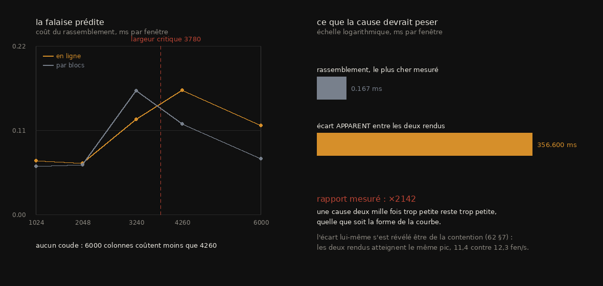

# R5 — La méthode et l'hygiène : comment ce dépôt se trompe, et ce qui l'attrape

> Rapport de campagne, écrit le **2026-09-11** d'une seule lecture des documents `archive/56`,
> `57`, `61`, `62`, `80`, `87`–`89` et de `archive/75` §D2–D4 et §E (8 documents et quatre
> sections, 2026-08-25 → 2026-09-08).
> Convention : `archive/NN §k` cite la preuve ; ce rapport est la lecture. Un fait porte un statut
> (`établi` · `borné` · `réfuté` · `rétracté` · `ouvert`) et son producteur (`src/depot/…` sauf
> mention ; JSON de même nom dans `docs/mesures/`).
>
> ⚠ Périmètre. Les cinq autres campagnes mesurent le rouleau ; celle-ci mesure **l'appareil qui
> mesure**. Son objet est l'instrument, le dépôt, la batterie et le chiffre publié — et elle a
> trouvé, dans les gardes écrites pour attraper les fautes de ce dépôt, **exactement les fautes
> qu'elles étaient censées attraper**. `62` y entre bien qu'il parle d'un rendu d'encre : sa
> conclusion porte sur la manière de publier un débit, pas sur l'encre.

## 0. Fiche

| | |
|---|---|
| question | Un dépôt qui publie des chiffres doit pouvoir répondre à quatre questions sur lui-même : **une batterie verte prouve-t-elle quelque chose** ; **un chiffre publié a-t-il un producteur** ; **un script écrit sert-il encore** ; **et le rangement lui-même vaut-il son prix**. Aucune n'avait de réponse mesurée avant le 25 août. |
| objets | le dépôt lui-même : 356 modules, 105 puis 160 batteries, 486 artefacts de `docs/mesures/`, 203 Gio sur disque dont 177 dans `data/` |
| ce qui a été construit | `poids_recuperable.py`, `contenu_en_double.py`, `sous_fenetre.py`, `empreinte_surface.py`, `donnees_sans_appelant.py`, `lplv` + `lplv.FAMILLES`, `appelants.py`, `fraicheur_des_figures.py`, `deplacer.py`, `permalien.py`, `taches_ouvertes.py`, `chiffres_sans_record.py`, `batteries_incapables_dechouer.py`, `le_chemin_du_nombre_publie.py`, `le_corpus_des_spires.py`, `la_forme_du_depot.py`, `enchainer.py`, `artefacts_orphelins.py`, `fiches_a_jour.py`, `modele_de_proprete.py`, `cout_de_la_fenetre.py`, `ab_segments.py`, `allure_du_rendu.py` |
| ce qui a été payé | **39 batteries sur 105** qui ne pouvaient pas échouer, dont une dans le module qui diagnostique les batteries ; **67 sur 160** qui n'atteignent pas le nombre qu'elles publient, dont une qui a laissé passer un patch appliqué à moitié ; une garde qui déclarait « 0 orphelin » sur une tige de quatre caractères ; une purge qui a effacé 197 fichiers sur 197 et dont le mécanisme n'a jamais été reproduit ; 4 h 32 de rendu perdues sur un script édité pendant qu'il tournait ; un `pkill -f` qui a tué le shell qui attendait |
| réponse au 11 septembre | **Une batterie verte ne prouvait rien dans un tiers des cas.** Deux balayages indépendants le mesurent : 39 sur 105 sortaient vertes par construction (`61`), et 67 sur 160 ne traversaient jamais le chemin qui produit le nombre publié (`80`). Aucune ne cachait un échec réel — mais une vérification qui ne peut pas échouer occupe la place d'une vraie. **Un chiffre publié n'avait pas toujours de producteur** : 53 dans 19 documents (`57`), et cinq d'entre eux vérifiés absents de l'arbre entier. **La provenance était devinée, pas observée** : 46 % du verdict « 0 orphelin » tenait sur douze caractères ou moins, minimum quatre (`87`), remplacé par une échelle à trois barreaux où ce qui est observé est compté à part (`89`). Et **le rangement n'était pas la panne** : la duplication réelle vaut 0,8 % du code, la cohésion des dossiers est déjà au-dessus du hasard, et re-partitionner coûterait 353 déplacements pour rien (`87`) |

## 1. Les faits — `REGISTRE_faits.tsv`

**20 faits** portent cette campagne, un par ligne dans
`REGISTRE_faits.tsv` (`R5-F01` et suivants) : l'énoncé, sa valeur, son statut, la
source qui le prouve et le producteur qui le recalcule. Le §2 les cite par leur
identifiant.

## 2. La campagne en six mouvements

```
 M1 le ménage, mesuré avant d'être écrit   56                  25–26 août
 M2 les tâches laissées, et le chiffre     57                  25–28 août
 M3 la batterie qui ne peut pas échouer    61 · 62 §5          27–28 août
 M4 la réfutation par ordre de grandeur    62                  27–28 août
 M5 le chemin du nombre publié             80 · 75 D2–D4       5 septembre
 M6 la forme, et la provenance observée    87 88 89            8 septembre
```

**M1 — Le ménage, mesuré avant d'être écrit.** `56` est un plan, et sa première tâche est de
mesurer l'impression qui l'a déclenché : *« sept dossiers blindés de scripts, une montagne de
doublons »*. Trois points sur quatre sont vrais, et le plus gros est faux. Les sept dossiers sont
**deux dossiers et cinq environnements** ; les « 16,6 Go » de venvs n'existent pas, parce que `uv`
installe en liens durs et qu'un fichier de venv est *un nom de plus sur des octets déjà là*
(`R5-F17`) ; et les « 25 sites d'appel » d'un environnement séparé n'étaient pas des besoins mais
des **emprunts** à un environnement strictement plus pauvre — c'est ce trou qui a fait conclure à
tort qu'une graine n'était pas couverte par la prédiction (R3, `41` §6bis). La vraie montagne est
ailleurs : **97 Go de rendus**, et un recalcul mesuré plutôt que supposé (la même surface rendue
deux fois, bit pour bit, parce que le cache était indexé par destination). Le hachage en trois
étages trouve 35,58 Gio de contenu identique, et la découverte vaut plus que le disque : **58,6 %
sont des fenêtres imbriquées**, donc rendre la plus large produit déjà les trois autres (`R5-F18`).
Le chantier `data/` est **clos par la mesure contre son propre plan** — `data/` est entièrement
gitignoré, 11 dossiers sur 81 nomment un rouleau, et forcer 70 dossiers d'expérience sous un nom
de rouleau ne les rangerait pas, ça les *mentirait*. Ce que la mesure désigne à la place est
« qu'est-ce que je peux effacer » : 50,6 Gio que plus aucun script ni document ne nomme, **nommés
et jamais effacés**. Le chantier `lplv` est le plus rentable pour le moins de code neuf : 123
modules dont 122 ont un `main()` sont 123 greffons sans registre, et `lplv <verbe> --help`
**exécute** le module plutôt que de refabriquer son aide — il n'y a donc rien à tenir à jour.


*`archive/56` §A · `src/figures/figure_doublons.py`, depuis `contenu_en_double.json`. Les 20,85 Gio de fenêtres imbriquées ne sont pas du disque à récupérer, c'est du temps de rendu déjà payé.*


*`archive/56` §A · `src/figures/figure_sous_fenetre.py`. Le décalage est `N_large // 2 − N_étroite // 2` et non `(N_large − N_étroite) / 2` : le réfuteur a redérivé la formule et est tombé sur la formulation naïve de sa propre consigne.*

**M2 — Les tâches laissées, et le chiffre sans record.** `57` répond à une question de l'auteur —
*des choses ont-elles été laissées de côté sans que personne ne le remarque ?* — et l'inventaire
devient **mécanique** : les marqueurs sont dérivés des documents, le registre porte le verdict, et
les deux se vérifient dans les deux sens. Réponse : rien n'a été sauté, mais plusieurs marqueurs
**mentaient**. Trois questions se ferment par la mesure : « 18 voxels ou rayon physique » (les
deux artefacts sont sur la grille 7,91 µm, prouvé par reconstruction identique — et ma première
mesure cherchait le corpus au mauvais endroit, *la panne la plus banale de ce dépôt, et elle ne se
voit pas : les nombres sortent, ils sont justes, ils parlent d'autre chose*) ; « 36 contre 72 »
(un budget nominal contre un compte réalisé, compatibles par la même arithmétique) ; et le régime
où une nappe gagne de l'aire en restant convergée (budget 100 : ×3 d'aire, zéro croisement, α
+0,000 — un fait qui appartient à R3). Deux lectures sont **corrigées** : « la correction dégrade
α » est faux, les deux valeurs sont sous la résolution de l'instrument. Et le document trouve la
limite de la garde des chiffres : `verifier_chiffres.py` vérifie qu'un chiffre recalculé apparaît
dans un document, **jamais la réciproque**. La moitié mécanisable est écrite le 28 août, cadrée
par une mesure préalable parce qu'*une garde qui désigne tout ne désigne rien* : 51 puis 53
chiffres orphelins dans 19 documents, chacun avec sa ligne (`R5-F08`). Trois pièges y sont traités
plutôt que subis — les blocs de code effacés avant la recherche (cinq faux positifs), les
identifiants écartés sur leur contexte et non sur leurs chiffres, et l'**adossement circulaire**
d'un registre dérivé des documents, qui adosserait un chiffre à sa propre copie.

**M3 — La batterie qui ne peut pas échouer.** `61` est le document le plus court de la campagne et
le plus dur, et son en-tête dit pourquoi : *« le défaut que ce dépôt traque partout vivait dans
l'instrument qui sert à le traquer »*. Une ligne — le compte d'échecs imprimé puis jeté — rendait une batterie verte quoi que
disent ses contrôles, et le critère du lanceur est exactement celui que cette ligne satisfait par
construction. Trouvé **par accident**, en sondant autre chose, parce que la sonde a rendu la
phrase `ALL PASS (2 failures, 28 checks)`, qui se contredit elle-même. Le balayage par arbre
syntaxique en trouve 39 sur 105 (`R5-F01`), et aucune ne cachait un échec réel — *mais une
vérification qui ne peut pas échouer occupe la place d'une vraie, et rend un compte de contrôles
qui rassure*. La première règle était trop faible et **ratait son propre cas** (`R5-F02`). Le
lendemain, le cas symétrique : une batterie verte comptée échec parce qu'elle imprime un verdict
que le lanceur ne sait pas lire, et 132 fichiers sur 135 emploient la formule attendue, donc la
divergence était invisible à la relecture. ⚠ Et la garde écrite pour ça en était une à son tour :
sa première version cherchait la chaîne dans le **texte** du fichier, donc elle était satisfaite
par le commentaire qui explique la règle — *une garde contre les vérifications incapables
d'échouer qui en était une*.

**M4 — La réfutation par ordre de grandeur.** `62` est l'élimination la plus propre de la
campagne, et son enseignement est de méthode. Deux rendus du même rouleau coûtent ×4,6 l'un de
l'autre ; l'hypothèse construite est une falaise de cache L3, et elle méritait de l'être — la
largeur critique tombe **exactement entre les deux segments observés**, et elle vient avec un
remède tout fait. La mesure l'ignore deux fois : aucun coude à la largeur prédite, et surtout un
rassemblement qui coûte **deux mille fois trop peu** pour expliquer quoi que ce soit (`R5-F19`).
⚠ Le second constat est le solide, et c'est la leçon : *une réfutation qui tient à la forme d'une
courbe se rouvre au premier point bruité ; une réfutation par ordre de grandeur ne se rouvre pas*.
Le remède meurt avec sa cause et **reste dans la mesure** comme preuve qu'il n'y avait rien à
remédier. Puis, le lendemain, la question elle-même se dissout : il n'y avait pas d'écart. Le même
crop du même segment rend ×4,4 plus vite que son run complet ; l'allure **instantanée** montre que
les deux rendus atteignent le même pic et que l'un a passé son run contendu, variant d'un facteur
43 sur lui-même ; et sur machine libre le même travail va ×2,5 plus vite pour une carte identique
au bit (`R5-F20`). *Le « segment lent » et le « segment rapide » sont le même moteur sur deux
machines différentes, et c'est moi qui faisais la différence.* Ce qui survit intact est la
réfutation elle-même, qui reste vraie qu'il y ait un écart à expliquer ou non.



*`archive/62` §3 · `src/figures/figure_hypothese_refutee.py`, depuis `cout_de_la_fenetre.json`. Le panneau de gauche est celui qu'on espérait lire : une falaise à la largeur critique, marquée en rouge, et il n'y en a pas. Celui de droite est celui qui tranche, en échelle logarithmique — la cause candidate et l'effet à expliquer n'ont pas le même ordre de grandeur.*

**M5 — Le chemin du nombre publié.** `80` franchit la limite que `61` avait écrite : *ce contrôle
dit qu'une batterie peut échouer, jamais qu'elle teste quelque chose d'utile*. Le déclencheur est
un patch appliqué à moitié, qui a laissé un enregistrement référencer trois variables
inexistantes — **et la batterie est restée verte**, parce qu'elle testait ses briques une par une
et jamais leur assemblage. Le balayage ferme le graphe d'appels de chaque module et rend la
différence : 67 sur 160 (`R5-F04`). ⚠ La portée a été **resserrée en cours de route** et le premier
chiffre était trop large — un pur lecteur de mesure n'a pas de nombre publié, donc le signe retenu
est l'**écriture** sous ses deux formes, sérialiser un fichier ou enregistrer une image. Et un
chiffre a été **retiré après avoir été calculé** : « les modules dont la tête de chemin est
dehors », 67 sur 67, est une identité et non un constat. Le remède fait passer la matière par
paramètre (`R5-F06`) et promeut le lecteur **dès le deuxième appelant** : cinq modules de `nappe/`
avaient chacun leur copie, et *deux dérouleurs comparés sur deux lectures différentes mesurent
d'abord leur désaccord de lecture*. ⚠⚠ La matière fabriquée est **deux vues d'un même objet, pas
deux objets** — la géométrie est dite une fois, l'intensité en est dérivée, et le contrôle qui les
lie est que le gabarit lu autour d'une spire ait sa crête sur zéro. ⚠⚠⚠ Et la fixture doit être
**ondulée** : des spires parfaitement décalées du pas sont atteintes exactement par un pas normal,
donc toutes les erreurs vaudraient zéro et chaque comparaison serait satisfaite par des zéros.
Vingt-deux sondes remettent chacune un défaut ; deux de mes contrôles ne pouvaient pas échouer et
ce sont elles qui l'ont dit. Et en cherchant où inscrire la batterie corrigée : **44 batteries que
le harnais ne lançait pas** (`R5-F07`), lancées une par une avant d'être inscrites, parce que les
inscrire sans les lancer aurait fait rougir le harnais entier sur un défaut qu'on n'aurait pas
nommé.


*`archive/80` §2 · `src/figures/figure_le_chemin_du_nombre_publie.py`. La branche laissée dehors porte toujours le même nom : `mesurer` et `dessiner`, les deux verbes qui publient.*

**M6 — La forme, et la provenance observée.** `87` répond à une plainte de l'auteur — *« plein de
scripts dans tous les sens, des duplicata, des trucs abandonnés qu'on refait sans le savoir, aucun
test »* — et corrige d'abord son quatrième point, qui est faux (`R5-F15`). Le corriger **change
les priorités** : les tests ne sont pas la panne. La vraie panne est qu'*on ne peut pas retrouver
ce qu'on a déjà mesuré* — 46 % du verdict « 0 orphelin » tient sur une tige de douze caractères ou
moins (`R5-F10`), et c'est la cause mécanique de « on refait des trucs existants » : un chiffre
existe, personne ne peut retrouver son producteur, donc quelqu'un le remesure. Puis vient l'idée
de l'auteur, reformulée en la version qui marche : non pas la fréquence des mots mais la
**co-occurrence** du vocabulaire de domaine, lue par l'arbre syntaxique — *les dossiers
correspondent-ils au domaine, ou le coupent-ils en travers ?* Réponse mesurée : ils correspondent
déjà (×1,89 global), `tracecheck` est **sous le hasard** (cinq choses qui partagent un nom), et la
conclusion **annule un refactor** (`R5-F14`). ⚠ Et le module qui diagnostique les fautes en portait
une : un compte de batteries à zéro, laissé passer par un contrôle qui n'assertait que « c'est un
entier ». `88` remplace la déclaration par l'**observation** — une chaîne qui tourne inventorie
avant et après chaque étage, donc aucun motif à tenir à jour et les 105 ambiguïtés disparaissent
(`R5-F12`). ⚠⚠ Sa propre sonde a montré qu'un de ses contrôles ne testait pas ce qu'il prétendait :
« valider en amont plutôt qu'au fil de l'eau » passait les trente contrôles, parce que je
vérifiais que l'exception nomme le bon verbe et jamais que **rien n'avait tourné**. `89` en tire
l'échelle à trois barreaux (`R5-F13`), et son invariant est celui des skills : *un barreau a le
droit de baisser la prétention du résultat, jamais la barre, et jamais en silence*. ⚠ La dette ne
fait délibérément pas échouer la garde — la rendre rouge sur 61 % du corpus la ferait désapprendre
— et elle ne peut que rétrécir, chaque chaîne écrite déplaçant des artefacts du barreau 2 vers le
1. Trois défauts y sont attrapés dès le premier parcours, tous les miens, dont **une exemption
morte** : un fichier exempté d'un parcours qui ne le traversait pas, donc une décision qui ne
protégeait rien et que personne ne pouvait voir.


*`archive/56` §C · `src/figures/figure_verbes.py`, depuis `verbes.json`. Rien n'est déclaré à la main : la famille vient du chemin, `--verifier` et `--json` sont lus dans le fichier, et le résumé est la première ligne de docstring — c'est-à-dire exactement ce que le module donne à son `argparse`.*

## 3. Chronologie, document par document

| doc | date | question | ce qui est établi | ce qui est rétracté ou borné |
|---|---|---|---|---|
| `56` | 25–26 août (+5 sept.) | le ménage vaut-il son prix ? | 2 dossiers + 5 venvs ; 4,24 Gio réels ; duplication 0,8 % en 4 variantes ; 97 Go de rendus ; recalcul mesuré bit pour bit ; 35,58 Gio identiques dont 58,6 % de fenêtres imbriquées ; `lplv` 218 verbes, release 204 ; `docs/` 522 → 58 ; `appelants.py` 160 s → 2,9 s ; 50,6 Gio sans appelant ; `permalien.py` | « 16,6 Go » (liens durs) ; « 25 besoins » (emprunts) ; le chantier `data/` **clos par la mesure contre son plan** ; « téléchargé en double » (17,4 Go surcomptés) ; la purge de `.lances` a effacé 197 → 4, mécanisme non reproduit ; `telecharger.py` déclaré orphelin à tort (bibliothèque) |
| `57` | 25–28 août | qu'a-t-on laissé de côté ? | inventaire mécanique dans les deux sens ; 18 vox = 142,4 µm prouvé par reconstruction ; 36 → 72 par la même arithmétique ; budget 100 = ×3 d'aire convergée ; `chiffres_sans_record.py` : 53 orphelins dans 19 documents | « la correction dégrade α » (sous la résolution) ; le rouleau de M1ter est `1447` pas `0172` ; la collision `+0,9984` assertée ; 5 chiffres à rejouer, jamais à fabriquer |
| `61` | 27–28 août | une batterie verte prouve-t-elle quelque chose ? | 39/105 incapables d'échouer ; la règle est la sortie qui **suit le verdict** ; le cas symétrique (verdict illisible par le lanceur) ; fonctions imbriquées exclues | la première règle ratait son propre cas ; la première garde du cas symétrique était satisfaite par son propre commentaire ; les batteries shell ne sont pas jugées |
| `62` | 27–28 août | pourquoi un segment coûte-t-il ×4,6 ? | réfutation par ordre de grandeur (×2142) ; la classe entière fermée (rassembler / modèle / disperser) ; A/B sur le même crop ; allure instantanée ×42,9 ; machine libre ×2,5, carte identique au bit | « la contention est écartée par mesure » (1586 % sur 2200) ; le « facteur 4,6 » lui-même ; Mio/Mo gardé dans le fichier ; piège `35m04` contre `2h54` (×60) |
| `80` | 5 septembre | une batterie atteint-elle le nombre qu'elle publie ? | 67/160, 102 fonctions ; matière injectable, nombres inchangés ; lecteur unique promu au 2ᵉ appelant ; 3 ronds-trips ; 22 sondes ; 44 batteries non lancées | portée resserrée (mentionner → écrire) ; « 67/67 têtes dehors » retiré (identité) ; atteinte ≠ testée ; appels par nom seulement, donc dette **surestimée** |
| `87` | 8 septembre | quelle est la forme du dépôt ? | 267/356 avec batterie ; 356 modules, 393 arêtes, 117 isolés ; 486 artefacts dont 46 % sur ≤ 12 caractères ; cohésion ×1,89, `tracecheck` ×0,61 ; **ne pas re-partitionner** | « aucun test » ; 2 mesures jetées avant publication (348 puis 240 artefacts) ; mon compte de batteries à zéro passé par un contrôle « c'est un entier » |
| `88` | 8 septembre | peut-on composer les greffons ? | `lplv enchainer` 6/6 en 2,71 s ; provenance **observée** ; chaîne validée avant le 1ᵉʳ étage ; créé ≠ modifié ; le lanceur est lui-même un greffon | `data/` hors observation (98 275 fichiers) ; run à sec « 6 muets » = faux signal ; ma sonde passait 30 contrôles sans tester ce qu'elle prétendait |
| `89` | 8 septembre | que valait « 0 orphelin » ? | l'échelle : 3 observés, 1111 devinés, 0 orphelin ; 675 sur ≤ 12 caractères ; `verifier_la_mecanique()` avant 430 s | 3 défauts miens dont une **exemption morte** ; la dette ne fait pas échouer, délibérément ; 3 parcours concurrents (I/O) tués par PID |
| `75` D2 | 5 septembre | P1 bis tient-il ? | ×15,93 reproduit ; cellules ∝ aire à 1,6 % sur 24 tirages ; P1 bis **tient** (×15,9 exigé, ×4,0 observé) | le « ×15,9 » n'avait pas de producteur ; le rapport « budget » était dans l'arbre (cherché un **nom** au lieu d'un concept) ; 12 tirages à 56 644 cellules exactement = plafond ; réserve (b) n = 12 |
| `75` D3 | 4–5 septembre | 41 scripts sans appelant | 41 → 33 → 24 ; *un script cité sans commande est une mesure non reproductible* ; 4 « morts » lus, aucun ne l'est ; `juger_nappe` adopté, équivalence prouvée statiquement ; sourcing détecté ; 81 fiches, 0 document sans fiche | `spire_suivante` n'avait pas la garde `REPLIEE` ; `figure_profondeur` ne se régénérait plus ; 3ᵉ point aveugle du registre (une ligne vide rendait 7 fiches invisibles) |
| `75` D4 | 5 septembre | → `80` | voir `80` | idem |
| `75` E | — | hors registre | la soumission (décision de l'auteur) ; le second papier (occasion de publication) ; H3/H6 de `69` (répondues) | — |

## 4. Le tableau des statuts

| statut | faits |
|---|---|
| **établi** | `R5-F01` à `R5-F20` ; le cache par contenu et ses trois exclusions délibérées (mtime, chemin absolu, ordre du système de fichiers — `56` A) ; les trois replis bruyants du raccourci, qui le rendent incapable d'empirer les choses (`56` A) ; `docs/` a quatre natures et une nature est un **usage** (mesures citées 77 fois, journaux zéro — `56` D) ; le registre bat son extension (`murs_et_causes.tsv` — `56` D) ; `permalien.py` : un permalien ne vaut que si son commit est sur le distant **et** que le chemin existe à ce commit (`56`) ; l'inventaire des tâches se vérifie dans les deux sens (`57`) ; P1 bis (`75` D2) ; un script cité sans commande est une mesure non reproductible (`75` D3) ; sourcer une bibliothèque shell, c'est l'exécuter (`75` D3) |
| **borné** | la limite de `chiffres_sans_record` : un adossé n'est qu'un **candidat**, seul un orphelin est un vrai orphelin (`57` §3) ; la dette de provenance : 1111 devinés dont 675 sur ≤ 12 caractères, mesurée et non résolue (`89`) ; la dette du chemin publié : 67 modules, surestimée parce que le graphe ne suit que les appels par nom (`80` §5) ; P1 bis : l'hypothèse (a) est levée, la réserve (b) sur n = 12 reste entière (`75` D2) ; le doublonnage de `data/` : 35,58 Gio mesurés, **rien n'est supprimé** (`56` A) |
| **réfuté** | « aucun test n'est réellement fait » (`87` §1) ; la falaise de cache L3 comme cause de l'écart de rendu (`62` §3) ; « la contention est écartée par mesure » (`62` §1 → §7) ; re-partitionner les dossiers par domaine (`87` §4) ; le préfixe plus étroit comme remède à la troncature (`87` §3, `89` §1) ; « ranger `data/` par rouleau clarifie le dépôt » (`56` B) ; « les cinq environnements pèsent 16,6 Go » (`56` §1.1) ; graine + un fil comme remède au non-déterminisme de `windcheck` (`75` D1, → R2) |
| **rétracté** | « 16,6 Go de venvs » ; « 25 sites d'appel » lus comme des besoins ; le « facteur 4,6 » entre deux segments ; « la correction dégrade α » (`57` §2.1) ; « `telecharger.py` est un orphelin » ; « la mesure de `16` est à jour » (l'entrée était périmée, la régénération avait eu lieu la veille) ; deux mesures de `87` jetées avant publication (348 puis 240 artefacts nommés nulle part) ; « le rapport *budget* n'est ni dans `docs/`, ni dans `src/`, ni dans `store/` » (`75` D2) |
| **ouvert** | voir §8 |

## 5. Les contradictions — `REGISTRE_contradictions.tsv`

**42 disputes** tranchées pendant cette campagne,
une par ligne (`R5-C01` et suivants) : *A a dit · B a dit · C tranche · statut*.

## 6. Les lois — `REGISTRE_lois.tsv`

**20 mécanismes** que cette campagne a payés
(`R5-L01` et suivants), rendus en prose groupée dans `FILS_ROUGES.md`.

## 7. Ce que la campagne dit des prix

1. **Progress Prizes — R5 est le socle de crédibilité de tout le reste.** Le concours nomme
   *conservative failure detection* et les métriques d'évaluation parmi ses problèmes ouverts ; ce
   que cette campagne apporte est le cran au-dessus : **comment savoir qu'une mesure dit quelque
   chose**. Trois instruments sont directement soumissibles et n'ont pas d'équivalent public :
   `batteries_incapables_dechouer.py` (une propriété syntaxique, donc lisible sans exécuter),
   `le_chemin_du_nombre_publie.py` (le graphe d'appels contre la batterie), et l'échelle de
   provenance à trois barreaux (`89`). Plus deux résultats négatifs complets avec leur puissance :
   la falaise de cache (`62`) et le re-partitionnement des dossiers (`87`).
2. **Grand Prize — l'hygiène est ce qui rend le graal défendable.** Le livrable est une image
   Docker qu'un jury lance : *un producteur qui ne tourne plus ressemble à une population vide*
   (R2), *une batterie verte peut ne rien tester* (`61`, `80`), et *un chiffre sans producteur est
   une anecdote* (`57`). La campagne de déroulage (R4) tourne sur des modules dont **44 batteries
   n'étaient pas lancées** jusqu'au 5 septembre ; c'est là que R5 a payé directement le graal.
3. **First Letters et le titre** : rien de direct. R5 ne mesure aucun rouleau.
4. **Et un fait qui vaut pour tous les prix** : `permalien.py` mesure que ce dépôt est **privé**,
   donc qu'un lien GitHub rend 404 pour un lecteur extérieur. Dans un texte de soumission, un lien
   cassé est pire qu'un chemin mort — un chemin dit honnêtement « ce fichier était là ». La forme
   `git show <commit>:<chemin>` est la parade, et elle est garantie par un contrôle.

## 8. Les portes ouvertes — `REGISTRE_portes.tsv`

**10 portes** que cette campagne laisse
(`R5-P01` et suivants), classées par prix dans `PORTES_OUVERTES.md`.

## 9. Sources pour un article

- **Une vérification incapable d'échouer, mesurée sur un dépôt entier** : `61` (39/105, la règle
  syntaxique, le cas symétrique) et `80` (67/160, le graphe d'appels, les 22 sondes). C'est un
  résultat méthodologique transportable hors du domaine, et il a été trouvé *par accident* puis
  systématisé. Antériorité : aucune connue dans ce corpus.
- **La provenance observée plutôt que déclarée** : `87` §3 (la troncature), `88` (la chaîne qui
  observe), `89` (l'échelle à trois barreaux). Le fait qui porte : déclarer coûterait 314 motifs
  écrits à la main, et 105 artefacts sont nommés par deux modules dont l'un lit et l'autre écrit.
- **Une réfutation par ordre de grandeur, et une question qui se dissout** : `62` — l'hypothèse
  élégante dont la frontière tombait entre les deux cas observés, la mesure qui l'ignore de ×2142,
  puis la découverte qu'il n'y avait pas d'écart. Avec la règle qui en sort : un débit ne se publie
  pas depuis un cumul.
- **Le ménage mesuré avant d'être écrit** : `56` — les liens durs qui font disparaître 12 Go
  imaginaires, la duplication réelle à 0,8 %, les 58,6 % de fenêtres imbriquées, et un chantier
  **clos par sa propre mesure** contre son plan. Antériorité : le skill `concevoir-avant-coder`
  (besoin avant solution, YAGNI sur ses deux axes, l'échelle de décision).
- **La forme d'un dépôt, mesurée par co-occurrence de vocabulaire** : `87` §4 — la mesure qui
  annule un refactor, et `tracecheck` sous le hasard.
- Tout chiffre de ce rapport se recalcule par le producteur nommé ; `src/depot/verifier_chiffres.py`
  lit `docs/rapports/`.
