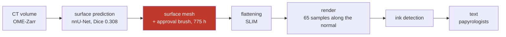

# R6 — La littérature et l'antériorité : ce qui était déjà publié, et par qui

> Rapport de campagne, écrit le **2026-09-11** d'une seule lecture de `archive/00`, `27`, `32`,
> `66`–`71`, `73`–`74`, et des pages *prizes*, *winners* et *2026 open problems* téléchargées le
> jour même (`PRIX.md`). Convention : `archive/NN §k` cite la preuve. Ce rapport est aussi la
> **matrice** de `REGISTRE_anteriorite.tsv` : chaque résultat du dépôt en face de ce que le domaine
> avait publié.

## 0. Fiche

| | |
|---|---|
| question | qu'est-ce qui était déjà publié — dans les trois papiers primaires, les 35 à 44 dépôts clonés, les pages du prix — et que le dépôt a redécouvert, contredit, ou laissé de côté ? |
| période | 17 août (état de l'art) → 3 septembre (audits, relecture adverse), puis 11 septembre (pages fraîches) |
| instruments | deux workflows d'audit adversarial (`66` : 15 agents, 14 résultats, 4,5 M jetons ; `67` : 9 agents, 98 outils, 2,9 M jetons) ; `verifier_citations.py` (140/140) ; `deja_dit.py` (164 paires au premier passage) ; `les_indices_de_spire.py` ; `nombre_de_fresnel.py` ; `la_case_vide.py` |
| ce que la campagne a coûté | trois papiers lus deux fois (résumé puis intégral ; « pour se situer » puis « pour refaire »), 46 pages du papier de référence, un commit épinglé récupéré, ~1 semaine de travail net perdue en outils qui existaient (`67` §7) |
| réponse au 11 septembre | **le domaine publie les mécanismes et les questions ; ce qui résiste est la mesure, sa répétition et son incertitude** (`71`). Sur 17 résultats de tête audités : 6 déjà connus, 11 partiels, 0 intact, 0 sans valeur. Sur 98 outils : 22 existaient, 50 en partie, 27 sans équivalent. Et le référent d'identité que le graal exige était **dans les noms de fichiers**, lu par personne (`73` §4, `74` §3) |

## 1. Les faits — `REGISTRE_faits.tsv`

**20 faits** portent cette campagne, un par ligne dans
`REGISTRE_faits.tsv` (`R6-F01` et suivants) : l'énoncé, sa valeur, son statut, la
source qui le prouve et le producteur qui le recalcule. Le §2 les cite par leur
identifiant.

## 2. La campagne en six mouvements

*La chaîne telle que `archive/00` §1 et `68` §2 la reconstituent : dix-sept étapes, quatre humaines,
une seule porte les 775 heures.*

**M1 — L'état de l'art (17–19 août, `00`).** Miroir complet du site (81 pages), 33 puis 44 dépôts
clonés, six vérificateurs recensés, la conclusion « un septième serait un doublon ». Recadré deux
jours plus tard par la lecture intégrale des trois papiers : le fait le plus important du champ
(`1667` lu, 775 h) n'y était pas.

**M2 — Lire en entier (19 août, `27`, `32`).** Trois papiers primaires puis le fondateur, lus
corps, tables et annexes. Ce que le résumé cachait : la cible de 1 µm, le WJF de 3,20 %, la phrase
*bounded geometric sense*, l'absence de tout taux d'erreur de traçage, le trou de 4,8 mm au cœur
de Scroll 1, le témoin négatif jeté par le pipeline d'EduceLab.

**M3 — Les audits adversariaux (29 août, `66`, `67`).** Quinze agents pour réfuter la nouveauté de
quatorze résultats, neuf pour 98 outils. Verdict : le domaine était déjà là, sur le disque ; la
faute est de vocabulaire et de grounding. Et la « conclusion » de l'audit était la thèse de
l'article depuis longtemps.

**M4 — Relire pour refaire (2 septembre, `68`).** Le même papier, lu avec l'autre question. Le
pinceau et son interface, le nombre de Fresnel, les 103 cases vides, la fenêtre plus petite qu'une
lettre. Quatre résultats, aucun visible à la première lecture.

**M5 — Le chercheur extérieur et sa révision (3 septembre, `69`, `73`, `74`).** Un prompt
« chercheur senior » rend sept hypothèses, cinq théorèmes empruntés (InSAR, sismique, OCT), sept
algorithmes ; une seconde passe les confronte au dépôt et trouve que le référent d'identité est
dans les noms ; l'audit de la seconde passe corrige son compte (57 → 101), son mécanisme et son
rouleau (`0800` → `0139`). **C'est ce mouvement qui ouvre la campagne R4.**

**M6 — L'article contre le corpus (3 septembre, `70`, `71`), puis les pages fraîches (11
septembre, `PRIX.md`).** Ce que l'article condense et ce qu'il laisse dehors ; les trois résultats
de tête audités ; et le 11 septembre, la règle de la fenêtre réécrite, First Letters passé à 23
rouleaux, et un lauréat de 20 000 $ (W. Stevens, déroulage par patches) que le dépôt n'avait
jamais cité.

## 3. Chronologie, document par document

**`00` · 2026-08-17 (→ 08-29) · l'état de l'art** — Point d'entrée sourcé (miroir 81/81, dépôts
clonés). Deux familles de mailleurs ; six vérificateurs ; personne ne ferme la boucle. Données : 45
échantillons, 310 segments, 33 sans surface ; la résolution sépare tracé de vierge (corrélation) ;
pyramide à six niveaux. §7 : `windcheck` reproduit (364 tests, 53/53 verdicts), excision 0,16 %
médiane, cellules excisées indiscernables du témoin (p = 0,859). §9 (08-18) : la métrique mesure un
défaut de la trace, pas du résultat (ρ +0,019, n = 89) ; profondeur de surface ×18 000 moins chère ;
fibres réfutées ; `PHerc0358` tracé et condamné avant rendu ; correction appliquée 58 → 8 µm. §10
(08-29) : les audits ; les 13 rouleaux du prix : 21 segments, 0 carte d'encre. **Rétracté** : « le
spiral fitting est immunisé au sheet switching par construction » (§2, 08-19).

**`27` · 2026-08-19 · trois papiers lus en entier** — [P1] topographie : 1 µm, effondrement à
3,40 µm, 0,691 held-out ; [P2] Henderson : difféomorphisme, sept pertes L1, WJF 3,20 %, tension
WJF/MRWD (2,77 % ↔ 25,67), un bit d'humain, 19 h sur RTX 3090, code publié avec trois réserves en
commentaire (espace spirale, densité, la vérité terrain saute à s1350) ; [P3] `1667` : 8 cm × 2 cm,
réduit de 4,9 cm/14 g à 2 cm/6 g, *bounded geometric sense*, titre perdu, ~20 objets scannés pour 3
résultats, scan BM18 2,4 µm/0,22 m/78 keV, encre directement visible sur Paris 4. **Rétracté** : la
première version écrite depuis les résumés (« 4 µm », une paraphrase entre guillemets).

**`32` · 2026-08-19 · EduceLab-Scrolls** — La vérifiabilité est une propriété du **corpus**
(fragments à vérité IR) ; six pratiques à reprendre (rapport ×8 plutôt que seuil, F0.5, sens de
l'erreur choisi, µ et σ sur la seconde moitié, notation contre soi, juge apparié) ; ce qui n'est pas
mesuré : l'alignement IR↔CT (Puppet Warp, dilatation r = 16 ≈ 52 µm à l'entraînement seulement),
« consistent with » laissé à l'œil (→ `45`), le témoin négatif jeté (→ `46`), le critère « readable »
sourcé à *60 Minutes*. Scroll 1 : 7,91 µm, Diamond I12 2019, **trou de 4,8 mm au cœur**.

**`66` · 2026-08-29 · audit d'antériorité** — 6 / 8 / 0 sur 14. Le fold de validation du modèle du
Grand Prize est indécidable depuis nos métadonnées (`20231210121321` dans le script publié contre
`20230702185753` dans le nom du checkpoint). L'énergie contredite. Angles morts : Discord, Kaggle,
`vesuvius-repro`, OverthINKingSegmenter, la littérature académique. §6 : l'audit a « conclu » la
thèse de l'article (*« This paper is about the judging step »*) ; les cinq dépôts à citer l'étaient
déjà → `deja_dit.py`.

**`67` · 2026-08-29 · audit des outils** — 22 / 50 / 27 sur 98 ; 23 verdicts de temps perdu. Le
plus cher : la campagne d'écart entre spires (`winding-ruler` publie les 14 rouleaux + 22). Plus
grave : `build_atlas_v2.py` contredit `pyramid.py` (le niveau 2 fusionne les feuilles, −10,3 %) et
notre outil tourne au niveau 2 ; `sensibilite_centre.py` né d'une prémisse fausse (l'ombilic est
publié sur `dl.ash2txt.org`) ; trois concurrents tiennent la même discipline méthodologique.
Correction contre soi : `selfgap.py` ne porte pas le test de convergence.

**`68` · 2026-09-02 · lire le papier en entier** — Le pinceau et son interface (§1) ; la méthode en
17 étapes (§2) ; un seul paramètre couplé, F (§3 : 59 scans ordonnés, décohérence à 1,2 m mesurée
sur `PHerc0268`) ; la case vide (§4 : 103) ; la fenêtre plus petite qu'une lettre (§5 : 66 px à
9,362 µm) ; « revealed » sans métrique (§6). Règle : un papier se lit deux fois. Corrigé le 09-05 :
scorer la case vide exige un recalage entre deux aplatissements (Dice 0,971, rapport d'aspect 3,2 %).

**`69` · 2026-09-03 · réponse d'un chercheur extérieur** — Sept hypothèses (spectre d'AUC,
débinage, décohérence D/E^α, régions ambiguës, résidus de phase, prior universel, verso témoin nul) ;
la physique corrigée (Paganin supprime les franges ; F = noyau en pixels ; bande perdue) ; les treize
ont 60–129 spires → 1 500 à 8 000 h de pinceau par rouleau ; le rouleau comme champ de phase à
vortex, résidus et coupures par flot à coût minimal ; K surfaces couplées ; FDR et repliement
d'époque ; emprunts référencés (InSAR, sismique, OCT, cryo-ET, franges, contraste de phase, encre CT,
statistique, papyrologie) ; plan de dix mois ; candidat `PHerc0826`. Doutes déclarés.

**`70` · 2026-09-03 · ce que l'article condense** — 70 documents lus par dix agents (23 389 lignes),
140 citations vérifiées (après qu'une garde en a sauté 44) ; 22 procédé / 21 dedans / 27 dehors ; le
croisement par chiffres ne marche pas. Le seul manque : 17 documents dans le périmètre (l'arc
excision, `33`, `34`, `54`, `42`, `41`, `55`…). Deux défauts vivants (niveau 2, ombilic). **Rétracté
le jour même** : écrire l'arc excision — rejoué, la proximité baisse de 22–50 % (→ `07` refondé, puis
confirmé par `75` D1).

**`71` · 2026-09-03 · trois résultats de tête audités** — Tirage : mécanisme dans le code,
« unseeded » → « by default », le vérificateur est déterministe donc une bascule prouve que la
surface a changé ; budget : la moitié propreté est publiée mot pour mot par `windcheck`
(*« a small trace is clean substantially because it is small »*), la moitié stabilité est libre ;
pavage : prémisse et discriminant antérieurs, le recensement de 105 paires survit. 17 audités : 6 /
11 / 0.

**`73` · 2026-09-03 · seconde passe** — H1 déjà répondue à moitié (`65`), H3 et H6 mortes comme
instruments (`16`, `33` : la queue sépare), H5 réhabilitée (`17` testait des auto-intersections), H7
plus urgente (`46`). Relecteur adverse : §6.7 confond présence et identité ; §3 « no threshold »
faux du placement ; §2.1 113 µm n'est pas centre à centre ; §5.7 sont des `auto_grown`. Plan : la
règle en trois semaines, trois prédicats dont l'identité manque, extraire toutes les spires. Livrable
4 : **les indices de spire dans les noms**. **Corrigé le 09-04** : le courriel de débinage
sur-affirmait (`69` §1.2 portait le contre-argument ; mesuré C3 : 1,01).

**`74` · 2026-09-03 · `73` audité** — Trois confirmations ; §2.3 juste pour une raison plus forte
(`43` : 113 µm dépend de `neighbor_step`, 116 → 102) ; réserve sur l'atlas (172,8 = 10 voxels
entiers, IQR 121–250) ; la découverte sous-comptée ×1,8 (101 segments, 3 rouleaux, 81 consécutives) ;
le plan déployait sans référent (`0800`, `1447` : zéro indice) et le bon rouleau était `PHerc0139`.
Erreur propre attrapée par une assertion qui a échoué.

**`PRIX.md` · 2026-09-11** — Diff 16 août → 11 septembre : la règle de la fenêtre devient une
exigence de démonstration ; First Letters 13 → 23 rouleaux ; lauréats : 64 500 $ sur 28 en deux
mois, dont Stevens 20 000 $ pour un déroulage par patches (`1667`, 365 cm²) — la question de R4,
non citée par le dépôt ; `windcheck`, TIFXYZ Doctor, TAUIL (résultat négatif), scroll-data-audit à
1 000 $ pièce. Appendice A des *Open Problems* : le *rollout drift* des traceurs neuraux, mesuré
indépendamment par R4.

## 4. L'antériorité — `REGISTRE_anteriorite.tsv`

**30 lignes** : un résultat du dépôt, ce que le domaine avait publié en face, et
le statut de la rencontre (`A01` et suivants).

## 5. Les contradictions — `REGISTRE_contradictions.tsv`

**20 disputes** tranchées pendant cette campagne,
une par ligne (`R6-C01` et suivants) : *A a dit · B a dit · C tranche · statut*.

## 6. Les lois — `REGISTRE_lois.tsv`

**9 mécanismes** que cette campagne a payés
(`R6-L01` et suivants), rendus en prose groupée dans `FILS_ROUGES.md`.

## 7. Ce que ça dit des prix

- **Grand Prize** : l'état de l'art est un pinceau à 25 h par spire ; les treize rouleaux éligibles
  ont 60–129 spires, un scan de repérage à F = 0,39, et zéro référent (`81`, R4). Ce que le domaine
  publie comme aide — les annotations de winding relatif (*Open Problems*), la détection
  conservatrice d'échec — est exactement ce que R4 construit ; ce qu'il a payé (Stevens, 20 000 $)
  est la même question, à lire d'abord.
- **First Letters** : la voie topographique exige ~1 µm (`27` §1) ; les modèles publiés ne séparent
  pas la feuille du vide à 9,362 µm (`75` C2, R1) ; la vérité terrain au régime du prix existe et la
  case est vide (`68` §4). La règle a changé le 11 septembre : démontrer la non-hallucination, ce
  que le harnais du dépôt fait (`PRIX.md` §0).
- **Progress Prizes** : le jury paie des résultats négatifs, des audits de données et de la QA à
  1 000 $ pièce (`PRIX.md` §4). Le dépôt en a une dizaine (`17`, `26`, `36`, `37`, `62`, `82`, `83`,
  `114`, les audits `66`–`67`, `ce_que_les_serveurs_publient`). La soumission est hors périmètre
  par décision de l'auteur (`75` §E) ; la matière, elle, est là.

## 8. Les portes ouvertes — `REGISTRE_portes.tsv`

**9 portes** que cette campagne laisse
(`R6-P01` et suivants), classées par prix dans `PORTES_OUVERTES.md`.

## 9. Sources pour un article

**Papiers primaires (lus intégralement le 2026-08-19, `27`)**
- [P1] G. Angelotti, F. Nicolardi, P. Henderson, W. B. Seales, *Ink Detection from Surface Topography
  of the Herculaneum Papyri*, arXiv:2603.27698 (mars 2026), Scientific Reports,
  doi 10.1038/s41598-026-58467-1.
- [P2] P. Henderson, *Virtually Unrolling the Herculaneum Papyri by Diffeomorphic Spiral Fitting*,
  arXiv:2512.04927 (déc. 2025), WACV 2026 ; code `github.com/pmh47/spiral-fitting` (prix 30 000 $).
- [P3] G. Angelotti *et al.* (27 auteurs, dont N. Friedman, W. B. Seales), *Complete virtual
  unwrapping and reading of a rolled Herculaneum papyrus*, arXiv:2606.29085 (27 juin 2026) ; commit
  épinglé `villa@e583fb67`.
- [P4] S. Parsons, C. S. Parker, C. Chapman, M. Hayashida, W. B. Seales, *EduceLab-Scrolls*,
  arXiv:2304.02084 (v3 lue ; v4 mai 2024).

**Pages officielles** (miroir `data/site/scrollprize.org/`, gitignoré ; téléchargées le 2026-08-16 et
le 2026-09-11) : `/2026_open_problems` (10 juillet 2026), `/prizes`, `/winners`, `/unwrapping`.

**Dépôts** (`tools/repos.tsv`, 44 clonés) : `ScrollPrize/villa` (VC3D, lasagna, `GrowPatch`,
`ApprovalMaskBrushTool`, `approval_inpaint.py`) ; `windcheck` (J. Carreras) ; `tifxyz-doctor`
(A. Cohen) ; `winding-ruler` (pscamillo) ; `winding-sync` ; `spiralcheck` ;
`herculaneum-scroll-tools` ; `vesuvius-automesh` ; `scrollfiesta` ; `khartes` ;
`ThaumatoAnakalyptor` ; `hendrikschilling/volume-cartographer`. **À ajouter** : `vesuvius-repro`
(TAUIL), les dépôts des lauréats d'août (Stevens, Hamm, Russo).

**Hors domaine, avec le transport** (`69` §5) : Goldstein, Zebker & Werner 1988 ; Costantini 1998 ;
Chen & Zebker 2001 (SNAPHU) ; Hooper & Zebker 2007 · Lomask *et al.* 2006 ; Wu & Zhong 2012 ; Wu &
Hale 2015 ; Hale 2013 · Li, Wu, Chen & Sonka 2006 ; Garvin *et al.* 2009 ; Chiu *et al.* 2010 ·
Martinez-Sanchez *et al.* 2014 · Takeda, Ina & Kobayashi 1982 ; Felsberg & Sommer 2001 · Guigay 1977 ;
Cloetens *et al.* 1999 ; Paganin *et al.* 2002 ; Bronnikov 2002 ; Nesterets 2008 ; Weitkamp *et al.*
2011 · Mocella *et al.* 2015 ; Bukreeva *et al.* 2016 ; Parker *et al.* 2019 · Benjamini & Hochberg
1995 ; Gross & Vitells 2010 ; Leahy *et al.* 1983 ; Scargle 1982 · Johnson 2004 ; Cavallo 1983 ;
Turner 1968.

**Relevés du dépôt** : `docs/mesures/audit_anteriorite.json` et `_synthese.md` ;
`docs/mesures/audit_outils.json` et `_synthese.md` ;
`docs/archive/registres/anteriorite_resultats_de_tete.md` ; `docs/mesures/les_indices_de_spire.json`.
