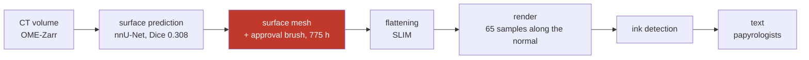

# R6 — La littérature et l'antériorité : ce qui était déjà publié, et par qui

> Rapport de campagne, écrit le **2026-09-11** d'une seule lecture de `archive/00`, `27`, `32`,
> `66`–`71`, `73`–`74`, et des pages *prizes*, *winners* et *2026 open problems* téléchargées le
> jour même (`PRIX.md`). Convention : `archive/NN §k` cite la preuve. Ce rapport est aussi la
> **matrice** de `REGISTRE_anteriorite.tsv` : chaque résultat du dépôt en face de ce que le domaine
> avait publié.

## 0. Fiche

| | |
|---|---|
| question | qu'est-ce qui était déjà publié — dans les trois papiers primaires, les 35 à 44 dépôts clonés, les pages du prix — et que le dépôt a redécouvert, contredit, ou laissé de côté ? |
| période | 17 août (état de l'art) → 3 septembre (audits, relecture adverse), puis 11 septembre (pages fraîches) |
| instruments | deux workflows d'audit adversarial (`66` : 15 agents, 14 résultats, 4,5 M jetons ; `67` : 9 agents, 98 outils, 2,9 M jetons) ; `verifier_citations.py` (140/140) ; `deja_dit.py` (164 paires au premier passage) ; `les_indices_de_spire.py` ; `nombre_de_fresnel.py` ; `la_case_vide.py` |
| ce que la campagne a coûté | trois papiers lus deux fois (résumé puis intégral ; « pour se situer » puis « pour refaire »), 46 pages du papier de référence, un commit épinglé récupéré, ~1 semaine de travail net perdue en outils qui existaient (`67` §7) |
| réponse au 11 septembre | **le domaine publie les mécanismes et les questions ; ce qui résiste est la mesure, sa répétition et son incertitude** (`71`). Sur 17 résultats de tête audités : 6 déjà connus, 11 partiels, 0 intact, 0 sans valeur. Sur 98 outils : 22 existaient, 50 en partie, 27 sans équivalent. Et le référent d'identité que le graal exige était **dans les noms de fichiers**, lu par personne (`73` §4, `74` §3) |

## 1. Vingt faits qui tiennent aujourd'hui

| # | fait | valeur | statut | source |
|--:|---|---|---|---|
| 1 | un rouleau scellé a été déroulé et lu en entier : `PHerc1667` | 31 spires, 1 231 cm², 22 colonnes, 8 papyrologues (arXiv 2606.29085, 27 juin 2026) | établi (lu intégralement) | `27` §3, `68` |
| 2 | le coût humain de ce déroulage | **~25 h par spire, ~775 h** (p. 28 : *« wrap by wrap copy tool combined with ~25 hours per wrap of manual annotation »*) ; le Grand Prize tolère 8 h | établi | `00` §0, `27` §3, `68` §1 |
| 3 | ce que ces heures paient | un **pinceau** (`ApprovalMaskBrushTool.cpp`) qui peint *« regions judged geometrically consistent with a single sheet »* ; le masque gouverne `GrowPatch::make_approved_mask` ; écrire `approval.tif` à côté de `x/y/z.tif` **est** l'intégration | établi | `68` §1 |
| 4 | aucun taux d'erreur de traçage n'est publié ; « sheet switches » apparaît une fois | le seul rempart est humain | établi | `27` §3, `00` §0 |
| 5 | le spiral fitting garantit une nappe, pas *la* nappe | WJF **3,20 %** (2,77–3,90 sur les ablations) ; *« the surface sometimes wanders between two true windings »* ; pertes L1 → médiane | établi ; `00` §2 v1 rétracté | `27` §2 |
| 6 | personne n'a comparé le taux de saut de spire de deux méthodes | WJF et MRWD non calculables pour Thaumato | établi | `27` §2 |
| 7 | la voie topographique de l'encre exige ~1 µm | DICE ≥ 0,70 seulement ≤ 1,02 µm ; effondrement à 0,029 dès 3,40 µm ; leave-one-papyrus-out 0,691 | établi ; « 4 µm » rétracté | `27` §1 |
| 8 | les treize rouleaux du prix sont à 8,64–9,36 µm, soit F = 0,39 : un scan de **repérage** | 53 % du régime de production (F = 0,73) ; du mauvais côté de F **et** de D (1,2 m) ; F = 0,73 à 9,362 µm demanderait D = 4,3 m | établi | `68` §3 · `encre/nombre_de_fresnel.py` |
| 9 | ce que F mesure vraiment dans les volumes publiés | le noyau de Paganin en pixels (3,5 contre 7,0) ; le régime du prix perd une **bande** (4,8–19 µm) plus un flou ∝ D, pas une atténuation ; 9,362 µm est un `binmean2` d'une acquisition à 4,681 | établi (calculé) | `69` §1.1–1.2 |
| 10 | la vérité terrain existe au régime du prix, et la case est vide | **103 cases** (0139 38, 0500P2 38, 0814 19, 0343P 8) ; `volume_transforms` relie repérage et production sur 6 objets | établi | `68` §4 · `encre/la_case_vide.py` |
| 11 | six vérificateurs existent et s'arrêtent tous au même endroit | `windcheck`, `tifxyz-doctor`, `winding-sync`, `winding-ruler`, `spiralcheck`, `herculaneum-scroll-tools` : *« whether removing it improves ink […] has not been measured »* | établi | `00` §4–5 |
| 12 | le pas d'enroulement est invariant sur la collection | 187 µm médian, IQR 181–193, 35/36 rouleaux entre 160 et 210 (`winding-ruler`) ; les treize ont **60 à 129 spires** | établi | `69` §0 |
| 13 | six de nos quatorze résultats étaient déjà publiés, huit à moitié, zéro nouveau | énergie, vérité terrain, fold, α-fenêtre, extension, graine | établi | `66` §2 |
| 14 | et un est **contredit** : l'énergie | 116 keV est dans la fenêtre optimale publiée à 8 µm (100–120 keV) ; notre 114,8 % venait d'un témoin de 2023 | réfuté | `66` §3 |
| 15 | 22 de nos 98 outils existaient déjà ; le mode de défaillance est le **vocabulaire** | *winding pitch*, *linearity*, *subvoxel re-centering*, *CT support*, *sheet consistency* | établi | `67` §1–2 |
| 16 | ce qui n'a aucun équivalent dans 35 dépôts | la statistique (0 `binomtest`, 0 permutation, 0 puissance), le juge en aveugle, le test de convergence, l'étage polaire | établi | `67` §5, `00` §10.1 |
| 17 | trois résultats de tête de l'article : 0 intact | tirage : mécanisme dans le code (`srand(clock())`) ; budget : moitié propreté publiée par `windcheck` ; pavage : prémisse et discriminant antérieurs, le recensement survit | établi | `71` |
| 18 | l'article condense 21 des 48 documents de résultat | 22 procédé, 27 dehors dont 17 dans le périmètre ; l'arc excision (`03`–`07`) absent | établi | `70` §1–3 |
| 19 | le référent d'**identité** est publié dans les noms de segments | **101 segments indexés** sur 3 rouleaux ; 81 spires consécutives (`0139` 37, `0172` 44) ; `PHercParis4` 58 plages | établi | `73` §4, `74` §3 · `excision/les_indices_de_spire.py` |
| 20 | le rouleau qui porte à la fois le référent et une carte dense | `PHerc0139` (37 spires, 91 fenêtres, queue 4,4 %, transformé au régime du prix) — écarté par `73` parce que son fichier s'appelait `_TEMOIN_` | établi | `74` §4 |

## 2. La campagne en six mouvements

*La chaîne telle que `archive/00` §1 et `68` §2 la reconstituent : dix-sept étapes, quatre humaines,
une seule porte les 775 heures.*

**M1 — L'état de l'art (17–19 août, `00`).** Miroir complet du site (81 pages), 33 puis 44 dépôts
clonés, six vérificateurs recensés, la conclusion « un septième serait un doublon ». Recadré deux
jours plus tard par la lecture intégrale des trois papiers : le fait le plus important du champ
(`1667` lu, 775 h) n'y était pas.

**M2 — Lire en entier (19 août, `27`, `32`).** Trois papiers primaires puis le fondateur, lus
corps, tables et annexes. Ce que le résumé cachait : la cible de 1 µm, le WJF de 3,20 %, la phrase
*bounded geometric sense*, l'absence de tout taux d'erreur de traçage, le trou de 4,8 mm au cœur
de Scroll 1, le témoin négatif jeté par le pipeline d'EduceLab.

**M3 — Les audits adversariaux (29 août, `66`, `67`).** Quinze agents pour réfuter la nouveauté de
quatorze résultats, neuf pour 98 outils. Verdict : le domaine était déjà là, sur le disque ; la
faute est de vocabulaire et de grounding. Et la « conclusion » de l'audit était la thèse de
l'article depuis longtemps.

**M4 — Relire pour refaire (2 septembre, `68`).** Le même papier, lu avec l'autre question. Le
pinceau et son interface, le nombre de Fresnel, les 103 cases vides, la fenêtre plus petite qu'une
lettre. Quatre résultats, aucun visible à la première lecture.

**M5 — Le chercheur extérieur et sa révision (3 septembre, `69`, `73`, `74`).** Un prompt
« chercheur senior » rend sept hypothèses, cinq théorèmes empruntés (InSAR, sismique, OCT), sept
algorithmes ; une seconde passe les confronte au dépôt et trouve que le référent d'identité est
dans les noms ; l'audit de la seconde passe corrige son compte (57 → 101), son mécanisme et son
rouleau (`0800` → `0139`). **C'est ce mouvement qui ouvre la campagne R4.**

**M6 — L'article contre le corpus (3 septembre, `70`, `71`), puis les pages fraîches (11
septembre, `PRIX.md`).** Ce que l'article condense et ce qu'il laisse dehors ; les trois résultats
de tête audités ; et le 11 septembre, la règle de la fenêtre réécrite, First Letters passé à 23
rouleaux, et un lauréat de 20 000 $ (W. Stevens, déroulage par patches) que le dépôt n'avait
jamais cité.

## 3. Chronologie, document par document

**`00` · 2026-08-17 (→ 08-29) · l'état de l'art** — Point d'entrée sourcé (miroir 81/81, dépôts
clonés). Deux familles de mailleurs ; six vérificateurs ; personne ne ferme la boucle. Données : 45
échantillons, 310 segments, 33 sans surface ; la résolution sépare tracé de vierge (corrélation) ;
pyramide à six niveaux. §7 : `windcheck` reproduit (364 tests, 53/53 verdicts), excision 0,16 %
médiane, cellules excisées indiscernables du témoin (p = 0,859). §9 (08-18) : la métrique mesure un
défaut de la trace, pas du résultat (ρ +0,019, n = 89) ; profondeur de surface ×18 000 moins chère ;
fibres réfutées ; `PHerc0358` tracé et condamné avant rendu ; correction appliquée 58 → 8 µm. §10
(08-29) : les audits ; les 13 rouleaux du prix : 21 segments, 0 carte d'encre. **Rétracté** : « le
spiral fitting est immunisé au sheet switching par construction » (§2, 08-19).

**`27` · 2026-08-19 · trois papiers lus en entier** — [P1] topographie : 1 µm, effondrement à
3,40 µm, 0,691 held-out ; [P2] Henderson : difféomorphisme, sept pertes L1, WJF 3,20 %, tension
WJF/MRWD (2,77 % ↔ 25,67), un bit d'humain, 19 h sur RTX 3090, code publié avec trois réserves en
commentaire (espace spirale, densité, la vérité terrain saute à s1350) ; [P3] `1667` : 8 cm × 2 cm,
réduit de 4,9 cm/14 g à 2 cm/6 g, *bounded geometric sense*, titre perdu, ~20 objets scannés pour 3
résultats, scan BM18 2,4 µm/0,22 m/78 keV, encre directement visible sur Paris 4. **Rétracté** : la
première version écrite depuis les résumés (« 4 µm », une paraphrase entre guillemets).

**`32` · 2026-08-19 · EduceLab-Scrolls** — La vérifiabilité est une propriété du **corpus**
(fragments à vérité IR) ; six pratiques à reprendre (rapport ×8 plutôt que seuil, F0.5, sens de
l'erreur choisi, µ et σ sur la seconde moitié, notation contre soi, juge apparié) ; ce qui n'est pas
mesuré : l'alignement IR↔CT (Puppet Warp, dilatation r = 16 ≈ 52 µm à l'entraînement seulement),
« consistent with » laissé à l'œil (→ `45`), le témoin négatif jeté (→ `46`), le critère « readable »
sourcé à *60 Minutes*. Scroll 1 : 7,91 µm, Diamond I12 2019, **trou de 4,8 mm au cœur**.

**`66` · 2026-08-29 · audit d'antériorité** — 6 / 8 / 0 sur 14. Le fold de validation du modèle du
Grand Prize est indécidable depuis nos métadonnées (`20231210121321` dans le script publié contre
`20230702185753` dans le nom du checkpoint). L'énergie contredite. Angles morts : Discord, Kaggle,
`vesuvius-repro`, OverthINKingSegmenter, la littérature académique. §6 : l'audit a « conclu » la
thèse de l'article (*« This paper is about the judging step »*) ; les cinq dépôts à citer l'étaient
déjà → `deja_dit.py`.

**`67` · 2026-08-29 · audit des outils** — 22 / 50 / 27 sur 98 ; 23 verdicts de temps perdu. Le
plus cher : la campagne d'écart entre spires (`winding-ruler` publie les 14 rouleaux + 22). Plus
grave : `build_atlas_v2.py` contredit `pyramid.py` (le niveau 2 fusionne les feuilles, −10,3 %) et
notre outil tourne au niveau 2 ; `sensibilite_centre.py` né d'une prémisse fausse (l'ombilic est
publié sur `dl.ash2txt.org`) ; trois concurrents tiennent la même discipline méthodologique.
Correction contre soi : `selfgap.py` ne porte pas le test de convergence.

**`68` · 2026-09-02 · lire le papier en entier** — Le pinceau et son interface (§1) ; la méthode en
17 étapes (§2) ; un seul paramètre couplé, F (§3 : 59 scans ordonnés, décohérence à 1,2 m mesurée
sur `PHerc0268`) ; la case vide (§4 : 103) ; la fenêtre plus petite qu'une lettre (§5 : 66 px à
9,362 µm) ; « revealed » sans métrique (§6). Règle : un papier se lit deux fois. Corrigé le 09-05 :
scorer la case vide exige un recalage entre deux aplatissements (Dice 0,971, rapport d'aspect 3,2 %).

**`69` · 2026-09-03 · réponse d'un chercheur extérieur** — Sept hypothèses (spectre d'AUC,
débinage, décohérence D/E^α, régions ambiguës, résidus de phase, prior universel, verso témoin nul) ;
la physique corrigée (Paganin supprime les franges ; F = noyau en pixels ; bande perdue) ; les treize
ont 60–129 spires → 1 500 à 8 000 h de pinceau par rouleau ; le rouleau comme champ de phase à
vortex, résidus et coupures par flot à coût minimal ; K surfaces couplées ; FDR et repliement
d'époque ; emprunts référencés (InSAR, sismique, OCT, cryo-ET, franges, contraste de phase, encre CT,
statistique, papyrologie) ; plan de dix mois ; candidat `PHerc0826`. Doutes déclarés.

**`70` · 2026-09-03 · ce que l'article condense** — 70 documents lus par dix agents (23 389 lignes),
140 citations vérifiées (après qu'une garde en a sauté 44) ; 22 procédé / 21 dedans / 27 dehors ; le
croisement par chiffres ne marche pas. Le seul manque : 17 documents dans le périmètre (l'arc
excision, `33`, `34`, `54`, `42`, `41`, `55`…). Deux défauts vivants (niveau 2, ombilic). **Rétracté
le jour même** : écrire l'arc excision — rejoué, la proximité baisse de 22–50 % (→ `07` refondé, puis
confirmé par `75` D1).

**`71` · 2026-09-03 · trois résultats de tête audités** — Tirage : mécanisme dans le code,
« unseeded » → « by default », le vérificateur est déterministe donc une bascule prouve que la
surface a changé ; budget : la moitié propreté est publiée mot pour mot par `windcheck`
(*« a small trace is clean substantially because it is small »*), la moitié stabilité est libre ;
pavage : prémisse et discriminant antérieurs, le recensement de 105 paires survit. 17 audités : 6 /
11 / 0.

**`73` · 2026-09-03 · seconde passe** — H1 déjà répondue à moitié (`65`), H3 et H6 mortes comme
instruments (`16`, `33` : la queue sépare), H5 réhabilitée (`17` testait des auto-intersections), H7
plus urgente (`46`). Relecteur adverse : §6.7 confond présence et identité ; §3 « no threshold »
faux du placement ; §2.1 113 µm n'est pas centre à centre ; §5.7 sont des `auto_grown`. Plan : la
règle en trois semaines, trois prédicats dont l'identité manque, extraire toutes les spires. Livrable
4 : **les indices de spire dans les noms**. **Corrigé le 09-04** : le courriel de débinage
sur-affirmait (`69` §1.2 portait le contre-argument ; mesuré C3 : 1,01).

**`74` · 2026-09-03 · `73` audité** — Trois confirmations ; §2.3 juste pour une raison plus forte
(`43` : 113 µm dépend de `neighbor_step`, 116 → 102) ; réserve sur l'atlas (172,8 = 10 voxels
entiers, IQR 121–250) ; la découverte sous-comptée ×1,8 (101 segments, 3 rouleaux, 81 consécutives) ;
le plan déployait sans référent (`0800`, `1447` : zéro indice) et le bon rouleau était `PHerc0139`.
Erreur propre attrapée par une assertion qui a échoué.

**`PRIX.md` · 2026-09-11** — Diff 16 août → 11 septembre : la règle de la fenêtre devient une
exigence de démonstration ; First Letters 13 → 23 rouleaux ; lauréats : 64 500 $ sur 28 en deux
mois, dont Stevens 20 000 $ pour un déroulage par patches (`1667`, 365 cm²) — la question de R4,
non citée par le dépôt ; `windcheck`, TIFXYZ Doctor, TAUIL (résultat négatif), scroll-data-audit à
1 000 $ pièce. Appendice A des *Open Problems* : le *rollout drift* des traceurs neuraux, mesuré
indépendamment par R4.

## 4. La table des antériorités

Chaque ligne : *résultat ou outil du dépôt · ce que le domaine avait · statut*. C'est la graine de
`REGISTRE_anteriorite.tsv` ; les références complètes sont au §9.

| résultat du dépôt | antériorité | statut |
|---|---|---|
| énergie du faisceau comme axe (`21`, `58`) | *Open Problems* « three coupled scan parameters » ; Angelotti 2026 Ext. Data Fig. 2 ; fenêtre 100–120 keV à 8 µm | **publié, et contredit** (`66` §3) |
| aucune vérité terrain sur rouleau | `ink-labels-README.md` : *« where no infrared ground truth exists »* | publié |
| fold de validation du modèle GP | `fragments=['20231210121321']` dans `villa/ink-detection` ; nom du checkpoint dit autre chose | publié ; **indécidable** ici |
| α suit la fenêtre | `windcheck/engines/atlas_query.cpp`, `selfgap.py` | publié |
| étendre une nappe (`43`, `44`) | workflow officiel `35_segmentation.md` (grandir / corriger / recommencer) | publié ; notre chaîne omet « corriger » |
| la graine décide (`25`) | `vesuvius-automesh/render_driver.py` ; `lasagna/volume_scale.py` contient `niveau_du_maillage.py` | publié |
| dispersion par fenêtre (`64`) | `winding-ruler` : *« it is the variance, not the mean, that decides usability »* | partiel : l'ICC 0,030 et le n requis sont libres |
| Hanley-McNeil, bootstrap par grappes (`63`) | `tifxyz-doctor` ; `windcheck` : *« patches are not independent draws »* | partiel : aucun IC sur une AUC d'encre dans 35 dépôts |
| témoin négatif α (`46`) | surface en travers chiffrée (`vesuvius-automesh`) ; « null control » (`windcheck/selfgap.py`) | partiel : faire tourner un détecteur d'encre dessus est libre |
| juge modèle de langue à condition vierge (`09`) | question posée depuis 2023 ; le domaine exclut l'outil (*« No OCR or language model was used »*) | partiel : le témoin dans l'image et `vierge \| vierge` sont libres |
| `step_size` du traceur (`26`) | 20 est le défaut ; `GrowPatch.cpp` lève une exception sinon | publié (réglage d'usine) |
| le traceur est un tirage (`35`) | `srand(clock())`, `mt19937(random_device)` ; `VC_GROWPATCH_RNG_SEED` | partiel : 78 exécutions, la bascule de verdict, sont libres |
| propreté = artefact de budget (`25`) | `windcheck/docs/FULL-CORPUS.md`, 278 traces, mot pour mot | **publié** ; la moitié stabilité est libre |
| les segments ne pavent pas (`44`) | tutoriel : *« big pile of small pieces »* ; `QuadSurface::overlap()` 2 voxels | partiel : le recensement de 105 paires ; recadré par `76` §7 |
| écart entre spires par rouleau (`16`) | `winding-ruler/atlas_collection_v2.csv` : 36 objets, niveau 1 | **publié** ; notre outil au niveau 2 est biaisé (−10,3 %) |
| interligne (`typographie.py`) | `villa/…/get_ink_metrics.py`, fenêtres de 512 px | publié |
| profil le long de la normale (`measure.py`) | `windcheck/bench/normal_profile.py`, 53 points | publié |
| plafond d'occupation, planéité (`trouver_graine.py`) | `automesh/select_regions.py:27` (`max_occ = 0.50`), `khartes/st.py:119` | publié |
| appariement des volumes (`apparier_volumes.py`) | `metadata.min.json` le déclare ; `vesuvius-catalog` | publié |
| l'axe erre (`laxe_nest_pas_une_ligne.py`) | ombilics publiés : Scroll 1 (`dl.ash2txt.org`), 5 rouleaux (bucket, `78`) | publié ; notre « seul » rétracté |
| garantie topologique ≠ sémantique | Henderson 2025 : WJF 3,20 %, L1 → médiane | publié ; c'est **lui** qui corrige `00` |
| aucun seuil ne sépare les feuilles (`79`) | le rendu officiel empile 65 échantillons, pas d'isosurface (`68` §2) | convergent |
| nombre de Fresnel ordonne les verdicts (`68` §3) | les verdicts sont des auteurs ; la mise en formule est du dépôt ; `69` §1.1 la recadre (Paganin) | partiel |
| 103 cases vides (`68` §4) | `volume_transforms` publiés ; personne ne les a remplies | **libre** |
| déterminisme du vérificateur | doc officielle + `windcheck` (9 configurations) | publié ; argument récupéré pour §5.1 |
| la statistique (permutation, puissance, IC, FDR) | zéro occurrence dans 35 dépôts | **libre** |
| le test de convergence, l'étage polaire, 12 outils de `depot/` | aucun équivalent | **libre** |
| référent d'identité = indices de spire | dans les noms depuis toujours ; *Open Problems* : *« relative winding number annotations seem to have a great impact »* | publié comme donnée, **non lu** avant `73` |
| déroulage par patches, détection d'incompatibilités 3D | **W. Stevens, août 2026, 20 000 $** (`1667`, 365 cm²) | publié ; **non cité** par le dépôt avant `PRIX.md` |
| dérive de rollout des traceurs | *Open Problems* App. A : *« small errors compound across steps »* | publié en prose ; mesuré par `104`–`111` |
| résultats négatifs payés | TAUIL (juillet, 1 000 $ : *negative-result analysis*) | le dépôt en a une dizaine, jamais soumis |

## 5. Contradictions et corrections internes à la campagne

| A | B | C | statut |
|---|---|---|---|
| `00` §2 (v1) : le spiral fitting est immunisé au sheet switching | `27` §2 : WJF 3,20 %, « wanders between two true windings » | correction écrite dans `00` le 08-19 | tranché |
| `27` (v1) : cible « 4 µm », citation paraphrasée | `27` §1 : 1,02 µm, verbatim | lecture intégrale | tranché ; règle : un résumé dit ce qu'un papier revendique |
| `27` §2 : AD 0,0568 vs 0,1567 (×2,76) | Thaumato aplatit avec SLIM → 0,0933 (×1,68) | lecture du texte | tranché |
| `00` §4 : « six vérificateurs, saturé » ; §9.3 : « n'existait dans aucun des six » | `67` : quatre équivalents dormaient dans leur code | audit des outils | tranché : juste sur les conclusions, faux sur le contenu |
| `66` : « nous n'avons rien découvert, juste des instruments » | l'article l'écrivait déjà (*« It measures »*) ; remarque de l'auteur | `66` §6 | tranché ; `deja_dit.py` |
| `66` recommandation : citer cinq dépôts | ils l'étaient (`windcheck` dans 20 docs) | vérifié le jour même | tranché ; auditer dedans avant dehors |
| (moi) : `selfgap.py` porte le test de convergence | `67` §6 : il mesure le détecteur, pas l'objet | audit | tranché ; s'accuser trop vite est aussi peu fondé |
| `68` §3 : F décide si la frange est résolue | `69` §1.1 : Paganin supprime les franges ; F = noyau en pixels ; bande perdue | calcul | tranché ; le rang de F tient, son sens change |
| `69` §6 : candidat `PHerc0826` (60 spires) | `73` §1 H6 : le pire des treize par la carte dense (22,8 %) | carte dense | tranché |
| `73` §1 H2 : courriel ESRF sans expérience | `73` (09-04) : `69` §1.2 chiffrait 1,3–1,5× ; C3 mesure 1,01 | mesure | tranché : courriel non justifié |
| `73` §2.3 : 113 µm = face à face (+ épaisseur) | `74` §2 : `43` — le rayon peut rentrer dans sa nappe ; 116 → 102 selon le réglage | source | tranché : valeur d'un réglage |
| `73` §4 : 57 segments, 2 rouleaux | `74` §3 : 101 segments, 3 rouleaux, 81 consécutives ; Paris4 58 plages | `les_indices_de_spire.py` | tranché |
| `73` §3.3 : extraire sur `0800` ou `1447` | `74` §4 : zéro indice ; `PHerc0139` porte les deux | mesure | tranché ; réserve : la queue ne prédit pas le traçage (`55`) |
| `73` §2.3 appuie sur l'atlas 172,8 µm | `74` §2 : 10 voxels entiers, IQR 121–250 ; appui = `16` (156) | lecture du CSV | tranché |
| `70` §5 : écrire l'arc excision | rejoué le jour même : la proximité baisse de 22–50 % | `07` refondé ; `75` D1 : `07` confirmée (0/10 au-delà du bruit) | tranché |
| `27` §4 : « corrigés ci-dessous » | rien ne suivait ; les corrections sont dans `06` | lecture | tranché (renvoi faux) |
| `71` : la doc de VC affirmerait « aucun seuil de distance ne sépare » | citation non retrouvée à la source | — | **ouvert** ; non citée |
| `66` : fold GP = `20231210121321` | nom du checkpoint : `20230702185753` | mesurer le modèle sur les deux segments | **ouvert** |
| `32` : v3 lue | une v4 existe (20 mai 2024) | — | ouvert (non lue) |
| `PRIX.md` : Stevens 20 000 $ sur la question de R4 | aucun document du dépôt ne le cite | — | à lire, à citer |

## 6. Les lois que la campagne a payées

1. **Chercher le concept, pas le nom** — `66` §1, `67` §2 : un `grep` sur nos mots français ne rend
   rien. La table de vocabulaire tient en cinq lignes et aurait coûté une heure.
2. **Un résumé dit ce qu'un papier revendique, pas ce qu'il mesure** — `27` (v1 → v2 : 4 µm, une
   paraphrase, une affirmation réfutée par un nombre).
3. **Un papier se lit deux fois** — pour se situer (`27`), pour refaire (`68`). Les quatre résultats
   de `68` étaient invisibles à la première lecture.
4. **Les idées ne sont pas gardées** — `66` §6 : trois fois dans une session le cadrage « instrument »
   présenté comme une trouvaille ; remède outillé (`deja_dit.py`).
5. **Auditer dedans avant dehors** — la recommandation phare de l'audit était déjà faite (`66` §6 bis).
6. **Une citation qu'on ne vérifie pas est une citation qu'on invente** — `94` §1 (R4), `71` §4 (une
   contre-position non retrouvée n'est pas citée), `74` (chaque revendication rejouée à la source).
7. **L'angle mort d'un serveur** — l'ombilic « seul sur Scroll 1 » (`67` §4, `78`), les 65 couches de
   `44` (`77` §10) : interroger une vue du corpus et conclure sur le corpus.
8. **Le domaine publie les mécanismes et les questions ; ce qui résiste est la mesure, sa répétition
   et son incertitude** (`71`). La formulation juste : *rendre mesurable et rejouable une limite que
   le prix énonce en prose* (`66` §6 bis).
9. **Une donnée peut être publiée et non lue** — les indices de spire (`73` §4), les
   `volume_transforms` (`68` §4), les cinq ombilics (`78`).

## 7. Ce que ça dit des prix

- **Grand Prize** : l'état de l'art est un pinceau à 25 h par spire ; les treize rouleaux éligibles
  ont 60–129 spires, un scan de repérage à F = 0,39, et zéro référent (`81`, R4). Ce que le domaine
  publie comme aide — les annotations de winding relatif (*Open Problems*), la détection
  conservatrice d'échec — est exactement ce que R4 construit ; ce qu'il a payé (Stevens, 20 000 $)
  est la même question, à lire d'abord.
- **First Letters** : la voie topographique exige ~1 µm (`27` §1) ; les modèles publiés ne séparent
  pas la feuille du vide à 9,362 µm (`75` C2, R1) ; la vérité terrain au régime du prix existe et la
  case est vide (`68` §4). La règle a changé le 11 septembre : démontrer la non-hallucination, ce
  que le harnais du dépôt fait (`PRIX.md` §0).
- **Progress Prizes** : le jury paie des résultats négatifs, des audits de données et de la QA à
  1 000 $ pièce (`PRIX.md` §4). Le dépôt en a une dizaine (`17`, `26`, `36`, `37`, `62`, `82`, `83`,
  `114`, les audits `66`–`67`, `ce_que_les_serveurs_publient`). La soumission est hors périmètre
  par décision de l'auteur (`75` §E) ; la matière, elle, est là.

## 8. Portes ouvertes de R6

- **Lire et citer les lauréats** : W. Stevens (déroulage par patches, août 2026), B. Hamm (labels
  plus proches de la vraie surface), D. Russo (14 checkpoints à 9 µm), pscamillo (profondeur du
  modèle 9 µm), Miller & Müller (First Letters sur `0826`, échecs publiés) — aucun n'est dans
  `tools/repos.tsv` ni cité (`PRIX.md` §4).
- **Cloner `vesuvius-repro` (TAUIL)** et récupérer le PDF OverthINKingSegmenter (`66` §5).
- **Le voisin conceptuel non lu** : l'assignation de *winding angle* de ThaumatoAnakalyptor — est-ce
  déjà un dépliage à résidus ? (`69` §7).
- **Miroiter le Discord et les discussions Kaggle 2023** (`66` §5).
- **Le fold du modèle du Grand Prize** : mesurer sur les deux segments candidats (`66` §3).
- **EduceLab v4** (mai 2024) non lue ; la « contre-position pavage » non retrouvée (`71` §4).
- **La littérature académique** : Obuchowski 1997 (ROC groupées), analyse de documents,
  hallucination des modèles vision-langage (`66` §5) ; les emprunts de `69` §5 (InSAR, Wu & Zhong,
  Li et al. 2006) restent des références nommées, aucune n'a été mise en œuvre.
- **Le second papier** (encre et régime de scan : `08`, `10`, `58`, `59`, `68` §3–4) et **la note
  courte des négatifs** (`17`, `26`, `36`, `37`, `62`) — `70` §3.
- **Le niveau 2 de `espacement_spires.py`** contredit par `winding-ruler` (−10,3 %) : outil vivant,
  à repasser au niveau 1 (`67` §4, `70` §4).

## 9. Sources pour un article

**Papiers primaires (lus intégralement le 2026-08-19, `27`)**
- [P1] G. Angelotti, F. Nicolardi, P. Henderson, W. B. Seales, *Ink Detection from Surface Topography
  of the Herculaneum Papyri*, arXiv:2603.27698 (mars 2026), Scientific Reports,
  doi 10.1038/s41598-026-58467-1.
- [P2] P. Henderson, *Virtually Unrolling the Herculaneum Papyri by Diffeomorphic Spiral Fitting*,
  arXiv:2512.04927 (déc. 2025), WACV 2026 ; code `github.com/pmh47/spiral-fitting` (prix 30 000 $).
- [P3] G. Angelotti *et al.* (27 auteurs, dont N. Friedman, W. B. Seales), *Complete virtual
  unwrapping and reading of a rolled Herculaneum papyrus*, arXiv:2606.29085 (27 juin 2026) ; commit
  épinglé `villa@e583fb67`.
- [P4] S. Parsons, C. S. Parker, C. Chapman, M. Hayashida, W. B. Seales, *EduceLab-Scrolls*,
  arXiv:2304.02084 (v3 lue ; v4 mai 2024).

**Pages officielles** (miroir `data/site/scrollprize.org/`, gitignoré ; téléchargées le 2026-08-16 et
le 2026-09-11) : `/2026_open_problems` (10 juillet 2026), `/prizes`, `/winners`, `/unwrapping`.

**Dépôts** (`tools/repos.tsv`, 44 clonés) : `ScrollPrize/villa` (VC3D, lasagna, `GrowPatch`,
`ApprovalMaskBrushTool`, `approval_inpaint.py`) ; `windcheck` (J. Carreras) ; `tifxyz-doctor`
(A. Cohen) ; `winding-ruler` (pscamillo) ; `winding-sync` ; `spiralcheck` ;
`herculaneum-scroll-tools` ; `vesuvius-automesh` ; `scrollfiesta` ; `khartes` ;
`ThaumatoAnakalyptor` ; `hendrikschilling/volume-cartographer`. **À ajouter** : `vesuvius-repro`
(TAUIL), les dépôts des lauréats d'août (Stevens, Hamm, Russo).

**Hors domaine, avec le transport** (`69` §5) : Goldstein, Zebker & Werner 1988 ; Costantini 1998 ;
Chen & Zebker 2001 (SNAPHU) ; Hooper & Zebker 2007 · Lomask *et al.* 2006 ; Wu & Zhong 2012 ; Wu &
Hale 2015 ; Hale 2013 · Li, Wu, Chen & Sonka 2006 ; Garvin *et al.* 2009 ; Chiu *et al.* 2010 ·
Martinez-Sanchez *et al.* 2014 · Takeda, Ina & Kobayashi 1982 ; Felsberg & Sommer 2001 · Guigay 1977 ;
Cloetens *et al.* 1999 ; Paganin *et al.* 2002 ; Bronnikov 2002 ; Nesterets 2008 ; Weitkamp *et al.*
2011 · Mocella *et al.* 2015 ; Bukreeva *et al.* 2016 ; Parker *et al.* 2019 · Benjamini & Hochberg
1995 ; Gross & Vitells 2010 ; Leahy *et al.* 1983 ; Scargle 1982 · Johnson 2004 ; Cavallo 1983 ;
Turner 1968.

**Relevés du dépôt** : `docs/mesures/audit_anteriorite.json` et `_synthese.md` ;
`docs/mesures/audit_outils.json` et `_synthese.md` ;
`docs/archive/registres/anteriorite_resultats_de_tete.md` ; `docs/mesures/les_indices_de_spire.json`.
