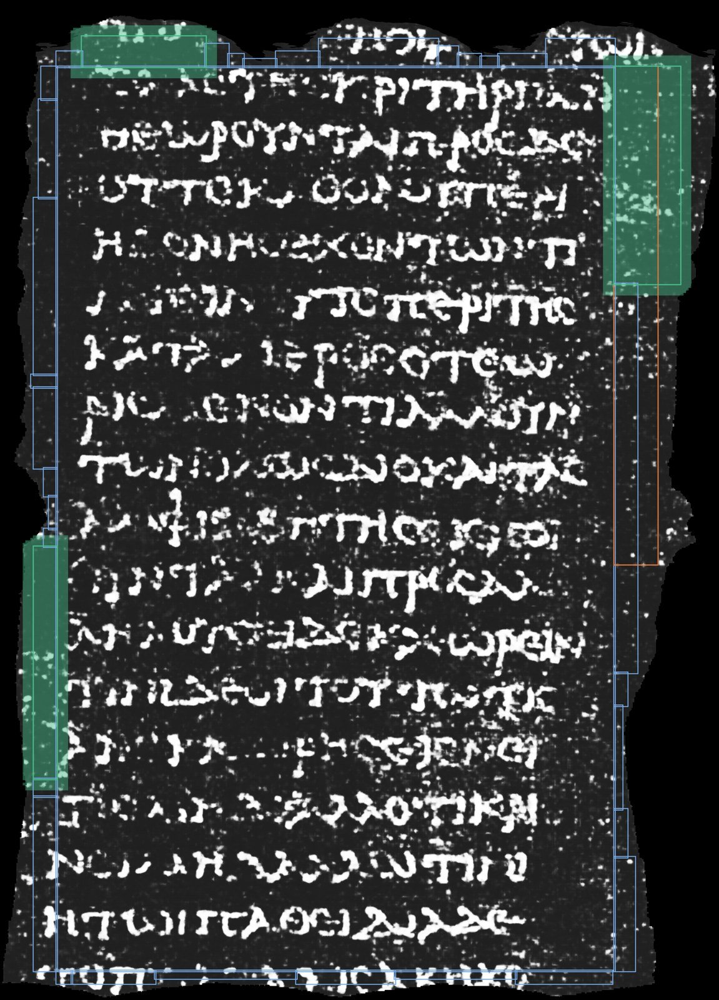
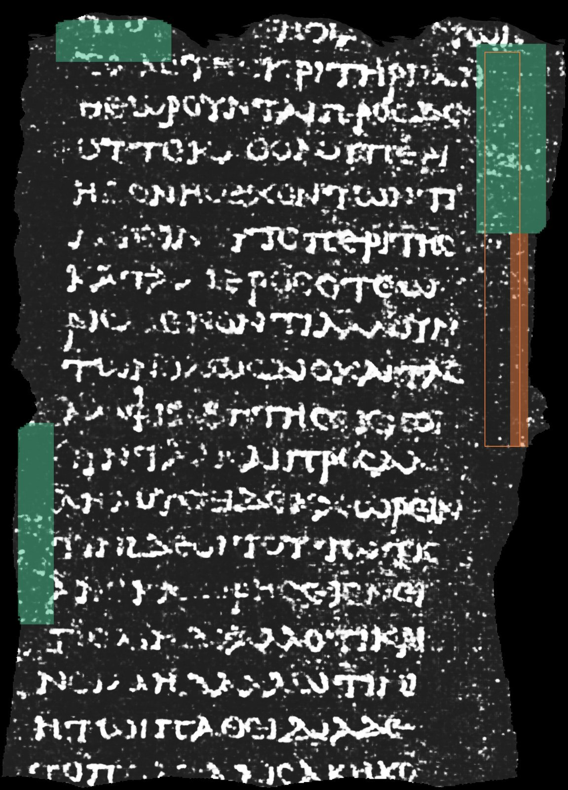
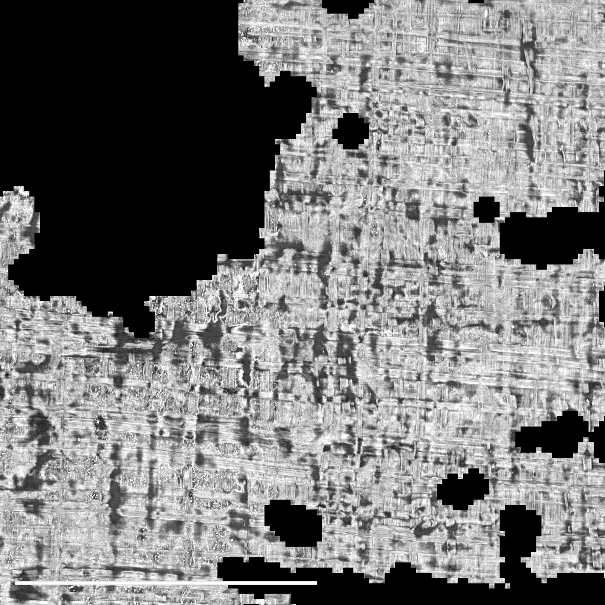
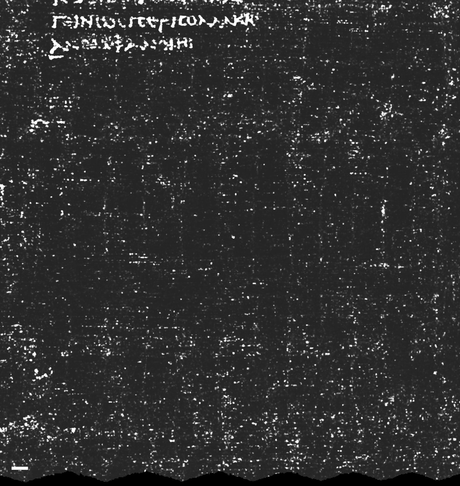

# Examples: one run of the four pipelines

A dated run (2026-09-28), kept so the outputs can be seen without running anything. The images are previews
of at most 1600 px; the pipelines write them at full resolution. To make them again:

```bash
uv run vesuve demo --data path/to/data --output outputs/demo
uv run python tools/make_examples.py outputs/demo
```

Each folder holds the report (`report.md`, rendered from `report.json`) and what the pipeline wrote.

## Grand Prize: [`grand-prize/report.md`](grand-prize/report.md)

The published ink map of segment `20230702185753` (PHercParis4), under the certificate. Green: chunks inside a
loop that stays under half a sheet along its whole profile. Orange outline: the right wing, which crosses.
Blue outlines: the rectangle, and the wings still to read.




[`grand-prize/correction.json`](grand-prize/correction.json) is the correction of the transfer to the next winding,
block by block: 340 blocks, 495 points brought back by one winding, 163 misses made right for 41 rights made misses.
It also holds the control on the band `w028-037`, where the same procedure gives 15 for 25 and nothing is written.
The corrected transfer itself, `corrected_transfer.npy`, is left out of the examples: it is an array, not something
to look at.

## Progress: [`progress/report.md`](progress/report.md)

The same certificate read the other way round: the band along column 260 (orange), rows 26 to 223, where the
loop's cumulative disagreement crosses half a sheet at cuts 163, 173 and 203.



## First Letters: [`first-letters/report.md`](first-letters/report.md)

A 2 cm × 2 cm window of PHerc1447, chosen on papyrus coverage alone: the render where the fibres show, then
the 2023 model's ink over it. The model shows no periodic rows at any angle, and the report says so.




## Paris 4 title: [`paris4-title/report.md`](paris4-title/report.md)

The innermost published band, `w010-027`, revision `20260701183124`, whose ink map registers with its mesh at
0.98. The core is on the right. Orange: the last written column, which is short. Blue: the region below its
last line and after it, where an end-title would sit.




⚠ This is a reading of the last image by eye, not a measurement: two small isolated marks sit below the last
line. They are for a papyrologist to judge, and this program does not claim them.
