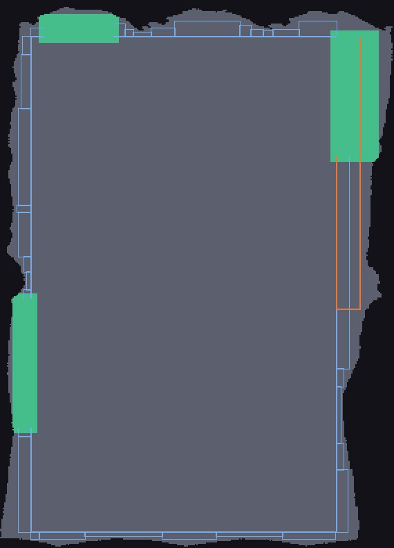
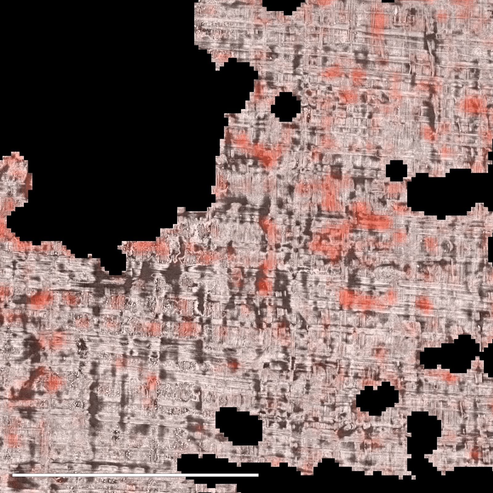
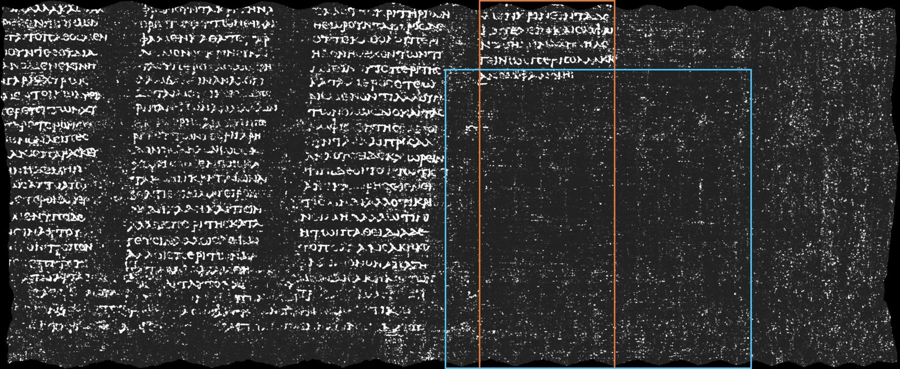

# Examples — one run of the four pipelines

A dated run (2026-09-24), kept so the outputs can be seen without running anything. The images are previews
of at most 1600 px; the pipelines write them at full resolution. Regenerate with:

```bash
uv run vesuve demo --donnees ../data --sortie sorties/demo
uv run python outils/faire_les_exemples.py sorties/demo
```

Each folder holds the report (`rapport.md`, derived from `rapport.json`) and what the pipeline wrote.

## Grand Prize — [`grand-prize/rapport.md`](grand-prize/rapport.md)

The published ink map of segment `20230702185753` (PHercParis4), under the certificate. Green: chunks inside a
loop that stays under half a sheet on its whole profile. Orange outline: the right wing that crosses. Blue
outlines: the rectangle and the wings still to read.




## Progress — [`progress/rapport.md`](progress/rapport.md)

The same certificate read the other way: the band along column 260 (orange), rows 26 to 223, where the loop's
cumulated disagreement crosses half a sheet at cuts 163, 173 and 203.


## First Letters — [`first-letters/rapport.md`](first-letters/rapport.md)

A 2 cm × 2 cm window of PHerc1447, chosen on papyrus coverage alone: the fibre-visible render, then the 2023
model's ink over it. The model shows no periodic rows at any angle, and the report says so.




## Paris 4 title — [`paris4-title/rapport.md`](paris4-title/rapport.md)

The innermost published band, `w010-027`, revision `20260701183124`, whose ink map registers with its mesh at
0.98. The core is on the right. Orange: the last written column, which is short. Blue: the region below its
last line and after it, where an end-title would be.




⚠ A reading of the last image by eye, not a measurement: two small isolated marks sit below the last line.
They are for a papyrologist to judge, not for this program to claim.
